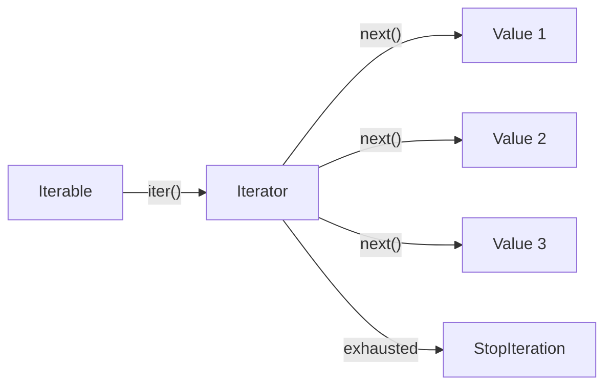

# Iterators, Generators, and Functional Tools

Many Python programs process streams of values: lines in a file, rows in a table, measurements from a sensor, tasks from a queue, or combinations produced by an algorithm. The beginner version is a `for` loop over a list. The deeper version is Python's iteration protocol, which lets code consume values one at a time without knowing where they came from or whether all values exist in memory.


*Figure: Python provides the practical environment for many CS, ML, and data examples. Image: [Wikimedia Commons](https://commons.wikimedia.org/wiki/File:Python-logo-notext.svg), Python Software Foundation, GPL-compatible free license; trademark terms apply.*

This topic extends the textbook's loops, arrays, functions, and modules into more idiomatic Python. Iterators and generators make lazy pipelines possible. Functional tools such as `map`, `filter`, `functools`, and `itertools` provide reusable building blocks. The point is not to replace every loop. The point is to know when a loop should become a reusable iterator, when a list should become a lazy sequence, and when a standard library tool already expresses the pattern.

## Definitions

An **iterable** is any object that can produce an iterator. Lists, tuples, strings, dictionaries, sets, files, ranges, and generators are iterable.

An **iterator** is an object with `__next__()` that returns the next item or raises `StopIteration`. The built-in `iter()` gets an iterator from an iterable, and `next()` asks for one value:

```python
items = iter([10, 20, 30])
next(items)  # 10
next(items)  # 20
```

A **generator function** is a function that uses `yield`. Calling it returns a generator object; the body runs only when values are requested:

```python
def count_up_to(n):
    value = 1
    while value <= n:
        yield value
        value += 1
```

A **generator expression** is a lazy expression similar to a list comprehension:

```python
squares = (x * x for x in range(10))
```

`map(function, iterable)` applies a function lazily. `filter(function, iterable)` keeps values for which the function returns truthy. In modern Python, comprehensions are often clearer for simple cases.

`functools` contains higher-order tools such as `partial`, `reduce`, `lru_cache`, and `wraps`. `itertools` contains efficient iterator building blocks such as `count`, `cycle`, `repeat`, `islice`, `chain`, `zip_longest`, `product`, `combinations`, and `groupby`.

## Key results

The first key result is that iteration is a protocol. A `for` loop does not require a list. It asks the object for an iterator and repeatedly calls for the next value until iteration stops. This is why the same loop shape works for files, ranges, lists, and custom generators.

The second result is that laziness saves memory and can represent infinite sequences. `range(1_000_000_000)` does not allocate a billion integers. `itertools.count()` can represent an endless count. A generator can read a large file line by line instead of loading it all.

The third result is that generators are one-time streams. Once consumed, they do not automatically restart. If you need to traverse data several times, store it in a list or create a fresh generator each time.

The fourth result is that `yield` pauses a function while preserving local state. On the next request, the function resumes after the `yield`. This makes stateful sequence logic much simpler than writing a full iterator class.

The fifth result is that functional tools are most useful when they clarify a data pipeline. For example, `sum(x*x for x in values)` is concise and memory efficient. But nested `map` and `filter` calls with lambdas can be harder to read than a direct loop.

The sixth result is that `itertools.groupby` groups only adjacent equal keys. Sort first if you need all equal keys grouped together across the whole dataset.

A seventh result is that lazy code moves errors later. A generator expression may be created successfully even though it will fail when consumed. For example, `(float(x) for x in fields)` does not convert anything immediately. The `ValueError` appears only when a loop, `list()`, `sum()`, or another consumer asks for values. This is normal, but it affects debugging. When diagnosing a lazy pipeline, force a small prefix with `list(islice(..., n))` or test each stage separately.

An eighth result is that the consumer controls progress. A generator does not "push" values into a program; the caller pulls them. This makes generators excellent for pipelines, because each stage can process one item and pass it forward. It also means cleanup matters when a generator owns a resource. For file processing, a generator should usually be used inside a `with` block or be designed so the file context is clearly managed.

Finally, functional style is not a contest to remove loops. Python's `for` loop is idiomatic and readable. Use generator expressions when they make a consumer clearer, such as `any(...)`, `all(...)`, `sum(...)`, and `max(...)`. Use named functions when the transformation has domain meaning. A readable loop is better than a compact pipeline that nobody wants to debug.

## Visual



| Tool | Lazy? | Typical use | Example |
|---|---:|---|---|
| List comprehension | no | Build a concrete list | `[x*x for x in xs]` |
| Generator expression | yes | Stream into a consumer | `sum(x*x for x in xs)` |
| `map` | yes | Apply existing function | `map(float, fields)` |
| `filter` | yes | Keep matching values | `filter(str.strip, lines)` |
| `itertools.chain` | yes | Combine iterables | `chain(a, b, c)` |
| `itertools.islice` | yes | Slice an iterator | `islice(lines, 10)` |
| `functools.lru_cache` | n/a | Memoize pure function results | `@lru_cache` |

## Worked example 1: stream valid readings from lines

Problem: process lines from a sensor file and yield only valid floating-point readings.

Data:

```python
lines = ["21.5\n", "error\n", "22.0\n", "\n", "20.75\n"]
```

Method:

1. Write a generator function that accepts any iterable of lines.
2. Strip whitespace.
3. Skip empty lines.
4. Attempt conversion to `float`.
5. Skip invalid records.
6. Yield valid numeric readings one at a time.

Work:

```python
def valid_readings(lines):
    for line in lines:
        text = line.strip()
        if not text:
            continue
        try:
            value = float(text)
        except ValueError:
            continue
        yield value
```

Step-by-step:

1. `"21.5\n"` strips to `"21.5"`, converts to `21.5`, and is yielded.
2. `"error\n"` strips to `"error"`, conversion raises `ValueError`, so it is skipped.
3. `"22.0\n"` converts to `22.0` and is yielded.
4. `"\n"` strips to `""`, so it is skipped before conversion.
5. `"20.75\n"` converts to `20.75` and is yielded.

Checked answer:

```python
list(valid_readings(lines)) == [21.5, 22.0, 20.75]
```

The generator does not require the full input to be a list. It would also work directly on an open file object.

## Worked example 2: use itertools for combinations

Problem: find all unordered pairs of sensors and compute the absolute difference between their readings.

Data:

```python
sensors = {"A": 21.5, "B": 22.0, "C": 20.0}
```

Method:

1. Use `itertools.combinations` to produce each pair once.
2. Each pair contains two `(name, value)` tuples.
3. Compute absolute difference.
4. Store readable results.

Work:

```python
from itertools import combinations

differences = []

for (name1, value1), (name2, value2) in combinations(sensors.items(), 2):
    diff = abs(value1 - value2)
    differences.append((name1, name2, diff))
```

Step-by-step:

1. `combinations(sensors.items(), 2)` yields pairs without repeats.
2. First pair: `("A", 21.5)` and `("B", 22.0)`, difference `0.5`.
3. Second pair: `("A", 21.5)` and `("C", 20.0)`, difference `1.5`.
4. Third pair: `("B", 22.0)` and `("C", 20.0)`, difference `2.0`.

Checked answer:

```python
differences == [
    ("A", "B", 0.5),
    ("A", "C", 1.5),
    ("B", "C", 2.0),
]
```

No pair appears twice, and no sensor is paired with itself.

## Code

```python
from functools import lru_cache
from itertools import islice

@lru_cache(maxsize=None)
def fibonacci(n):
    if n < 0:
        raise ValueError("n must be non-negative")
    if n < 2:
        return n
    return fibonacci(n - 1) + fibonacci(n - 2)

def fibonacci_stream():
    index = 0
    while True:
        yield fibonacci(index)
        index += 1

first_ten = list(islice(fibonacci_stream(), 10))
print(first_ten)
```

This example combines a generator for an infinite stream, `islice` to take a finite prefix, and `lru_cache` to avoid recomputing recursive Fibonacci values.

The example is intentionally small, but it demonstrates an important boundary: one part describes an infinite source, and another part decides how much to consume. This is a common generator design. A file reader yields records until the file ends; a caller decides whether to process all records or only the first ten. A sensor stream may be unbounded; a caller decides when to stop. Keeping production and consumption separate makes lazy programs flexible without making every function responsible for every stopping rule.

## Common pitfalls

- Expecting a generator to restart after it has been consumed.
- Calling `list()` on a huge or infinite iterator without thinking about memory.
- Hiding simple logic inside nested `map`, `filter`, and `lambda` calls.
- Forgetting that `groupby` groups adjacent records, not all matching records globally.
- Using `yield` and `return value` as if both produced normal output values. A generator's `return` stops iteration.
- Catching `StopIteration` manually inside ordinary loops. Let `for` handle it unless implementing iteration internals.
- Using generators when the data must be indexed many times. A list may be the right structure.

## Connections

- [Control Flow and Comprehensions](/cs/programming/python/control-flow-and-comprehensions)
- [Functions, Arguments, and Decorators](/cs/programming/python/functions-arguments-and-decorators)
- [Files and Context Managers](/cs/programming/python/files-and-context-managers)
- [Standard Library Highlights](/cs/programming/python/standard-library-highlights)
