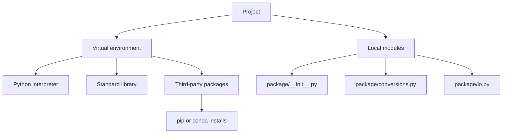

# Modules, Packages, and Environments

As Python programs grow, one file becomes too crowded. The textbook introduces modules as Python files that contain definitions and statements, then demonstrates importing conversion functions from another file. It also discusses the standard library, third-party packages, `pip`, Anaconda, Conda, and virtual environments. Those topics belong together because importing code and managing installed code are two sides of the same workflow.


*Figure: Python provides the practical environment for many CS, ML, and data examples. Image: [Wikimedia Commons](https://commons.wikimedia.org/wiki/File:Python-logo-notext.svg), Python Software Foundation, GPL-compatible free license; trademark terms apply.*

A module gives code a home. A package groups related modules. An environment decides which interpreter and installed packages are available. Good Python projects keep these layers explicit: local modules for project code, the standard library for built-in capabilities, third-party packages for external functionality, and an isolated environment to make the setup reproducible.

## Definitions

A **module** is a Python file. If a file is named `fahrenheit.py`, its module name is usually `fahrenheit`, and functions inside it can be imported:

```python
from fahrenheit import c2f, f2c
```

A **package** is a directory of modules, usually containing an `__init__.py` file in traditional packages. Modern namespace packages can omit it, but beginners should recognize `__init__.py` because it remains common.

An **import** statement makes names from another module available. Common forms include:

```python
import math
import numpy as np
from pathlib import Path
from math import sin, cos
```

A **standard library module** ships with Python. Examples include `math`, `statistics`, `pathlib`, `json`, `csv`, `datetime`, `collections`, `itertools`, and `unittest`.

A **third-party package** is installed separately, often with `pip` or `conda`. Examples include NumPy, pandas, Matplotlib, Flask, Django, and pytest.

An **environment** is the interpreter plus the libraries available to it. A virtual environment isolates dependencies for one project. Conda environments do the same, while also managing non-Python compiled dependencies in many cases.

A **dependency file** records what a project needs. With `pip`, a simple form is `requirements.txt`; with Conda, `environment.yml` is common.

## Key results

The first key result is that imports should be explicit enough to keep names understandable. `import math` followed by `math.sin(x)` makes the module source visible. `from math import sin` is fine for a small number of very common functions. `from math import *` is discouraged because it fills the namespace with many names and can create collisions.

The second result is that Python searches for imports along `sys.path`. The script directory is usually first, which is why naming a file `math.py` or `random.py` can shadow the standard library module of the same name.

The third result is that modules run when imported. Top-level statements execute once at import time. Therefore reusable modules should put demonstrations and command-line behavior under:

```python
if __name__ == "__main__":
    ...
```

When the file is run as a script, `__name__` is `"__main__"`. When it is imported, `__name__` is the module name.

The fourth result is that package installation and import names are related but not always identical. You might install `python-dateutil` but import `dateutil`. Read package documentation and avoid guessing.

The fifth result is that environment isolation prevents accidental dependencies. If code works only because a package is globally installed on one computer, it will fail elsewhere. A fresh virtual environment is a good test of whether the project's setup instructions are complete.

The sixth result is that module design is about stable boundaries. Put functions and classes that are reused together. Avoid circular imports where module A imports B and B imports A; they often signal that shared logic belongs in a third module.

A seventh result is that import time should be boring. A module should define functions, classes, constants, and lightweight configuration when imported. It should not ask the user for input, open a GUI, start a server, download data, or run a long calculation unless that is the documented purpose of importing it. This is why examples often place demonstration code under the `if __name__ == "__main__":` guard: the file can be both imported as a module and run as a script.

An eighth result is that package boundaries should match ownership of ideas. A project might have `io.py` for reading files, `models.py` for data classes, `analysis.py` for calculations, and `plotting.py` for visual output. That organization is not mandatory, but it illustrates a principle: files should be named after responsibilities, not after vague stages such as `misc.py` or `stuff.py`. Vague module names tend to collect unrelated code.

Finally, environment files are part of project communication. A short `requirements.txt` or Conda environment file tells another person how to reproduce the imports. Without it, a project depends on memory and local machine history. When a script imports third-party packages, update the dependency record at the same time as the code.

## Visual



| Import style | Example | Advantage | Tradeoff |
|---|---|---|---|
| Module import | `import math` | Clear source namespace | Slightly longer calls |
| Alias import | `import numpy as np` | Conventional short prefix | Alias must be known |
| Specific import | `from pathlib import Path` | Direct use of one name | Source less visible |
| Star import | `from math import *` | Very short in tiny experiments | Namespace pollution |
| Relative import | `from .utils import clean` | Works inside packages | Only valid in package context |

## Worked example 1: create and import a conversion module

Problem: move temperature conversion functions into a reusable module and call them from a separate script.

Method:

1. Create `conversions.py`.
2. Define pure functions in it.
3. Create `demo.py`.
4. Import the functions.
5. Run the demo script, not the module internals manually.

`conversions.py`:

```python
def c2f(celsius):
    return celsius * 9 / 5 + 32

def f2c(fahrenheit):
    return (fahrenheit - 32) * 5 / 9
```

`demo.py`:

```python
from conversions import c2f, f2c

print(c2f(0))
print(f2c(212))
```

Step-by-step:

1. Python starts `demo.py`.
2. `from conversions import c2f, f2c` searches for `conversions.py`.
3. Python executes the module definition, binding `c2f` and `f2c`.
4. The imported names become available in `demo.py`.
5. `c2f(0)` returns `32.0`.
6. `f2c(212)` returns `100.0`.

Checked answer:

```text
32.0
100.0
```

The functions can now be imported by tests, notebooks, or other scripts without copying their definitions.

## Worked example 2: diagnose the wrong package environment

Problem: `python -m pip install pandas` succeeds, but the editor still says `ModuleNotFoundError: No module named 'pandas'`.

Method:

1. Print the interpreter path in the terminal used for installation.
2. Print the interpreter path inside the editor.
3. Compare them.
4. Install with the interpreter that actually runs the code, or switch the editor interpreter.

Terminal check:

```powershell
python -c "import sys; print(sys.executable)"
python -m pip show pandas
```

Editor check:

```python
import sys
print(sys.executable)
```

Step-by-step reasoning:

1. Suppose the terminal prints `C:\project\.venv\Scripts\python.exe`.
2. Suppose the editor prints `C:\Users\user\anaconda3\python.exe`.
3. These are different environments.
4. Installing into `.venv` does not install into Anaconda.
5. Either select `.venv` in the editor or install pandas into the Anaconda environment.

Checked answer: the error is not really about pandas; it is about two different interpreters. The fix is to align installation and execution.

## Code

```python
import importlib.util
import sys
from pathlib import Path

def module_location(module_name):
    spec = importlib.util.find_spec(module_name)
    if spec is None:
        return None
    return spec.origin

print("Interpreter:", sys.executable)
print("Working directory:", Path.cwd())

for name in ["math", "json", "numpy"]:
    location = module_location(name)
    print(f"{name:>5}:", location if location else "not importable")
```

This diagnostic script reports which interpreter is running and where selected modules resolve. It helps detect shadowing and missing dependencies.

Run this script from the same place that runs the failing program: the editor's run button, the terminal, a notebook cell, or a scheduled task. Environment problems are context problems. A command that works in one terminal does not prove that a notebook kernel, IDE debugger, or service account uses the same interpreter. When documenting a project, include the command used to create the environment and the command used to run the program so another person can reproduce both steps.

## Common pitfalls

- Naming a local file after a standard library module, such as `statistics.py`, `json.py`, or `typing.py`.
- Using `from module import *` in real projects and losing track of where names came from.
- Putting slow work, prompts, or plotting at module top level, causing it to run during import.
- Installing packages globally instead of inside the project environment.
- Running `pip install` for one Python executable and running scripts with another.
- Committing virtual environment directories into source control. Commit dependency files instead.
- Creating circular imports because two modules know too much about each other.

## Connections

- [Setup, REPL, and Environments](/cs/programming/python/setup-repl-and-environments)
- [Functions, Arguments, and Decorators](/cs/programming/python/functions-arguments-and-decorators)
- [Files and Context Managers](/cs/programming/python/files-and-context-managers)
- [Standard Library Highlights](/cs/programming/python/standard-library-highlights)
