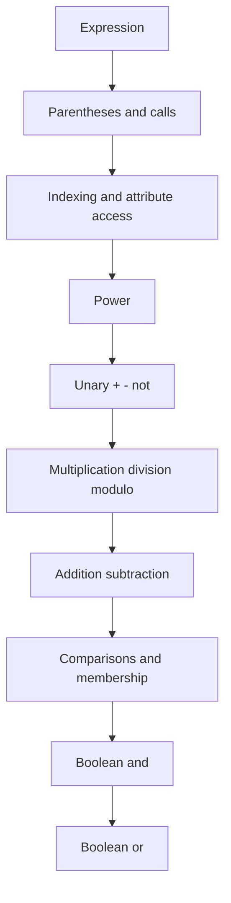

# Operators and Expressions

Operators are the compact vocabulary of Python programs. They let you compute numbers, compare values, combine logic, index containers, and build expressions that can be passed to functions or assigned to names. In the textbook, operators first appear in simple formulas such as `y = a*x + b`, in string examples such as indexing and slicing, and in conditions used by `if` statements and loops.


*Figure: Python provides the practical environment for many CS, ML, and data examples. Image: [Wikimedia Commons](https://commons.wikimedia.org/wiki/File:Python-logo-notext.svg), Python Software Foundation, GPL-compatible free license; trademark terms apply.*

The important habit is to read an expression in layers. Start with literals and names, then function calls and indexing, then arithmetic, comparisons, boolean logic, and finally assignment statements that store the result. Python has a precedence table, but professional code does not rely on readers memorizing every row. Parentheses are cheap; use them when they clarify intent.

## Definitions

An **operator** is syntax that combines or transforms values. Arithmetic operators include `+`, `-`, `*`, `/`, `//`, `%`, and `**`. Comparison operators include `<`, `<=`, `>`, `>=`, `==`, and `!=`. Boolean operators include `and`, `or`, and `not`.

An **operand** is a value an operator acts on. In `a + b`, both `a` and `b` are operands.

An **expression** is any piece of code that evaluates to a value. `2 + 3`, `name.lower()`, `items[0]`, and `x > 0 and y > 0` are expressions.

**Precedence** determines which operators bind first. In `2 + 3 * 4`, multiplication happens before addition, so the result is `14`. Parentheses override precedence: `(2 + 3) * 4` gives `20`.

**Associativity** determines how operators of the same precedence group. Most arithmetic operators group from left to right, but exponentiation groups from right to left: `2 ** 3 ** 2` means `2 ** (3 ** 2)`, which is `512`.

**Integer division** with `//` returns the floor of the quotient. **Modulo** with `%` returns the remainder in a way that satisfies:

$$
a = (a // b) \times b + (a \% b)
$$

For positive integers this matches school arithmetic. With negative values, remember that Python floors the quotient.

**Short-circuit evaluation** means `and` and `or` do not always evaluate both sides. In `x != 0 and total / x > 10`, the division is skipped when `x` is zero.

## Key results

The first key result is that `/` and `//` are different. In Python 3, `/` always produces true division, usually a `float`, even when the inputs are integers. `//` produces floor division. This matters in algorithms, indexing, pagination, and unit conversions.

The second result is that comparison operators can be chained. Instead of writing `0 <= x and x <= 100`, Python allows `0 <= x <= 100`. This is readable and evaluates `x` only once.

The third result is that boolean operators return one of their operands, not necessarily the literal values `True` or `False`. For example, `"" or "fallback"` evaluates to `"fallback"`. This can be useful, but do not overuse it when an explicit conditional would be clearer.

The fourth result is that strings and containers define some familiar operators differently. For strings, `+` concatenates and `*` repeats. For lists, `+` concatenates lists and `in` checks membership. For sets, operators such as `|`, `&`, and `-` mean union, intersection, and difference.

The fifth result is that equality and identity are separate questions. `==` asks whether values are equal according to their type's equality rule. `is` asks whether two names refer to the exact same object. Use `is` for `None`, singletons, and identity checks; use `==` for value equality.

A sixth result is that operators are often overloaded by type, so the same symbol can express related but different ideas. `+` adds numbers, concatenates strings, concatenates lists, and can be defined by custom classes. `in` tests substring membership for strings, element membership for lists and sets, and key membership for dictionaries. This is convenient, but it means every expression should be read together with the types of the operands. If the operands are unclear, introduce intermediate names or use `type()` while debugging.

A seventh result is that expressions are easier to test when they are decomposed. Consider a single long line that calculates a billing total, applies a discount, applies tax, and rounds the result. Python can evaluate it, but a reader has to reconstruct the business rule from precedence. Splitting the expression into `subtotal`, `discount`, `tax`, and `total` creates natural inspection points and test assertions. This is especially useful with floating-point arithmetic, where rounding at the wrong stage can change results.

The final practical result is that boolean expressions should avoid hidden work. A condition such as `if user and user.is_active and expensive_check(user):` is valid and uses short-circuiting well: the expensive check runs only when earlier checks pass. But a condition that mutates data, reads files, or logs messages as a side effect is harder to reason about. Keep boolean expressions mostly about asking questions, not changing state. When state must change, put that step on its own line before the condition.

## Visual

| Category | Operators | Example | Result |
|---|---|---|---|
| Arithmetic | `+ - * /` | `7 / 2` | `3.5` |
| Floor and remainder | `// %` | `7 // 2`, `7 % 2` | `3`, `1` |
| Power | `**` | `2 ** 5` | `32` |
| Comparison | `< <= > >= == !=` | `3 <= 5` | `True` |
| Boolean | `and or not` | `True and False` | `False` |
| Membership | `in`, `not in` | `"py" in "python"` | `True` |
| Identity | `is`, `is not` | `x is None` | depends on `x` |
| Assignment expression | `:=` | `(n := len(items))` | binds and returns `n` |



## Worked example 1: evaluate a formula carefully

Problem: compute the value of:

```python
result = 3 + 4 * 2 ** 3 - 10 // 3
```

Method:

1. Start with exponentiation: `2 ** 3 = 8`.
2. Multiplication comes next: `4 * 8 = 32`.
3. Floor division is in the same precedence family as multiplication: `10 // 3 = 3`.
4. Addition and subtraction proceed left to right:

$$
\begin{aligned}
3 + 32 - 3 &= 35 - 3 \\
           &= 32
\end{aligned}
$$

Checked answer:

```python
result = 32
```

Verification in Python:

```python
print(3 + 4 * 2 ** 3 - 10 // 3)
```

Output:

```text
32
```

The expression is valid, but if it appeared in business logic, parentheses would help:

```python
result = 3 + (4 * (2 ** 3)) - (10 // 3)
```

## Worked example 2: use modulo for a time conversion

Problem: convert `3671` seconds into hours, minutes, and seconds.

Method:

1. One hour is `3600` seconds.
2. Compute whole hours with floor division:

```python
hours = 3671 // 3600
```

So:

$$
3671 // 3600 = 1
$$

3. Compute the remainder after removing whole hours:

```python
remaining = 3671 % 3600
```

Manual check:

$$
3671 - 1 \times 3600 = 71
$$

4. One minute is `60` seconds:

```python
minutes = remaining // 60
seconds = remaining % 60
```

5. Manual check:

$$
\begin{aligned}
71 // 60 &= 1 \\
71 \% 60 &= 11
\end{aligned}
$$

Checked answer: `3671` seconds is `1` hour, `1` minute, and `11` seconds.

Python verification:

```python
total = 3671
hours = total // 3600
remaining = total % 3600
minutes = remaining // 60
seconds = remaining % 60

print(hours, minutes, seconds)
```

Output:

```text
1 1 11
```

## Code

```python
def split_seconds(total_seconds):
    if total_seconds < 0:
        raise ValueError("total_seconds must be non-negative")

    hours = total_seconds // 3600
    remaining = total_seconds % 3600
    minutes = remaining // 60
    seconds = remaining % 60
    return hours, minutes, seconds

for value in [59, 60, 3599, 3600, 3671]:
    h, m, s = split_seconds(value)
    print(f"{value:4d} seconds -> {h:02d}:{m:02d}:{s:02d}")
```

This snippet uses arithmetic, comparison, tuple return values, and formatted strings. It is also easy to test because each input has a deterministic output.

When adapting this pattern, test boundary values deliberately. For time splitting, boundaries include `0`, `59`, `60`, `3599`, and `3600`. These values reveal whether floor division and modulo are being used correctly. The same idea applies to pagination, array chunking, and unit conversion: choose examples that sit exactly on the boundary and one step to either side. Operators often fail at edges, not in the middle of ordinary-looking input.

Also notice that the function raises an exception before doing arithmetic on invalid data. That is better than returning a strange value such as `None` or `-1` for a duration. Arithmetic functions should either return a valid numeric result or fail loudly with a useful message.

For student exercises, write the expected arithmetic beside at least one test case. If the code says `total % 3600`, the notes should show the subtraction that produces the same remainder. This habit catches precedence mistakes and makes the program easier to review without running it.

## Common pitfalls

- Using `/` when an index or count needs an integer. Use `//` for whole-number quotient.
- Forgetting that `**` binds before unary minus in subtle cases. `-2 ** 2` is `-4`, while `(-2) ** 2` is `4`.
- Comparing floats for exact equality after several arithmetic operations. Prefer tolerances for measured or computed real values.
- Using `is` for numbers or strings because it "seems to work" in a small test. Use `==` for value equality.
- Writing dense expressions that are technically correct but unreadable. Parentheses and intermediate names are part of good style.
- Forgetting short-circuit behavior when the right side has side effects. Avoid side effects inside boolean expressions.
- Assuming `%` behaves like a simple truncating remainder for negative numbers. Python's modulo follows floor division.

## Connections

- [Syntax, Variables, and Types](/cs/programming/python/syntax-variables-and-types)
- [Control Flow and Comprehensions](/cs/programming/python/control-flow-and-comprehensions)
- [Strings and Text Processing](/cs/programming/python/strings-and-text-processing)
- [Testing and the Scientific Stack](/cs/programming/python/testing-and-scientific-stack)
