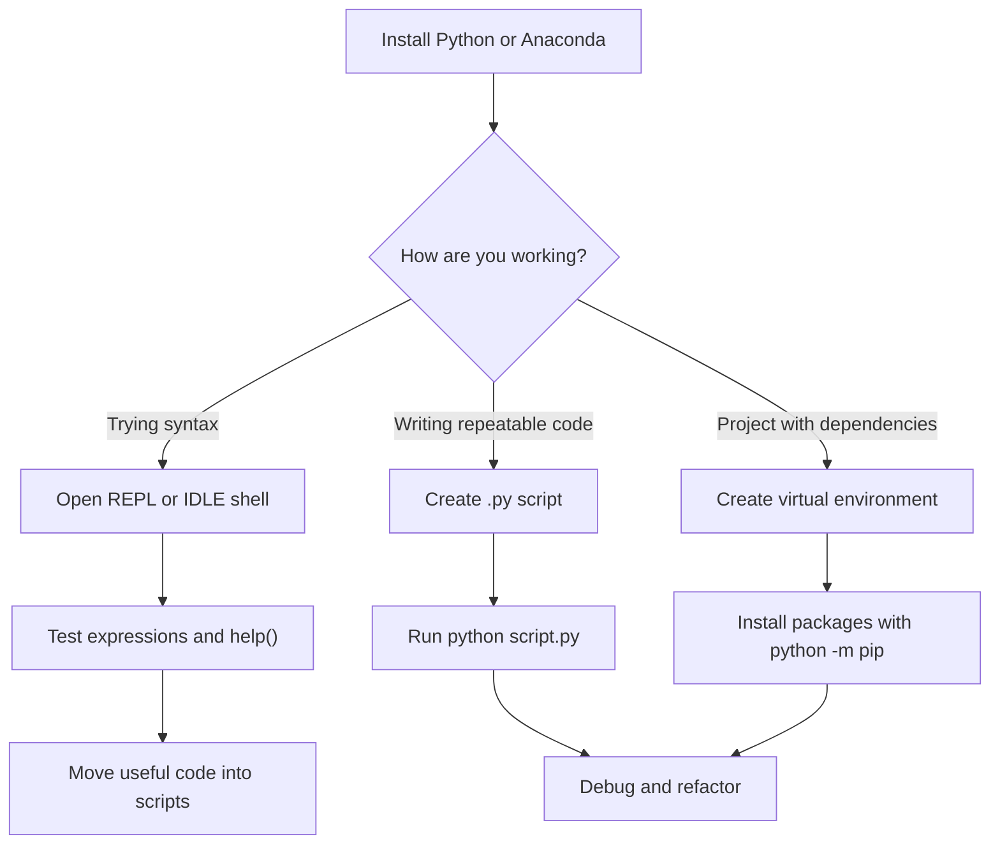

# Setup, REPL, and Environments

Python is easiest to learn when the feedback loop is short: type a small expression, run it, inspect the result, and then save the parts worth keeping in a script. Hans-Petter Halvorsen's *Python Programming* begins with this practical route. It introduces Python as an interpreted, cross-platform language, then shows several ways to run it: the IDLE shell that comes with the basic installer, a system console, a script file, Spyder through Anaconda, and other editors such as Visual Studio Code.

This page turns that first-contact material into a repeatable working model. The main idea is that "Python" is not just one executable. A useful Python setup has an interpreter, a place to edit code, a way to run scripts, and a package/environment strategy. Beginners can start with the official installer and IDLE. Larger projects usually need a virtual environment, a command-line workflow, and an editor that can lint, debug, and run tests.

## Definitions

An **interpreter** is the program that reads and executes Python code. In a console, it is usually started with `python`, `py`, or a full path to a Python executable. The interpreter can run in interactive mode, where each line is executed immediately, or in script mode, where it runs a `.py` file from top to bottom.

A **REPL** is a read-evaluate-print loop. It reads an expression or statement, evaluates it, prints a useful representation of the result, and waits for the next command. The Python prompt `>>>` is the classic sign that you are inside the REPL, not inside the operating-system shell.

A **script** is a text file containing Python statements, conventionally ending in `.py`. Scripts are better than a REPL transcript when a task has several steps, needs to be repeated, or should be version controlled. A script can still be developed interactively: test small fragments in the REPL, then paste the durable version into the script.

An **IDE** is an integrated development environment. IDLE is simple and bundled with Python. Spyder, highlighted in the textbook through Anaconda, is common in scientific workflows. Visual Studio Code and PyCharm are general-purpose editors that add extensions, debugging, terminal integration, and project navigation.

A **package manager** installs reusable libraries. `pip` installs packages from the Python Package Index. `conda`, included with Anaconda, manages both packages and environments and is especially convenient for scientific stacks with compiled dependencies.

A **virtual environment** is an isolated directory containing a Python interpreter plus project-specific packages. It prevents one project from silently depending on packages installed for another project. In modern Python, the built-in `venv` module is enough for many projects:

```powershell
python -m venv .venv
.\.venv\Scripts\Activate.ps1
python -m pip install requests
```

On macOS or Linux, activation usually looks like:

```bash
python3 -m venv .venv
source .venv/bin/activate
python -m pip install requests
```

## Key results

The first key result is operational: always know which prompt you are using. A system shell prompt runs operating-system commands such as `cd`, `dir`, `ls`, `python`, and `pip`. A Python prompt runs Python statements such as `print("Hello")`, `x = 3`, and `help(str)`. Many beginner errors come from typing Python into the shell or shell commands into Python.

The second key result is that Python can be used in two complementary modes. Interactive mode is ideal for exploration, numerical checks, and learning syntax. Script mode is ideal for repeatable programs. The textbook demonstrates both: single-line `print("Hello World!")` examples in the shell, then saved files executed from IDLE, a terminal, or Spyder.

The third result is that installation choices shape the rest of the workflow. The official Python distribution is small and clean. It includes the interpreter, IDLE, the standard library, and `pip`. Anaconda is larger but bundles a scientific environment, Spyder, Jupyter Notebook, NumPy, SciPy, Matplotlib, and related tools. For a student focused on basic programming, the official installer is enough. For a student focused on calculations, plotting, or data analysis, Anaconda removes a lot of setup friction.

The fourth result is reproducibility. A project should be able to say which packages it needs. With `pip`, that is often done with `requirements.txt`; with `conda`, an `environment.yml` file is common. The exact format matters less than the habit: do not rely on "whatever happens to be installed globally" when code is meant to be shared.

Finally, use `python -m pip` rather than bare `pip` when you are unsure which interpreter owns a package installation. The `-m` form asks the selected Python interpreter to run the `pip` module inside that interpreter's environment, reducing confusion when several Python installations are present.

## Visual



| Tool | Best use | Strength | Watch for |
|---|---|---|---|
| IDLE | First programs and REPL practice | Bundled, simple, low setup | Limited project features |
| Terminal or Command Prompt | Running scripts and package commands | Transparent and reproducible | Confusing shell prompt vs `>>>` prompt |
| Spyder | Scientific learning workflow | Variable explorer and plotting support | Usually tied to Anaconda environments |
| VS Code | General project work | Extensions, debugger, terminal, Git integration | Needs interpreter selection |
| Jupyter Notebook | Exploratory analysis and teaching | Code, output, plots, and prose together | Execution order can hide state problems |

## Worked example 1: run one expression in the REPL

Problem: verify a Celsius-to-Fahrenheit calculation interactively before saving it in a script.

Method:

1. Open a terminal or IDLE shell.
2. Confirm that the `>>>` prompt is visible. If the prompt is `C:\...>` or `$`, start Python first.
3. Assign the Celsius value.
4. Apply the formula.
5. Print or inspect the result.

Interactive session:

```python
>>> celsius = 20
>>> fahrenheit = celsius * 9 / 5 + 32
>>> fahrenheit
68.0
>>> print(f"{celsius} C = {fahrenheit} F")
20 C = 68.0 F
```

Check:

1. The formula is $F = C \times 9/5 + 32$.
2. Substitute $C = 20$:

$$
\begin{aligned}
F &= 20 \times 9/5 + 32 \\
  &= 36 + 32 \\
  &= 68
\end{aligned}
$$

3. The REPL output `68.0` matches the manual calculation. The `.0` appears because division with `/` produces a floating-point result in Python.

Conclusion: the expression is correct and can now be moved into a script or function.

## Worked example 2: turn REPL work into a script

Problem: save the same conversion so it can be run repeatedly for different input values.

Method:

1. Create a file named `temperature.py`.
2. Put durable code into the file, not the `>>>` prompts.
3. Use `input()` to ask for a value.
4. Convert the input string to `float`.
5. Run the file from the shell.

Script:

```python
celsius_text = input("Celsius: ")
celsius = float(celsius_text)
fahrenheit = celsius * 9 / 5 + 32

print(f"{celsius:.1f} C = {fahrenheit:.1f} F")
```

Run:

```powershell
python temperature.py
```

Possible interaction:

```text
Celsius: 37
37.0 C = 98.6 F
```

Check:

1. `input()` always returns text, so `"37"` must be converted before arithmetic.
2. `float("37")` gives `37.0`.
3. The formula gives:

$$
\begin{aligned}
37 \times 9/5 + 32 &= 66.6 + 32 \\
                  &= 98.6
\end{aligned}
$$

4. The printed result matches the expected body-temperature conversion.

Conclusion: the REPL helped validate the expression; the script made it reusable.

## Code

```python
from pathlib import Path
import sys

def describe_runtime() -> None:
    print("Python executable:", sys.executable)
    print("Python version:", sys.version.split()[0])
    print("Current directory:", Path.cwd())

    try:
        import pip
    except ImportError:
        print("pip module: not available")
    else:
        print("pip module:", Path(pip.__file__).parent)

if __name__ == "__main__":
    describe_runtime()
```

This script is useful when an editor seems to run a different Python than the terminal. It prints the exact interpreter path, which is often the fastest way to diagnose environment confusion.

Use the output as a baseline note when asking for help or debugging package problems. If two tools report different executable paths, treat them as different Python installations until proven otherwise. If a package imports in one place and fails in another, rerun this diagnostic in both places before reinstalling anything. That habit prevents random package changes and keeps environment work factual.

## Common pitfalls

- Typing `python myfile.py` at the `>>>` prompt. That command belongs in the operating-system shell, not inside Python.
- Typing `print("hello")` into PowerShell or Command Prompt without first starting Python. Shells do not understand Python syntax.
- Installing packages with one interpreter and running code with another. Prefer `python -m pip install package` after activating the intended environment.
- Forgetting to activate a virtual environment before installing dependencies.
- Naming a script after a standard library module, such as `random.py`, `math.py`, or `json.py`. That can shadow the real module and break imports.
- Treating notebooks as if cells always run from top to bottom. Restart and run all cells before trusting notebook results.
- Assuming Anaconda and official Python share packages. They are separate installations unless deliberately configured.

## Connections

- [Syntax, Variables, and Types](/cs/programming/python/syntax-variables-and-types)
- [Modules, Packages, and Environments](/cs/programming/python/modules-packages-and-environments)
- [Files and Context Managers](/cs/programming/python/files-and-context-managers)
- [Testing and the Scientific Stack](/cs/programming/python/testing-and-scientific-stack)
