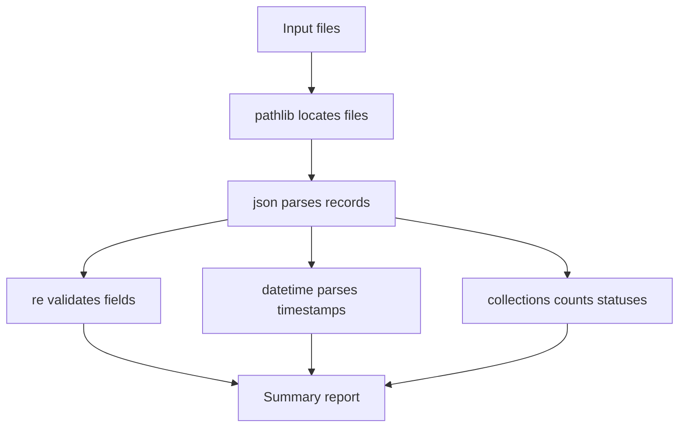

# Standard Library Highlights

Python is often described as having "batteries included." Halvorsen's textbook introduces the standard library through modules such as `math` and through the general idea that Python ships with reusable modules for common tasks. That point deserves emphasis: before installing a package or writing a custom parser, check whether the standard library already solves the problem.

This page focuses on a practical subset: `pathlib` for paths, `collections` for better containers, `datetime` for dates and times, `json` for structured data, and `re` for regular expressions. These modules cover a large fraction of everyday scripting. They also model a broader principle: use specialized library types instead of ad hoc string manipulation or fragile conventions.

## Definitions

`pathlib` provides object-oriented filesystem paths. `Path("data") / "file.txt"` builds a path without hard-coding a slash style.

`collections` provides container types beyond the built-ins. Common examples are `Counter`, `defaultdict`, `deque`, and `namedtuple`. These often replace manual dictionary bookkeeping.

`datetime` provides date, time, datetime, duration, and timezone-related classes. The most common classes are `date`, `time`, `datetime`, `timedelta`, and `timezone`.

`json` reads and writes JavaScript Object Notation, a text format for dictionaries, lists, strings, numbers, booleans, and null values. JSON maps naturally to Python's `dict`, `list`, `str`, `int`, `float`, `True`, `False`, and `None`.

`re` provides regular expressions, a pattern language for matching text. It is powerful for structured text patterns such as IDs, dates, and repeated forms, but it is not the right tool for every string problem.

The **standard library** is the collection of modules distributed with Python. You import them without installing third-party packages:

```python
from pathlib import Path
from collections import Counter
import json
```

## Key results

The first key result is that `pathlib.Path` should usually replace path string concatenation. It makes path joining, suffix checks, parent directories, file reads, and file writes more readable:

```python
path = Path("data") / "readings.json"
text = path.read_text(encoding="utf-8")
```

The second result is that `Counter` and `defaultdict` remove common manual patterns. Counting values does not require an `if key not in counts` block; grouping records does not require repeated setup of empty lists.

The third result is that datetimes should be parsed and formatted deliberately. Human-readable date strings are not dates until parsed. Durations should use `timedelta`, not magic numbers scattered through code. Time zones are a serious topic; avoid mixing naive and aware datetimes in production systems.

The fourth result is that JSON is for data, not arbitrary Python objects. A set, datetime, or custom class is not automatically JSON serializable. Convert to dictionaries, lists, strings, and numbers first.

The fifth result is that regular expressions should be compiled or named when patterns matter. A raw string avoids accidental backslash escapes:

```python
pattern = re.compile(r"^[A-Z]\d{3}$")
```

The sixth result is that standard library modules compose well. A script might use `Path` to find JSON files, `json` to parse them, `Counter` to summarize statuses, `datetime` to parse timestamps, and `re` to validate IDs.

A seventh result is that using the standard library often improves portability. A hand-written path join might work on one operating system and fail on another. A manual date parser might accept one format accidentally and reject a valid case. A custom JSON-like format might be easy to write but hard to read safely. Standard modules encode many edge cases that ordinary scripts should not rediscover.

An eighth result is that standard does not mean small or trivial. Modules such as `sqlite3`, `subprocess`, `logging`, `argparse`, `statistics`, `decimal`, `fractions`, `tempfile`, and `pathlib` can replace substantial custom code. When a task feels common, search the standard library index before adding a dependency. A third-party package may still be the right choice, but the decision should be informed.

Finally, standard-library code still needs careful boundaries. A regular expression can be wrong. A JSON schema can be too loose. A path can point to the wrong directory. A datetime can be naive when a timezone-aware value is required. Library use removes boilerplate; it does not remove the need to state assumptions and test important behavior.

## Visual

| Module | Main job | Good for | Avoid using it for |
|---|---|---|---|
| `pathlib` | Paths and filesystem convenience | Joining, reading, writing paths | Parsing file formats |
| `collections.Counter` | Counting hashable values | Frequencies, histograms | Ordered numeric arrays |
| `collections.defaultdict` | Defaults for missing keys | Grouping records | Hiding schema mistakes |
| `datetime` | Dates, times, durations | Scheduling, timestamps | High-level calendar policy alone |
| `json` | Structured text data | Config, APIs, logs | Arbitrary Python object storage |
| `re` | Pattern matching | Validation and extraction | Simple fixed delimiters |



## Worked example 1: count statuses in JSON files

Problem: given a directory of JSON log files, count how many records have each status.

Example file content:

```json
[
  {"time": "2026-05-16T10:00:00", "status": "OK"},
  {"time": "2026-05-16T10:01:00", "status": "WARN"}
]
```

Method:

1. Use `Path.glob("*.json")` to find files.
2. Read each file with UTF-8.
3. Parse JSON into Python objects.
4. Use `Counter` to count the `status` field.

Work:

```python
from collections import Counter
from pathlib import Path
import json

counts = Counter()

for path in Path("logs").glob("*.json"):
    records = json.loads(path.read_text(encoding="utf-8"))
    for record in records:
        counts[record["status"]] += 1
```

Step-by-step:

1. `Path("logs").glob("*.json")` yields matching paths.
2. `read_text` returns each file as a string.
3. `json.loads` converts the string into lists and dictionaries.
4. `record["status"]` extracts a status such as `"OK"`.
5. `Counter` increments the count.

Checked answer for the example file alone:

```python
counts == Counter({"OK": 1, "WARN": 1})
```

If three files are processed, the final counts are the sum across all records in all files.

## Worked example 2: validate and parse IDs with dates

Problem: parse sample labels like `"A123-2026-05-16"` into a prefix, numeric ID, and date.

Method:

1. Use a regular expression with named groups.
2. Use a raw string for the pattern.
3. Convert the numeric part to `int`.
4. Convert the date part with `date.fromisoformat`.

Work:

```python
import re
from datetime import date

pattern = re.compile(
    r"^(?P<prefix>[A-Z])(?P<number>\d{3})-(?P<day>\d{4}-\d{2}-\d{2})$"
)

label = "A123-2026-05-16"
match = pattern.match(label)

if not match:
    raise ValueError(f"invalid label: {label}")

prefix = match.group("prefix")
number = int(match.group("number"))
day = date.fromisoformat(match.group("day"))
```

Step-by-step:

1. `^` and `$` require the whole string to match.
2. `(?P<prefix>[A-Z])` captures one uppercase letter.
3. `(?P<number>\d{3})` captures exactly three digits.
4. The hyphen is matched literally.
5. The date group captures an ISO date shape.
6. `int("123")` becomes `123`.
7. `date.fromisoformat("2026-05-16")` becomes a `date` object.

Checked answer:

```python
prefix == "A"
number == 123
day.isoformat() == "2026-05-16"
```

## Code

```python
from collections import defaultdict
from datetime import datetime
from pathlib import Path
import json

def group_events_by_day(path):
    events = json.loads(Path(path).read_text(encoding="utf-8"))
    grouped = defaultdict(list)

    for event in events:
        timestamp = datetime.fromisoformat(event["timestamp"])
        grouped[timestamp.date().isoformat()].append(event["name"])

    return dict(grouped)

sample = Path("events.json")
sample.write_text(
    json.dumps(
        [
            {"timestamp": "2026-05-16T09:00:00", "name": "setup"},
            {"timestamp": "2026-05-16T10:30:00", "name": "test"},
        ],
        indent=2,
    ),
    encoding="utf-8",
)

print(group_events_by_day(sample))
```

This runnable example uses `Path`, `json`, `datetime`, and `defaultdict` together in a small but realistic workflow.

In a real project, split the sample-writing code from the grouping function. The function should read and group; the sample setup belongs in a test, a demo, or an `if __name__ == "__main__":` block. This distinction matters because imports should not create files as a side effect. The snippet is compact for learning, but production modules should keep examples away from reusable definitions so importing the module is predictable.

The broader lesson is that standard library modules are building blocks. Compose them deliberately, and keep side effects at the program boundary.

A useful study exercise is to rewrite a small manual solution with one standard library module. Replace a counting dictionary with `Counter`, string path joins with `Path`, manual JSON formatting with `json.dumps`, or hand-written date slicing with `datetime.fromisoformat`. The comparison makes the library's value concrete.

## Common pitfalls

- Building paths with hard-coded slashes instead of `Path`.
- Using `defaultdict` where a missing key should be treated as an error.
- Treating date strings as if alphabetical sorting always means chronological correctness. ISO format works; many human formats do not.
- Mixing naive and timezone-aware datetimes.
- Trying to dump sets, datetimes, or custom objects directly to JSON without conversion.
- Using regular expressions for simple `.split()` or `.startswith()` tasks.
- Forgetting raw strings for regex patterns that contain backslashes.

## Connections

- [Files and Context Managers](/cs/programming/python/files-and-context-managers)
- [Strings and Text Processing](/cs/programming/python/strings-and-text-processing)
- [Containers and Idioms](/cs/programming/python/containers-and-idioms)
- [Testing and the Scientific Stack](/cs/programming/python/testing-and-scientific-stack)
