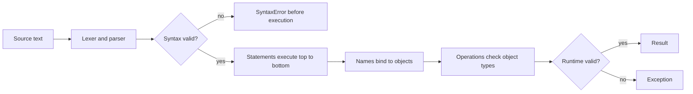

# Syntax, Variables, and Types

Python syntax is designed to make structure visible. Instead of braces around blocks, Python uses indentation; instead of type declarations for ordinary variables, it uses dynamic typing; instead of a mandatory program wrapper, a file can begin with useful statements immediately. Halvorsen's textbook introduces these ideas through small programs: assign a number, print it, combine values in a formula, inspect a variable's type, and gradually build longer scripts.

The practical lesson is that Python code is close to executable pseudocode, but it is still precise. Whitespace matters. Names are case-sensitive. Values have types even when variables do not have declared types. A beginner who understands those rules can read most simple Python programs and can diagnose many first errors without guessing.

## Definitions

A **statement** is an instruction Python executes, such as assignment, `if`, `for`, `import`, or `return`. An **expression** is code that produces a value, such as `2 + 3`, `len(name)`, or `temperature > 25`.

A **variable** is a name bound to an object. In `x = 3`, `x` is the name and `3` is the integer object. Python variables are not boxes with fixed types; they are references to objects. The same name can later be rebound to a different object:

```python
x = 3
x = "three"
```

This is legal, but frequent type changes for the same name often make code harder to read.

A **type** describes what operations a value supports. Common built-in types include `int`, `float`, `complex`, `bool`, `str`, `list`, `tuple`, `set`, `dict`, and `NoneType`. Use `type(value)` while learning, but in production code it is often better to rely on behavior, validation, or type hints.

An **identifier** is a valid name. Python names can contain letters, digits, and underscores, but cannot start with a digit. `total`, `total_cost`, and `_cache` are valid. `2total` is not. Names are case-sensitive: `amount`, `Amount`, and `AMOUNT` are three different names.

A **comment** starts with `#` and continues to the end of the line. Comments should explain intent, assumptions, or non-obvious reasoning. They should not repeat simple code in English.

A **docstring** is a string literal placed at the start of a module, function, class, or method. Tools can read docstrings to generate help:

```python
def area(width, height):
    """Return the area of a rectangle."""
    return width * height
```

## Key results

The first key result is that indentation is syntax. A block begins after a colon and continues as long as indentation stays aligned. This affects `if`, `for`, `while`, `def`, `class`, `try`, `with`, and related constructs. Four spaces per indentation level is the standard convention.

The second result is that assignment binds names; it does not copy every value. For immutable values such as integers and strings, this distinction rarely surprises beginners. For mutable values such as lists and dictionaries, aliasing matters:

```python
a = [1, 2, 3]
b = a
b.append(4)
print(a)  # [1, 2, 3, 4]
```

Both names refer to the same list. To make a shallow copy, use `a.copy()`, `list(a)`, or slicing for lists.

The third result is that Python has strong dynamic typing. "Dynamic" means names can be bound without declared types and types are checked while the program runs. "Strong" means Python does not silently combine incompatible types in arbitrary ways:

```python
"2" + 2  # TypeError
```

You must state the conversion:

```python
int("2") + 2  # 4
```

The fourth result is that truth values follow clear rules. `False`, `None`, numeric zero, empty strings, and empty containers are falsey. Most other objects are truthy. This makes code such as `if names:` idiomatic when you mean "if this list is not empty."

The fifth result is that readable naming is part of correctness. A name such as `temperature_c` carries units; `t` does not. In short exercises, `x` and `y` are acceptable. In programs that will be reread, descriptive names prevent mistakes.

A sixth result is that Python's apparent freedom should be balanced with local discipline. Because the interpreter does not require declarations, programmers have to create clarity through naming, small functions, and checks near the boundary of the program. If a value arrives from `input()`, a file, JSON, command-line arguments, or a web request, its type should be treated as unknown until converted or validated. Inside the core of a program, values should have stable meanings. For example, avoid using `value` as text in one half of a function and as a float in the other half. Use `value_text` for the raw string and `value` or `value_c` for the converted number.

A seventh result is that syntax errors and type errors point to different stages of understanding. A syntax error means Python could not parse the program; inspect punctuation, indentation, quotes, colons, and parentheses. A type error means Python understood the statement but rejected the operation for the values supplied at runtime. Reading that distinction early makes later debugging easier. When a beginner sees `TypeError: can only concatenate str (not "int") to str`, the fix is not random punctuation; it is a conversion or a different operation.

Finally, comments and docstrings should not compensate for vague code. If a comment says `# convert celsius to fahrenheit`, the function name `celsius_to_fahrenheit` is better. Use comments for assumptions that are not visible in the syntax: units from a sensor, why a threshold is chosen, or why a value is rounded before comparison.

## Visual



| Value | Type | Example operation | Notes |
|---|---|---|---|
| `42` | `int` | `42 + 8` | Arbitrary precision integer |
| `3.14` | `float` | `3.14 * r ** 2` | Binary floating-point approximation |
| `2 + 3j` | `complex` | `abs(2 + 3j)` | Uses `j` for imaginary part |
| `True` | `bool` | `temperature > 25` | Subclass of `int`, but use as logic |
| `"Python"` | `str` | `"Python".lower()` | Immutable Unicode text |
| `None` | `NoneType` | `result is None` | Represents no value or missing result |

## Worked example 1: trace assignments and types

Problem: predict the output and types in a short script.

```python
x = 3
y = 2.5
z = x + y
label = "total"

print(z)
print(type(x).__name__)
print(type(z).__name__)
print(label.upper())
```

Method:

1. `x = 3` binds `x` to an `int`.
2. `y = 2.5` binds `y` to a `float`.
3. `z = x + y` adds an `int` and a `float`. Python converts the numeric result to `float` because fractional precision may be needed.
4. `label = "total"` binds a string.
5. `print(z)` prints the numeric value.
6. `type(x).__name__` reports `int`.
7. `type(z).__name__` reports `float`.
8. `label.upper()` returns a new string, because strings are immutable.

Checked answer:

```text
5.5
int
float
TOTAL
```

The original `label` remains `"total"` unless the uppercase result is assigned back:

```python
label = label.upper()
```

## Worked example 2: fix input conversion

Problem: a user types two numbers, but the program concatenates them instead of adding them.

Buggy code:

```python
a = input("First: ")
b = input("Second: ")
print(a + b)
```

Suppose the user enters `10` and `5`. The output is:

```text
105
```

Method:

1. `input()` returns strings.
2. `a` is `"10"` and `b` is `"5"`.
3. For strings, `+` means concatenation, so `"10" + "5"` is `"105"`.
4. Convert both inputs before adding.

Fixed code:

```python
a_text = input("First: ")
b_text = input("Second: ")

a = float(a_text)
b = float(b_text)

print(a + b)
```

Check:

1. If the inputs are `10` and `5`, then `float("10")` is `10.0` and `float("5")` is `5.0`.
2. Numeric addition gives:

$$
\begin{aligned}
10.0 + 5.0 &= 15.0
\end{aligned}
$$

3. The output is now `15.0`. If integer-only input is required, use `int()` instead of `float()`.

## Code

```python
def summarize_value(name, value):
    print(f"{name}:")
    print(f"  value = {value!r}")
    print(f"  type  = {type(value).__name__}")
    print(f"  truth = {bool(value)}")

values = {
    "count": 0,
    "pi": 3.14159,
    "title": "Python Programming",
    "items": [],
    "missing": None,
}

for name, value in values.items():
    summarize_value(name, value)
```

The snippet is useful for learning because it shows representation, type, and truth value side by side. The `!r` conversion in an f-string uses `repr()`, making strings and `None` easier to distinguish from printed prose.

## Common pitfalls

- Forgetting that indentation is part of the grammar. Misaligned blocks can change meaning or raise `IndentationError`.
- Using a variable before assigning it. Python raises `NameError` because the name has no binding in the current scope.
- Expecting `input()` to return a number. It returns text; convert explicitly.
- Confusing `=` assignment with `==` equality comparison.
- Reusing built-in names such as `list`, `str`, `sum`, or `type` as variables. That shadows useful functions.
- Assuming `a = b` copies a list or dictionary. It creates another reference to the same object.
- Comparing to `None` with `==`. Prefer `is None`, because `None` is a singleton.

## Connections

- [Setup, REPL, and Environments](/cs/programming/python/setup-repl-and-environments)
- [Operators and Expressions](/cs/programming/python/operators-and-expressions)
- [Control Flow and Comprehensions](/cs/programming/python/control-flow-and-comprehensions)
- [Containers and Idioms](/cs/programming/python/containers-and-idioms)
