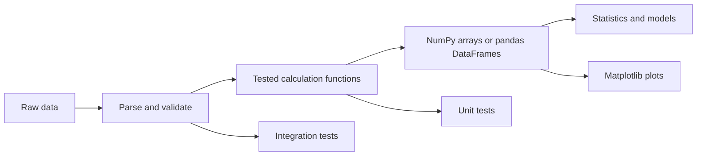

# Testing and the Scientific Stack

Testing and scientific computing sit at different ends of many Python courses, but they reinforce each other. Testing asks whether code behaves as intended. Scientific computing asks Python to calculate, transform, and visualize data correctly. Halvorsen's textbook includes many exercises and a short mathematics section with math functions, statistics, trigonometry, polynomials, NumPy, SciPy, Matplotlib, and pandas mentioned as important packages. This page gives a compact bridge from beginner scripts to reliable numeric work.

The most important habit is to separate calculation from presentation. A function that returns a result can be tested. A plotting function that depends on a tested calculation is easier to trust. A data-analysis notebook that uses small tested helpers is more reproducible than one long sequence of manually edited cells.

## Definitions

A **test** is code that checks other code. A test usually arranges input, calls the unit under test, and asserts the expected result.

`unittest` is Python's standard library testing framework. It uses test classes and assertion methods:

```python
import unittest

class TestMath(unittest.TestCase):
    def test_addition(self):
        self.assertEqual(2 + 3, 5)
```

`pytest` is a popular third-party testing framework. It can run simple test functions with plain `assert` statements:

```python
def test_addition():
    assert 2 + 3 == 5
```

A **unit test** checks a small piece, such as one function. An **integration test** checks several pieces working together, such as file parsing plus calculation.

NumPy provides efficient arrays and numerical functions. pandas provides labeled tabular data structures such as `DataFrame`. Matplotlib provides plotting. SciPy provides scientific algorithms for optimization, integration, signal processing, interpolation, and more. These packages are third-party libraries, often installed through Anaconda, Conda, or `pip`.

A **vectorized** operation applies an operation to many values using optimized array code rather than a Python loop.

A **fixture** in testing is setup data or resources used by tests. In pytest, fixtures can be functions decorated with `@pytest.fixture`.

## Key results

The first key result is that tests should be deterministic. A test should not depend on the current time, random data, network availability, or a file left over from a previous run unless those dependencies are controlled.

The second result is that floating-point tests need tolerances. Decimal-looking values often have binary approximations. Instead of checking exact equality for computed floats, use `math.isclose`, `pytest.approx`, or NumPy testing helpers.

The third result is that small pure functions are the easiest to test. A function that accepts data and returns data can be tested without files, user input, plots, or global state.

The fourth result is that NumPy arrays change the way code should be written. Instead of looping over every element in Python, write array expressions:

```python
fahrenheit = celsius * 9 / 5 + 32
```

where `celsius` may be an entire NumPy array.

The fifth result is that pandas is for labeled table operations, not a replacement for every list of dictionaries. It shines when data has columns, missing values, grouping, joins, time indexes, and export/import needs.

The sixth result is that plots are outputs, not proofs. A plot can reveal a problem, but tested calculations and clear data transformations are what make the result defensible.

A seventh result is that tests should cover boundaries from the domain, not just from the code. Temperature conversion has known reference points such as freezing and boiling water. A parser has empty input, malformed input, and valid input with extra whitespace. A statistical function has one value, repeated values, negative values, and sometimes missing data. Good test cases come from what the program means, not only from which branches appear in the implementation.

An eighth result is that scientific libraries reward vector thinking. If a calculation is naturally "apply this formula to every value," an array expression is usually clearer and faster than a Python loop. If the operation is "group rows by label and compute a summary," pandas may express it directly. If the task is a small teaching example, a plain list may still be best. Choose the tool by the shape of the data and the question being asked.

Finally, reproducibility is more than a passing test. Record package dependencies, keep raw data separate from derived data, make notebooks restartable from a clean kernel, and avoid hidden manual steps. A result that cannot be rerun is hard to trust, even when the code looked correct once.

## Visual



| Tool | Install status | Best for | Example |
|---|---|---|---|
| `unittest` | standard library | Built-in test suites | `python -m unittest` |
| `pytest` | third-party | Concise tests and fixtures | `pytest` |
| NumPy | third-party | Numeric arrays | `np.array([1, 2, 3])` |
| pandas | third-party | Tables and labeled data | `pd.DataFrame(...)` |
| Matplotlib | third-party | Plots | `plt.plot(x, y)` |
| SciPy | third-party | Scientific algorithms | optimization, integration |

## Worked example 1: test a conversion function

Problem: test a Celsius-to-Fahrenheit function with known reference values and a round trip.

Function:

```python
def c2f(celsius):
    return celsius * 9 / 5 + 32

def f2c(fahrenheit):
    return (fahrenheit - 32) * 5 / 9
```

Method using pytest:

1. Write test functions whose names begin with `test_`.
2. Check exact values that are exactly representable enough for this formula.
3. Use an approximate check for round trips.

Tests:

```python
import pytest

def test_c2f_reference_points():
    assert c2f(0) == 32
    assert c2f(100) == 212

def test_round_trip_body_temperature():
    assert f2c(c2f(37)) == pytest.approx(37)
```

Step-by-step:

1. `c2f(0)` computes `0 * 9 / 5 + 32 = 32`.
2. `c2f(100)` computes `100 * 9 / 5 + 32 = 212`.
3. `c2f(37)` gives `98.6`.
4. `f2c(98.6)` mathematically gives `37`.
5. `pytest.approx(37)` allows tiny floating-point error.

Checked answer: all tests should pass. If the formula accidentally used `5 / 9` in `c2f`, the reference tests would fail immediately.

## Worked example 2: compute and plot an array transformation

Problem: convert several Celsius readings to Fahrenheit, compute the mean, and prepare a plot.

Data:

```python
celsius = [0, 10, 20, 30]
```

Method:

1. Convert the list to a NumPy array.
2. Apply the formula once to the whole array.
3. Compute the mean using NumPy.
4. Plot Celsius vs Fahrenheit with Matplotlib.

Work:

```python
import numpy as np
import matplotlib.pyplot as plt

celsius = np.array([0, 10, 20, 30], dtype=float)
fahrenheit = celsius * 9 / 5 + 32
average_f = fahrenheit.mean()

plt.plot(celsius, fahrenheit, marker="o")
plt.xlabel("Celsius")
plt.ylabel("Fahrenheit")
plt.title("Temperature conversion")
```

Step-by-step:

1. `np.array` creates a numeric array: `[0., 10., 20., 30.]`.
2. The multiplication and addition are vectorized.
3. Results:

$$
\begin{aligned}
0^\circ C &\to 32^\circ F \\
10^\circ C &\to 50^\circ F \\
20^\circ C &\to 68^\circ F \\
30^\circ C &\to 86^\circ F
\end{aligned}
$$

4. The mean is:

$$
\begin{aligned}
(32 + 50 + 68 + 86) / 4 &= 236 / 4 \\
                       &= 59
\end{aligned}
$$

Checked answer:

```python
fahrenheit.tolist() == [32.0, 50.0, 68.0, 86.0]
average_f == 59.0
```

The plot should be a straight line because the conversion formula is linear.

## Code

```python
from math import isclose

def mean(values):
    if not values:
        raise ValueError("values must not be empty")
    return sum(values) / len(values)

def test_mean_regular_values():
    assert mean([10, 20, 30]) == 20

def test_mean_float_values():
    assert isclose(mean([0.1, 0.2, 0.3]), 0.2, rel_tol=1e-12)

def test_mean_empty_values():
    try:
        mean([])
    except ValueError as error:
        assert "empty" in str(error)
    else:
        raise AssertionError("mean([]) should raise ValueError")
```

This code is written so it can be run by pytest as plain test functions, while using only the standard library.

When converting this style to a larger project, keep tests close to the behavior they protect. A `tests/` directory can mirror the source layout, with test files named after modules. Use small fixtures for representative data instead of depending on large local files. For scientific work, store expected values that can be checked independently, such as hand-calculated reference points or values from a trusted source. The goal is not to test Python or NumPy themselves; it is to test your assumptions, formulas, parsing rules, and data transformations.

## Common pitfalls

- Testing only the "happy path" and skipping invalid input, empty data, and boundary values.
- Comparing computed floats with exact equality when a tolerance is needed.
- Letting tests depend on files in the current working directory without creating them in the test.
- Mixing calculation, printing, plotting, and input in one function, which makes testing difficult.
- Installing NumPy or pandas into one environment and running the notebook or script in another.
- Using pandas for tiny problems where a list of dictionaries or `csv` is simpler.
- Trusting a plot without checking the underlying data transformation.

## Connections

- [Functions, Arguments, and Decorators](/cs/programming/python/functions-arguments-and-decorators)
- [Errors, Exceptions, and Debugging](/cs/programming/python/errors-exceptions-and-debugging)
- [Modules, Packages, and Environments](/cs/programming/python/modules-packages-and-environments)
- [Standard Library Highlights](/cs/programming/python/standard-library-highlights)
