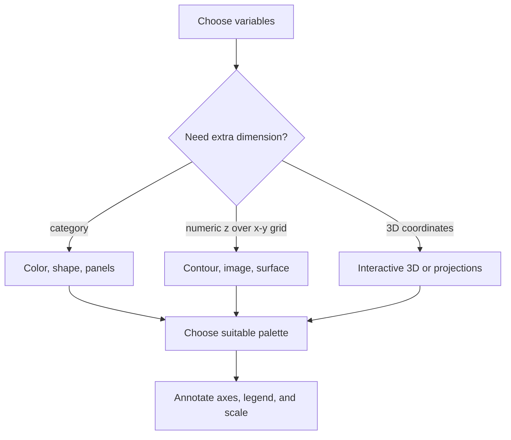

# Advanced Graphics and 3D Plots

The later graphics chapters of *The Book of R* move beyond first plots into devices, margins, annotations, colors, palettes, higher-dimensional displays, contours, surfaces, and interactive 3D graphics. These topics are not separate from statistics: visualization choices determine whether patterns, residual structure, clusters, and model surfaces can be understood.

Advanced plotting in R has two sides. One side is control over a two-dimensional figure: devices, margins, axes, clipping, legends, mathematical labels, and color. The other side is representing more than two variables: color scales, facets, contours, perspective surfaces, and interactive rotation. The goal is not decoration. It is to make structure visible without misleading the reader.

## Definitions

A **graphics device** is an output target such as an on-screen window, PDF, or PNG. Managing devices matters when a script writes multiple figures.

**Margins** are controlled in base graphics with `par(mar = ...)` and related settings. They reserve space for titles, axes, and labels.

A **palette** is a set of colors used to encode groups or numeric values. Qualitative palettes distinguish categories; sequential palettes encode ordered magnitudes; diverging palettes emphasize deviations around a midpoint.

A **contour plot** represents a surface $z = f(x, y)$ by drawing lines of equal $z$ value. In base R, `contour` and `filled.contour` are common tools.

A **perspective plot** draws a 3D-looking surface in 2D using `persp`.

An **interactive 3D plot** allows rotation, zooming, or other user-driven changes. The book discusses packages for interactive 3D work; exact package choices may vary by R installation and era.

## Key results

Higher-dimensional plotting requires explicit mapping:

| Data dimension | Visual strategy | Base R examples |
|---|---|---|
| One numeric variable | Histogram, density, boxplot | `hist`, `density`, `boxplot` |
| Two numeric variables | Scatterplot, line plot | `plot`, `lines` |
| Two numeric plus category | Color, shape, facets | `col`, `pch`, separate panels |
| Two numeric plus numeric response | Contour, image, surface | `contour`, `image`, `persp` |
| Three numeric coordinates | 3D scatter or projections | package-based 3D, pairs |

Color should match data type. Categories need distinct hues. Ordered numeric values need ordered palettes. Diverging values need a meaningful midpoint, such as zero residual or average difference.

For surfaces, the usual base R setup is:

1. Create sequences of x and y coordinates.
2. Evaluate a function at every x-y grid pair.
3. Store z-values in a matrix.
4. Plot with `contour`, `image`, `filled.contour`, or `persp`.

The z-matrix orientation matters. Rows and columns must align with the x and y vectors expected by the plotting function. Small test grids help catch transposition errors.

## Visual



```text
Surface grid:

          y1     y2     y3
x1      z11    z12    z13
x2      z21    z22    z23
x3      z31    z32    z33
x4      z41    z42    z43

Contour lines connect equal z values across the grid.
```

## Worked example 1: Contour plot of a bivariate function

Problem: plot contours of $z = \sin(x)\cos(y)$ over $-\pi \le x \le \pi$ and $-\pi \le y \le \pi$.

Method:

1. Create x and y coordinate sequences.
2. Use `outer` to evaluate the function over the grid.
3. Draw contour lines.
4. Add a title and axis labels.
5. Check a known value manually.

```r
x <- seq(-pi, pi, length.out = 80)
y <- seq(-pi, pi, length.out = 80)
z <- outer(x, y, function(a, b) sin(a) * cos(b))

contour(
  x,
  y,
  z,
  nlevels = 12,
  xlab = "x",
  ylab = "y",
  main = "Contours of sin(x) cos(y)"
)
```

Checked answer: at `x = 0`, `sin(0) = 0`, so `z = 0` for every `y`. The contour plot should include a zero contour through the vertical line at x = 0. At `x = pi / 2` and `y = 0`, `z = 1 * 1 = 1`, so the surface reaches a high value near that coordinate.

The `outer` call is concise because it evaluates all x-y combinations without a hand-written nested loop.

## Worked example 2: Color-coded residual surface

Problem: fit `mpg ~ wt + hp` in `mtcars`, compute predicted mpg over a grid of weight and horsepower values, and display the fitted surface as a filled contour.

Method:

1. Fit the linear model.
2. Create grid sequences for `wt` and `hp`.
3. Use `expand.grid` to create prediction points.
4. Predict mpg for every grid point.
5. Reshape predictions into a matrix.
6. Plot with `filled.contour`.

```r
fit <- lm(mpg ~ wt + hp, data = mtcars)

wt_grid <- seq(min(mtcars$wt), max(mtcars$wt), length.out = 40)
hp_grid <- seq(min(mtcars$hp), max(mtcars$hp), length.out = 40)
grid <- expand.grid(wt = wt_grid, hp = hp_grid)

grid$mpg_hat <- predict(fit, newdata = grid)
z <- matrix(grid$mpg_hat, nrow = length(wt_grid), ncol = length(hp_grid))

filled.contour(
  wt_grid,
  hp_grid,
  z,
  xlab = "Weight",
  ylab = "Horsepower",
  color.palette = terrain.colors,
  main = "Predicted mpg from linear model"
)
```

Checked answer: the fitted model has negative coefficients for weight and horsepower in this data set, so predicted mpg should generally decrease as either axis increases. The contour colors should reflect higher mpg in the low-weight, low-horsepower corner and lower mpg in the high-weight, high-horsepower corner.

This plot visualizes a model surface. It should be interpreted inside the observed data range; empty corners of the grid may represent combinations not well supported by actual cars.

## Code

```r
# Build a reusable surface plot for any two-predictor lm object.

plot_lm_surface <- function(fit, data, xvar, yvar, n = 50) {
  x_grid <- seq(min(data[[xvar]]), max(data[[xvar]]), length.out = n)
  y_grid <- seq(min(data[[yvar]]), max(data[[yvar]]), length.out = n)
  grid <- expand.grid(x = x_grid, y = y_grid)
  names(grid) <- c(xvar, yvar)

  grid$z <- predict(fit, newdata = grid)
  z <- matrix(grid$z, nrow = n, ncol = n)

  image(x_grid, y_grid, z, xlab = xvar, ylab = yvar, col = heat.colors(20))
  contour(x_grid, y_grid, z, add = TRUE)
  points(data[[xvar]], data[[yvar]], pch = 19, cex = 0.7)
}

fit <- lm(mpg ~ wt + hp, data = mtcars)
plot_lm_surface(fit, mtcars, "wt", "hp")
```

## Common pitfalls

- Using color palettes that imply order for unordered categories.
- Forgetting legends or scales when color encodes numeric values.
- Plotting a model surface far outside observed data and interpreting extrapolation as evidence.
- Transposing the z-matrix accidentally and labeling axes incorrectly.
- Overusing 3D perspective when a contour or faceted 2D plot would be easier to read.
- Making margins too small for labels, especially when exporting to file devices.
- Changing global graphical parameters and not restoring them.

## Connections

- [Base graphics](/cs/programming/r/base-graphics)
- [ggplot2 graphics](/cs/programming/r/ggplot2-graphics)
- [Linear and generalized models](/cs/programming/r/linear-and-generalized-models)
- [Matrices and arrays](/cs/programming/r/matrices-and-arrays)
