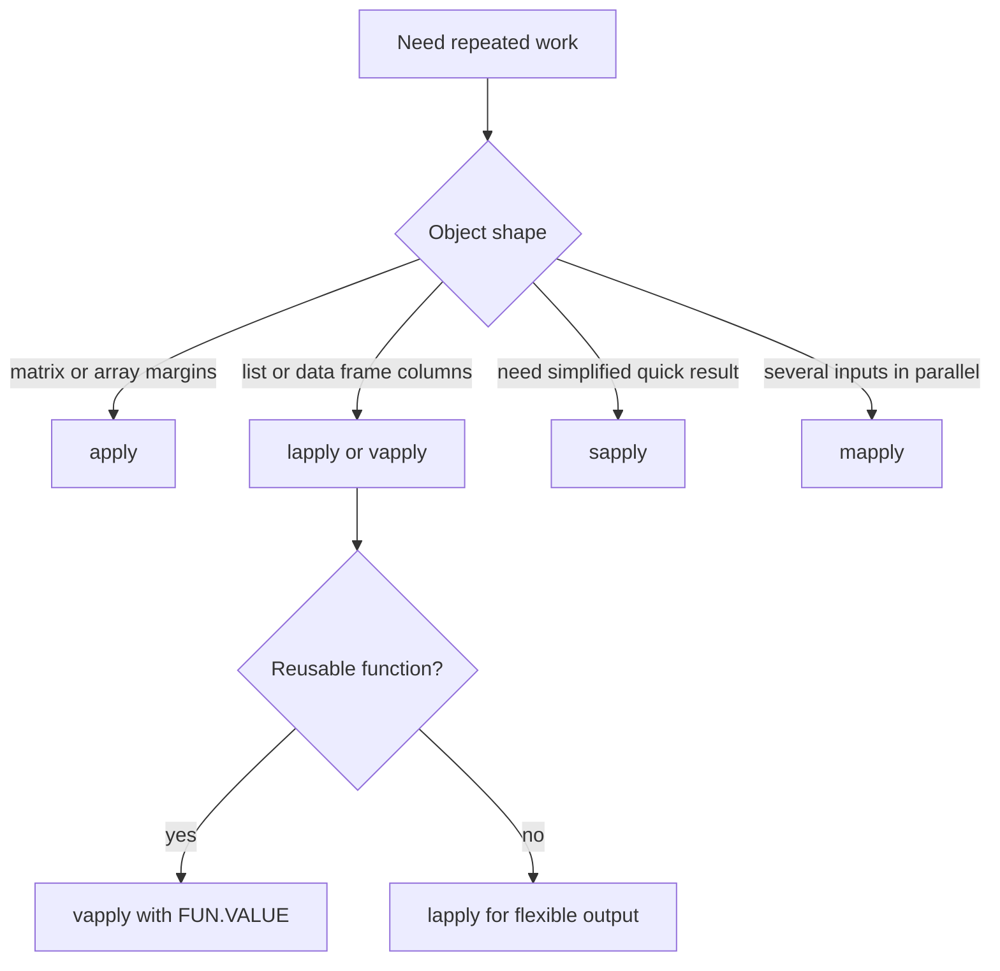

# Apply Family

R's apply family is a set of tools for repeated work without writing explicit loops every time. The book first introduces implicit looping through `apply`, then later uses functions and lists in ways that make `lapply`, `sapply`, `vapply`, and `mapply` natural. These functions do not make loops disappear; they package common loop patterns into expressions that say what is being applied and to what.


*Figure: R connects programming examples to statistical modeling and visualization workflows. Image: [Wikimedia Commons](https://commons.wikimedia.org/wiki/File:R_logo.svg), The R Foundation, CC BY-SA 4.0.*

The apply family is most useful when each iteration is independent and produces a predictable result. It is less useful when iterations depend heavily on previous iterations, in which case a clear `for` or `while` loop may be better. The goal is readable, reliable iteration, not avoiding the word `for` at all costs.

## Definitions

`apply(X, MARGIN, FUN, ...)` applies a function to the rows, columns, or higher-dimensional margins of an array or matrix. `MARGIN = 1` means rows; `MARGIN = 2` means columns.

`lapply(X, FUN, ...)` applies a function to each element of a vector or list and always returns a list.

`sapply(X, FUN, ...)` is a simplifying wrapper around `lapply`. It tries to turn the result into a vector, matrix, or array when possible.

`vapply(X, FUN, FUN.VALUE, ...)` is like `sapply`, but it requires a declared output shape and type. This makes it safer inside functions and packages.

`mapply(FUN, ..., MoreArgs = NULL)` applies a function over multiple inputs in parallel. It is useful when the first call uses `x[1]` and `y[1]`, the second uses `x[2]` and `y[2]`, and so on.

An **anonymous function** is a function written inline, such as `function(x) mean(x, na.rm = TRUE)`.

## Key results

The apply functions differ mainly in input expectation and output simplification:

| Function | Input pattern | Output | Best use |
|---|---|---|---|
| `apply` | Matrix or array margins | Simplified when possible | Row or column summaries |
| `lapply` | List or vector elements | Always list | Heterogeneous results |
| `sapply` | List or vector elements | Tries to simplify | Interactive quick work |
| `vapply` | List or vector elements | Declared type/shape | Reliable programming |
| `mapply` | Multiple parallel inputs | Simplified by default | Pairwise or parallel argument mapping |

`vapply` is often the best default inside reusable functions because it fails early if a result has the wrong type or length. For example:

```r
vapply(mtcars, mean, numeric(1))
```

This says every column summary must be one numeric value. If a column cannot produce that, R raises an error instead of silently returning an awkward list.

`apply` coerces data frames to matrices if given a data frame. Because matrices require one type, this can accidentally turn numbers into character strings. For data frames, prefer `lapply`, `vapply`, or column-specific code unless every selected column is safely numeric.

## Visual



```text
Matrix margins:

        col1 col2 col3
row1      1    4    7  <- MARGIN = 1 applies across rows
row2      2    5    8
row3      3    6    9
          ^    ^    ^
          MARGIN = 2 applies down columns
```

## Worked example 1: Column summaries with `vapply`

Problem: compute the mean and standard deviation for numeric columns `mpg`, `hp`, and `wt` in `mtcars`, returning a clean summary table.

Method:

1. Select the numeric columns.
2. Use `vapply` for means, requiring one numeric result per column.
3. Use `vapply` for standard deviations.
4. Combine into a data frame.
5. Check one mean manually in principle by comparing with `mean(mtcars$mpg)`.

```r
cars <- mtcars[c("mpg", "hp", "wt")]

means <- vapply(cars, mean, numeric(1))
sds <- vapply(cars, sd, numeric(1))

summary_table <- data.frame(
  variable = names(cars),
  mean = means,
  sd = sds,
  row.names = NULL
)

summary_table
#   variable       mean         sd
# 1      mpg  20.090625   6.026948
# 2       hp 146.687500  68.562868
# 3       wt   3.217250   0.978457
```

Checked answer: `vapply(cars, mean, numeric(1))` calls `mean` once for each column and requires each call to return one numeric value. The mpg mean is the same value returned by `mean(mtcars$mpg)`, so the apply result matches the direct calculation.

The benefit over `sapply` is the contract. If one selected column were character, `vapply` would fail clearly instead of simplifying unpredictably.

## Worked example 2: Pairwise simulation with `mapply`

Problem: simulate three binomial experiments with different numbers of trials and different success probabilities. For each experiment, compute the observed number of successes with a fixed random seed.

Method:

1. Store trial counts in one vector.
2. Store probabilities in another vector of the same length.
3. Write a function that calls `rbinom(1, size, prob)`.
4. Use `mapply` to pass corresponding elements.
5. Check that output length matches the number of experiments.

```r
set.seed(42)
trials <- c(10, 20, 50)
probs <- c(0.2, 0.5, 0.8)

simulate_successes <- function(size, prob) {
  rbinom(1, size = size, prob = prob)
}

successes <- mapply(simulate_successes, size = trials, prob = probs)
successes
# [1]  4 13 39

length(successes)
# [1] 3
```

Checked answer: there are three experiments, so there are three simulated counts. Each count is possible for its trial size: 4 is between 0 and 10, 13 is between 0 and 20, and 39 is between 0 and 50. With the seed fixed, the result is reproducible.

This pattern is clearer than manually indexing inside a loop when the conceptual operation is "call the same function with parallel argument vectors."

## Code

```r
# Apply several summary functions to selected columns.

summarize_numeric <- function(df, cols) {
  selected <- df[cols]
  if (!all(vapply(selected, is.numeric, logical(1)))) {
    stop("All selected columns must be numeric")
  }

  stats <- list(
    mean = function(x) mean(x, na.rm = TRUE),
    median = function(x) median(x, na.rm = TRUE),
    sd = function(x) sd(x, na.rm = TRUE),
    missing = function(x) sum(is.na(x))
  )

  pieces <- lapply(stats, function(fun) vapply(selected, fun, numeric(1)))
  as.data.frame(pieces)
}

print(summarize_numeric(mtcars, c("mpg", "disp", "hp", "wt")))
```

The helper deliberately uses `lapply` and `vapply` together. `lapply(stats, ...)` iterates over a list of functions because each list element is itself a function object. Inside that outer loop, `vapply(selected, fun, numeric(1))` iterates over the selected columns and requires one numeric result per column. The final `as.data.frame(pieces)` turns a list of equal-length named vectors into a rectangular summary.

This nesting is easier to understand if you read from the inside out. For one statistic, such as the mean, apply that statistic to every selected column. Then repeat the same column-wise operation for every statistic in the `stats` list. The output has variables as rows and statistics as columns because each statistic returns one value per variable.

Apply functions are not a substitute for understanding data shape. Before choosing an apply function, identify the unit of iteration: rows of a matrix, columns of a data frame, elements of a list, or parallel elements of several vectors. Then identify the expected output of one iteration. If one iteration returns one number, `vapply(..., numeric(1))` is natural. If it returns a fitted model or a mixed object, `lapply` is natural. If it returns values whose shape can vary, do not force simplification too early.

For teaching and debugging, an explicit `for` loop can be clearer than a dense anonymous function. Once the loop body is stable, replacing it with an apply function may reduce boilerplate. Clarity is the standard, not cleverness.

A practical comparison is to write the same operation both ways. First, use a `for` loop with a preallocated result vector and comments. Second, use `vapply` with the same helper function. If both produce identical output, the apply version is a compact expression of the same loop. If the apply version is hard to read, keep the loop. R style favors vectorization, but maintainable analysis favors code that future readers can verify.

Be especially careful when applying functions that return models, plots, or tests. Those results are complex objects, so `lapply` is usually the right first container. Afterward, extract the specific scalar summaries needed for a report with `vapply`. This two-stage approach avoids premature simplification while still producing clean summary tables.

When an apply call is confusing, rewrite it as a loop on paper. Identify the first input, the function call made for that input, and the first returned value. Then generalize. This small exercise turns apply syntax from magic into ordinary repeated evaluation.

## Common pitfalls

- Using `apply` on a data frame with mixed types and accidentally coercing everything to character.
- Assuming `sapply` always returns the same shape. It simplifies when it can, which can surprise program code.
- Forgetting `FUN.VALUE` in `vapply` or declaring the wrong expected type.
- Passing extra arguments in the wrong place. Extra arguments after `FUN` are passed to the applied function.
- Making anonymous functions so dense that a simple named helper would be clearer.
- Treating apply functions as automatically faster. They are often clearer, but performance depends on the operation.

## Connections

- [Control flow, functions, and scoping](/cs/programming/r/control-flow-functions-scoping)
- [Matrices and arrays](/cs/programming/r/matrices-and-arrays)
- [Lists and data frames](/cs/programming/r/lists-and-data-frames)
- [Probability distributions](/cs/programming/r/probability-distributions)
