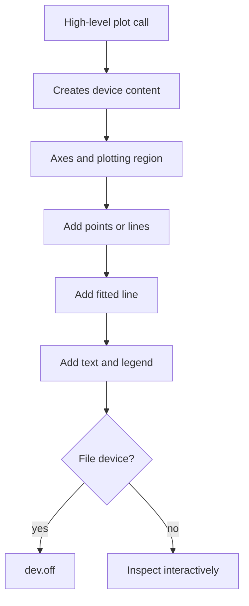

# Base Graphics

Base R graphics are immediate, scriptable, and deeply connected to ordinary R objects. The book introduces plotting early with `plot`, graphical parameters, points, lines, text, colors, and axis controls, then returns later to advanced customization. Base graphics are not arranged around a grammar in the same way as `ggplot2`; instead, you open a device, draw a plot, and add layers procedurally.

That procedural style is useful for statistical exploration. A scatterplot can be drawn with one command, then a fitted line, legend, labels, and reference marks can be added step by step. Understanding base graphics also helps when reading older R code, using modeling functions that provide base diagnostic plots, or exporting quick figures without additional packages.

## Definitions

A **graphics device** is where a plot is drawn. It may be the RStudio plot pane, a screen window, a PDF file, or a PNG file. File devices such as `png()` and `pdf()` must be closed with `dev.off()`.

The function **`plot()`** is a generic plotting function. Its behavior depends on the class and arguments of the object supplied. For numeric vectors, it draws points; for formulas, it uses variables from a data frame; for fitted models, it may dispatch to diagnostic plots.

**Graphical parameters** control appearance. Some are supplied directly to plotting functions, such as `col`, `pch`, `lty`, `lwd`, `xlab`, `ylab`, and `main`. Others are set with `par()`, such as `mfrow`, `mar`, and `cex`.

Low-level functions **add to an existing plot**. Examples include `points`, `lines`, `abline`, `text`, `legend`, `segments`, `arrows`, `polygon`, and `axis`.

The **plot region** is the coordinate area where data are drawn. Margins surround it and hold labels, titles, and axes.

## Key results

Base graphics follow a draw-then-add workflow:

| Step | Function examples | Purpose |
|---|---|---|
| Open device | `plot()` pane, `png()`, `pdf()` | Choose output target |
| Draw high-level plot | `plot`, `hist`, `boxplot`, `barplot` | Create axes and plotting region |
| Add layers | `points`, `lines`, `abline`, `legend` | Annotate or enrich |
| Adjust layout | `par(mfrow = c(2, 2))`, `par(mar = ...)` | Multiple panels and margins |
| Close file device | `dev.off()` | Finish writing output file |

Plot types can be controlled with `type`:

| `type` | Meaning |
|---|---|
| `"p"` | points |
| `"l"` | lines |
| `"b"` | both points and lines |
| `"h"` | vertical lines, useful for mass functions |
| `"n"` | set up plot without drawing data |

Many plotting arguments are vectorized or recycled. For example, `col = mtcars$cyl` is not directly a good color mapping, but `col = as.factor(mtcars$cyl)` or an indexed palette can vary point color by group. Shape uses `pch`; line type uses `lty`; line width uses `lwd`.

Saving plots should be scripted. A plot that matters for a report should be generated by code that opens a device, draws the figure, and closes the device. Manual export from a GUI is convenient but less reproducible.

## Visual



```text
Figure area
+---------------------------------------+
| margin: title                         |
|   +-------------------------------+   |
|   |                               |   |
|   |        plot region            |   |
|   |        points, lines          |   |
|   |                               |   |
|   +-------------------------------+   |
| margin: axis labels                   |
+---------------------------------------+
```

## Worked example 1: Scatterplot with fitted line and legend

Problem: plot `mpg` against `wt` in `mtcars`, color points by cylinder count, add a fitted regression line, and include a legend.

Method:

1. Create a factor for cylinder count.
2. Create a small palette with one color per cylinder level.
3. Index colors by the factor.
4. Draw the scatterplot.
5. Fit a linear model and add `abline`.
6. Add a legend mapping colors to cylinder groups.

```r
cyl <- factor(mtcars$cyl)
palette <- c("4" = "steelblue", "6" = "darkorange", "8" = "firebrick")
point_col <- palette[as.character(cyl)]

plot(
  mtcars$wt,
  mtcars$mpg,
  pch = 19,
  col = point_col,
  xlab = "Weight (1000 lbs)",
  ylab = "Miles per gallon",
  main = "Fuel economy decreases with vehicle weight"
)

fit <- lm(mpg ~ wt, data = mtcars)
abline(fit, lwd = 2)

legend(
  "topright",
  legend = names(palette),
  col = palette,
  pch = 19,
  title = "Cylinders"
)
```

Checked answer: the fitted line slopes downward because heavier cars generally have lower mpg in `mtcars`. The color vector has length 32, matching the rows of `mtcars`, because each cylinder value is converted to a palette entry.

The plot uses base layering: `plot()` creates the figure, `abline()` adds the model line, and `legend()` adds explanatory annotation.

## Worked example 2: Multi-panel diagnostic layout

Problem: create a two-panel figure showing a histogram of `mpg` and a boxplot of `mpg` by cylinder count.

Method:

1. Save old graphical parameters so they can be restored.
2. Set `par(mfrow = c(1, 2))`.
3. Draw the histogram in the first panel.
4. Draw the grouped boxplot in the second panel.
5. Restore old parameters.
6. Check the layout.

```r
old_par <- par(no.readonly = TRUE)
par(mfrow = c(1, 2))

hist(
  mtcars$mpg,
  breaks = 8,
  col = "gray80",
  border = "white",
  main = "MPG distribution",
  xlab = "Miles per gallon"
)

boxplot(
  mpg ~ cyl,
  data = mtcars,
  col = c("steelblue", "darkorange", "firebrick"),
  xlab = "Cylinders",
  ylab = "Miles per gallon",
  main = "MPG by cylinders"
)

par(old_par)
```

Checked answer: `mfrow = c(1, 2)` creates one row and two columns. The first high-level plot fills the left panel; the second fills the right panel. Restoring `old_par` prevents later plots from unexpectedly staying in two-panel mode.

This is a common base graphics pattern: change global plotting parameters only after saving the old state, especially inside scripts or functions.

## Code

```r
# Save a publication-style base plot to a PNG file.

save_mpg_plot <- function(path) {
  png(path, width = 900, height = 650, res = 120)
  on.exit(dev.off(), add = TRUE)

  plot(
    mtcars$wt,
    mtcars$mpg,
    pch = 21,
    bg = "white",
    col = "black",
    xlab = "Weight (1000 lbs)",
    ylab = "Miles per gallon",
    main = "MTCARS: mpg versus weight"
  )
  grid(col = "gray85")
  points(mtcars$wt, mtcars$mpg, pch = 19, col = "steelblue")
  abline(lm(mpg ~ wt, data = mtcars), col = "firebrick", lwd = 2)
}

out_file <- tempfile(fileext = ".png")
save_mpg_plot(out_file)
file.exists(out_file)
```

The plotting function uses `on.exit(dev.off(), add = TRUE)` so the device is closed even if a later plotting command fails. This is a robust pattern for scripts that write graphics files. Without it, an error between `png()` and `dev.off()` can leave the file incomplete or leave the graphics device open for later plots.

The order of drawing commands matters in base graphics. The first `plot()` call establishes the axes and coordinate system. `grid()` is then drawn before the final points so the grid does not cover the data. The second `points()` call redraws the data in the desired color after the grid. Finally, `abline()` draws the fitted line. If these commands were reordered, later layers could obscure earlier ones.

Base graphics reward incremental development. Start with the simplest plot that shows the data. Add labels. Add a model line or reference line only if it supports the question. Add a legend only when the visual encoding is not self-evident. Then move the finished sequence into a function if the same plot must be regenerated. This workflow keeps graphics tied to analysis rather than turning them into one-off manual artifacts.

When exporting, check the file dimensions and resolution. A plot that looks fine in an interactive pane may have cramped labels in a small PNG or excessive whitespace in a PDF. Scripted devices let you tune `width`, `height`, and `res` in a reproducible way.

A good base plot can usually be reconstructed from four questions: what data define the coordinate system, what additional elements are layered, what annotations explain the encodings, and what device captures the result? If any answer is missing, the plot is either not reproducible or not self-explanatory. This is why high-level calls, low-level additions, legends, and device management are all part of the same skill.

For multi-panel figures, plan the comparison before setting `mfrow`. Shared scales make panels easier to compare; different scales may reveal within-panel detail but can exaggerate differences. Base graphics gives you the controls, but the analyst must choose whether comparability or local detail is more important for the question.

Base graphics is also useful for quick model diagnostics because many modeling functions already provide plot methods. Calling `plot(fit)` for an `lm` object produces a standard diagnostic set without loading another package. Understanding devices, layouts, and graphical parameters makes those built-in diagnostics easier to save and interpret.

For review, redraw one plot from scratch with only the code in the script. If the figure cannot be reproduced, some step was manual or hidden.

## Common pitfalls

- Forgetting to call `dev.off()` after opening `png()` or `pdf()`.
- Changing `par()` settings and not restoring them.
- Expecting a low-level function such as `points()` to create axes. Use a high-level plot first.
- Confusing `col` for point border with `bg` for fill when using filled plotting characters such as `pch = 21`.
- Letting a legend cover important data because placement was not checked.
- Using too many manual graphical tweaks before confirming the data and statistical message are correct.

## Connections

- [Descriptive statistics](/cs/programming/r/descriptive-statistics)
- [ggplot2 graphics](/cs/programming/r/ggplot2-graphics)
- [Advanced graphics and 3D plots](/cs/programming/r/advanced-graphics-3d)
- [Linear and generalized models](/cs/programming/r/linear-and-generalized-models)
