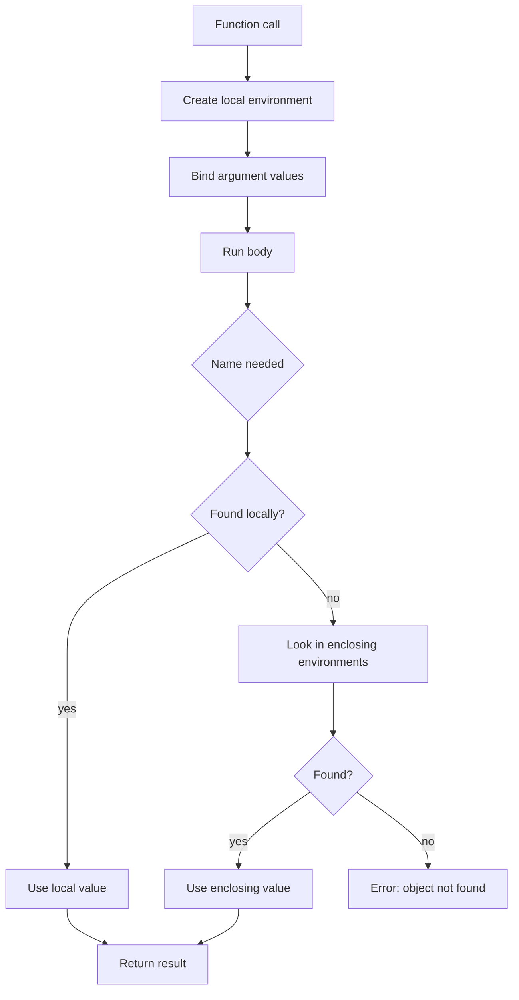

# Control Flow, Functions, and Scoping

R is vector-oriented, but real programs still need decisions, repetition, reusable functions, error checks, and local variables. The programming part of *The Book of R* moves from calling functions to writing functions, using `if`, `else`, `for`, `while`, `repeat`, `break`, `next`, and understanding where R looks for names. These tools turn isolated commands into reliable analysis programs.


*Figure: R connects programming examples to statistical modeling and visualization workflows. Image: [Wikimedia Commons](https://commons.wikimedia.org/wiki/File:R_logo.svg), The R Foundation, CC BY-SA 4.0.*

The main design principle is to keep data flow visible. A function should receive inputs as arguments, compute using local variables, and return a value. It should not depend on a mysterious object in the global environment unless that object is intentionally part of the interface. Scoping rules make R flexible, but they also allow hidden dependencies if code is written casually.

## Definitions

**Control flow** is code that changes which statements run or how many times they run. `if` and `else` choose branches; `for` and `while` repeat; `break` exits a loop; `next` skips to the next iteration.

An **`if` condition** must have length one. For vectorized conditional replacement, use `ifelse()` or indexing rather than `if`.

A **function** is an object created with `function(...) { ... }`. It has formal arguments, a body, and an environment. The last evaluated expression is returned unless `return()` is used explicitly.

**Lexical scoping** means a function looks for names first inside its own local environment, then in the environment where it was created, and then along the search path. This is why functions can see objects from their creation context, but relying on that behavior accidentally can make code hard to reproduce.

The **search path** is the sequence of attached packages and environments R consults for names. `search()` displays it.

## Key results

Use `if` for one decision and vectorized logic for many element-wise decisions:

| Goal | Prefer | Avoid |
|---|---|---|
| One branch based on one value | `if (n > 0) ...` | `if (vector > 0) ...` |
| Element-wise replacement | `ifelse(x > 0, x, 0)` | Loop unless needed |
| Filter rows | `df[df$x > 0, ]` | Rebuilding row by row |
| Repeat fixed times | `for (i in seq_along(x))` | `for (i in 1:length(x))` when length may be 0 |
| Repeat until condition | `while (...)` | Infinite loop without update |

Functions should validate assumptions near the top. For example, if a function requires numeric input, check `is.numeric(x)`. If it requires non-missing values, either stop on missing values or state and implement an `na.rm` argument. Good error messages are part of the function's interface.

R returns the last expression automatically:

```r
square <- function(x) {
  x * x
}
```

This is equivalent to returning `x * x`, but `return()` can be clearer for early exits:

```r
if (length(x) == 0) return(NA_real_)
```

Scoping explains this common bug: a function works in your current session because it reads a global variable, but fails for someone else because that variable is absent. Pass the value as an argument instead.

## Visual



| Loop keyword | Meaning | Example use |
|---|---|---|
| `for` | Iterate over a known sequence | Apply a model to each column |
| `while` | Continue while a condition is true | Iterate until tolerance is reached |
| `repeat` | Continue until explicit `break` | Simulation with stopping condition |
| `break` | Exit loop immediately | Stop when a target is found |
| `next` | Skip rest of current iteration | Ignore invalid item |

## Worked example 1: Writing a validated summary function

Problem: write a function that computes a trimmed mean after checking that input is numeric and that the trim proportion is between 0 and 0.5.

Method:

1. Define formal arguments `x`, `trim`, and `na.rm`.
2. Stop if `x` is not numeric.
3. Stop if `trim` is outside the allowed interval.
4. Remove missing values if requested.
5. Sort, remove the requested number of values from each end, and compute the mean.
6. Check with a small vector.

```r
trimmed_mean <- function(x, trim = 0.1, na.rm = FALSE) {
  if (!is.numeric(x)) {
    stop("x must be numeric")
  }
  if (length(trim) != 1 || trim < 0 || trim >= 0.5) {
    stop("trim must be one number in [0, 0.5)")
  }
  if (na.rm) {
    x <- x[!is.na(x)]
  }
  if (length(x) == 0) {
    return(NA_real_)
  }

  x <- sort(x)
  k <- floor(length(x) * trim)
  if (k > 0) {
    x <- x[(k + 1):(length(x) - k)]
  }
  mean(x)
}

trimmed_mean(c(1, 2, 3, 100), trim = 0.25)
# [1] 2.5
```

Checked answer: the sorted vector is `1, 2, 3, 100`. With `trim = 0.25` and length 4, `floor(4 * 0.25) = 1`, so one value is removed from each end. The remaining values are 2 and 3, whose mean is 2.5.

The function does not depend on any global variable. Every input that changes the result is an argument.

## Worked example 2: Looping until convergence

Problem: approximate $\sqrt{10}$ using Newton's method and a `while` loop. Stop when consecutive guesses differ by less than `0.0001`.

Method:

1. Choose an initial guess.
2. Update with $g_{\text{new}} = \frac{1}{2}(g + 10/g)$.
3. Track the absolute difference between old and new guesses.
4. Continue while the difference is too large.
5. Compare with `sqrt(10)`.

```r
target <- 10
guess <- 3
tolerance <- 0.0001
difference <- Inf
iterations <- 0

while (difference > tolerance) {
  new_guess <- 0.5 * (guess + target / guess)
  difference <- abs(new_guess - guess)
  guess <- new_guess
  iterations <- iterations + 1
}

guess
# [1] 3.162278

iterations
# [1] 3

sqrt(10)
# [1] 3.162278
```

Checked answer: the approximation matches `sqrt(10)` to the printed precision. The loop stops because the update eventually changes by less than `0.0001`. The variable `iterations` confirms that the loop ran a finite number of times.

The required safety feature is the update inside the loop. Without updating `difference`, a `while` loop can run forever.

## Code

```r
# Fit the same simple model to several response variables.

fit_response <- function(response, predictor, data) {
  if (!response %in% names(data)) stop("Unknown response column")
  if (!predictor %in% names(data)) stop("Unknown predictor column")

  form <- as.formula(paste(response, "~", predictor))
  fit <- lm(form, data = data)
  c(
    response = response,
    intercept = unname(coef(fit)[1]),
    slope = unname(coef(fit)[2]),
    r_squared = summary(fit)$r.squared
  )
}

responses <- c("mpg", "hp")
results <- lapply(responses, fit_response, predictor = "wt", data = mtcars)
print(do.call(rbind, results))
```

This function is small, but it demonstrates several programming habits. It checks whether requested columns exist before constructing a formula. It creates the formula inside the function, which keeps the calling code concise. It returns a named vector of results rather than printing inside the function. That makes the function composable: `lapply` can call it repeatedly, and `do.call(rbind, ...)` can combine the returned values.

Scoping is the reason `fit_response` works safely. The names `response`, `predictor`, `data`, `form`, and `fit` are local to each call. If a global object named `fit` already exists, it is not overwritten by the local `fit`. If a global object named `response` exists, it does not change the argument value passed to the function. This local isolation is one of the main reasons to write functions even for moderately small analyses.

When a function starts to need many options, resist the urge to read them from global variables. Add arguments with sensible defaults. For example, a modeling helper might accept `conf_level = 0.95` or `na_action = na.omit`. Defaults keep common calls short, while arguments keep the dependency visible. Hidden global state makes code look shorter but makes results harder to reproduce.

Loops remain useful when each iteration changes state or when the algorithm is easiest to describe step by step. Apply functions are useful when the same independent operation is applied to many inputs. The best R code uses both styles where they make the program clearer.

When debugging a function, test it with the smallest input that exercises the important branch. For a validation branch, pass a deliberately wrong type. For an empty-input branch, pass `numeric(0)`. For a normal branch, pass two or three values where the answer can be checked by hand. This style catches mistakes in control flow before the function is used on a full data set.

Scoping can be studied by intentionally creating names in different places. Create `x <- 10` globally, then define `f <- function(x) x + 1`, and call `f(3)`. The result is 4 because the argument named `x` inside the function masks the global `x`. This is not a trick; it is the rule that makes functions reliable. Inputs should be passed as arguments, not guessed from the surrounding workspace.

## Common pitfalls

- Using `if` with a logical vector. `if` needs one `TRUE` or `FALSE`; use `ifelse` or indexing for element-wise logic.
- Writing `for (i in 1:length(x))` when `x` might be length zero. Use `seq_along(x)`.
- Letting functions read important inputs from the global environment instead of arguments.
- Forgetting that assignments inside a function are local unless special assignment is used.
- Building loops that grow objects one element at a time for large data. Preallocate or use apply-style tools.
- Swallowing errors with broad `try` calls and then continuing as if results were valid.

## Connections

- [Getting started with R](/cs/programming/r/getting-started-rstudio-packages)
- [Apply family](/cs/programming/r/apply-family)
- [Special values, classes, and coercion](/cs/programming/r/special-values-classes-coercion)
- [Linear and generalized models](/cs/programming/r/linear-and-generalized-models)
