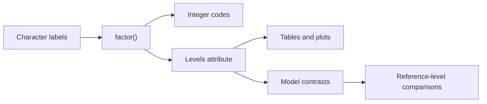

# Factors and Categorical Data

R has a special representation for categorical variables: factors. A factor stores observed category labels together with a fixed set of possible levels. This is more than a display convenience. Statistical models need to know which variables are categorical so they can create indicator columns, choose reference groups, and report coefficients in terms of category differences.

The book discusses factors as part of non-numeric values because categories sit between text and numbers. The labels are human-readable strings, but internally R stores integer codes with a `levels` attribute. That internal coding is useful, but it also creates classic mistakes when people treat factor codes as the original data. Good factor work means controlling levels deliberately and converting carefully.

## Definitions

A **factor** is an integer vector with a `levels` attribute and class `"factor"`. It represents nominal categories such as `"low"`, `"medium"`, and `"high"` or `"control"` and `"treated"`.

An **ordered factor** is a factor whose levels have a meaningful order. Shirt sizes, severity grades, and survey responses such as `"strongly disagree"` through `"strongly agree"` are typical examples.

The **levels** of a factor are the allowed categories. `levels(x)` returns them, and `factor(x, levels = ...)` sets them explicitly.

The **reference level** is the baseline category used by many model functions. In treatment contrasts for `lm`, coefficients for other factor levels are interpreted relative to the reference level. `relevel()` changes it.

The function `cut()` converts numeric values into categorical intervals. This is useful for grouping ages, measurement bands, or probability bins, but the interval boundaries must be chosen carefully.

## Key results

Factors are not just strings. A character vector records labels; a factor records labels plus a declared category set. That matters when a category is possible but absent in a subset. For example, a plot or table can preserve an empty level if the factor levels are already declared.

| Task | Function | Example |
|---|---|---|
| Create nominal factor | `factor(x)` | `factor(c("A", "B", "A"))` |
| Set level order | `factor(x, levels = ...)` | `factor(x, levels = c("low", "med", "high"))` |
| Create ordered factor | `ordered(x, levels = ...)` | `ordered(rating, levels = 1:5)` |
| Inspect levels | `levels(x)` | `levels(group)` |
| Count categories | `table(x)` | `table(iris$Species)` |
| Drop unused levels | `droplevels(x)` | `droplevels(subset_group)` |
| Change reference | `relevel(x, ref = "control")` | `relevel(group, "control")` |
| Bin numeric values | `cut(x, breaks = ...)` | `cut(age, c(0, 18, 65, Inf))` |

The safest factor conversion rule is: if a factor must become numeric values represented by its labels, convert through character first:

```r
as.numeric(as.character(factor_numbers))
```

Using `as.numeric(factor_numbers)` returns the internal integer codes, not the label values.

Factors influence model matrices. For a factor with $k$ levels, a standard regression model usually creates $k - 1$ indicator columns when an intercept is present. Each coefficient compares one non-reference level with the reference level, holding other predictors constant.

## Visual



```text
Labels:       control treated control high
Levels:       control treated high
Codes:        1       2       1       3

The codes are storage. The labels and levels are the meaning.
```

## Worked example 1: Controlling level order in summaries

Problem: survey responses are recorded as `"medium"`, `"low"`, `"high"`, `"medium"`, `"low"`. Create an ordered factor with levels low, medium, high, then produce a table in that order.

Method:

1. Store the raw character responses.
2. Create an ordered factor with explicit levels.
3. Check the levels.
4. Tabulate.
5. Verify the counts manually.

```r
response <- c("medium", "low", "high", "medium", "low")
rating <- ordered(response, levels = c("low", "medium", "high"))

levels(rating)
# [1] "low"    "medium" "high"

table(rating)
# rating
#    low medium   high
#      2      2      1
```

Checked answer: `"low"` appears twice, `"medium"` appears twice, and `"high"` appears once. The table prints in the intended conceptual order, not alphabetical order or first-seen order.

This matters in plots and reports. An ordered factor lets axes, legends, and summaries follow the scale's meaning rather than an arbitrary ordering.

## Worked example 2: Reference levels in a linear model

Problem: in a small experiment, compare plant growth across `"control"` and `"fertilizer"` groups. Fit a model where control is the reference group, and interpret the coefficient.

Method:

1. Build a data frame with group and growth.
2. Convert group to a factor with `"control"` first.
3. Fit `lm(growth ~ group, data = plants)`.
4. Compare model coefficients with manual group means.
5. Interpret the treatment coefficient.

```r
plants <- data.frame(
  group = c("control", "control", "fertilizer", "fertilizer"),
  growth = c(4.8, 5.1, 6.0, 6.4)
)

plants$group <- factor(plants$group, levels = c("control", "fertilizer"))
fit <- lm(growth ~ group, data = plants)
coef(fit)
#      (Intercept) groupfertilizer
#             4.95            1.25

tapply(plants$growth, plants$group, mean)
#    control fertilizer
#       4.95       6.20
```

Checked answer: the control mean is `(4.8 + 5.1) / 2 = 4.95`. The fertilizer mean is `(6.0 + 6.4) / 2 = 6.20`. The difference is `6.20 - 4.95 = 1.25`, matching the `groupfertilizer` coefficient. The intercept is the reference group mean.

The factor level order controls the interpretation. If `"fertilizer"` were the reference, the intercept and sign of the group coefficient would change, even though fitted values would remain the same.

## Code

```r
# Factor workflow with iris: order species by average petal length.

species_mean <- tapply(iris$Petal.Length, iris$Species, mean)
ordered_species <- names(sort(species_mean))

iris2 <- iris
iris2$Species <- factor(iris2$Species, levels = ordered_species)

print(species_mean)
print(levels(iris2$Species))
print(table(iris2$Species))

boxplot(
  Petal.Length ~ Species,
  data = iris2,
  xlab = "Species ordered by mean petal length",
  ylab = "Petal length",
  main = "Iris petal length by species"
)
```

## Common pitfalls

- Treating `as.numeric(factor_x)` as if it returns numeric labels. It returns internal codes.
- Letting R choose alphabetical levels when a conceptual order is needed.
- Forgetting to drop unused levels after subsetting, which can leave empty categories in tables and plots.
- Changing the reference level without updating model interpretation.
- Converting every character column to factor automatically. Modern R no longer does this by default in `data.frame`, and many text identifiers should remain character.
- Cutting continuous variables into categories without a reason. Binning can throw away information and create arbitrary thresholds.

## Connections

- [Vectors, arithmetic, and comparison](/cs/programming/r/vectors-arithmetic-comparison)
- [Lists and data frames](/cs/programming/r/lists-and-data-frames)
- [Statistical inference](/cs/programming/r/statistical-inference)
- [Linear and generalized models](/cs/programming/r/linear-and-generalized-models)
