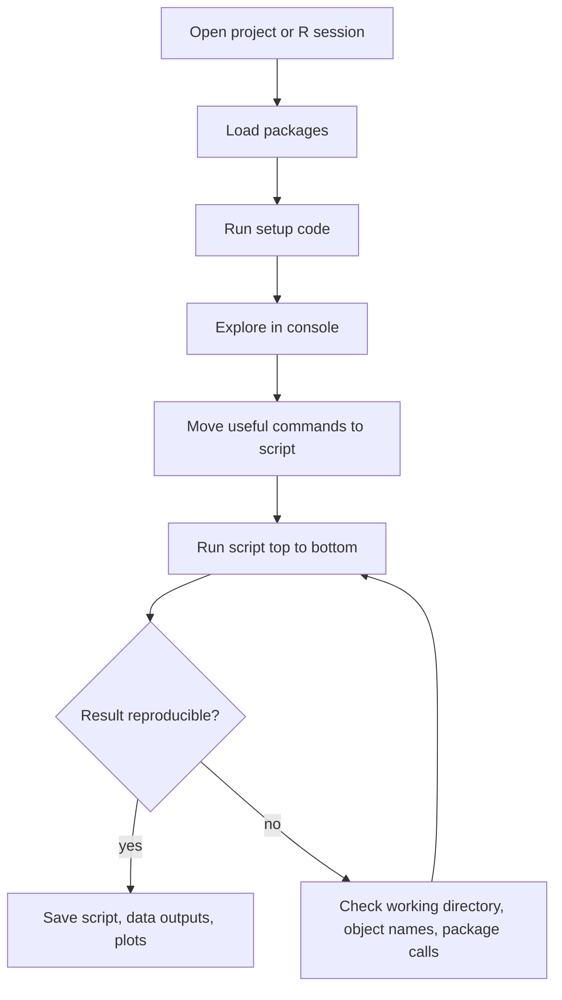

# Getting Started with R

R is both a programming language and an interactive statistical environment. The first chapters of *The Book of R* treat R as a place to work: you type an expression, R evaluates it, prints a result, and keeps any assigned objects in memory for later use. That immediate feedback loop is the reason R is friendly for statistics. You can compute a number, inspect a vector, draw a plot, change the code, and rerun the same command without compiling a whole program.

The practical goal at the beginning is not to memorize every command. It is to build a repeatable workflow: use the console for exploration, save durable work in scripts, ask help pages for exact argument names, and install packages only when base R does not already provide the tool you need. RStudio, described in the book's appendix, wraps that workflow with editor, console, environment, files, plots, and help panes, but the same ideas apply in any R editor.

## Definitions

An **R expression** is a piece of code that R can evaluate, such as `2 + 3`, `sqrt(16)`, or `mean(c(4, 7, 9))`. The console prompt, usually `>`, waits for an expression. If the expression is complete, R evaluates it. If the expression is incomplete, for example an unmatched parenthesis, R changes to a continuation prompt, often `+`, until the expression can be parsed.

An **object** is a value stored under a name. Assignment is usually written with `<-`, as in `scores <- c(82, 91, 76)`. The name `scores` then points to that vector in the current environment. R also accepts `=`, but `<-` is the common idiom in scripts because it makes ordinary assignment visually distinct from function arguments.

The **working directory** is the folder R treats as the default location for relative file paths. `getwd()` prints it, and `setwd()` changes it. Projects in RStudio make this less fragile because opening the project sets a predictable working directory.

A **script** is a plain text `.R` file containing commands that can be rerun. Scripts are preferable to relying on console history because they preserve the exact sequence of analysis steps.

A **package** is an installable collection of functions, data, documentation, and sometimes compiled code. `install.packages("ggplot2")` installs a contributed package from CRAN, while `library(ggplot2)` attaches it for use in the current session. Installation is usually done rarely; loading is done each session.

The **help system** is available through `?name`, `help("name")`, `??keyword`, and `example(name)`. A help page normally describes usage, arguments, return value, details, examples, and cross-references.

## Key results

The central startup pattern is explore, record, rerun. Use the console to test tiny expressions, but move anything important into a script as soon as it becomes part of the analysis. A script should run from top to bottom in a fresh session, creating objects, loading packages, importing data, transforming variables, analyzing, and plotting without depending on hidden console state.

R evaluates expressions in the current environment and searches attached packages for functions. That means names matter. If you create an object named `mean`, you can make later code confusing because the name already belongs to a common function. Use descriptive names such as `sample_mean`, `fuel_data`, and `plot_theme`.

Package management has two separate steps:

| Task | Function | How often | Typical location |
|---|---:|---:|---|
| Install a package | `install.packages("pkg")` | Once per library or update | Console, setup notes |
| Load a package | `library(pkg)` | Every session that uses it | Top of script |
| Read package help | `help(package = "pkg")` | As needed | Console |
| Check installed packages | `installed.packages()` | As needed | Console |

R's help pages are executable learning material. The examples at the bottom of a help page are usually small enough to run directly. They also reveal conventions for argument order, object classes, and return values. When a function surprises you, inspect both `?function_name` and `str(result)`; the first explains the contract, and the second shows the actual object you received.

## Visual



| Habit | Why it matters | Small check |
|---|---|---|
| Start with a clean script | Makes work reproducible | `rm(list = ls())` only for practice, not as a hidden dependency |
| Use relative paths inside projects | Keeps code portable | `file.exists("data/input.csv")` |
| Load packages explicitly | Avoids depending on old sessions | Put `library(...)` near the top |
| Ask for help early | Prevents argument guessing | `?read.csv`, `args(read.csv)` |
| Comment intent, not every line | Helps future readers | `# compute group medians` |

## Worked example 1: Building a tiny reproducible session

Problem: create a small vector of quiz scores, compute a percentage summary, and write the code so it can be rerun later.

Method:

1. Start with raw values. Suppose the scores are `8`, `9`, `6`, `10`, and `7` out of 10.
2. Store them in an object using assignment.
3. Convert to percentages by vectorized arithmetic.
4. Summarize with `mean`, `min`, and `max`.
5. Keep the commands in a script, not just in console history.

```r
scores <- c(8, 9, 6, 10, 7)
percent <- scores / 10 * 100

percent
# [1]  80  90  60 100  70

mean(percent)
# [1] 80

range(percent)
# [1]  60 100
```

Checked answer: the average is 80 percent, and the observed range is 60 to 100 percent. The check is direct: the five percentages sum to `80 + 90 + 60 + 100 + 70 = 400`, and `400 / 5 = 80`.

The important workflow lesson is that each object depends only on earlier script lines. If the script is run in a fresh R session, `scores` is created before `percent`, and `percent` is created before the summaries. There is no invisible dependency on a value typed yesterday.

## Worked example 2: Using help to resolve an argument

Problem: round a set of measurements to one decimal place, but verify the argument name rather than guessing it.

Method:

1. Look up the help page for `round`.
2. Check the usage line.
3. Apply the function to a vector.
4. Confirm the result manually for at least one element.

```r
?round
args(round)
# function (x, digits = 0)

measurements <- c(3.14159, 2.71828, 1.41421)
round(measurements, digits = 1)
# [1] 3.1 2.7 1.4
```

Checked answer: `3.14159` rounds to `3.1` when one digit after the decimal point is requested; `2.71828` rounds to `2.7`; `1.41421` rounds to `1.4`. The `args(round)` output confirms that the second argument is named `digits`, so the call is explicit and readable.

This style scales. For `read.table`, `plot`, `lm`, and many other functions, the help page gives the argument names that make a script self-documenting. Reading the usage line is faster than trial and error.

## Code

```r
# Minimal startup script for a small analysis.
# Save this as analysis.R inside an RStudio project.

required_packages <- c("stats", "graphics")
loaded <- vapply(required_packages, require, logical(1), character.only = TRUE)

if (!all(loaded)) {
  stop("A required package failed to load.")
}

scores <- c(8, 9, 6, 10, 7)
score_summary <- data.frame(
  mean = mean(scores),
  sd = sd(scores),
  min = min(scores),
  max = max(scores)
)

print(score_summary)

plot(
  scores,
  type = "b",
  pch = 19,
  xlab = "Quiz",
  ylab = "Score",
  main = "Quiz Scores"
)
```

Read this startup script as a miniature version of a full analysis. The package loading happens before any analysis objects are created. The raw data vector is small enough to type by hand, but in a real project the same position would usually be occupied by a file import. The summary table is stored as an object before it is printed, which makes it available for later writing, testing, or plotting. The plot call uses explicit labels so the figure can stand alone in a report.

A useful self-check is to restart R and run the script from the first line. If it succeeds, the script is not relying on hidden objects in the global environment. If it fails, the error usually points to a missing package, a wrong working directory, an object created only in the console, or a line that needs to appear earlier. This restart-and-run habit is one of the fastest ways to move from interactive exploration to reproducible work.

## Common pitfalls

- Treating the console as the only record. Console work is useful for discovery, but a script is the durable record.
- Installing a package inside every script run. Put `library(pkg)` in the script; reserve `install.packages()` for setup instructions or an explicit installer script.
- Forgetting that file paths are relative to the working directory. Check with `getwd()` and prefer RStudio projects for analysis folders.
- Using object names that mask common functions, such as `c`, `mean`, `data`, `plot`, or `T`.
- Ignoring the continuation prompt. If R shows `+`, finish the expression or press Escape before typing a new command.
- Saving and restoring the entire workspace as the main reproducibility strategy. Reproducible work should come from scripts and source data, not from a hidden `.RData` image.

## Connections

- [Vectors, arithmetic, and comparison](/cs/programming/r/vectors-arithmetic-comparison)
- [Indexing, names, and recycling](/cs/programming/r/indexing-names-recycling)
- [Reading and writing data](/cs/programming/r/reading-and-writing-data)
- [Control flow, functions, and scoping](/cs/programming/r/control-flow-functions-scoping)
