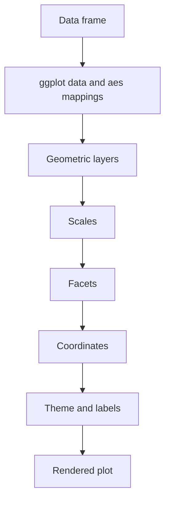

# ggplot2 Graphics

The book introduces `ggplot2` as a grammar-of-graphics alternative to base plotting. Instead of drawing a figure procedurally, `ggplot2` builds a plot from a data frame, aesthetic mappings, geometric layers, scales, facets, coordinates, and themes. This structure is especially strong when a plot should encode multiple variables consistently or produce a family of related panels.


*Figure: R connects programming examples to statistical modeling and visualization workflows. Image: [Wikimedia Commons](https://commons.wikimedia.org/wiki/File:R_logo.svg), The R Foundation, CC BY-SA 4.0.*

The central shift is from "draw points, then add a line" to "declare the data, map variables to visual properties, and add layers that use those mappings." Once that grammar is understood, scatterplots, histograms, smoothers, facets, and density plots become variations on the same template.

## Definitions

`ggplot(data, aes(...))` starts a plot with a data frame and default aesthetic mappings. Aesthetic mappings connect variables to visual properties such as `x`, `y`, `color`, `fill`, `shape`, and `size`.

A **geom** is a geometric layer that draws something. Common examples include `geom_point`, `geom_line`, `geom_smooth`, `geom_histogram`, `geom_boxplot`, `geom_bar`, and `geom_density`.

A **mapping** is data-driven and belongs inside `aes()`. A **setting** is a constant and belongs outside `aes()`. For example, `aes(color = Species)` maps color to a variable, while `color = "steelblue"` sets every point to the same color.

A **facet** splits a plot into panels by one or more variables. `facet_wrap(~ Species)` creates one panel per species.

A **theme** controls non-data display elements such as grid lines, text size, background, and legend position. A **scale** controls how data values become visual values.

## Key results

The common `ggplot2` build pattern is:

```r
ggplot(data, aes(x = ..., y = ...)) +
  geom_...() +
  scale_...() +
  facet_...() +
  labs(...) +
  theme_...()
```

Not every plot needs every part. The minimum useful plot is usually data, mapping, and one geom.

| Component | Example | Role |
|---|---|---|
| Data | `ggplot(iris, ...)` | Source data frame |
| Mapping | `aes(Sepal.Length, Petal.Length)` | Variables to visual properties |
| Geom | `geom_point()` | What gets drawn |
| Statistical transformation | `geom_smooth(method = "lm")` | Compute then draw |
| Scale | `scale_color_brewer()` | Control visual encoding |
| Facet | `facet_wrap(~ Species)` | Split into panels |
| Labels | `labs(title = ..., x = ...)` | Human-readable text |
| Theme | `theme_minimal()` | Non-data styling |

The mapping-vs-setting distinction is the most common beginner issue. If you write `aes(color = "red")`, ggplot treats `"red"` as a data category and creates a legend. If you write `color = "red"` outside `aes()`, all points are red.

`ggplot2` expects tidy-ish rectangular data: one row per observation, variables in columns, and grouping variables stored explicitly. It can plot wide data, but many multi-series plots become easier after reshaping to long format.

## Visual



| Mapping or setting | Code | Meaning |
|---|---|---|
| Mapped color | `aes(color = Species)` | Color varies by data |
| Constant color | `color = "steelblue"` | Every layer item uses same color |
| Mapped size | `aes(size = Sepal.Width)` | Size encodes numeric variable |
| Constant alpha | `alpha = 0.6` | Every item is partly transparent |

## Worked example 1: Scatterplot with linear smooth by group

Problem: create a scatterplot of petal length against sepal length in `iris`, color by species, and add a separate linear trend for each species.

Method:

1. Load `ggplot2`.
2. Start with `iris` as the data frame.
3. Map sepal length to x, petal length to y, and species to color.
4. Add points.
5. Add a linear smoother with `method = "lm"` and no standard-error ribbon.
6. Add labels.

```r
library(ggplot2)

p <- ggplot(
  iris,
  aes(x = Sepal.Length, y = Petal.Length, color = Species)
) +
  geom_point(size = 2, alpha = 0.8) +
  geom_smooth(method = "lm", se = FALSE) +
  labs(
    title = "Petal length increases with sepal length",
    x = "Sepal length",
    y = "Petal length",
    color = "Species"
  ) +
  theme_minimal()

print(p)
```

Checked answer: because `color = Species` is inside the initial `aes()`, both `geom_point()` and `geom_smooth()` inherit the grouping. The result is one color per species and a separate fitted line per species. If the color mapping were removed from `aes()`, the smoother would fit one overall line unless grouping were supplied separately.

This is the grammar in action: data and mappings are declared once, then layers use them consistently.

## Worked example 2: Faceted histogram with constant fill

Problem: show the distribution of `mpg` in `mtcars` separately for 4-, 6-, and 8-cylinder cars, using facets and a constant fill color.

Method:

1. Copy `mtcars` and convert `cyl` to a factor for categorical display.
2. Start `ggplot` with `mpg` mapped to x.
3. Add `geom_histogram` with a constant fill outside `aes()`.
4. Facet by cylinder group.
5. Check that fill is not mapped to a variable.

```r
library(ggplot2)

cars <- mtcars
cars$cyl \lt - factor(cars$cyl)

ggplot(cars, aes(x = mpg)) +
  geom_histogram(binwidth = 3, fill = "gray70", color = "white") +
  facet_wrap(~ cyl, nrow = 1) +
  labs(
    title = "Fuel economy distribution by cylinder count",
    x = "Miles per gallon",
    y = "Number of cars"
  ) +
  theme_minimal()
```

Checked answer: `facet_wrap(~ cyl)` creates one panel for each cylinder level. The fill is constant because `fill = "gray70"` is outside `aes()`. No fill legend is needed because fill does not encode data.

The plot answers a different question than a single histogram: it shows how the distribution shifts across cylinder groups rather than mixing all cars in one panel.

## Code

```r
# Reusable ggplot function for a scatterplot with optional faceting.

library(ggplot2)

scatter_by_group <- function(df, x, y, color, facet = NULL) {
  mapping <- aes(
    x = .data[[x]],
    y = .data[[y]],
    color = .data[[color]]
  )

  p <- ggplot(df, mapping) +
    geom_point(size = 2, alpha = 0.75) +
    geom_smooth(method = "lm", se = FALSE) +
    labs(x = x, y = y, color = color) +
    theme_minimal()

  if (!is.null(facet)) {
    p <- p + facet_wrap(vars(.data[[facet]]))
  }

  p
}

scatter_by_group(iris, "Sepal.Length", "Petal.Length", "Species")
```

The reusable function uses `.data[[x]]` so column names can be supplied as character strings. This is useful in programming with `ggplot2`, where a hard-coded call such as `aes(Sepal.Length, Petal.Length)` is simple interactively but not flexible inside a function. The function still keeps the mapping explicit: x, y, and color each come from named columns in the supplied data frame.

The function also delays faceting until after the base plot is constructed. If `facet` is `NULL`, the plot is returned without panels. If `facet` is supplied, `facet_wrap(vars(.data[[facet]]))` adds a panel per level or value. This pattern is common in report code because one plotting function can support both an overview and grouped versions of the same relationship.

Remember that a ggplot object is an object. You can assign it to `p`, add layers later with `p + ...`, print it, save it with `ggsave`, or return it from a function. This is different from base graphics, where commands draw directly on the active device. The object-oriented design makes `ggplot2` convenient for building plots piece by piece and reusing a shared theme or scale.

Even with `ggplot2`, statistical judgment comes first. A smooth line should match the question, a color mapping should encode a meaningful variable, and facets should compare panels on a scale that supports comparison. The grammar makes complex graphics possible, but it does not decide which graphic is honest or useful.

When debugging a ggplot, add one layer at a time. Start with `ggplot(data, aes(...)) + geom_point()` or another minimal geom. If that works, add color, then facets, then scales, then themes. This incremental process reveals whether the problem is data shape, mapping, statistical transformation, or styling. It is much faster than debugging a long plot expression all at once.

The grammar also encourages consistency across a report. If several plots use the same grouping variable, reuse the same color scale and labels. If panels compare related variables, keep axis labels and themes consistent. Visual consistency reduces cognitive load and makes real differences in the data easier to see.

For data that is not already in a convenient shape, reshape before plotting rather than fighting the plot call. A long data frame with one measurement column and one variable-name column often makes faceting, coloring, and grouping straightforward. Even when reshaping tools are outside this page, the principle remains: plot code should describe graphics, not hide data cleaning.

When comparing base graphics and `ggplot2`, notice where state lives. Base graphics draws on the active device; `ggplot2` builds an object that can be printed later. This difference explains many workflow choices.

That object can also be stored, modified, and saved, which makes repeated report graphics easier to manage.

This makes plot construction feel closer to building a model object than drawing on paper.

## Common pitfalls

- Putting constants inside `aes()`, such as `aes(color = "red")`, and accidentally creating a legend.
- Forgetting to convert numeric codes such as cylinder count to factors when they should be categories.
- Adding too many aesthetics to one plot. Color, shape, size, alpha, and facets can overload a reader.
- Expecting `ggplot2` to modify data. It visualizes the data supplied; cleaning and reshaping should be explicit.
- Forgetting `print(p)` when creating ggplot objects inside functions or non-interactive scripts.
- Using a smoother without understanding the method. LOESS and linear model smoothers answer different questions.

## Connections

- [Base graphics](/cs/programming/r/base-graphics)
- [Descriptive statistics](/cs/programming/r/descriptive-statistics)
- [Advanced graphics and 3D plots](/cs/programming/r/advanced-graphics-3d)
- [Linear and generalized models](/cs/programming/r/linear-and-generalized-models)
