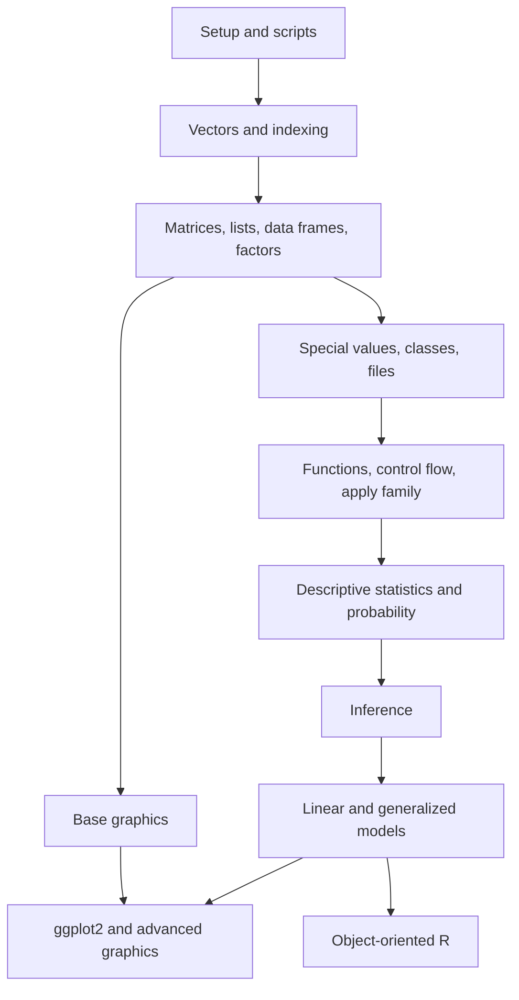

# R

R is a language for programming with data and a working environment for statistics, graphics, simulation, and modeling. Tilman M. Davies's *The Book of R* teaches these pieces in a deliberate order: first the language, then programming structures, then probability and statistics, then statistical modeling, and finally richer graphics. These notes follow that arc while keeping each page focused on the concepts, R idioms, worked examples, and cross-links needed for SJ Wiki review.

The course begins with interactive work in the console and scripts, then builds outward from vectors to matrices, lists, data frames, factors, files, functions, apply-style iteration, descriptive statistics, probability distributions, inference, regression, generalized models, object-oriented behavior, and plotting systems. The pages are original study notes based on the textbook's scope rather than a replacement for the book's exercises or prose.

## Definitions

**R** is both a programming language and a statistical computing environment. It evaluates expressions interactively, stores objects in environments, and provides a large standard library for data manipulation, probability, modeling, and graphics.

**Base R** refers to the language and packages distributed with R itself, including core data structures, graphics, statistics, and utilities. Much of *The Book of R* is intentionally base-R-first so readers understand the language before relying on contributed packages.

**CRAN** is the Comprehensive R Archive Network, the main distribution network for R and contributed packages. Packages such as `ggplot2`, spreadsheet readers, or 3D graphics tools are installed from CRAN or another repository and loaded with `library()`.

**A script** is a saved `.R` file containing commands that can be rerun. Reproducible analysis depends on scripts more than console history or saved workspace images.

**An object** is a value bound to a name. Objects include vectors, matrices, arrays, lists, data frames, factors, functions, fitted models, hypothesis-test results, and plots.

**A data frame** is R's main rectangular data object: a list of equal-length columns, where each column can have its own type or class.

**A model formula** is R's compact syntax for statistical models, such as `mpg ~ wt + hp`, meaning "model `mpg` using `wt` and `hp`."

## Key results

The textbook's table of contents supports five large blocks:

| Textbook block | Chapters | Wiki coverage |
|---|---:|---|
| The language | 1-8 | setup, vectors, indexing, matrices, nonnumeric values, data frames, classes, files, base plotting |
| Programming | 9-12 | function calls, scoping, conditions, loops, writing functions, apply family, errors and visibility |
| Statistics and probability | 13-16 | descriptive statistics, data visualization, probability, common distributions |
| Testing and modeling | 17-22 | confidence intervals, hypothesis tests, ANOVA ideas, linear regression, multiple regression, diagnostics, model selection |
| Advanced graphics | 23-26 | devices, customization, grammar of graphics, color, contours, surfaces, and 3D plotting concepts |

The page sequence in this wiki is:

| Position | Page | Main role |
|---:|---|---|
| 2 | [Getting started with R](/cs/programming/r/getting-started-rstudio-packages) | Console, RStudio workflow, packages, help, scripts |
| 3 | [Vectors, arithmetic, and comparison](/cs/programming/r/vectors-arithmetic-comparison) | Numeric and character vectors, vectorization, logical tests |
| 4 | [Indexing, names, and recycling](/cs/programming/r/indexing-names-recycling) | Subsetting, named lookup, replacement, recycling rules |
| 5 | [Matrices and arrays](/cs/programming/r/matrices-and-arrays) | Rectangular atomic data, dimensions, matrix algebra |
| 6 | [Lists and data frames](/cs/programming/r/lists-and-data-frames) | Heterogeneous containers and tabular data |
| 7 | [Factors and categorical data](/cs/programming/r/factors-and-categorical-data) | Levels, ordered categories, model contrasts |
| 8 | [Special values, classes, and coercion](/cs/programming/r/special-values-classes-coercion) | `NA`, `NaN`, `Inf`, `NULL`, type, class, conversion |
| 9 | [Reading and writing data](/cs/programming/r/reading-and-writing-data) | CSV, spreadsheet, RDS/RData, graphics files |
| 10 | [Control flow, functions, and scoping](/cs/programming/r/control-flow-functions-scoping) | `if`, loops, functions, environments |
| 11 | [Apply family](/cs/programming/r/apply-family) | `apply`, `lapply`, `sapply`, `vapply`, `mapply` |
| 12 | [Probability distributions](/cs/programming/r/probability-distributions) | `d/p/q/r` distribution functions and simulation |
| 13 | [Descriptive statistics](/cs/programming/r/descriptive-statistics) | Center, spread, tables, grouped summaries |
| 14 | [Base graphics](/cs/programming/r/base-graphics) | Procedural plotting and file devices |
| 15 | [ggplot2 graphics](/cs/programming/r/ggplot2-graphics) | Grammar of graphics, mappings, geoms, facets |
| 16 | [Statistical inference](/cs/programming/r/statistical-inference) | Confidence intervals, hypothesis tests, categorical tests |
| 17 | [Linear and generalized models](/cs/programming/r/linear-and-generalized-models) | `lm`, diagnostics, prediction, `glm` overview |
| 18 | [Advanced graphics and 3D plots](/cs/programming/r/advanced-graphics-3d) | Color, contours, surfaces, higher-dimensional plots |
| 19 | [Object-oriented R](/cs/programming/r/object-oriented-r) | S3, S4, generic functions, class-based behavior |

The notes intentionally do not create a separate full tidyverse page because the textbook's main contributed graphics package coverage is `ggplot2`, not a full modern `dplyr`/`tidyr`/`magrittr` workflow. The `ggplot2` page links that grammar-of-graphics material to the rest of the R course.

## Visual



| Learning question | First page to read | Then read |
|---|---|---|
| How do I start an R analysis reproducibly? | Setup | Files, functions |
| Why does R operate on whole columns at once? | Vectors | Indexing, apply |
| How do tables and categories work? | Data frames | Factors, classes |
| How do I summarize and plot data? | Descriptive statistics | Base graphics, ggplot2 |
| How do I run tests and models? | Inference | Linear and generalized models |
| Why does `summary()` change behavior? | Classes | Object-oriented R |

## Worked example 1: Choosing a reading path for a data analysis task

Problem: a student has a CSV file with plant measurements and treatment groups. They need to read the file, clean missing values, summarize growth by treatment, plot the result, and fit a simple model. Choose a path through the wiki pages.

Method:

1. Identify the first technical need: importing a CSV file.
2. Identify the data structure after import: a data frame with numeric and categorical columns.
3. Identify cleaning issues: missing values and class conversion.
4. Identify summaries and visualizations.
5. Identify inference or modeling.
6. Map each need to a page.

Page path:

```text
reading-and-writing-data
  -> lists-and-data-frames
  -> factors-and-categorical-data
  -> special-values-classes-coercion
  -> descriptive-statistics
  -> base-graphics or ggplot2-graphics
  -> statistical-inference
  -> linear-and-generalized-models
```

Checked answer: the path starts with file import because no analysis can happen until the data is a reliable R object. It then moves to data frames and factors because treatment groups should be categorical. Missing-value and coercion checks happen before summaries. Plotting and modeling come after the data's structure is known. This path mirrors the textbook's order but skips pages that are not immediately needed, such as arrays or 3D plots.

The important study habit is to follow the dependency chain. Models depend on clean variables; clean variables depend on correct import; correct import depends on paths, delimiters, missing-value codes, and classes.

## Worked example 2: Translating a textbook chapter into R objects

Problem: the textbook chapter on simple linear regression introduces an equation, fitted coefficients, residuals, inference, and predictions. Translate those ideas into R objects and functions.

Method:

1. Represent the response and predictor as data frame columns.
2. Represent the model equation with a formula.
3. Fit the model with `lm`.
4. Extract coefficients, residuals, fitted values, and predictions.
5. Use class-aware summaries and plots for interpretation.

```r
fit <- lm(mpg ~ wt, data = mtcars)

coef(fit)
# (Intercept)          wt
#   37.285126   -5.344472

head(fitted(fit), 3)
#        Mazda RX4    Mazda RX4 Wag       Datsun 710
#         23.28261         21.91977         24.88595

head(resid(fit), 3)
#        Mazda RX4    Mazda RX4 Wag       Datsun 710
#        -2.282610        -0.919770        -2.085952

predict(fit, newdata = data.frame(wt = 3))
#        1
# 21.25171
```

Checked answer: the fitted equation is

$$
\begin{aligned}
\widehat{mpg} &= 37.285126 - 5.344472 \cdot wt.
\end{aligned}
$$

For `wt = 3`, the prediction is `37.285126 - 5.344472 * 3 = 21.251710`, matching `predict`. The object `fit` stores much more than the printed coefficients; it is an S3 object of class `"lm"` that works with `summary`, `plot`, `resid`, `fitted`, and `predict`.

This translation pattern works throughout the course: mathematical ideas become R objects; R functions operate on those objects; class-specific methods present the results.

## Code

```r
# A small map of the R notes. This is useful as a checklist for review.

r_notes <- data.frame(
  order = 1:6,
  stage = c(
    "Language basics",
    "Core data structures",
    "Import and cleaning",
    "Programming",
    "Statistics",
    "Graphics and modeling"
  ),
  pages = c(
    "setup, vectors, indexing",
    "matrices, lists, data frames, factors",
    "files, special values, classes",
    "control flow, functions, apply",
    "descriptive stats, probability, inference",
    "base graphics, ggplot2, lm, glm, OOP"
  )
)

print(r_notes)
```

## Common pitfalls

- Reading the modeling pages before understanding vectors, data frames, factors, and missing values.
- Treating RStudio as the language. RStudio is an editor and workflow environment; R is the language doing the computation.
- Memorizing function names without understanding object structure. `str()` often explains more than another guessed command.
- Depending on saved workspace state instead of scripts that run from top to bottom.
- Skipping graphics until the end. Plots are part of data checking, not just final presentation.
- Treating the textbook's `ggplot2` coverage as a complete tidyverse course. These notes cover `ggplot2` where the book does, while base R remains the backbone.

## Connections

- [Getting started with R](/cs/programming/r/getting-started-rstudio-packages)
- [Vectors, arithmetic, and comparison](/cs/programming/r/vectors-arithmetic-comparison)
- [Reading and writing data](/cs/programming/r/reading-and-writing-data)
- [Statistical inference](/cs/programming/r/statistical-inference)
- [Linear and generalized models](/cs/programming/r/linear-and-generalized-models)
