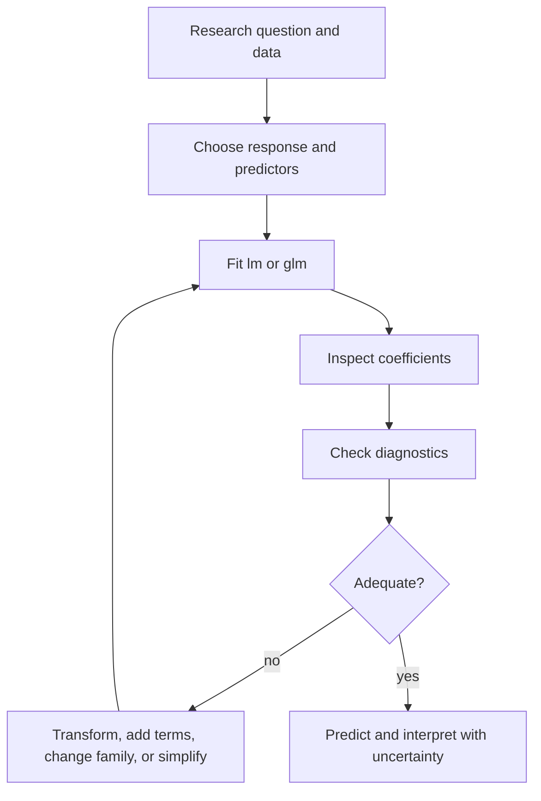

# Linear and Generalized Models

Linear models are the modeling core of *The Book of R*. The regression chapters move from simple linear regression to multiple regression, categorical predictors, interactions, transformations, model selection, diagnostics, leverage, Cook's distance, and collinearity. The same formula interface also leads naturally to generalized linear models, where the response distribution and link function change but the modeling workflow remains familiar.


*Figure: R connects programming examples to statistical modeling and visualization workflows. Image: [Wikimedia Commons](https://commons.wikimedia.org/wiki/File:R_logo.svg), The R Foundation, CC BY-SA 4.0.*

The key idea is that a model is an explicit approximation. In simple linear regression, R estimates an intercept and slope so a line summarizes the average relationship between a numeric predictor and numeric response. In multiple regression, each coefficient is interpreted while holding other predictors fixed. Diagnostics then ask whether the approximation is adequate for the intended use.

## Definitions

A **linear model** represents a numeric response as a linear combination of predictors plus error:

$$
\begin{aligned}
y_i &= \beta_0 + \beta_1x_{i1} + \cdots + \beta_px_{ip} + \epsilon_i.
\end{aligned}
$$

The function `lm(formula, data = ...)` fits linear models by least squares. A formula such as `mpg ~ wt + hp` means "model `mpg` using `wt` and `hp`."

A **residual** is observed minus fitted value: $e_i = y_i - \hat{y}_i$. Residuals diagnose nonlinearity, unequal variance, outliers, and other model problems.

A **categorical predictor** is represented through contrasts. With an intercept and $k$ levels, the default treatment coding uses $k - 1$ indicator columns.

An **interaction** allows the effect of one predictor to depend on another. In formulas, `x * z` expands to `x + z + x:z`.

A **generalized linear model (GLM)** extends linear modeling to non-normal responses using a distribution family and link function. `glm()` fits these models. Logistic regression is a GLM for binary responses with `family = binomial`.

## Key results

Important model functions:

| Task | Function | Example |
|---|---|---|
| Fit linear model | `lm` | `lm(mpg ~ wt + hp, data = mtcars)` |
| Summarize coefficients | `summary` | `summary(fit)` |
| Extract coefficients | `coef` | `coef(fit)` |
| Fitted values | `fitted` | `fitted(fit)` |
| Residuals | `resid` | `resid(fit)` |
| Confidence intervals | `confint` | `confint(fit)` |
| Predictions | `predict` | `predict(fit, newdata, interval = "prediction")` |
| ANOVA comparison | `anova` | `anova(fit_small, fit_large)` |
| GLM fit | `glm` | `glm(am ~ wt + hp, data = mtcars, family = binomial)` |

The least-squares line minimizes the residual sum of squares:

$$
\begin{aligned}
RSS &= \sum_{i=1}^{n}(y_i - \hat{y}_i)^2.
\end{aligned}
$$

For simple regression, the slope estimates the average change in response for a one-unit increase in the predictor. For multiple regression, a slope estimates the average change associated with one predictor while the other model predictors are held constant.

Diagnostics are not optional. A small p-value for a coefficient does not guarantee a useful model if residuals show curvature, strong outliers, nonconstant variance, or influential points. Model selection should balance fit and complexity; adding variables always can increase apparent fit but may reduce interpretability and out-of-sample performance.

## Visual



| Formula syntax | Expansion | Meaning |
|---|---|---|
| `y ~ x` | intercept + `x` | Simple regression |
| `y ~ x + z` | intercept + main effects | Additive model |
| `y ~ x * z` | `x + z + x:z` | Main effects and interaction |
| `y ~ x:z` | interaction only | Product/interaction term without main effects |
| `y ~ poly(x, 2)` | orthogonal polynomial | Curved relationship |
| `y ~ 0 + group` | no intercept | One coefficient per group |

## Worked example 1: Simple linear regression with prediction

Problem: fit a model predicting `mpg` from `wt` in `mtcars`, interpret the slope, and predict mpg for a car weighing 3.0 thousand pounds.

Method:

1. Fit `lm(mpg ~ wt, data = mtcars)`.
2. Extract coefficients.
3. Interpret the slope.
4. Use `predict` with `newdata`.
5. Check the prediction manually from the fitted line.

```r
fit <- lm(mpg ~ wt, data = mtcars)
coef(fit)
# (Intercept)          wt
#   37.285126   -5.344472

new_car <- data.frame(wt = 3.0)
predict(fit, newdata = new_car)
#        1
# 21.25171
```

Manual check:

$$
\begin{aligned}
\widehat{mpg} &= 37.285126 - 5.344472(3.0) \\
&= 37.285126 - 16.033416 \\
&= 21.251710.
\end{aligned}
$$

Checked answer: the prediction is about 21.25 mpg. The slope means that, in this fitted simple linear model, each additional 1000 pounds of weight is associated with about 5.34 fewer miles per gallon on average.

This is an association in the `mtcars` data, not a controlled causal estimate. Other variables, such as horsepower and cylinders, are related to weight.

## Worked example 2: Logistic regression with `glm`

Problem: model whether a car has manual transmission (`am = 1`) using weight and horsepower in `mtcars`.

Method:

1. Confirm the response is coded 0/1.
2. Fit `glm(am ~ wt + hp, family = binomial, data = mtcars)`.
3. Extract coefficients.
4. Predict probabilities for two cars.
5. Interpret probability scale rather than raw log-odds.

```r
logit_fit <- glm(am ~ wt + hp, data = mtcars, family = binomial)
coef(logit_fit)
# (Intercept)          wt          hp
#  18.8662987  -8.0834752   0.0362556

new_cars <- data.frame(
  wt = c(2.2, 4.0),
  hp = c(90, 180)
)

predict(logit_fit, newdata = new_cars, type = "response")
#         1         2
# 0.9895829 0.0014460
```

Checked answer: `type = "response"` returns estimated probabilities, not log-odds. The lighter, lower-horsepower car is predicted to have high probability of manual transmission in this model, while the heavier, higher-horsepower car is predicted to have low probability. These estimates reflect a tiny data set and should be treated as demonstration, not a production classifier.

The GLM workflow resembles `lm`: formula, data, fit, summary, diagnostics, prediction. The interpretation changes because the link function maps linear predictors to response-scale means.

## Code

```r
# Linear model diagnostic summary.

diagnose_lm <- function(fit) {
  stopifnot(inherits(fit, "lm"))
  infl <- cooks.distance(fit)
  leverage <- hatvalues(fit)
  data.frame(
    row = names(resid(fit)),
    fitted = fitted(fit),
    residual = resid(fit),
    standardized_residual = rstandard(fit),
    leverage = leverage,
    cooks_distance = infl,
    row.names = NULL
  )
}

fit <- lm(mpg ~ wt + hp + factor(cyl), data = mtcars)
diag_table <- diagnose_lm(fit)
print(head(diag_table[order(-diag_table$cooks_distance), ], 6))

par(mfrow = c(2, 2))
plot(fit)
par(mfrow = c(1, 1))
```

The diagnostic table turns model diagnostics into data, which makes them easier to sort, filter, and report. `standardized_residual` helps identify observations whose residuals are large relative to the model's estimated error scale. `leverage` identifies observations with unusual predictor combinations. `cooks_distance` combines residual size and leverage to flag points that strongly influence fitted coefficients.

The four default `plot(fit)` panels are a compact diagnostic set for linear models: residuals versus fitted values for nonlinearity and unequal variance, a normal Q-Q plot for residual shape, scale-location for spread, and residuals versus leverage for influential points. These plots do not automatically approve or reject a model; they guide judgment about whether the linear approximation is reasonable for the analysis goal.

For GLMs, diagnostic ideas remain but details change. Residual definitions differ, fitted values are on a mean scale determined by the family and link, and prediction uncertainty may need response-scale transformation. A logistic regression coefficient is naturally a log-odds coefficient; odds ratios can be obtained with `exp(coef(fit))`, while predicted probabilities require `predict(..., type = "response")`.

Model selection should be documented as a modeling decision, not a mechanical search. If variables are chosen by theory, say so. If nested models are compared by partial F tests, record the nesting. If AIC is used, remember that it compares candidate models rather than proving the selected model is true. Diagnostics and interpretability remain part of the final choice.

A strong regression report usually includes the model formula, data source, fitted coefficient table, interval or uncertainty summary, diagnostic comments, and a statement of the prediction or explanation goal. If categorical variables are used, report the reference levels. If transformations are used, interpret on the transformed scale or back-transform carefully. If interactions are used, avoid interpreting main effects as universal slopes.

For prediction, distinguish confidence intervals for the mean response from prediction intervals for a new observation. In `predict.lm`, `interval = "confidence"` and `interval = "prediction"` answer different questions. The prediction interval is wider because it includes individual observation variability in addition to uncertainty about the fitted mean.

Always connect coefficient interpretation to the formula actually fitted. A slope in `mpg ~ wt` is marginal with respect to that one predictor. A slope in `mpg ~ wt + hp` is conditional on horsepower. A slope inside an interaction depends on the other interacting variable. The same variable name can therefore carry different interpretations across models.

Keep the fitted object, not only the printed summary. The object stores what later functions need for prediction, diagnostics, intervals, and plots.

## Common pitfalls

- Interpreting regression coefficients causally without design or assumptions that support causality.
- Ignoring categorical predictor reference levels.
- Reading a GLM coefficient as a direct probability change when it is on the link scale.
- Predicting far outside the observed predictor range and treating the result as reliable.
- Selecting models only by p-values without considering diagnostics, subject matter, and complexity.
- Forgetting that interactions change main-effect interpretation.
- Reporting $R^2$ without residual checks or an explanation of prediction error.

## Connections

- [Factors and categorical data](/cs/programming/r/factors-and-categorical-data)
- [Statistical inference](/cs/programming/r/statistical-inference)
- [Base graphics](/cs/programming/r/base-graphics)
- [Object-oriented R](/cs/programming/r/object-oriented-r)
