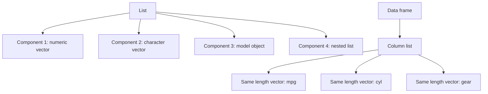

# Lists and Data Frames

Vectors and matrices require one atomic type. Lists remove that restriction: a list can hold a numeric vector, a character string, a matrix, a fitted model, and another list at the same time. Data frames build on lists by requiring each component to behave like a column of the same length. That combination makes data frames the central object for statistical work in R.

The book introduces lists before data frames because data frames are easier to understand once you know that each column is a list component. A data frame looks rectangular, but internally it is a named list of equal-length vectors. This explains both its flexibility and its indexing rules: `df[rows, columns]` treats it like a table, while `df$column` or `df[["column"]]` extracts a column component.

## Definitions

A **list** is a generic vector whose elements can be any R objects. List elements are often called components. Lists are created with `list()`.

The single-bracket operator `[` returns a sub-list. The double-bracket operator `[[` extracts one component. The dollar operator `$` extracts a named component using a convenient syntax. For a list `x <- list(a = 1:3, b = "hi")`, `x["a"]` is still a list, while `x[["a"]]` is the integer vector `1:3`.

A **data frame** is a list of equal-length vectors with row and column structure. Each column can have a different type, but all columns must have the same number of rows.

A **row** is an observation or record. A **column** is a variable. This terminology is not enforced by R, but it is the convention behind most statistical functions.

The function `str()` displays an object's structure. For lists and data frames, `str()` is often more informative than printing because it shows component names, types, and abbreviated contents.

## Key results

Lists are the standard return type for complex functions. A hypothesis test, regression model, or clustering result usually contains several related objects: estimates, residuals, call, coefficients, diagnostics, and metadata. Returning a list keeps those pieces together without forcing them into a rectangular table.

Data frames are the standard input type for modeling and plotting. Functions such as `lm`, `glm`, `plot`, and `ggplot` can use column names inside a data frame. This makes code readable:

```r
lm(mpg ~ wt + hp, data = mtcars)
```

The formula says which columns to use, and `data = mtcars` tells R where to find them.

| Object | Shape | Types allowed | Main indexing style | Common use |
|---|---|---|---|---|
| Atomic vector | 1D | One type | `x[i]` | Numeric values, labels |
| Matrix | 2D | One type | `x[i, j]` | Linear algebra, grids |
| List | 1D components | Mixed | `x[[name]]` | Function results, nested data |
| Data frame | 2D table | Mixed by column | `df[i, j]`, `df$col` | Data analysis |

Data frame subsetting has one extra hazard: selecting one column with `df[, "col"]` may return a vector, while `df[, "col", drop = FALSE]` returns a one-column data frame. Use `drop = FALSE` when program code needs a data frame regardless of column count.

## Visual



```text
Data frame as a list of columns:

cars
|-- mpg:  numeric, length 32
|-- cyl:  numeric, length 32
|-- hp:   numeric, length 32
|-- gear: numeric, length 32
```

## Worked example 1: Extracting from a nested list

Problem: create a list representing an experiment with metadata, raw observations, and a summary. Extract the treatment name and the second raw observation correctly.

Method:

1. Build a list with named components.
2. Put another list inside it for metadata.
3. Use `[[` or `$` to extract components.
4. Use `[` after extracting the raw vector.
5. Verify object types with `str`.

```r
experiment <- list(
  metadata = list(id = "exp_01", treatment = "fertilizer"),
  raw = c(5.2, 5.8, 6.1, 5.5),
  summary = c(mean = 5.65, n = 4)
)

experiment$metadata$treatment
# [1] "fertilizer"

experiment[["raw"]][2]
# [1] 5.8

str(experiment$metadata)
# List of 2
#  $ id       : chr "exp_01"
#  $ treatment: chr "fertilizer"
```

Checked answer: `experiment$metadata` extracts the nested metadata list, and `$treatment` extracts the string `"fertilizer"`. `experiment[["raw"]]` extracts the numeric vector `c(5.2, 5.8, 6.1, 5.5)`, so position 2 is `5.8`.

The key distinction is that `experiment["raw"]` would return a one-component list, not the numeric vector. When you want the component itself, use `[[` or `$`.

## Worked example 2: Building and filtering a data frame

Problem: create a small student data frame, add a pass/fail column, and select students who passed with a score of at least 85.

Method:

1. Create equal-length vectors for name, section, and score.
2. Combine them with `data.frame`.
3. Add a logical or character column using vectorized comparison.
4. Build a row filter.
5. Select relevant columns.

```r
students <- data.frame(
  name = c("Ana", "Bo", "Chen", "Dia"),
  section = c("A", "A", "B", "B"),
  score = c(91, 78, 85, 68)
)

students$passed <- students$score >= 70
selected <- students$passed & students$score >= 85

students[selected, c("name", "section", "score")]
#   name section score
# 1  Ana       A    91
# 3 Chen       B    85
```

Checked answer: Ana has 91 and Chen has 85, so both satisfy `score >= 85` and pass. Bo passes with 78 but does not meet the 85 threshold. Dia does not pass. The logical filter has length 4, matching the four rows.

This example shows why data frames dominate analysis code: each variable keeps its natural type, but the rows remain aligned.

## Code

```r
# Summarize a data frame by a grouping column using base R.

cars <- mtcars
cars$model <- rownames(mtcars)
cars$cyl_group <- paste(cars$cyl, "cyl")

mpg_by_cyl <- aggregate(
  mpg ~ cyl_group,
  data = cars,
  FUN = function(x) c(mean = mean(x), sd = sd(x), n = length(x))
)

# aggregate stores the multi-value result in a matrix column;
# convert it into a cleaner data frame.
clean_summary <- data.frame(
  cyl_group = mpg_by_cyl$cyl_group,
  mpg_by_cyl$mpg
)

print(clean_summary)
```

## Common pitfalls

- Using `[` when `[[` is needed. `x["a"]` returns a list; `x[["a"]]` returns the component.
- Assuming every rectangular object is a matrix. A data frame can mix numeric, character, logical, and factor columns.
- Forgetting that all data frame columns must have the same length.
- Accidentally dropping a one-column data frame to a vector. Use `drop = FALSE` in programmatic code.
- Relying on partial matching with `$`. Prefer `[[` with exact column names in functions.
- Adding a column whose length is not one and not the number of rows. Recycling can hide mistakes.

## Connections

- [Indexing, names, and recycling](/cs/programming/r/indexing-names-recycling)
- [Factors and categorical data](/cs/programming/r/factors-and-categorical-data)
- [Reading and writing data](/cs/programming/r/reading-and-writing-data)
- [Linear and generalized models](/cs/programming/r/linear-and-generalized-models)
