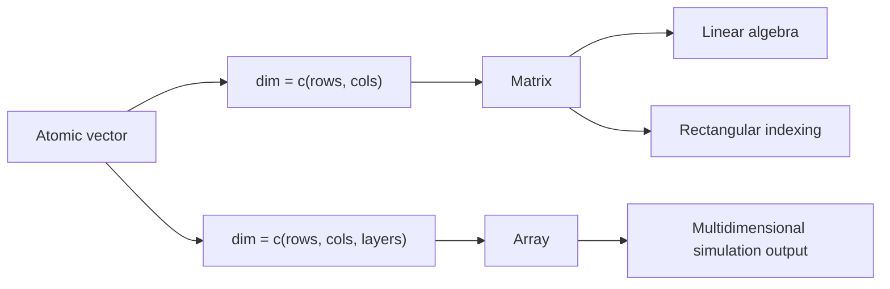

# Matrices and Arrays

Vectors are one-dimensional. Matrices and arrays extend the same atomic-vector storage into two or more dimensions. This matters in R because many mathematical and statistical procedures are naturally rectangular: a data table, a design matrix for regression, an image grid, a covariance matrix, or a simulated result with dimensions for replicate, variable, and parameter.

The book's matrix chapter connects everyday R syntax with linear algebra. A matrix still contains one atomic type, but it has a `dim` attribute that tells R how to arrange the values into rows and columns. Arrays generalize that idea to three or more dimensions. The key mental model is that R stores the values in a vector and layers dimension metadata on top.

## Definitions

A **matrix** is a two-dimensional atomic object with rows and columns. It is created with `matrix`, `cbind`, `rbind`, or by assigning `dim` to a vector. All elements have the same atomic type.

An **array** is a matrix generalized to more than two dimensions. For example, `array(1:24, dim = c(3, 4, 2))` has 3 rows, 4 columns, and 2 layers.

**Column-major order** means R fills matrices down columns by default. `matrix(1:6, nrow = 2)` produces a first column `1, 2`, second column `3, 4`, and third column `5, 6`.

**Matrix indexing** uses two positions inside brackets: `x[row, column]`. Leaving one side blank selects all rows or all columns. For example, `x[2, ]` selects row 2, and `x[, 3]` selects column 3.

**Matrix multiplication** uses `%*%`, while `*` is element-wise multiplication. This distinction is critical: `A * B` multiplies corresponding entries; `A %*% B` performs linear algebra multiplication where rows of `A` are combined with columns of `B`.

## Key results

Matrix creation is controlled by dimensions and fill direction:

| Function or operator | Purpose | Example |
|---|---|---|
| `matrix(x, nrow, ncol)` | Build a matrix from a vector | `matrix(1:6, nrow = 2)` |
| `byrow = TRUE` | Fill across rows instead of down columns | `matrix(1:6, 2, byrow = TRUE)` |
| `rbind` | Stack rows | `rbind(c(1, 2), c(3, 4))` |
| `cbind` | Bind columns | `cbind(x = 1:3, y = 4:6)` |
| `dim` | Read or set dimensions | `dim(A)` |
| `t` | Transpose | `t(A)` |
| `diag` | Create or extract diagonal | `diag(3)` |
| `solve` | Solve systems or invert matrices | `solve(A, b)` |

For matrix multiplication, the number of columns in the left matrix must equal the number of rows in the right matrix. If $A$ is $m \times n$ and $B$ is $n \times p$, then $AB$ is $m \times p$.

$$
\begin{aligned}
(AB)_{ij} &= \sum_{k=1}^{n} A_{ik}B_{kj}.
\end{aligned}
$$

R's `drop` behavior is a frequent surprise. Selecting one row or one column from a matrix usually drops the matrix structure and returns a vector. Use `drop = FALSE` when the result must remain a matrix, especially inside functions.

Arrays use the same idea with more indices: `x[i, j, k]`. In statistics, arrays are useful for simulation output where one dimension can represent replications, another variables, and another scenarios.

## Visual

```text
matrix(1:6, nrow = 2)

       col1 col2 col3
row1     1    3    5
row2     2    4    6

Underlying vector order: 1, 2, 3, 4, 5, 6
Fill path: down first column, down second column, down third column
```



## Worked example 1: Matrix multiplication by hand and in R

Problem: multiply

$$
A =
\begin{bmatrix}
1 & 2 & 3 \\
4 & 5 & 6
\end{bmatrix},
\quad
B =
\begin{bmatrix}
10 & 20 \\
30 & 40 \\
50 & 60
\end{bmatrix}.
$$

Method:

1. Check dimensions. `A` is $2 \times 3$ and `B` is $3 \times 2$, so multiplication is defined.
2. The result has dimension $2 \times 2$.
3. Compute each entry as a row-column dot product.
4. Verify with `%*%`.

Manual work:

$$
\begin{aligned}
C_{11} &= 1(10) + 2(30) + 3(50) = 220 \\
C_{12} &= 1(20) + 2(40) + 3(60) = 280 \\
C_{21} &= 4(10) + 5(30) + 6(50) = 490 \\
C_{22} &= 4(20) + 5(40) + 6(60) = 640.
\end{aligned}
$$

```r
A <- matrix(1:6, nrow = 2, byrow = TRUE)
B <- matrix(c(10, 20, 30, 40, 50, 60), nrow = 3, byrow = TRUE)

A %*% B
#      [,1] [,2]
# [1,]  220  280
# [2,]  490  640
```

Checked answer: the R result matches the manual dot products. If `A * B` were used instead, R would attempt element-wise multiplication and fail or recycle depending on dimensions; `%*%` is the intended matrix product.

## Worked example 2: Keeping matrix shape during subsetting

Problem: create a 3 by 3 matrix of monthly counts, extract the second column both as a vector and as a one-column matrix, then compute row totals after replacing one value.

Method:

1. Build the matrix with row and column names.
2. Extract `counts[, "Feb"]` and inspect its class/dimensions.
3. Extract `counts[, "Feb", drop = FALSE]`.
4. Replace a known entry using two-dimensional indexing.
5. Use `rowSums` for row totals.

```r
counts <- matrix(
  c(12, 15, 13, 20, 18, 21, 9, 11, 10),
  nrow = 3,
  byrow = TRUE,
  dimnames = list(c("A", "B", "C"), c("Jan", "Feb", "Mar"))
)

counts[, "Feb"]
#  A  B  C
# 15 18 11

counts[, "Feb", drop = FALSE]
#   Feb
# A  15
# B  18
# C  11

counts["C", "Mar"] <- 14
rowSums(counts)
#  A  B  C
# 40 59 34
```

Checked answer: after replacement, row C is `9 + 11 + 14 = 34`. Row A is `12 + 15 + 13 = 40`, and row B is `20 + 18 + 21 = 59`. The `drop = FALSE` extraction keeps the two-dimensional structure, which is useful when downstream code expects a matrix.

## Code

```r
# Simulate a small matrix of measurements and standardize each column.

measurements <- matrix(
  c(5.1, 3.5, 1.4,
    4.9, 3.0, 1.4,
    6.2, 3.4, 5.4,
    5.9, 3.0, 5.1),
  nrow = 4,
  byrow = TRUE,
  dimnames = list(
    paste0("plant_", 1:4),
    c("sepal_length", "sepal_width", "petal_length")
  )
)

centered <- sweep(measurements, 2, colMeans(measurements), FUN = "-")
standardized <- sweep(centered, 2, apply(measurements, 2, sd), FUN = "/")

print(round(standardized, 2))
print(crossprod(standardized))
```

## Common pitfalls

- Expecting `matrix(1:6, nrow = 2)` to fill by row. R fills by column unless `byrow = TRUE`.
- Using `*` when matrix multiplication requires `%*%`.
- Forgetting `drop = FALSE` when extracting a single row or column for code that still expects a matrix.
- Trying to put mixed types in a matrix. A matrix is atomic, so mixing numbers and text coerces everything to a common type.
- Solving a singular or nearly singular system with `solve` without checking whether the matrix is invertible or ill-conditioned.
- Losing dimension names during transformations and then relying on positional indexing.

## Connections

- [Vectors, arithmetic, and comparison](/cs/programming/r/vectors-arithmetic-comparison)
- [Indexing, names, and recycling](/cs/programming/r/indexing-names-recycling)
- [Apply family](/cs/programming/r/apply-family)
- [Linear and generalized models](/cs/programming/r/linear-and-generalized-models)
