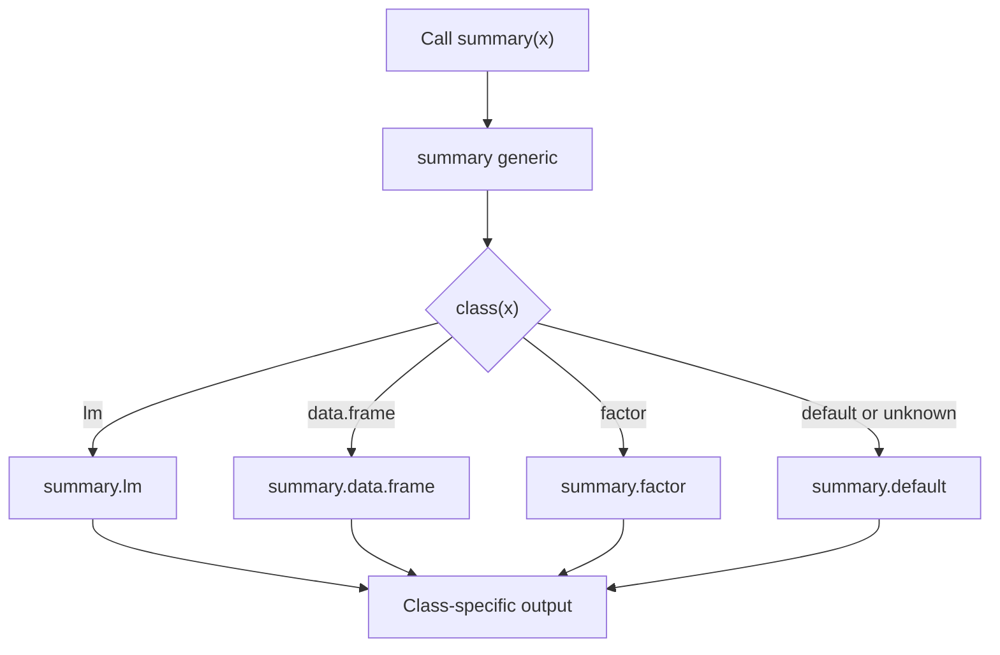

# Object-Oriented R

R's object-oriented systems are easy to miss at first because many examples look like ordinary function calls. You call `summary(fit)`, `plot(fit)`, or `print(test)`, and R chooses behavior based on the object's class. The book's discussion of classes, attributes, fitted model objects, and plotting methods points toward this larger idea: R objects carry metadata, and generic functions use that metadata to decide what to do.


*Figure: R connects programming examples to statistical modeling and visualization workflows. Image: [Wikimedia Commons](https://commons.wikimedia.org/wiki/File:R_logo.svg), The R Foundation, CC BY-SA 4.0.*

Base R has several object systems. The most common for everyday analysis is S3, a lightweight convention built around class attributes and generic functions. S4 is more formal, with declared classes, slots, and method signatures. A brief understanding is enough to explain why `summary()` works on vectors, data frames, hypothesis tests, and linear models while returning different structures for each.

## Definitions

An **attribute** is metadata attached to an object. Names, dimensions, classes, and levels are attributes. `attributes(x)` displays them.

A **class** is an attribute that identifies what kind of object something should be treated as. `class(fit)` for a linear model is usually `"lm"`.

A **generic function** dispatches to a method based on class. In S3, `summary()` is generic, and `summary.lm()` is the method for objects of class `"lm"`.

An **S3 object** is usually a list or vector with a class attribute. S3 is informal: classes do not require formal declarations, and methods are named `generic.class`.

An **S4 object** belongs to a formally defined class created with `setClass`. Its components are called slots and are accessed with `@`. S4 methods are registered with `setMethod`.

**Method dispatch** is the process of selecting a class-specific method for a generic function call.

## Key results

S3 is visible through common modeling work:

| Object | Class | Generic call | Method idea |
|---|---|---|---|
| Linear model | `"lm"` | `summary(fit)` | `summary.lm` reports coefficients and diagnostics |
| Hypothesis test | `"htest"` | `print(test)` | `print.htest` formats test output |
| Data frame | `"data.frame"` | `summary(df)` | Column-wise summaries |
| Factor | `"factor"` | `summary(f)` | Level counts |

You can inspect available S3 methods with `methods("summary")` or `methods(class = "lm")`. You can inspect dispatch with `UseMethod` in generic definitions:

```r
print.summary.lm
```

Many S3 objects are lists. A fitted `lm` object contains coefficients, residuals, fitted values, model frame information, QR decomposition details, and more. The class controls how generic functions present and use that list.

S4 is stricter and useful for complex systems that need validation. Many Bioconductor packages use S4 because biological data structures can require formal slots and consistency checks. For introductory R, it is usually enough to recognize S4 syntax and avoid confusing `@` with list `$`.

## Visual



| System | Style | Class definition | Method dispatch | Typical use |
|---|---|---|---|---|
| S3 | Informal | `class(x) <- "my_class"` | `generic.class` naming | Base models, simple custom objects |
| S4 | Formal | `setClass()` | `setMethod()` | Large structured packages |
| Reference classes/R6 | Mutable objects | Package/system dependent | Methods attached to objects | Stateful applications |

## Worked example 1: Inspecting an S3 linear model

Problem: fit a linear model and show that `summary(fit)` dispatches to an S3 method for class `"lm"`.

Method:

1. Fit a model with `lm`.
2. Check its class.
3. List method names for `summary`.
4. Call `summary`.
5. Extract coefficients directly from the summary object.

```r
fit <- lm(mpg ~ wt, data = mtcars)
class(fit)
# [1] "lm"

methods("summary")[grep("summary.lm", methods("summary"))]
# [1] "summary.lm"

s <- summary(fit)
class(s)
# [1] "summary.lm"

s$coefficients
#              Estimate Std. Error   t value     Pr(>|t|)
# (Intercept) 37.285126   1.877627 19.857575 8.241799e-19
# wt          -5.344472   0.559101 -9.559044 1.293959e-10
```

Checked answer: the fitted model has class `"lm"`, and the summary object has class `"summary.lm"`. The generic call `summary(fit)` uses the linear-model method, producing coefficient estimates, standard errors, t statistics, and p-values.

The same word `summary` means different things for different classes because R dispatches methods by class.

## Worked example 2: Creating a small S3 class

Problem: create a simple S3 class for a quiz result and define a custom print method.

Method:

1. Write a constructor that returns a list.
2. Store score, total, and name.
3. Assign class `"quiz_result"`.
4. Define `print.quiz_result`.
5. Create an object and print it.

```r
new_quiz_result <- function(name, score, total) {
  if (score > total) stop("score cannot exceed total")
  x <- list(name = name, score = score, total = total)
  class(x) <- "quiz_result"
  x
}

print.quiz_result <- function(x, ...) {
  percent <- x$score / x$total * 100
  cat(
    x$name, ": ",
    x$score, "/", x$total,
    " (", round(percent, 1), "%)\n",
    sep = ""
  )
  invisible(x)
}

result <- new_quiz_result("Ana", 18, 20)
result
# Ana: 18/20 (90%)
```

Checked answer: the object is a list with class `"quiz_result"`. When it is printed, R looks for `print.quiz_result` and uses the custom method. The percentage is `18 / 20 * 100 = 90`.

This demonstrates S3's lightweight nature. No formal class declaration was required, but the constructor and print method create a clear convention.

## Code

```r
# Minimal S3 summary method for the quiz_result class.

summary.quiz_result <- function(object, ...) {
  percent <- object$score / object$total * 100
  out <- list(
    name = object$name,
    score = object$score,
    total = object$total,
    percent = percent,
    passed = percent >= 70
  )
  class(out) <- "summary.quiz_result"
  out
}

print.summary.quiz_result <- function(x, ...) {
  status <- if (x$passed) "passed" else "did not pass"
  cat(x$name, status, "with", round(x$percent, 1), "percent\n")
  invisible(x)
}

result <- new_quiz_result("Bo", 13, 20)
summary(result)
```

This small class demonstrates the same pattern used by many base R objects. A constructor creates a valid object, the class attribute identifies it, and generic functions provide user-facing behavior. `print(result)` gives a compact display of the object itself. `summary(result)` creates a different object with derived information. `print(summary(result))` then formats that summary object. Each step is ordinary R code plus naming conventions.

The constructor is important because S3 itself does not prevent invalid objects. Without `new_quiz_result`, someone could create `list(name = "Ana", score = 30, total = 20)` and assign class `"quiz_result"`, producing an impossible score. A constructor centralizes validation and keeps methods simpler because methods can assume the object was built correctly.

For analysis users, the practical value of object-oriented R is extraction discipline. Instead of digging through every list component of an `lm` object, use `coef`, `resid`, `fitted`, `predict`, `summary`, and `confint`. These functions express intent and let the class decide the correct method. Direct component access is still useful for learning and debugging, but documented extractors are more stable.

S4 follows the same broad idea with stronger rules. It is less common in introductory examples, but when you see `object@slot`, read it as formal slot access rather than list extraction. The stricter structure is helpful in large package ecosystems where objects need validation and predictable components.

To study S3 dispatch, use `methods()` and `getS3method()`. For example, `methods("plot")` reveals many class-specific plot methods, and `getS3method("summary", "lm")` retrieves the method used for linear-model summaries. You do not need to memorize the method bodies, but seeing that they exist makes generic behavior less mysterious.

The safest way to extend R with a small class is to write a constructor, a validator if needed, and a few methods for common generics such as `print`, `summary`, or `plot`. Keep the underlying object simple and document its components. If the class becomes complex enough that informal conventions are fragile, that is a sign to consider a more formal system or an existing package structure.

For everyday analysis, you do not need to design many classes, but you do need to recognize them. If an object prints in a polished way, assume there is structure underneath. Use `class()`, `str()`, and documented extractors before reaching into components. That keeps analysis code aligned with the methods the package author intended.

This is especially important for objects returned by statistical functions. A hypothesis test, model, or clustering result may print only a few lines while storing estimates, data names, residuals, call information, or diagnostic quantities. Class-aware extractors preserve meaning and protect code from internal layout changes. Treat printed output as a view, not as the whole object.

When in doubt, compare `print(x)` with `str(x)`; the contrast shows why classes are useful.

That comparison also teaches which extractor functions are worth learning next.

It is a small habit with large payoff in debugging.

## Common pitfalls

- Thinking `summary()` is one fixed function rather than a generic with class-specific methods.
- Editing an object's class attribute casually and breaking method assumptions.
- Accessing internals of complex objects without checking their documented extractors.
- Confusing list `$` access with S4 `@` slot access.
- Writing S3 methods without a constructor, making invalid objects easy to create.
- Assuming two objects with the same printed output have the same class or structure. Use `str()`.

## Connections

- [Special values, classes, and coercion](/cs/programming/r/special-values-classes-coercion)
- [Lists and data frames](/cs/programming/r/lists-and-data-frames)
- [Control flow, functions, and scoping](/cs/programming/r/control-flow-functions-scoping)
- [Linear and generalized models](/cs/programming/r/linear-and-generalized-models)
