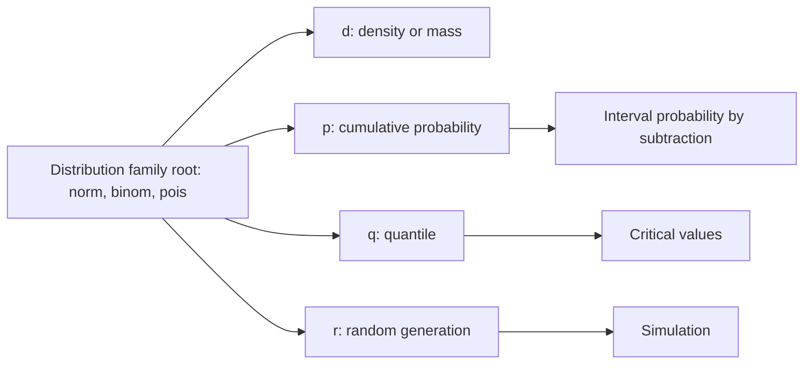

# Probability Distributions in R

R has a consistent interface for probability distributions. The book uses probability as a bridge between programming and statistics: once you can create vectors, call functions, and plot results, you can compute probabilities, quantiles, simulated samples, and distribution curves. This makes abstract probability concrete because every distribution family has a small set of related functions.

Most distribution functions come in four forms. For a distribution root such as `norm`, R provides `dnorm` for density, `pnorm` for cumulative probability, `qnorm` for quantiles, and `rnorm` for random generation. The same prefix pattern appears for binomial (`binom`), Poisson (`pois`), uniform (`unif`), exponential (`exp`), t (`t`), chi-square (`chisq`), F (`f`), and many others.

## Definitions

A **probability distribution** describes possible values of a random variable and how probability is assigned to those values.

A **discrete distribution** assigns probability to countable values. Examples include Bernoulli, binomial, and Poisson distributions. R's `d` functions return probabilities for discrete distributions.

A **continuous distribution** assigns probability over intervals. Examples include normal, uniform, exponential, and t distributions. R's `d` functions return density values, not interval probabilities.

A **cumulative distribution function (CDF)** returns $P(X \le x)$. In R, `p*` functions compute CDF values, such as `pnorm(1.96)`.

A **quantile function** is the inverse CDF. It returns the value $x$ such that $P(X \le x) = p$. In R, `q*` functions compute quantiles, such as `qnorm(0.975)`.

A **random sample generator** creates pseudo-random observations from a distribution. In R, `r*` functions do this, such as `rbinom(100, size = 10, prob = 0.3)`.

## Key results

R's distribution naming pattern is the main result:

| Prefix | Meaning | Normal example | Binomial example |
|---|---|---|---|
| `d` | density or probability mass | `dnorm(x, mean, sd)` | `dbinom(x, size, prob)` |
| `p` | cumulative probability | `pnorm(q, mean, sd)` | `pbinom(q, size, prob)` |
| `q` | quantile | `qnorm(p, mean, sd)` | `qbinom(p, size, prob)` |
| `r` | random generation | `rnorm(n, mean, sd)` | `rbinom(n, size, prob)` |

For continuous distributions, point probabilities are zero. `dnorm(0)` is a density height, not $P(X = 0)$. To get interval probabilities, subtract CDF values:

$$
\begin{aligned}
P(a < X < b) &= F(b) - F(a).
\end{aligned}
$$

For discrete distributions, `dbinom(3, size = 10, prob = 0.4)` is the probability of exactly 3 successes. A cumulative statement such as "at most 3 successes" uses `pbinom(3, size = 10, prob = 0.4)`.

Simulation should be reproducible when used in notes, reports, or tests. `set.seed()` fixes the pseudo-random sequence so readers can reproduce the same sample.

## Visual



| Distribution | R root | Parameters | Common use |
|---|---|---|---|
| Normal | `norm` | `mean`, `sd` | Measurement variation, approximations |
| Binomial | `binom` | `size`, `prob` | Number of successes in fixed trials |
| Poisson | `pois` | `lambda` | Event counts per interval |
| Uniform | `unif` | `min`, `max` | Equal chance over interval |
| Exponential | `exp` | `rate` | Waiting times |
| t | `t` | `df` | Inference for means with estimated variance |

## Worked example 1: Normal interval probability

Problem: suppose exam scores are approximately normal with mean 75 and standard deviation 8. Find the probability that a randomly chosen score is between 70 and 90.

Method:

1. Define $X \sim N(75, 8^2)$.
2. Use the CDF identity $P(70 \lt  X \lt  90) = F(90) - F(70)$.
3. Compute both cumulative probabilities with `pnorm`.
4. Subtract.
5. Sanity-check using z-scores.

```r
lower <- pnorm(70, mean = 75, sd = 8)
upper <- pnorm(90, mean = 75, sd = 8)
prob <- upper - lower

lower
# [1] 0.2659855

upper
# [1] 0.9696036

prob
# [1] 0.7036181
```

Checked answer: the lower z-score is `(70 - 75) / 8 = -0.625`, and the upper z-score is `(90 - 75) / 8 = 1.875`. The interval spans from moderately below the mean to well above it, so a probability around 0.70 is plausible. The computed answer is approximately 0.704.

The key is that `dnorm(70)` and `dnorm(90)` would not answer this question; they are density heights. Interval probability comes from `pnorm`.

## Worked example 2: Binomial exact and cumulative probabilities

Problem: a machine produces an acceptable part with probability 0.9. In 12 independent parts, find the probability of exactly 10 acceptable parts and the probability of at least 10 acceptable parts.

Method:

1. Define $X \sim \mathrm{Binomial}(12, 0.9)$.
2. Use `dbinom` for exactly 10.
3. Use either a sum of `dbinom(10:12, ...)` or a CDF complement for at least 10.
4. Check that both cumulative methods agree.

```r
exact_10 <- dbinom(10, size = 12, prob = 0.9)
at_least_10_sum <- sum(dbinom(10:12, size = 12, prob = 0.9))
at_least_10_cdf <- 1 - pbinom(9, size = 12, prob = 0.9)

exact_10
# [1] 0.2301278

at_least_10_sum
# [1] 0.8891308

at_least_10_cdf
# [1] 0.8891308
```

Checked answer: "at least 10" means 10, 11, or 12 acceptable parts. Summing those exact probabilities matches the complement of "at most 9." The result is high, about 0.889, because the success probability is 0.9 and 12 trials is not large.

This example also shows the value of naming variables. `exact_10` and `at_least_10_cdf` prevent confusion between point and cumulative probabilities.

## Code

```r
# Compare theoretical and simulated binomial probabilities.

set.seed(123)
n_sim <- 10000
size <- 12
prob <- 0.9

simulated <- rbinom(n_sim, size = size, prob = prob)
sim_table <- prop.table(table(factor(simulated, levels = 0:size)))
theory <- dbinom(0:size, size = size, prob = prob)

comparison <- data.frame(
  successes = 0:size,
  simulated = as.numeric(sim_table),
  theoretical = theory
)

print(tail(comparison, 5))

plot(
  comparison$successes,
  comparison$theoretical,
  type = "h",
  lwd = 4,
  xlab = "Acceptable parts",
  ylab = "Probability",
  main = "Binomial(12, 0.9) probabilities"
)
points(comparison$successes, comparison$simulated, pch = 19)
```

The simulation table is a useful bridge between probability theory and data analysis. The `theoretical` column is what the binomial model says before data are simulated. The `simulated` column is what happened in 10,000 pseudo-random experiments. The two columns should be close, but not identical, because simulation has sampling variability. Increasing `n_sim` usually makes the simulated proportions move closer to the theoretical probabilities.

This code also illustrates why factor levels are supplied in `table(factor(simulated, levels = 0:size))`. Without explicit levels, outcomes that did not occur in the simulation would be absent from the table, shortening the result and misaligning it with `0:size`. By declaring all possible success counts, the simulated and theoretical vectors have the same length and refer to the same outcomes.

When using distribution functions, name the event in words before coding it. "Exactly 3" becomes `dbinom(3, ...)`. "At most 3" becomes `pbinom(3, ...)`. "More than 3" becomes `pbinom(3, ..., lower.tail = FALSE)` or `1 - pbinom(3, ...)`. "Between 70 and 90" for a continuous variable becomes a difference of two CDF values. Translating the event first prevents off-by-one errors and wrong-tail errors.

Simulation is also a diagnostic tool. If a theoretical probability calculation seems suspicious, simulate the experiment and compare the approximate frequency. Disagreement usually means either the formula was coded incorrectly or the simulation does not match the same assumptions.

Distribution functions also support inference pages. Critical values in confidence intervals come from quantile functions such as `qt` and `qnorm`. P-values often come from cumulative probabilities such as `pt`, `pnorm`, or `pchisq`. Random generators support power simulations and teaching demonstrations. Learning the `d`, `p`, `q`, `r` pattern once pays off across most of introductory statistics.

Parameterization must be checked from the help page. For example, normal functions use `mean` and `sd`, while exponential functions use `rate` by default, and some distributions offer alternative parameter names. A mathematically correct idea can become wrong code if the parameter is supplied on the wrong scale. When in doubt, run a small sanity check, such as verifying the simulated mean is close to the theoretical mean.

Graphing a distribution is often the fastest sanity check. A discrete mass function should have bars at possible values whose heights sum to one. A continuous density should have plausible shape and scale, but areas, not point heights, represent probabilities. Pairing probability calculations with plots makes tail direction and endpoint choices easier to verify.

When a result is a probability, check that it lies between 0 and 1. When a result is a quantile, check that it is on the original measurement scale. This simple distinction catches many prefix mix-ups.

## Common pitfalls

- Treating a continuous density value as a probability. Use CDF differences for intervals.
- Confusing `lower.tail = FALSE` with subtracting the wrong endpoint. For `P(X > q)`, use `lower.tail = FALSE` or `1 - p*(q)`.
- Forgetting distribution parameters. `sd` in `rnorm` is standard deviation, not variance.
- Using `set.seed()` once and then expecting every later random call to be independent of earlier calls in the script.
- Simulating a small number of observations and expecting exact agreement with theoretical probabilities.
- Using `pbinom(10, ...)` for "at least 10"; that gives "at most 10."

## Connections

- [Vectors, arithmetic, and comparison](/cs/programming/r/vectors-arithmetic-comparison)
- [Apply family](/cs/programming/r/apply-family)
- [Descriptive statistics](/cs/programming/r/descriptive-statistics)
- [Statistical inference](/cs/programming/r/statistical-inference)
