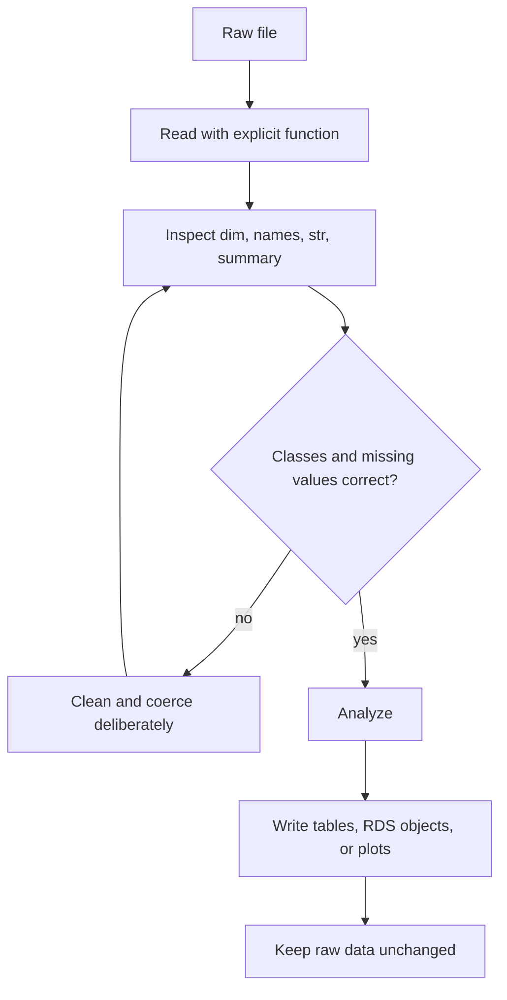

# Reading and Writing Data

Analysis starts when data enters R and becomes an object with known columns, classes, and missing-value conventions. *The Book of R* introduces built-in data sets, text tables, spreadsheet workbooks, web files, graphics output, and ad hoc object storage. The details vary by file type, but the same discipline applies: know the path, know the delimiter, inspect the imported object, and save outputs in a format suited to their next use.

The safest workflow is to separate raw input from derived output. Raw files should remain unchanged. R scripts should read raw files, perform explicit cleaning steps, and write cleaned data, tables, plots, or serialized R objects to predictable locations. This keeps the analysis reproducible and makes mistakes easier to trace.

## Definitions

A **CSV file** is a comma-separated text file. It is commonly read with `read.csv()` or `read.table(sep = ",", header = TRUE)`, and written with `write.csv()`.

A **delimited text file** stores rows as lines and columns separated by a delimiter such as comma, tab, semicolon, or pipe. `read.table()` is the flexible base R reader; `read.delim()` is a tab-delimited convenience wrapper.

An **Excel workbook** is a spreadsheet file such as `.xlsx`. Base R does not read `.xlsx` directly; contributed packages such as `readxl` are commonly used.

An **RData** file stores one or more R objects by name. `save()` writes named objects to `.RData`, and `load()` restores them into an environment. An **RDS** file stores one object without forcing its name; `saveRDS()` and `readRDS()` are often cleaner for scripted workflows.

A **graphics device** is an output target for plots. Devices include the interactive plot pane, `png()`, `pdf()`, and other file devices. Plot code runs while the device is open, and `dev.off()` closes the file.

## Key results

Import decisions should be explicit:

| Format | Read function | Write function | Preserves R classes well? | Good use |
|---|---|---|---|---|
| CSV | `read.csv` | `write.csv` | Partly | Exchange with spreadsheets and other tools |
| Tab-delimited | `read.delim` | `write.table` | Partly | Plain text data transfer |
| Excel `.xlsx` | `readxl::read_excel` | `writexl::write_xlsx` or other package | Partly | Spreadsheet collaboration |
| RData | `load` | `save` | Yes | Multiple R objects |
| RDS | `readRDS` | `saveRDS` | Yes | One object with explicit assignment |
| Image/PDF plot | Not usually read as data | `png`, `pdf`, `jpeg` | Not data | Reports and figures |

After every import, inspect structure and dimensions:

```r
dim(dat)
names(dat)
str(dat)
summary(dat)
head(dat)
```

CSV import can go wrong when files use non-comma delimiters, decimal commas, embedded commas in quoted strings, nonstandard missing codes, or inconsistent header rows. Use arguments such as `sep`, `header`, `na.strings`, `stringsAsFactors`, and `colClasses` when defaults do not match the file.

RData is convenient but can hide object names. `load("file.RData")` creates objects in the current environment and returns their names invisibly. RDS is usually more explicit:

```r
clean_data <- readRDS("clean_data.rds")
```

## Visual



| Checkpoint | Command | Failure it catches |
|---|---|---|
| File exists | `file.exists(path)` | Wrong working directory or path |
| Row/column shape | `dim(dat)` | Header parsed as data, delimiter wrong |
| Column names | `names(dat)` | Unexpected names or duplicates |
| Column classes | `str(dat)` | Numeric data imported as character |
| Missing values | `colSums(is.na(dat))` | Unrecognized missing-value codes |

## Worked example 1: Reading a CSV string and cleaning classes

Problem: a small CSV stores patient id, group, and response. The missing response code is `"."`. Read it, convert group to a factor, convert response to numeric, and compute group means.

Method:

1. Represent the CSV text with `textConnection` for a self-contained example.
2. Use `read.csv` with `na.strings = "."`.
3. Inspect the result.
4. Convert group to a factor with explicit levels.
5. Aggregate response by group.
6. Check one mean manually.

```r
txt <- "id,group,response
1,control,5.1
2,treated,6.3
3,control,.
4,treated,6.9"

dat <- read.csv(textConnection(txt), na.strings = ".")
dat$group <- factor(dat$group, levels = c("control", "treated"))

str(dat)
# 'data.frame': 4 obs. of  3 variables:
#  $ id      : int  1 2 3 4
#  $ group   : Factor w/ 2 levels "control","treated": 1 2 1 2
#  $ response: num  5.1 6.3 NA 6.9

aggregate(response ~ group, data = dat, FUN = mean, na.rm = TRUE)
#     group response
# 1 control      5.1
# 2 treated      6.6
```

Checked answer: the treated responses are 6.3 and 6.9, so their mean is `(6.3 + 6.9) / 2 = 6.6`. The control group has one observed response, 5.1, because the other is missing.

The example is small, but the import policy is realistic: missing codes are declared during reading, then class choices are made explicitly.

## Worked example 2: Saving a cleaned object and a plot

Problem: create a cleaned `mtcars` subset with model names and four variables. Save it as RDS, read it back, and write a PNG scatterplot.

Method:

1. Build the cleaned data frame.
2. Save one object with `saveRDS`.
3. Read it back with explicit assignment.
4. Open a PNG graphics device.
5. Draw the plot.
6. Close the device with `dev.off()`.

```r
cars <- mtcars[, c("mpg", "wt", "hp", "cyl")]
cars$model <- rownames(mtcars)

tmp_rds <- tempfile(fileext = ".rds")
tmp_png <- tempfile(fileext = ".png")

saveRDS(cars, tmp_rds)
cars2 <- readRDS(tmp_rds)

identical(cars, cars2)
# [1] TRUE

png(tmp_png, width = 700, height = 500)
plot(cars2$wt, cars2$mpg, pch = 19, xlab = "Weight", ylab = "MPG")
dev.off()
```

Checked answer: `identical(cars, cars2)` returns `TRUE`, so the RDS round trip preserved the object. The plot file path is temporary in this example, but a project script would use a stable path such as `"figures/mpg_vs_weight.png"`.

The key habit is to close file graphics devices. If `dev.off()` is forgotten, the file may be incomplete or locked until the session ends.

## Code

```r
# Reusable import checker for rectangular data.

check_import <- function(df) {
  stopifnot(is.data.frame(df))
  report <- data.frame(
    variable = names(df),
    class = vapply(df, function(x) paste(class(x), collapse = "/"), character(1)),
    missing = vapply(df, function(x) sum(is.na(x)), integer(1)),
    unique_values = vapply(df, function(x) length(unique(x)), integer(1)),
    row.names = NULL
  )
  list(
    dimensions = dim(df),
    names = names(df),
    report = report,
    preview = head(df)
  )
}

txt <- "site,count,status
A,10,ok
B,.,check
C,15,ok"

example <- read.csv(textConnection(txt), na.strings = ".")
print(check_import(example))
```

## Common pitfalls

- Reading a file from the wrong working directory. Check `getwd()` and `file.exists(path)`.
- Letting a missing code such as `"."`, `"NA "`, or `"-99"` become ordinary data.
- Trusting printed output without checking `str()`. Numeric-looking columns may be character.
- Saving analysis state only as `.RData`. Scripts plus raw data are more reproducible.
- Forgetting `row.names = FALSE` when writing CSV files for non-R users.
- Opening a graphics device and forgetting `dev.off()`.
- Using Excel import code without recording the package dependency.

## Connections

- [Getting started with R](/cs/programming/r/getting-started-rstudio-packages)
- [Special values, classes, and coercion](/cs/programming/r/special-values-classes-coercion)
- [Lists and data frames](/cs/programming/r/lists-and-data-frames)
- [Base graphics](/cs/programming/r/base-graphics)
