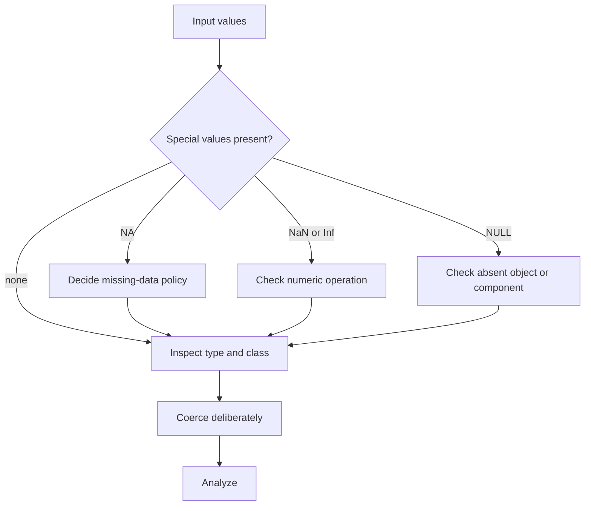

# Special Values, Classes, and Coercion

Real data rarely arrives as neat numeric vectors with no surprises. R has several special values for missingness, undefined calculations, infinite results, and absent objects. It also has type and class systems that determine how functions interpret values. The book places these ideas after vectors, factors, lists, and data frames because they explain many of R's most confusing beginner errors.


*Figure: R connects programming examples to statistical modeling and visualization workflows. Image: [Wikimedia Commons](https://commons.wikimedia.org/wiki/File:R_logo.svg), The R Foundation, CC BY-SA 4.0.*

The practical message is simple: inspect objects before analyzing them. `NA`, `NaN`, `Inf`, `NULL`, character-to-numeric coercion, factor coding, date classes, and data frame column classes all change what a function can do. A statistical answer is only as reliable as the object structure that produced it.

## Definitions

`NA` represents a missing value. It can appear in numeric, character, logical, and other vectors. Most computations involving `NA` return `NA` unless the function has an argument such as `na.rm = TRUE`.

`NaN` means "not a number." It usually appears when a numeric operation is undefined, such as `0 / 0` or `sqrt(-1)` in real arithmetic. `is.nan()` detects it, and `is.na()` also treats `NaN` as missing-like.

`Inf` and `-Inf` represent positive and negative infinity. They can arise from operations such as `1 / 0` and can be detected with `is.infinite()`.

`NULL` represents absence, not a missing element. It has length zero and is often used to mean "no object supplied" or "remove this component." In a list, assigning `NULL` to a component removes it.

A **type** is the low-level storage mode, such as double, integer, character, logical, or list. `typeof()` reports it.

A **class** is an attribute that tells generic functions how to treat an object. `class()` reports it. A numeric vector may have class `"Date"`; a list may have class `"lm"`.

**Coercion** is conversion from one type or class to another. R may coerce explicitly through functions such as `as.numeric`, `as.character`, and `as.Date`, or implicitly when mixed values must fit in one vector.

## Key results

Special values have different meanings and should not be collapsed into one vague category:

| Value | Meaning | Length behavior | Detection | Common source |
|---|---|---:|---|---|
| `NA` | Missing value | Occupies a position | `is.na(x)` | Missing data, failed match |
| `NaN` | Undefined numeric result | Occupies a position | `is.nan(x)` | `0 / 0`, invalid numeric operation |
| `Inf` | Infinite numeric result | Occupies a position | `is.infinite(x)` | `1 / 0`, overflow |
| `NULL` | No value or absent component | Length zero | `is.null(x)` | Optional argument, removed list item |

R's coercion hierarchy for atomic vectors often moves toward the type that can represent all values. Logical values can become numeric (`TRUE` to `1`, `FALSE` to `0`), numeric values can become character, and mixing character with numbers in `c()` usually produces a character vector.

Classes affect method dispatch. `summary(fit)` behaves differently for a fitted linear model than for a numeric vector because `fit` has class `"lm"`. The visible function name is the same, but R chooses a class-specific method.

Missing values require explicit policy. Removing rows with missing values may be appropriate for a simple example but can bias a real analysis. At the code level, the first step is to count and locate missingness before deciding whether to omit, impute, flag, or model it.

## Visual



| Check | Function | Example question |
|---|---|---|
| Storage type | `typeof(x)` | Is this really numeric storage? |
| Class | `class(x)` | Will generic functions use special methods? |
| Structure | `str(x)` | What is inside this object? |
| Missing count | `sum(is.na(x))` | How many values are missing? |
| Complete rows | `complete.cases(df)` | Which records have no missing values? |

## Worked example 1: Separating `NA`, `NaN`, and `Inf`

Problem: a calculation produces `c(4, NA, 0 / 0, 1 / 0, -1 / 0, 9)`. Identify each special value type and compute the mean of finite observed numbers only.

Method:

1. Create the vector.
2. Use `is.na`, `is.nan`, and `is.infinite`.
3. Build a finite-and-observed filter with `is.finite`.
4. Subset the vector.
5. Compute the mean and check manually.

```r
x <- c(4, NA, 0 / 0, 1 / 0, -1 / 0, 9)

is.na(x)
# [1] FALSE  TRUE  TRUE FALSE FALSE FALSE

is.nan(x)
# [1] FALSE FALSE  TRUE FALSE FALSE FALSE

is.infinite(x)
# [1] FALSE FALSE FALSE  TRUE  TRUE FALSE

valid <- is.finite(x)
x[valid]
# [1] 4 9

mean(x[valid])
# [1] 6.5
```

Checked answer: the only finite observed values are 4 and 9. Their mean is `(4 + 9) / 2 = 6.5`. `is.na` detects both `NA` and `NaN`, but `is.nan` only detects `NaN`, so the two checks answer different questions.

The main habit is to define validity for the task. For a mean, finite observed numbers are valid. For a diagnostic report, the infinities and NaNs may be the most important values because they reveal division by zero or invalid transformations.

## Worked example 2: Coercing imported numeric text safely

Problem: a CSV-like input stores counts as character strings: `"10"`, `"12"`, `"missing"`, and `"15"`. Convert valid numbers to numeric, mark invalid entries as missing, and compute the total.

Method:

1. Store the raw values as character.
2. Convert with `as.numeric`, which creates `NA` for nonnumeric text and warns.
3. Locate conversion failures.
4. Sum with `na.rm = TRUE`.
5. Check the total manually.

```r
raw_counts <- c("10", "12", "missing", "15")
counts <- suppressWarnings(as.numeric(raw_counts))

counts
# [1] 10 12 NA 15

failed <- is.na(counts) & !is.na(raw_counts)
raw_counts[failed]
# [1] "missing"

sum(counts, na.rm = TRUE)
# [1] 37
```

Checked answer: the valid numeric labels are 10, 12, and 15. Their total is `10 + 12 + 15 = 37`. The text `"missing"` cannot be converted to a number, so it becomes `NA` and is recorded as a conversion failure.

In production code, do not hide the warning without replacing it with a check. The example uses `suppressWarnings` only because it immediately records which raw values failed conversion.

## Code

```r
# Audit a data frame for classes and missing values.

audit_frame <- function(df) {
  data.frame(
    variable = names(df),
    class = vapply(df, function(x) paste(class(x), collapse = "/"), character(1)),
    type = vapply(df, typeof, character(1)),
    missing = vapply(df, function(x) sum(is.na(x)), integer(1)),
    finite_missing = vapply(df, function(x) {
      if (is.numeric(x)) sum(!is.finite(x) | is.na(x)) else NA_integer_
    }, integer(1)),
    row.names = NULL
  )
}

example <- data.frame(
  group = factor(c("A", "B", "A", "B")),
  value = c(10, NA, NaN, Inf),
  date = as.Date(c("2026-01-01", "2026-01-02", NA, "2026-01-04"))
)

print(audit_frame(example))
```

The audit function separates three related questions. `class` tells you how R methods will treat a column; `type` tells you how the column is stored; missing counts tell you whether ordinary summaries will return `NA`. A date column, for example, has a class that makes printing and plotting date-aware even though its storage is numeric internally. A factor column has integer storage, but its levels supply the categorical meaning.

For numeric columns, the `finite_missing` count is stricter than `missing`. It flags `Inf` and `NaN` as well as `NA`, which is useful before modeling. A regression can fail or produce meaningless estimates if a transformed predictor contains infinite values from `log(0)` or division by zero. Finding those values near import or cleaning is much cheaper than discovering them after a long analysis pipeline.

Coercion should be treated as a data-cleaning step, not a quick fix. If `as.numeric()` introduces `NA`, record which raw values failed. If a factor must become numeric labels, convert through character and then inspect the result. If a column should be a date, use `as.Date()` with the expected format and check for missing values afterward. Every conversion is an assumption about what the data means.

In reports, include enough of this audit to make the analysis credible. A short sentence such as "Two response values coded as `-99` were converted to missing, and no infinite values remained after log transformation" is often more valuable than another decimal place in a model coefficient.

As a final check, distinguish "unknown," "undefined," and "absent" in your own words before coding. Use `NA` for an unknown observed slot, recognize `NaN` as an undefined numeric result, and reserve `NULL` for no component or no argument. Those meanings lead to different code and different analysis decisions.

## Common pitfalls

- Using `x == NA` to test for missing values. Use `is.na(x)` because `NA` means unknown, so equality with it is also unknown.
- Treating `NULL` as a missing value inside a vector. `NULL` usually removes or omits; `NA` occupies a position.
- Calling `as.numeric()` directly on a factor and interpreting the internal codes as data values.
- Removing missing values with `na.rm = TRUE` without reporting how many values were removed.
- Ignoring `Inf` after division or logarithms. Infinite values can pass through some summaries and break models later.
- Assuming class and type are the same. A `Date` has numeric storage but date behavior.

## Connections

- [Factors and categorical data](/cs/programming/r/factors-and-categorical-data)
- [Reading and writing data](/cs/programming/r/reading-and-writing-data)
- [Descriptive statistics](/cs/programming/r/descriptive-statistics)
- [Object-oriented R](/cs/programming/r/object-oriented-r)
