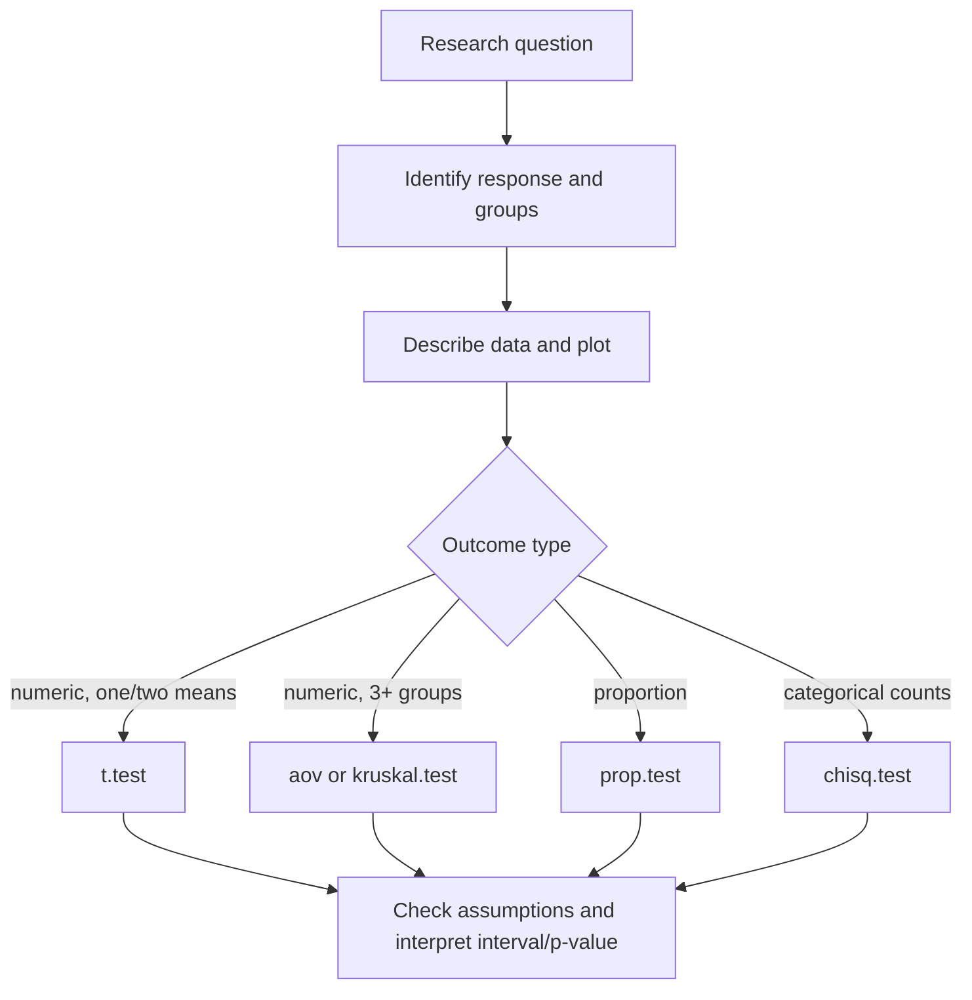

# Statistical Inference

Statistical inference uses sample data to make statements about a broader population or data-generating process. The book's inference chapters cover sampling distributions, confidence intervals, hypothesis tests, proportions, categorical tests, errors, power, and ANOVA. R supplies many standard tests as functions, but the function call is only the final step. The analyst must know the question, assumptions, null hypothesis, alternative hypothesis, test statistic, p-value, and interpretation.


*Figure: R connects programming examples to statistical modeling and visualization workflows. Image: [Wikimedia Commons](https://commons.wikimedia.org/wiki/File:R_logo.svg), The R Foundation, CC BY-SA 4.0.*

The danger in R is that tests are easy to run before the problem is clear. A good inference workflow starts with a study question and descriptive checks, then chooses a method whose assumptions are defensible. The output is interpreted in the scale of the data, not just as "significant" or "not significant."

## Definitions

A **parameter** is a population quantity, such as a population mean $\mu$, proportion $p$, or regression slope $\beta_1$.

An **estimator** is a sample-based rule for estimating a parameter, such as the sample mean $\bar{x}$.

A **confidence interval** is a range of plausible parameter values produced by a method that has a long-run coverage rate. A 95 percent confidence interval procedure captures the true parameter in about 95 percent of repeated samples under its assumptions.

A **null hypothesis** $H_0$ is the default claim tested, often "no difference" or "no association." An **alternative hypothesis** $H_A$ is the competing claim.

A **p-value** is the probability, assuming $H_0$ and model assumptions, of observing a test statistic at least as extreme as the one observed. It is not the probability that $H_0$ is true.

**Type I error** means rejecting a true null hypothesis. **Type II error** means failing to reject a false null hypothesis. **Power** is the probability of rejecting a false null.

## Key results

Standard R inference functions include:

| Question | Function | Typical formula or arguments |
|---|---|---|
| One mean | `t.test(x, mu = ...)` | Numeric vector |
| Two means | `t.test(y ~ group, data = ...)` | Numeric response, two groups |
| Paired mean difference | `t.test(before, after, paired = TRUE)` | Matched vectors |
| One or two proportions | `prop.test(x, n)` | Success counts and trial counts |
| Categorical goodness of fit | `chisq.test(table)` | One-way count table |
| Categorical association | `chisq.test(table(a, b))` | Two-way table |
| One-way ANOVA | `aov(y ~ group, data = ...)` | Numeric response, factor group |
| Nonparametric group comparison | `kruskal.test(y ~ group, data = ...)` | Rank-based alternative |

For a one-sample t confidence interval:

$$
\begin{aligned}
\bar{x} \pm t_{\alpha/2, n - 1}\frac{s}{\sqrt{n}}.
\end{aligned}
$$

The t test assumes independent observations and, for small samples, roughly normal data or at least no severe outliers. Two-sample t tests add assumptions about group independence and use Welch's unequal-variance version by default in R.

ANOVA compares means across more than two groups by partitioning variation into between-group and within-group components. A significant ANOVA result says at least one group mean differs, not which specific pair differs. Follow-up comparisons require additional procedures.

## Visual



| Output item | Meaning | Bad interpretation |
|---|---|---|
| Estimate | Sample-based effect size | Proof of population value |
| Confidence interval | Plausible parameter range | Probability parameter is inside after seeing data |
| p-value | Tail probability under null | Probability null is true |
| Test statistic | Standardized evidence measure | Effect size by itself |

## Worked example 1: One-sample t interval and test

Problem: a lab measures reaction times in seconds: `0.48`, `0.52`, `0.51`, `0.49`, `0.55`, `0.50`. Test whether the mean differs from 0.50 seconds and compute a 95 percent confidence interval.

Method:

1. State hypotheses: $H_0: \mu = 0.50$, $H_A: \mu \ne 0.50$.
2. Compute sample mean and standard deviation.
3. Run `t.test(x, mu = 0.50)`.
4. Interpret estimate, interval, and p-value.
5. Check the mean manually.

```r
rt <- c(0.48, 0.52, 0.51, 0.49, 0.55, 0.50)

mean(rt)
# [1] 0.5083333

sd(rt)
# [1] 0.02483277

t.test(rt, mu = 0.50)
# One Sample t-test
# t = 0.82158, df = 5, p-value = 0.4487
# 95 percent confidence interval:
#  0.4822657 0.5344009
# sample estimates:
# mean of x
# 0.5083333
```

Checked answer: the sample mean is `(0.48 + 0.52 + 0.51 + 0.49 + 0.55 + 0.50) / 6 = 3.05 / 6 = 0.5083333`. The confidence interval includes 0.50, and the p-value is large, so this small sample does not provide strong evidence that the population mean differs from 0.50 seconds.

The correct conclusion is not "the mean is exactly 0.50." It is that the data are compatible with 0.50 under this model and sample size.

## Worked example 2: Chi-square test of association

Problem: a survey records preferred interface theme by user type. Test whether theme preference is associated with user type.

Method:

1. Create a two-way count table.
2. State hypotheses: independence versus association.
3. Run `chisq.test`.
4. Inspect expected counts.
5. Interpret the p-value and residual pattern.

```r
theme_counts <- matrix(
  c(35, 20,
    15, 30),
  nrow = 2,
  byrow = TRUE,
  dimnames = list(
    user = c("beginner", "advanced"),
    theme = c("light", "dark")
  )
)

theme_counts
#           theme
# user       light dark
# beginner      35   20
# advanced      15   30

test <- chisq.test(theme_counts)
test$expected
#           theme
# user       light dark
# beginner    27.5 27.5
# advanced    22.5 22.5

test$p.value
# [1] 0.002699796
```

Checked answer: if user type and theme were independent, the beginner row would be expected to split 27.5 and 27.5. Instead, beginners choose light more often than expected and advanced users choose dark more often than expected. The p-value is about 0.0027, giving evidence of association.

The test does not prove why the association exists. It only shows that the observed count pattern is unlikely under independence.

## Code

```r
# Inference helper: report group means and Welch two-sample t test.

compare_two_groups <- function(df, response, group) {
  y <- df[[response]]
  g <- factor(df[[group]])
  if (nlevels(g) != 2) stop("group must have exactly two levels")
  if (!is.numeric(y)) stop("response must be numeric")

  descriptive <- aggregate(y, list(group = g), function(x) {
    c(n = length(x), mean = mean(x), sd = sd(x))
  })
  names(descriptive)[2] <- response

  test <- t.test(y ~ g)
  list(
    descriptive = descriptive,
    estimate = test$estimate,
    conf_int = test$conf.int,
    p_value = test$p.value
  )
}

iris2 <- subset(iris, Species != "virginica")
print(compare_two_groups(iris2, "Sepal.Length", "Species"))
```

The helper returns both descriptive and inferential output because a test without context is incomplete. The group means, standard deviations, and counts tell the reader what the sample looks like. The t test adds an interval and p-value for a specific comparison. If the descriptive output showed a severe imbalance in sample sizes or obvious outliers, the test result would need more caution.

The formula `y ~ g` inside `t.test` is a compact interface: numeric response on the left, two-level group on the right. The function uses Welch's two-sample t test by default, which does not assume equal variances. That default is often safer than the equal-variance pooled test, but it still assumes independent observations and a response scale where comparing means is meaningful.

Inference code should be paired with a written claim. A good result statement includes the estimate, interval, p-value when relevant, and the population or process being discussed. For example: "In this sample, setosa had a lower mean sepal length than versicolor; the Welch interval for the difference excludes zero." That is more informative than "the result was significant."

For categorical tests, inspect expected counts and the study design. A chi-square test of association is not appropriate for every table, especially with small expected counts or dependent observations. R will often warn about approximation quality, and those warnings should be treated as part of the result, not console noise.

A useful inference checklist is: parameter, estimate, uncertainty, assumptions, and conclusion. The parameter says what population quantity is being discussed. The estimate says what the sample suggests. The interval or test statistic describes uncertainty. Assumptions define when the procedure is trustworthy. The conclusion translates the output back into the original question.

Power and error concepts belong in planning, not only after a test. A tiny study may fail to detect an important effect. A huge study may detect a negligible effect. R can compute or simulate power for many designs, but the analyst must decide what effect size is practically meaningful. Statistical significance and practical importance should be reported separately.

## Common pitfalls

- Treating p-values as the probability that the null hypothesis is true.
- Running a test before plotting or summarizing the data.
- Ignoring assumptions such as independence, paired structure, or expected cell counts.
- Reporting only "significant" without an effect size or confidence interval.
- Using multiple tests without considering multiplicity.
- Interpreting a nonsignificant result as proof of no effect, especially with small samples.
- Forgetting that ANOVA significance does not identify which groups differ.

## Connections

- [Descriptive statistics](/cs/programming/r/descriptive-statistics)
- [Probability distributions](/cs/programming/r/probability-distributions)
- [Base graphics](/cs/programming/r/base-graphics)
- [Linear and generalized models](/cs/programming/r/linear-and-generalized-models)
