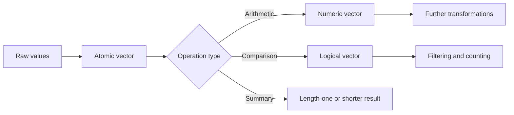

# Vectors, Arithmetic, and Comparison

R's basic unit of computation is the vector. Even a single number such as `7` is treated as a vector of length one. This explains why early R code feels different from calculator-style programming: most arithmetic, comparison, mathematical, and summary functions naturally act on many values at once. The book introduces this style immediately after setup because it is the foundation for later matrices, data frames, statistics, and plots.


*Figure: R connects programming examples to statistical modeling and visualization workflows. Image: [Wikimedia Commons](https://commons.wikimedia.org/wiki/File:R_logo.svg), The R Foundation, CC BY-SA 4.0.*

A beginner can write loops in R, but idiomatic R first asks whether the operation is vectorized. If you want to add 10 to every score, you write `scores + 10`, not a loop over positions. If you want to test which cars have more than 25 miles per gallon, you write `mtcars$mpg > 25`. The result is another vector, often a logical vector used for filtering or summaries.

## Definitions

A **vector** is an ordered collection of elements of the same atomic type. Common atomic vector types include numeric, integer, character, logical, complex, and raw. A vector made with `c(1, 2, 3)` is numeric by default; `c("a", "b")` is character; `c(TRUE, FALSE)` is logical.

**Vectorized arithmetic** means an operator is applied element by element. If `x <- c(2, 4, 6)`, then `x + 1` returns `c(3, 5, 7)`, and `x * x` returns `c(4, 16, 36)`.

**Comparison operators** return logical values. The usual operators are `<`, `<=`, `>`, `>=`, `==`, and `!=`. Equality uses `==`; a single `=` is assignment in many contexts and is not the equality test.

**Logical operators** combine logical values. `&` and `|` work element by element; `&&` and `||` examine only the first element and are mostly for control-flow conditions. `!` negates logical values.

**Character vectors** hold strings. They can be compared, pasted, split, searched, and used as names or categorical labels. R stores `"10"` as text, not as the number `10`, until you explicitly coerce it.

## Key results

The most important rule is that arithmetic between vectors works position by position. If the vectors have the same length, the rule is direct:

$$
\begin{aligned}
(x_1, x_2, x_3) + (y_1, y_2, y_3)
&= (x_1 + y_1, x_2 + y_2, x_3 + y_3).
\end{aligned}
$$

If one vector has length one, R recycles that single value. This is why `scores / 10` divides every score by 10. Recycling of longer unequal lengths is legal in some cases but risky; it is covered more carefully in the indexing page.

Numeric functions such as `sqrt`, `log`, `exp`, `sin`, `abs`, `round`, and `signif` are vectorized. Summary functions such as `sum`, `mean`, `median`, `sd`, `var`, `min`, `max`, and `range` usually reduce a vector to a shorter result. Many summaries need `na.rm = TRUE` when missing values are present.

Logical values are also numeric in arithmetic contexts: `TRUE` behaves like `1`, and `FALSE` behaves like `0`. This makes expressions such as `sum(mtcars$mpg > 25)` a natural way to count how many rows satisfy a condition.

| Operation | Example | Result idea |
|---|---|---|
| Create numeric vector | `c(2, 4, 8)` | Three numbers |
| Create sequence | `1:5` | `1, 2, 3, 4, 5` |
| Repeat values | `rep(3, times = 4)` | `3, 3, 3, 3` |
| Element arithmetic | `c(2, 4) * c(10, 20)` | `20, 80` |
| Scalar recycling | `c(2, 4) + 1` | `3, 5` |
| Comparison | `c(2, 4) > 3` | `FALSE, TRUE` |
| Count condition | `sum(x > 0)` | Number of positive values |

## Visual



```text
Position:     1    2    3    4
x:          10   20   30   40
y:           1    2    3    4
x + y:      11   22   33   44
x > 25:  FALSE FALSE TRUE TRUE
```

## Worked example 1: Computing adjusted exam scores

Problem: a teacher has raw scores out of 40: `31`, `36`, `28`, `40`, and `34`. Convert them to percentages, add a 3-point curve, cap the result at 100, and compute the class average.

Method:

1. Store the raw scores in a numeric vector.
2. Convert each score by dividing by 40 and multiplying by 100.
3. Add the curve with scalar recycling.
4. Use `pmin` to cap each adjusted score at 100.
5. Summarize with `mean`.

```r
raw <- c(31, 36, 28, 40, 34)
percent <- raw / 40 * 100
curved <- percent + 3
final <- pmin(curved, 100)

percent
# [1]  77.5  90.0  70.0 100.0  85.0

final
# [1]  80.5  93.0  73.0 100.0  88.0

mean(final)
# [1] 86.9
```

Checked answer: the original percentages sum to `422.5`; after adding 3 points to five students the uncapped total would be `437.5`. The perfect score would become 103, so it is reduced to 100, subtracting 3. The final total is `434.5`, and `434.5 / 5 = 86.9`.

The important R idea is that no loop was required. Division by 40, multiplication by 100, and addition of 3 all operated across the whole vector. `pmin(curved, 100)` also works element by element, comparing each value with 100.

## Worked example 2: Filtering with comparisons

Problem: from the built-in `mtcars` data, identify cars with fuel economy above 25 mpg and at most 4 cylinders. Count them and extract their mpg values.

Method:

1. Use `$` to get numeric vectors from the data frame.
2. Build one logical vector for the mpg condition.
3. Build a second logical vector for the cylinder condition.
4. Combine them with element-wise `&`.
5. Use the logical vector for counting and extraction.

```r
high_mpg <- mtcars$mpg > 25
small_engine <- mtcars$cyl <= 4
selected <- high_mpg & small_engine

sum(selected)
# [1] 6

mtcars$mpg[selected]
# [1] 32.4 30.4 33.9 27.3 26.0 30.4
```

Checked answer: `selected` is a logical vector with one entry per row of `mtcars`. `sum(selected)` counts `TRUE` values because `TRUE` is treated as `1`. The extracted mpg values all exceed 25, and all corresponding `cyl` values are 4 in this data set, so both conditions are satisfied.

This pattern is central to R analysis: build a vector of values, build a logical condition of the same length, then use that condition to count, summarize, subset, or plot.

## Code

```r
# Vectorized summary for several numeric variables in mtcars.

vars <- c("mpg", "hp", "wt")
summary_table <- data.frame(
  variable = vars,
  mean = vapply(mtcars[vars], mean, numeric(1)),
  sd = vapply(mtcars[vars], sd, numeric(1)),
  minimum = vapply(mtcars[vars], min, numeric(1)),
  maximum = vapply(mtcars[vars], max, numeric(1))
)

summary_table$range_width \lt - summary_table$maximum - summary_table$minimum
print(summary_table)

efficient <- mtcars$mpg >= 25
print(mtcars[efficient, c("mpg", "cyl", "hp", "wt")])
```

The snippet contains three vector patterns that appear throughout R. First, `vapply(mtcars[vars], mean, numeric(1))` treats the selected data-frame columns as a list of numeric vectors and insists that each mean is one number. Second, `summary_table$range_width \lt - ...` creates a new column by subtracting two existing numeric vectors element by element. Third, `efficient \lt - mtcars$mpg >= 25` creates a logical vector with one value per row, and that vector selects rows from the data frame.

When studying vectorized code, always ask two shape questions: what is the length of each input, and what is the length of the output? For `mtcars$mpg \gt = 25`, the input has length 32 and the output also has length 32. For `mean(mtcars$mpg)`, the input has length 32 and the output has length 1. For `mtcars[efficient, c("mpg", "cyl", "hp", "wt")]`, the row filter has length 32, and the column index has length 4, so the result is a data frame with selected rows and four columns.

This shape discipline prevents many beginner mistakes. If a comparison produces one logical value, it can control an `if` statement. If it produces many logical values, it is probably a filter. If a summary produces one number, it can be stored in a table of summaries. If an arithmetic operation unexpectedly produces a warning about recycling, stop and check whether the two input lengths were intended to align.

For exam-style work, practice translating sentences into vector expressions. "Cars with at least 100 horsepower" becomes `mtcars$hp \gt = 100`. "Cars with at least 100 horsepower and fewer than 6 cylinders" becomes `mtcars$hp >= 100 & mtcars$cyl < 6`. "How many?" wraps the logical vector in `sum()`. "Which values?" uses the logical vector inside brackets. This translation is the bridge from arithmetic to data analysis.

Also practice predicting output type before running code. A comparison returns logical values, arithmetic returns numeric values when inputs are numeric, `paste()` returns character values, and summaries usually return shorter numeric results. If the predicted type and actual type differ, inspect coercion. Mixed vectors and imported data are common places where a numeric-looking value is actually character.

## Common pitfalls

- Using `=` when you meant `==`. Equality tests need `==`; assignment is not a comparison.
- Mixing numbers and character strings in one vector. `c(1, "2")` becomes character, so numeric arithmetic will fail until coerced.
- Forgetting `na.rm = TRUE` in summaries when missing values are present.
- Using `&&` or `||` for vector filters. Use `&` and `|` when each row or element needs its own decision.
- Assuming printed output shows full precision. R may print fewer digits than it stores; use `print(x, digits = ...)` when necessary.
- Ignoring warning messages from vector recycling. A warning often means your vectors do not line up as intended.

## Connections

- [Getting started with R](/cs/programming/r/getting-started-rstudio-packages)
- [Indexing, names, and recycling](/cs/programming/r/indexing-names-recycling)
- [Matrices and arrays](/cs/programming/r/matrices-and-arrays)
- [Descriptive statistics](/cs/programming/r/descriptive-statistics)
