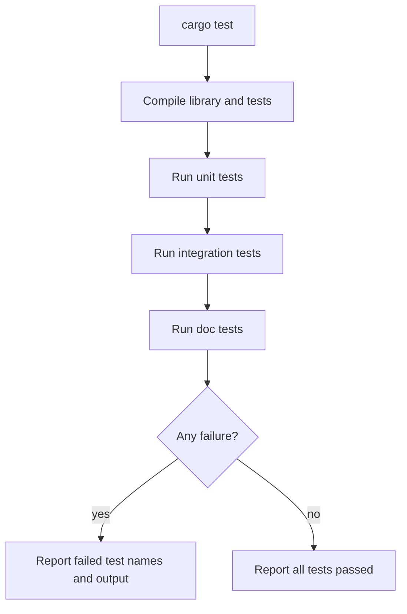

# Automated Tests

Rust's type system prevents many bugs, but it does not prove that program logic matches the user's intent. Automated tests fill that gap. The book presents tests as ordinary Rust functions annotated with attributes and run by Cargo's test harness. Tests can check success values, expected panics, error returns, private helper functions, and public crate behavior from integration tests.

This page follows [error handling](/cs/programming/rust/error-handling) because tests often use panics, assertions, and `Result`. It also supports every later project page: once a Rust program grows past examples, `cargo test` becomes part of the normal edit loop alongside `cargo check`.

## Definitions

A test function is a function annotated with `#[test]`. Cargo discovers and runs these functions when `cargo test` is executed.

An assertion checks a condition and panics if the condition is false. The main assertion macros are `assert!`, `assert_eq!`, and `assert_ne!`. `assert_eq!` and `assert_ne!` print both compared values when they fail, which usually makes failures easier to diagnose.

`#[should_panic]` marks a test that passes only if the function panics. It can include `expected = "text"` to require that the panic message contain specific text.

Test functions can return `Result<(), E>`. This style allows use of the `?` operator inside tests. Returning `Ok(())` passes; returning `Err` fails.

Unit tests live near the code they test, often inside a `mod tests` block guarded by `#[cfg(test)]`. Because they are child modules, they can test private items from the parent module.

Integration tests live in the top-level `tests` directory of a Cargo package. Each file is compiled as a separate crate that depends on the library crate, so integration tests exercise the public API.

Doc tests are examples in documentation comments that Cargo can compile and run. They keep documentation examples honest.

## Key results

The first key result is that `cargo test` compiles code in test mode, runs unit tests, then integration tests, and can also run doc tests. This is more than a command runner; it is a separate test build configuration.

The second key result is that tests pass or fail through panic. Assertion macros panic on failure. A test that finishes without panic passes unless it returns an `Err`.

The third key result is that test organization encodes intent. Unit tests are good for internal edge cases and private helpers. Integration tests are good for public behavior and crate-level workflows.

The fourth key result is that test filtering and output controls keep large suites manageable. `cargo test name_fragment` runs tests whose names contain the fragment. `cargo test -- --show-output` shows printed output from passing tests. The first `--` separates Cargo options from test-harness options.

Proof sketch for a unit test: a `#[cfg(test)]` module is compiled only when testing. Inside that module, `use super::*;` imports the parent module's items. A `#[test]` function calls the item and uses assertions. If an assertion fails, the panic is captured by the test harness and reported as a failed test.

## Visual



| Test kind | Location | Can access private items? | Best for |
|---|---|---:|---|
| Unit test | Same file in `mod tests` | yes | Small internal behavior |
| Integration test | `tests/*.rs` | no | Public API behavior |
| Doc test | Documentation comment | public examples | Keeping docs executable |
| Panic test | Any test function | depends on location | Validating invariants |
| Result test | Any test returning `Result` | depends on location | Using `?` in setup |

## Worked example 1: testing rectangle containment

Problem: test that a larger rectangle can contain a smaller rectangle and cannot contain a larger rectangle.

1. Define the behavior:

```rust
impl Rectangle {
    fn can_hold(&self, other: &Rectangle) -> bool {
        self.width > other.width && self.height > other.height
    }
}
```

2. Write the success test:

```rust
#[test]
fn larger_can_hold_smaller() {
    let larger = Rectangle { width: 8, height: 7 };
    let smaller = Rectangle { width: 5, height: 1 };

    assert!(larger.can_hold(&smaller));
}
```

3. Check the condition. `8 > 5` is true and `7 > 1` is true, so `can_hold` returns true. `assert!(true)` does not panic. The test passes.

4. Write the negative test:

```rust
#[test]
fn smaller_cannot_hold_larger() {
    let larger = Rectangle { width: 8, height: 7 };
    let smaller = Rectangle { width: 5, height: 1 };

    assert!(!smaller.can_hold(&larger));
}
```

5. Check the condition. `5 > 8` is false, so `smaller.can_hold(&larger)` is false. The `!` makes it true. The assertion passes.

The checked answer is two tests that verify both directions of the predicate.

## Worked example 2: testing an error-returning parser

Problem: parse a positive integer and write a test that can use `?`.

1. Define the parser:

```rust
fn parse_positive(input: &str) -> Result<u32, String> {
    let n: u32 = input.parse().map_err(|_| String::from("not a number"))?;
    if n == 0 {
        Err(String::from("must be positive"))
    } else {
        Ok(n)
    }
}
```

2. Write a `Result`-returning test:

```rust
#[test]
fn parses_positive_number() -> Result<(), String> {
    let n = parse_positive("42")?;
    assert_eq!(n, 42);
    Ok(())
}
```

3. Trace success. `parse_positive("42")` returns `Ok(42)`. The `?` unwraps `42`. `assert_eq!(42, 42)` passes. The test returns `Ok(())`.

4. Write a failure test:

```rust
#[test]
fn rejects_zero() {
    assert_eq!(
        parse_positive("0"),
        Err(String::from("must be positive"))
    );
}
```

5. Check the answer. The success case passes without `unwrap`, and the failure case verifies the exact error value.

## Code

```rust
pub fn add_two(n: i32) -> i32 {
    n + 2
}

pub fn divide(a: i32, b: i32) -> Result<i32, String> {
    if b == 0 {
        Err(String::from("division by zero"))
    } else {
        Ok(a / b)
    }
}

#[cfg(test)]
mod tests {
    use super::*;

    #[test]
    fn adds_two() {
        assert_eq!(add_two(2), 4);
    }

    #[test]
    fn divides_evenly() -> Result<(), String> {
        let value = divide(12, 3)?;
        assert_eq!(value, 4);
        Ok(())
    }

    #[test]
    fn reports_division_by_zero() {
        assert_eq!(divide(12, 0), Err(String::from("division by zero")));
    }
}
```

Run these with `cargo test`. The test module is compiled only in test builds because of `#[cfg(test)]`.

## Common pitfalls

- Testing only the happy path and leaving boundary behavior unchecked.
- Using `assert!(a == b)` instead of `assert_eq!(a, b)`, losing helpful failure output.
- Marking a test with `#[should_panic]` but not checking the expected message when different panics are possible.
- Putting integration tests in `tests` for private helpers. Integration tests should exercise public API.
- Forgetting that printed output from passing tests is captured unless test-harness options request it.
- Relying on test execution order. Tests should be independent.
- Using `unwrap` in test setup when returning `Result` and `?` would give clearer failure flow.

## Connections

- [Error handling](/cs/programming/rust/error-handling)
- [Structs, methods, and enums](/cs/programming/rust/structs-methods-enums)
- [Cargo and crates.io workflow](/cs/programming/rust/cargo-crates-io-workflow)
- [Closures and iterators](/cs/programming/rust/closures-and-iterators)
- [Multithreaded web server](/cs/programming/rust/multithreaded-web-server)
