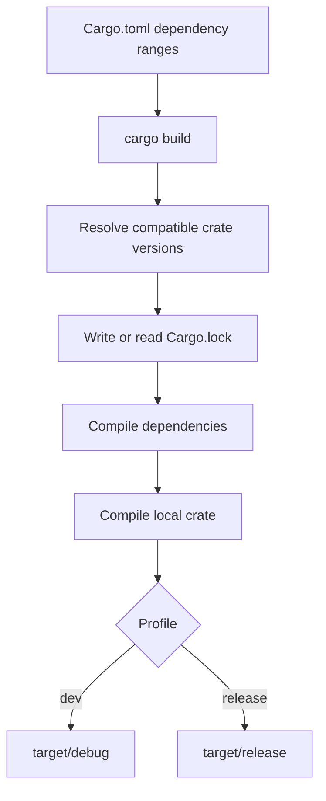

# Cargo and Crates.io Workflow

Cargo begins as a build command, but the Rust book later returns to it as an ecosystem tool. Cargo manages profiles, documentation, publishing, workspaces, dependency versions, and crates.io packaging. This matters because Rust development is rarely only about compiling one crate. Real projects depend on public crates, share code across packages, publish libraries, and control build settings for development and release.

This page extends [getting started](/cs/programming/rust/getting-started-toolchain-cargo) and the [minigrep project](/cs/programming/rust/io-project-minigrep). It focuses on what changes when code moves from local learning project to reusable crate or multi-crate workspace.

## Definitions

Crates.io is the public Rust package registry. Cargo can download dependencies from it and can publish packages to it when a package is prepared with metadata, versioning, and credentials.

Semantic Versioning, often SemVer, uses versions such as `1.2.3` to communicate compatibility. In Cargo, a dependency requirement such as `rand = "0.8.5"` is shorthand for compatible versions at least `0.8.5` and below `0.9.0`.

`Cargo.lock` records exact dependency versions selected during resolution. Binary applications typically commit it. Libraries often omit it because downstream applications will resolve their own full dependency graph, though workspace policies can vary.

A build profile controls compiler settings. The default `dev` profile favors fast compilation and debug info. The `release` profile favors optimized runtime performance.

Documentation comments start with triple slashes `///` and support Markdown. `cargo doc --open` builds documentation for the current crate and its dependencies.

A workspace is a set of related packages that share a `Cargo.lock` and output directory. Workspaces are useful for large projects split into multiple crates.

`pub use` can re-export items, making a crate's public API easier to navigate. Re-exporting is part of API design, not merely a local import shortcut.

## Key results

The first key result is that Cargo's version resolution balances compatibility and reproducibility. `Cargo.toml` states acceptable version ranges, while `Cargo.lock` records exact selected versions.

The second key result is that profiles let one project have different compile settings for different goals. Debug builds are not failed release builds; they are optimized for the edit-compile-test loop.

The third key result is that public crates need documentation and stable API boundaries. Publishing exposes names, modules, features, and behavior to users. Once users rely on them, changes should respect semantic versioning.

The fourth key result is that workspaces help avoid duplication. Multiple packages in one repository can share build artifacts and dependency resolution while keeping separate crate boundaries.

Proof sketch for dependency locking: `Cargo.toml` may allow several compatible versions. On first resolution, Cargo chooses exact versions and writes them to `Cargo.lock`. Future builds use the lock file rather than resolving again. Therefore the same source checkout builds with the same dependency versions until `cargo update` or a manifest change asks for new resolution.

Another key result is that crate publication turns local names into a contract. Documentation comments, examples, feature flags, module paths, and re-exports all become part of how users learn the crate. Cargo can package and upload the source, but it cannot decide whether the API is understandable. The book therefore pairs publishing with documentation: examples should compile, public items should explain their purpose, and the crate root should guide readers toward the important modules.

Profiles are also a contract with yourself. The `dev` profile's faster builds encourage frequent checking. The `release` profile's optimization makes performance measurements meaningful. If a program appears slow in debug mode, the first question should be whether it has been tested under the release profile. This is not special pleading for Rust; it follows directly from using different compiler settings for different goals.

Workspaces add a final ecosystem habit: keep crate boundaries meaningful. A workspace is helpful when packages can be built and versioned together while still having separate responsibilities. It is not a substitute for modules. If two pieces of code are always released together and do not need separate dependency graphs, a module split inside one crate may be simpler. If a core library, CLI, and test helper have different users or dependency needs, separate packages inside one workspace can keep those boundaries clean.

Cargo features are another part of ecosystem design even when a small crate does not need many of them. A feature flag lets a crate compile optional code or optional dependencies. That can keep default builds lightweight, but it also increases the number of configurations that need testing. The same principle applies as with public modules: once users depend on a feature name and behavior, changing it becomes an API decision. Cargo makes features easy to declare, but the author still has to decide which combinations are meaningful and supported.

A clean Cargo workflow therefore has two tracks: local confidence through `check`, `test`, and documentation builds, and release confidence through version review, changelog discipline, and package metadata.

Those tracks meet at the manifest: it is both a local build recipe and the public description other tools read.

Treat manifest changes as code changes.

## Visual



| Workflow | Command | What it checks or produces |
|---|---|---|
| Build debug | `cargo build` | Fast local executable or library artifact |
| Build optimized | `cargo build --release` | Optimized artifact |
| Check quickly | `cargo check` | Type and borrow checking without final binary |
| Run tests | `cargo test` | Test build and harness execution |
| Build docs | `cargo doc --open` | Local HTML docs |
| Update locked deps | `cargo update` | New compatible versions in `Cargo.lock` |
| Publish crate | `cargo publish` | Upload package to crates.io |

## Worked example 1: dependency version resolution

Problem: understand what happens when a package declares `rand = "0.8.5"`.

1. The manifest contains:

```toml
[dependencies]
rand = "0.8.5"
```

2. Cargo interprets this as a compatible version requirement. For a pre-`1.0` crate, compatibility is limited to the same leftmost nonzero component, so Cargo accepts versions from `0.8.5` up to but not including `0.9.0`.

3. On first build, Cargo updates the registry index, selects a specific compatible version, and also resolves transitive dependencies needed by `rand`.

4. Cargo writes exact selected versions into `Cargo.lock`.

5. Suppose `rand 0.8.6` is released later. A normal build still uses the locked version. Running `cargo update -p rand` can update the lock file to a newer compatible version.

6. Check the answer. `Cargo.toml` expresses the dependency policy; `Cargo.lock` expresses the exact build. To use `rand 0.9`, the manifest requirement must change because `0.9.0` is outside the allowed range.

## Worked example 2: designing a tiny workspace

Problem: split a command-line project into a reusable library and a binary frontend.

1. Create a workspace root manifest:

```toml
[workspace]
members = [
    "search-core",
    "search-cli",
]
```

2. Put pure search logic in `search-core`, a library crate:

```text
search-core/src/lib.rs
```

3. Put argument parsing and printing in `search-cli`, a binary crate:

```text
search-cli/src/main.rs
```

4. Make the CLI depend on the library using a path dependency:

```toml
[dependencies]
search-core = { path = "../search-core" }
```

5. Check the result. Running `cargo test` at the workspace root can test both packages. Both packages share one lock file and one `target` directory. The library remains reusable without the CLI process boundary.

This mirrors a common Rust design: keep the core crate testable and platform-neutral, and put executable concerns at the edge.

## Code

```rust
//! A tiny arithmetic helper crate.
//!
//! # Examples
//!
//! ```
//! let value = cargo_demo::add_one(2);
//! assert_eq!(value, 3);
//! ```

/// Adds one to the input value.
///
/// This function is intentionally small so documentation tests can
/// demonstrate the crate's public API.
pub fn add_one(value: i32) -> i32 {
    value + 1
}

#[cfg(test)]
mod tests {
    use super::*;

    #[test]
    fn adds_one() {
        assert_eq!(add_one(41), 42);
    }
}
```

In a library crate, documentation comments become part of the generated API docs. The example in the doc comment can be run as a doc test by Cargo.

## Common pitfalls

- Publishing names or modules accidentally and then treating later breaking changes as harmless.
- Forgetting required package metadata before publishing, such as license or description.
- Assuming `Cargo.lock` and `Cargo.toml` serve the same purpose.
- Benchmarking with the development profile.
- Using very broad dependency requirements without understanding SemVer compatibility.
- Creating a workspace when simple modules inside one crate would be enough.
- Re-exporting too much from internal modules, making private organization part of the public API.

## Connections

- [Getting started, toolchain, and Cargo](/cs/programming/rust/getting-started-toolchain-cargo)
- [I/O project with minigrep](/cs/programming/rust/io-project-minigrep)
- [Packages, crates, and modules](/cs/programming/rust/packages-crates-modules)
- [Automated tests](/cs/programming/rust/automated-tests)
- [Macros and unsafe Rust](/cs/programming/rust/macros-and-unsafe-rust)
