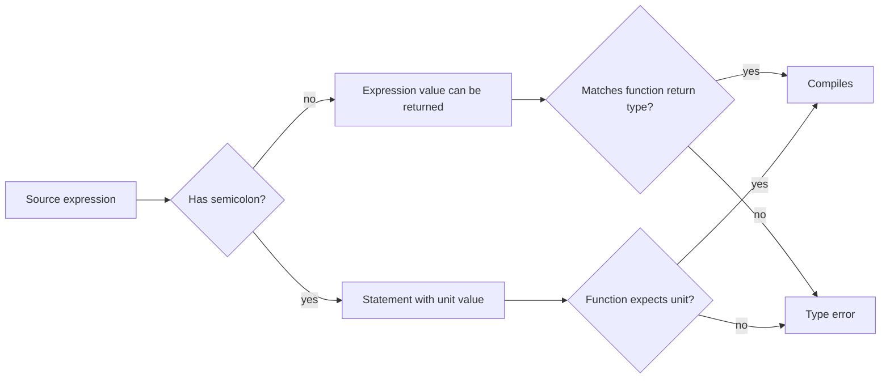

# Common Programming Concepts

Rust has familiar programming building blocks: variables, types, functions, branches, and loops. The difference is that Rust gives those ideas stricter compile-time meaning. Variables are immutable by default. Integer and floating-point types have explicit sizes. Functions and branches are expressions when they produce values. Loops can return values. These choices make code less ambiguous and give the compiler more information to check.

This page corresponds to the book's chapter on common programming concepts. It prepares the ground for [ownership](/cs/programming/rust/ownership-references-slices), where mutability and scope become memory-safety rules, and for [pattern matching](/cs/programming/rust/pattern-matching), where control flow becomes more expressive than a chain of `if` statements.

## Definitions

A binding connects a name to a value. In Rust, `let x = 5;` creates an immutable binding. Reassignment is rejected unless the binding is declared mutable with `let mut x = 5;`.

Shadowing creates a new binding with the same name:

```rust
let spaces = "   ";
let spaces = spaces.len();
```

The second `spaces` is a new value and may have a different type. This differs from mutation, which changes the value behind one binding but keeps the same type.

Scalar types represent a single value. The main scalar families are integers, floating-point numbers, booleans, and characters. Integer examples include `i32`, `u32`, `i64`, and `usize`. Floating-point examples are `f32` and `f64`. A `char` is a Unicode scalar value written in single quotes.

Compound types group multiple values. Tuples have fixed length and can contain mixed types, such as `(i32, f64, bool)`. Arrays have fixed length and contain values of the same type, such as `[i32; 5]`.

A statement performs an action and does not return a value. An expression evaluates to a value. Function bodies are made of statements and can end with an expression without a semicolon to return that expression.

Rust has three loop forms: `loop`, `while`, and `for`. `loop` repeats until `break`; `while` repeats while a condition is true; `for` iterates over a collection or iterator.

## Key results

The first key result is that immutability is the default. This is not a restriction for its own sake. If a value is not supposed to change, the compiler can enforce that intention. When change is needed, `mut` marks the location where readers should expect it.

The second key result is that type inference is local but not magical. Rust can infer many types from assignments and later uses, but it will ask for an annotation when several target types are possible. A common example is string parsing:

```rust
let n: u32 = "42".parse().expect("number");
```

Without the `u32` annotation or another use that determines the target type, `parse` has too many possible output types.

The third key result is that `if` is an expression. Both branches must produce compatible types when the result is assigned:

```rust
let label = if score >= 60 { "pass" } else { "retry" };
```

The fourth key result is that `for` is the usual safe loop for collections. Indexing with a manual `while` loop can panic if the index logic is wrong. Iterating directly over items avoids that boundary mistake and is often clearer.

Proof sketch for expression returns: a Rust function with return type `i32` can end with `x + 1` because the expression's value is used as the function result. If the line becomes `x + 1;`, the semicolon turns it into a statement whose value is `()`, the unit type. The compiler rejects the mismatch because `()` is not `i32`.

## Visual

| Concept | Rust form | What the compiler enforces | Small example |
|---|---|---|---|
| Immutable binding | `let x = 5;` | No reassignment | `x = 6` is rejected |
| Mutable binding | `let mut x = 5;` | Same type after mutation | `x = 6` is allowed |
| Shadowing | `let x = x + 1;` | New binding may change type | `let x = "5"; let x = 5;` |
| Tuple | `(a, b, c)` | Fixed length, mixed types | `(500, 6.4, true)` |
| Array | `[a, b, c]` | Fixed length, one element type | `[1, 2, 3]` |
| Function return | final expression | Return type compatibility | `x + 1` no semicolon |
| `for` loop | `for item in items` | Iterator protocol | no manual index needed |



## Worked example 1: shadowing input into a number

Problem: convert a text value with extra whitespace into a number, and show why shadowing is appropriate.

1. Start with a string slice:

```rust
let count = "  15  ";
```

The type is `&str`, a borrowed view of string data. It contains spaces.

2. Trim the whitespace:

```rust
let count = count.trim();
```

This creates a new binding named `count`. The old binding is shadowed. The value is now the string slice `"15"`.

3. Parse as a number:

```rust
let count: u32 = count.parse().expect("count should be numeric");
```

The annotation tells `parse` which numeric type to produce. The new binding is a `u32`.

4. Use it numerically:

```rust
let doubled = count * 2;
```

5. Check the answer. Since `count` is `15`, `doubled` is `30`.

This would not work as mutation:

```rust
let mut count = "  15  ";
count = 15;
```

The second assignment is rejected because a mutable binding can change value but not type. Shadowing is the correct tool when a name represents successive refinements of a value.

## Worked example 2: returning a value from a loop

Problem: find the first square number greater than `50` using a `loop` expression.

1. Set the starting counter:

```rust
let mut n = 1;
```

2. Use `loop` as an expression:

```rust
let answer = loop {
    let square = n * n;
    if square > 50 {
        break square;
    }
    n += 1;
};
```

3. Trace the iterations:

| `n` | `n * n` | Greater than `50`? | Action |
|---:|---:|---|---|
| 1 | 1 | no | increment |
| 2 | 4 | no | increment |
| 3 | 9 | no | increment |
| 4 | 16 | no | increment |
| 5 | 25 | no | increment |
| 6 | 36 | no | increment |
| 7 | 49 | no | increment |
| 8 | 64 | yes | `break 64` |

4. Check the answer. The variable `answer` is `64`. The `break square` statement supplies the value of the entire `loop` expression.

This example matters because it shows Rust's expression-oriented design. A loop can compute a value directly instead of mutating a placeholder outside the loop and reading it later.

## Code

```rust
fn classify_temperature(celsius: f64) -> &'static str {
    if celsius <= 0.0 {
        "freezing"
    } else if celsius < 20.0 {
        "cold"
    } else if celsius < 30.0 {
        "mild"
    } else {
        "hot"
    }
}

fn fahrenheit_to_celsius(fahrenheit: f64) -> f64 {
    (fahrenheit - 32.0) * 5.0 / 9.0
}

fn main() {
    let readings = [32.0, 68.0, 86.0, 104.0];

    for fahrenheit in readings {
        let celsius = fahrenheit_to_celsius(fahrenheit);
        println!(
            "{fahrenheit:>5.1} F = {celsius:>5.1} C ({})",
            classify_temperature(celsius)
        );
    }
}
```

The snippet uses functions, arrays, `for`, floating-point arithmetic, `if` expressions, and formatted output. It is intentionally small but covers most of the chapter's basic mechanics.

## Common pitfalls

- Adding `mut` automatically. Prefer immutable bindings until the code actually needs reassignment.
- Confusing shadowing with mutation. Shadowing creates a new binding and can change type; mutation keeps the same binding and type.
- Putting a semicolon after the final expression of a function that is supposed to return a value.
- Expecting arrays to grow. Arrays have fixed length; use `Vec<T>` for growable sequences.
- Indexing arrays in a manual loop when direct `for element in array` iteration would avoid bounds mistakes.
- Assuming integer overflow behavior should be ignored. In debug builds, overflow checks can panic; in release, overflow wraps unless checked methods are used.
- Forgetting that `if` branches assigned to a variable must have compatible types.

## Connections

- [Guessing game first project](/cs/programming/rust/guessing-game-first-project)
- [Ownership, references, and slices](/cs/programming/rust/ownership-references-slices)
- [Structs, methods, and enums](/cs/programming/rust/structs-methods-enums)
- [Common collections](/cs/programming/rust/common-collections)
- [Pattern matching](/cs/programming/rust/pattern-matching)
