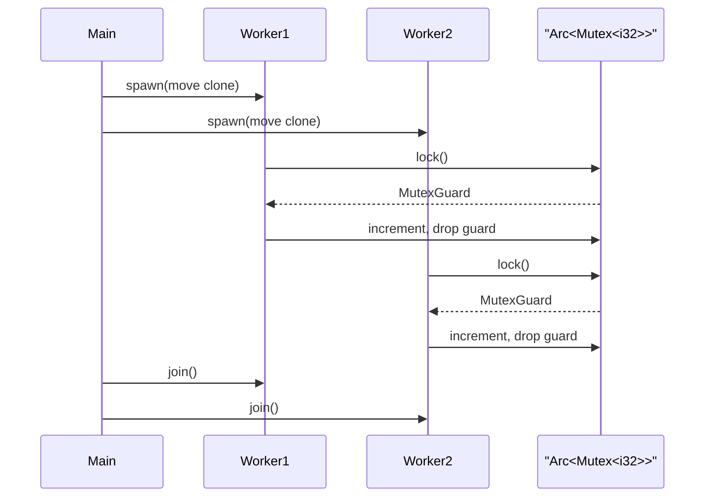

# Concurrency and Shared State

Rust's concurrency chapter shows how ownership and types prevent many classic threaded-programming mistakes. The language does not remove the hard parts of concurrency, but it makes data sharing explicit. Threads can take ownership of captured values. Channels transfer messages between threads. Mutexes protect shared state. Marker traits such as `Send` and `Sync` determine which types may safely cross or be shared across thread boundaries.


*Figure: Rust connects systems control with compile-time memory-safety guarantees. Image: [Wikimedia Commons](https://commons.wikimedia.org/wiki/File:Rust_programming_language_black_logo.svg), Rust Foundation, CC BY 4.0.*

This page builds directly on [ownership](/cs/programming/rust/ownership-references-slices), [closures](/cs/programming/rust/closures-and-iterators), and [smart pointers](/cs/programming/rust/smart-pointers). The final [multithreaded web server](/cs/programming/rust/multithreaded-web-server) project uses these ideas to build a small thread pool.

## Definitions

A thread is an independent path of execution within a process. Rust creates a new thread with `std::thread::spawn`, passing a closure to run on that thread.

A `JoinHandle` represents a spawned thread. Calling `join` waits for the thread to finish and returns a `Result`.

The `move` keyword on a thread closure transfers ownership of captured values into the new thread. This is often required because the spawned thread may outlive the current function.

A channel is a message-passing mechanism. `std::sync::mpsc::channel()` returns a transmitter and receiver. Values sent through the transmitter are moved into the channel and then received by the receiver.

A mutex protects shared data by allowing only one thread at a time to access it. `Mutex<T>` wraps a value and returns a guard from `lock`. The guard dereferences to the inner value and releases the lock when dropped.

`Arc<T>` is an atomically reference-counted pointer. It is the thread-safe counterpart to `Rc<T>` for shared ownership across threads.

`Send` means ownership of a value can be transferred to another thread. `Sync` means references to a value can be shared between threads. These traits are implemented automatically for many types when their contents are safe.

## Key results

The first key result is that a spawned thread cannot borrow local data unless Rust can prove the data outlives the thread. In practice, `move` closures are common because ownership transfer is clear and safe.

The second key result is that message passing moves ownership. Once a `String` is sent through a channel, the sender should not keep using it unless it cloned the data first.

The third key result is that shared-state concurrency needs both shared ownership and mutual exclusion. `Mutex<T>` alone does not let multiple threads own the same mutex. `Arc<Mutex<T>>` is the common combination.

The fourth key result is that poisoning is part of mutex error handling. If a thread panics while holding a lock, later `lock` calls return an error to signal that the protected data may be inconsistent.

Proof sketch for `Arc<Mutex<T>>`: each thread needs ownership of a pointer to the same mutex, so `Arc` provides thread-safe reference counting. Each thread needs mutable access to the inner value, so `Mutex` serializes that access. The type `Arc<Mutex<T>>` says both facts explicitly.

The concurrency chapter's larger result is that Rust makes sharing decisions visible in types. A channel-based design says values move from sender to receiver, so ownership travels with the message. A shared-state design says many threads can reach the same value, so the code must show both shared ownership and synchronization. This does not make every concurrent algorithm easy, but it removes many implicit assumptions. When a type does not implement `Send`, Rust will not let it move to another thread. When a type does not implement `Sync`, Rust will not let references to it be shared freely. Those refusals are not arbitrary; they are the same memory-safety story at thread scale.

A second practical result is that lock scope should be designed intentionally. A `MutexGuard` releases the lock when dropped, so braces or helper functions can shorten the critical section. Holding a lock while doing slow work, printing, sleeping, or waiting on another lock can reduce concurrency or create deadlock risks. Rust guarantees the guard is released, but it does not decide how much work belongs inside the protected region. That remains a program-design responsibility.

Message passing has a similar design question. A channel can carry owned data, commands, or closures representing work. Sending smaller messages can keep ownership clear, while sending large cloned data can waste memory. The type of the channel documents the protocol between threads. If the receiver handles `Job` values, the program is building a worker queue. If it handles domain events, the program is building a message-driven design. Rust checks transfer safety, but the message vocabulary is still a design choice.

The best concurrency examples therefore name the protocol as carefully as they name the data structure.

The compiler can guarantee transfer and sharing safety, but it cannot guarantee that a concurrent design is fair, fast, or free of higher-level deadlocks. Those properties still require review, tests, and measurement.

Rust removes many memory hazards; it does not remove the need to reason about scheduling and workload.

Measure the design under realistic contention before trusting its performance.

Correctness comes first; throughput comes next.

Always.

## Visual



| Pattern | Main types | Ownership shape | Best for |
|---|---|---|---|
| Spawn and join | `thread::spawn`, `JoinHandle` | closure owns captured data | Parallel work units |
| Message passing | `mpsc::Sender`, `Receiver` | send moves values | Producer-consumer pipelines |
| Shared state | `Arc<Mutex<T>>` | many owners, one mutable access at a time | Shared counters, shared queues |
| Read-only sharing | `Arc<T>` | many owners, no mutation | Configuration, lookup data |
| Trait safety | `Send`, `Sync` | compiler-enforced thread transfer/sharing | Type-level concurrency checks |

## Worked example 1: sending strings through a channel

Problem: spawn a worker thread that sends two messages to the main thread.

1. Create the channel:

```rust
let (tx, rx) = mpsc::channel();
```

2. Move the transmitter into a thread:

```rust
thread::spawn(move || {
    tx.send(String::from("hello")).unwrap();
    tx.send(String::from("done")).unwrap();
});
```

The `move` keyword is important because the spawned thread owns `tx`.

3. Receive messages:

```rust
for received in rx {
    println!("{received}");
}
```

The loop ends when all transmitters are dropped.

4. Trace ownership. Each `String` is moved into `send`. The receiving side becomes the owner of each message. The worker cannot use a sent string afterward unless it cloned it before sending.

5. Check the answer. Main prints `hello` and `done`, then exits the loop after the sender is dropped.

This pattern avoids shared mutable state entirely. Threads communicate by transferring values.

## Worked example 2: counting with `Arc<Mutex<i32>>`

Problem: spawn ten threads, each incrementing one shared counter.

1. Create the counter:

```rust
let counter = Arc::new(Mutex::new(0));
```

2. For each thread, clone the `Arc`:

```rust
let counter = Arc::clone(&counter);
```

This increments the atomic reference count. It does not clone the integer.

3. Lock and mutate:

```rust
let mut num = counter.lock().unwrap();
*num += 1;
```

The guard `num` ensures exclusive access until it is dropped.

4. Join all threads. Without joining, main might print before workers finish.

5. Check the answer. After ten successful increments, the protected value is `10`.

If this used `Rc<Mutex<i32>>`, the compiler would reject sending it to threads because `Rc<T>` is not `Send`. That rejection is the type system preventing unsynchronized reference-count updates.

## Code

```rust
use std::sync::{Arc, Mutex};
use std::thread;

fn main() {
    let counter = Arc::new(Mutex::new(0));
    let mut handles = Vec::new();

    for _ in 0..10 {
        let counter = Arc::clone(&counter);
        let handle = thread::spawn(move || {
            let mut value = counter.lock().expect("mutex poisoned");
            *value += 1;
        });
        handles.push(handle);
    }

    for handle in handles {
        handle.join().expect("thread panicked");
    }

    println!("result: {}", *counter.lock().expect("mutex poisoned"));
}
```

The code uses a vector of join handles so main waits for every worker. The final lock reads the completed counter.

## Common pitfalls

- Spawning a thread that borrows local data without proving the borrow outlives the thread.
- Forgetting `move` on thread closures that need ownership.
- Using `Rc<T>` across threads instead of `Arc<T>`.
- Assuming `Mutex<T>` alone gives shared ownership. It must be owned by something shareable, often `Arc<T>`.
- Holding a mutex guard longer than necessary, reducing concurrency or risking deadlock.
- Ignoring `join`, which can hide panics or let main exit early.
- Treating `Send` and `Sync` as traits to manually implement casually. Unsafe manual implementations require deep invariants.

## Connections

- [Ownership, references, and slices](/cs/programming/rust/ownership-references-slices)
- [Closures and iterators](/cs/programming/rust/closures-and-iterators)
- [Smart pointers](/cs/programming/rust/smart-pointers)
- [Macros and unsafe Rust](/cs/programming/rust/macros-and-unsafe-rust)
- [Multithreaded web server](/cs/programming/rust/multithreaded-web-server)
