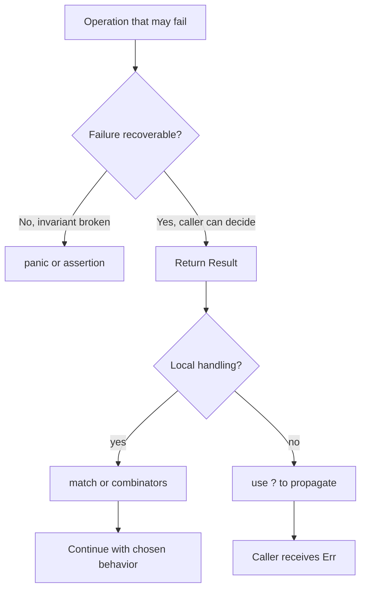

# Error Handling

Rust separates errors into two broad categories: unrecoverable errors, handled with `panic!`, and recoverable errors, represented by `Result<T, E>`. This distinction is central to Rust's reliability story. If a bug violates a program invariant, panicking may be appropriate. If failure is expected as part of the environment, such as a missing file or invalid input, the type system should make callers handle it.

This page builds on [pattern matching](/cs/programming/rust/pattern-matching) because `Result` is an enum, and on [collections](/cs/programming/rust/common-collections) because indexing can panic while safe access returns `Option`. It also prepares for project pages such as [closures and iterators](/cs/programming/rust/closures-and-iterators), where command-line programs often return `Result` from `main`.

## Definitions

`panic!` is a macro that stops normal execution. When a panic occurs, Rust either unwinds the stack and runs cleanup code or aborts immediately, depending on the panic strategy. Panics are for unrecoverable states: violated assumptions, impossible branches, or programmer errors.

`Result<T, E>` is an enum with two variants:

```rust
enum Result<T, E> {
    Ok(T),
    Err(E),
}
```

`Ok(T)` contains a success value. `Err(E)` contains an error value. Because `Result` is part of the prelude, it is available without import.

`unwrap` extracts the success value or panics on error. `expect` does the same but lets the programmer supply a panic message. They are useful in examples, tests, prototypes, and situations where failure truly violates an invariant, but they are not a substitute for designed error handling.

The `?` operator propagates errors. When applied to a `Result`, it returns the success value if the result is `Ok`, or returns early from the current function with the error if the result is `Err`.

`Box<dyn std::error::Error>` is a trait-object error type often used in small applications when several different error types may be returned and the program does not need a custom error enum.

## Key results

The first key result is that recoverable failure belongs in function signatures. A function that reads a file should usually return `Result<String, io::Error>`, not panic when the file is absent.

The second key result is that `?` keeps error-handling code linear. It is equivalent to matching on the result and returning early on `Err`, but it avoids repetitive boilerplate.

The third key result is that `panic!` is still useful. Examples include indexing past the end of a vector, failing an assertion in a test, or detecting a broken internal invariant. The important distinction is whether the caller can reasonably recover.

The fourth key result is that error conversion can happen during propagation. The `?` operator uses the `From` trait to convert error types when the function's return error type supports it.

Proof sketch for `?`: suppose a function returns `Result<String, io::Error>`. Inside it, `File::open(path)?` is valid because `File::open` returns `Result<File, io::Error>`. If opening succeeds, the expression yields the `File`. If opening fails, the whole function immediately returns `Err(error)`. Therefore later code only runs in the success case.

The book also distinguishes examples from production-facing decisions. In a teaching example, `expect("Failed to read line")` is acceptable because it keeps attention on the concept being introduced. In a library, the same choice would be too forceful because it ends the caller's program. A useful rule is to ask who has enough context to decide what should happen. If the current function can repair the problem, handle it locally. If the caller knows the policy, return `Result`. If the state proves a bug in the program itself, panic may be the clearest signal. This question keeps error handling from becoming mechanical.

Another practical result is that error messages are part of the interface for command-line tools. `eprintln!` sends diagnostics to standard error, allowing standard output to remain machine-readable or pipe-friendly. This small distinction becomes important in the `minigrep` project, where successful search results and failure messages should not be mixed.

The `Result` type also composes with other language features. It can be matched directly, converted with methods such as `map_err`, returned from tests, and used as the return type of `main`. This makes error handling a normal part of expression-oriented Rust rather than a separate exception mechanism. The code path that succeeds and the code path that fails are both visible in types.

Choosing an error type is therefore a design step. Small binaries can often return `Box<dyn Error>` from top-level functions to keep examples compact. Libraries usually benefit from a specific error enum or structured error type so callers can react to different failures without string matching.

When reading Rust code, follow the `Result` outward. The place where an error is created, enriched, propagated, logged, or converted often reveals which layer owns the recovery policy.

That layer is where the user-facing decision belongs.

Lower layers should preserve enough context for that decision.

Do not discard causes too early.

Keep context intact.

## Visual



| Tool | On success | On failure | Best use |
|---|---|---|---|
| `match` | explicit branch | explicit branch | Full custom handling |
| `unwrap` | extract value | panic | quick examples or impossible errors |
| `expect` | extract value | panic with message | tests and invariant checks |
| `?` | extract value | return early | propagate recoverable errors |
| `panic!` | not applicable | stop normal execution | unrecoverable bugs |

## Worked example 1: opening or creating a file

Problem: open `hello.txt`; if it does not exist, create it; if another error occurs, panic.

1. Call `File::open`:

```rust
let greeting_file_result = File::open("hello.txt");
```

The type is `Result<File, io::Error>`.

2. Match the result:

```rust
let greeting_file = match greeting_file_result {
    Ok(file) => file,
    Err(error) => match error.kind() {
        ErrorKind::NotFound => match File::create("hello.txt") {
            Ok(fc) => fc,
            Err(e) => panic!("Problem creating the file: {e:?}"),
        },
        other_error => panic!("Problem opening the file: {other_error:?}"),
    },
};
```

3. Trace the missing-file case. `File::open` returns `Err(error)`. The outer match enters the `Err` arm. `error.kind()` is `ErrorKind::NotFound`, so the program tries `File::create`.

4. If create succeeds, its `Ok(fc)` arm returns the new file handle.

5. Check the answer. The final `greeting_file` binding contains an open file whether the file already existed or was successfully created. Permission errors or other unexpected errors panic with diagnostic information.

This example is verbose, but it shows that `Result` handling is ordinary pattern matching.

## Worked example 2: simplifying file reading with `?`

Problem: write a function that reads a username from a file and propagates any I/O error to the caller.

1. Start with the signature:

```rust
fn read_username_from_file() -> Result<String, io::Error>
```

The caller must handle either a `String` or an `io::Error`.

2. Open the file with `?`:

```rust
let mut username_file = File::open("hello.txt")?;
```

If opening fails, the function returns `Err(error)` immediately.

3. Read into a string:

```rust
let mut username = String::new();
username_file.read_to_string(&mut username)?;
```

If reading fails, the function returns that error immediately.

4. Return success:

```rust
Ok(username)
```

5. Check the answer. The function has only one explicit success return, but two possible early error returns. This is exactly what the signature promises.

The standard library also provides `std::fs::read_to_string`, which packages this common pattern into one call. The hand-written version is useful for understanding `?`.

## Code

```rust
use std::fs::File;
use std::io::{self, Read};

fn read_username_from_file(path: &str) -> Result<String, io::Error> {
    let mut file = File::open(path)?;
    let mut username = String::new();
    file.read_to_string(&mut username)?;
    Ok(username.trim().to_string())
}

fn main() -> Result<(), Box<dyn std::error::Error>> {
    match read_username_from_file("hello.txt") {
        Ok(username) if !username.is_empty() => {
            println!("Hello, {username}!");
        }
        Ok(_) => {
            println!("The username file was empty.");
        }
        Err(error) => {
            eprintln!("Could not read username: {error}");
        }
    }

    Ok(())
}
```

The `main` function returns `Result`, which lets larger programs use `?` at top level if desired. This example chooses to handle the custom function's error locally so it can print a friendly message.

## Common pitfalls

- Using `panic!` for ordinary environmental failures such as missing user input or unavailable files.
- Calling `unwrap` in library code where callers should be allowed to recover.
- Writing `?` in a function that does not return `Result`, `Option`, or another compatible type.
- Losing context by converting all errors to strings too early.
- Ignoring a `Result` and assuming the operation succeeded. Rust warns about unused `Result` values.
- Treating panic as exception-style control flow. Rust's recoverable path is `Result`.
- Forgetting that vector indexing can panic; use `get` when absence is expected.

## Connections

- [Pattern matching](/cs/programming/rust/pattern-matching)
- [Common collections](/cs/programming/rust/common-collections)
- [Generics, traits, and lifetimes](/cs/programming/rust/generics-traits-lifetimes)
- [Automated tests](/cs/programming/rust/automated-tests)
- [Closures and iterators](/cs/programming/rust/closures-and-iterators)
