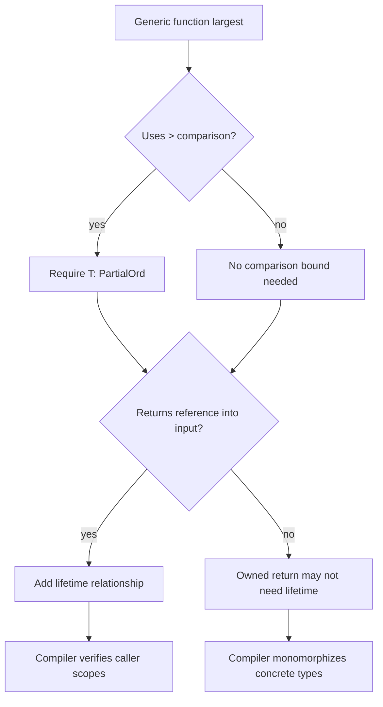

# Generics, Traits, and Lifetimes

Generics, traits, and lifetimes let Rust express reusable code without giving up static checking. Generics remove duplication across types. Traits describe shared behavior. Lifetimes describe how long references are valid relative to one another. Together they explain how Rust libraries can feel high-level while still compiling to concrete, efficient code.


*Figure: Rust connects systems control with compile-time memory-safety guarantees. Image: [Wikimedia Commons](https://commons.wikimedia.org/wiki/File:Rust_programming_language_black_logo.svg), Rust Foundation, CC BY 4.0.*

This page is one of the densest in the Rust book. It depends on [ownership and references](/cs/programming/rust/ownership-references-slices), because lifetimes are about borrowed data, and on [structs and enums](/cs/programming/rust/structs-methods-enums), because generic parameters often appear on custom types. It prepares for [smart pointers](/cs/programming/rust/smart-pointers), [closures and iterators](/cs/programming/rust/closures-and-iterators), and [advanced features](/cs/programming/rust/object-oriented-and-advanced-features).

## Definitions

A generic type parameter is a placeholder for a concrete type. It appears in angle brackets, such as `fn largest<T>(list: &[T]) -> &T`. The compiler generates concrete code for the used types through monomorphization, so generic abstraction does not require runtime type dispatch by default.

A trait defines behavior shared by types. A trait can require methods and can provide default method implementations:

```rust
trait Summary {
    fn summarize(&self) -> String;
}
```

Implementing a trait for a type makes that behavior available:

```rust
impl Summary for Article {
    fn summarize(&self) -> String {
        format!("{}, by {}", self.headline, self.author)
    }
}
```

A trait bound restricts a generic type to types that implement required behavior:

```rust
fn notify(item: &impl Summary) { }
fn notify_generic<T: Summary>(item: &T) { }
```

`where` clauses make complex bounds easier to read.

A lifetime is a name for the scope over which a reference is valid. Lifetime annotations do not change how long values live. They describe relationships that the borrow checker must verify.

The common lifetime annotation syntax is `'a`:

```rust
fn longest<'a>(x: &'a str, y: &'a str) -> &'a str
```

This says the returned string slice lives at least as long as the shorter of the lifetimes of `x` and `y`.

## Key results

The first key result is that generic code needs explicit capability requirements. A function cannot compare two `T` values unless its bounds say comparison is available, such as `T: PartialOrd`.

The second key result is that traits are Rust's main abstraction mechanism. They support generic bounds, default behavior, trait objects, and extension of existing types, while preserving compile-time checking.

The third key result is the orphan rule: you can implement a trait for a type only if either the trait or the type is local to your crate. This prevents dependency conflicts where two crates define competing implementations for the same external trait and external type.

The fourth key result is that lifetimes prevent dangling references. If a function returns a reference, Rust must know which input reference it is tied to or whether it is `'static`.

Proof sketch for `longest`: the returned reference is either `x` or `y`. If the caller stores the result longer than one of those inputs lives, there is a possible path where the result points to dropped data. The annotation `<'a>` tells Rust the result cannot outlive the shorter input lifetime, eliminating that possibility.

The lifetime elision rules explain why many reference-returning functions do not show lifetime syntax even though lifetimes still exist. The compiler can infer lifetimes in common patterns: each input reference gets its own lifetime parameter, a single input lifetime is assigned to output references, and methods with `&self` often tie output references to `self`. When these rules are insufficient, annotations become necessary. Therefore lifetime syntax is not a feature to add everywhere; it is a way to document relationships that inference cannot determine.

Traits also support API evolution through default methods. A trait can require one core method and provide another method in terms of it. Implementors write the essential behavior, while callers get a richer interface. This pattern appears throughout the standard library and is one reason trait design deserves care: default behavior becomes part of what implementors and users expect.

Generic structs and enums follow the same rules as generic functions. `Option<T>` and `Result<T, E>` are not special syntax; they are generic enums whose variants carry type parameters. Seeing them this way helps connect everyday error handling with the broader abstraction system. A program can define its own generic enum when the standard ones do not model the domain precisely enough.

The practical sequence is: write the concrete version first, notice real duplication, then introduce generics and trait bounds that exactly match the operations used. Prematurely generic code is often harder to read than two simple concrete functions.

For lifetimes, the parallel rule is to start with ordinary references and add explicit annotations only when the compiler needs a relationship stated.

## Visual



| Feature | Solves | Example | Checked by |
|---|---|---|---|
| Generic type | Duplicate code across types | `Vec<T>` | Type checker |
| Trait | Shared behavior | `Display`, `Iterator` | Trait solver |
| Trait bound | Required capability | `T: Clone` | Type checker |
| Lifetime | Validity of references | `&'a str` | Borrow checker |
| `where` clause | Readable complex bounds | `where T: Display + Clone` | Type checker |
| Monomorphization | Efficient generic code | separate code for `i32`, `String` | Compiler backend |

## Worked example 1: making `largest` generic

Problem: write one function that returns the largest item in a slice for any comparable type.

1. Start with a concrete integer version:

```rust
fn largest_i32(list: &[i32]) -> &i32 {
    let mut largest = &list[0];
    for item in list {
        if item > largest {
            largest = item;
        }
    }
    largest
}
```

2. Replace `i32` with `T`:

```rust
fn largest<T>(list: &[T]) -> &T {
```

3. The comparison `item > largest` now fails because Rust does not know that `T` supports ordering.

4. Add the bound:

```rust
fn largest<T: PartialOrd>(list: &[T]) -> &T {
```

5. Check with integers:

```rust
let numbers = vec![34, 50, 25, 100, 65];
let result = largest(&numbers);
```

The answer is a reference to `100`.

6. Check with characters:

```rust
let chars = vec!['y', 'm', 'a', 'q'];
let result = largest(&chars);
```

The answer is a reference to `'y'` because characters implement `PartialOrd`.

The function returns a reference, so it does not require `T: Clone` and does not move values out of the slice.

## Worked example 2: explaining the `longest` lifetime

Problem: return the longer of two string slices without allocating a new string.

1. Write the function:

```rust
fn longest<'a>(x: &'a str, y: &'a str) -> &'a str {
    if x.len() > y.len() {
        x
    } else {
        y
    }
}
```

2. Interpret the annotation. Both inputs and the output share the lifetime parameter `'a`. This does not mean `x` and `y` literally live for exactly the same scope. It means the output is valid only for the overlap that both inputs can support.

3. Valid use:

```rust
let s1 = String::from("abcd");
let s2 = "xyz";
let result = longest(s1.as_str(), s2);
```

Both inputs are valid when `result` is used, so the borrow checker accepts it.

4. Invalid shape:

```rust
let result;
{
    let s2 = String::from("xyz");
    result = longest("abcd", s2.as_str());
}
println!("{result}");
```

5. Check the answer. This is rejected. If `longest` returned `s2.as_str()`, then `result` would refer to `s2`, which is dropped at the end of the inner block. The annotation lets Rust reject the unsafe possibility.

## Code

```rust
use std::fmt::Display;

trait Summary {
    fn summarize(&self) -> String;
}

struct NewsArticle {
    headline: String,
    author: String,
}

impl Summary for NewsArticle {
    fn summarize(&self) -> String {
        format!("{}, by {}", self.headline, self.author)
    }
}

fn print_pair<T, U>(label: T, item: U)
where
    T: Display,
    U: Summary,
{
    println!("{label}: {}", item.summarize());
}

fn main() {
    let article = NewsArticle {
        headline: String::from("Rust reaches stable build"),
        author: String::from("The team"),
    };

    print_pair("headline", article);
}
```

The `where` clause keeps the signature readable once multiple generic parameters and bounds are involved.

## Common pitfalls

- Writing a generic function and then using operations not listed in its trait bounds.
- Returning references without expressing how their lifetimes relate to input references.
- Believing lifetime annotations extend the life of a value. They only describe and constrain validity.
- Adding lifetime annotations to owned values such as `String` when references are not involved.
- Fighting the orphan rule by trying to implement an external trait for an external type.
- Using trait objects when static generics would be simpler, or using generics when runtime heterogeneity is actually needed.
- Requiring `Clone` to avoid ownership issues when borrowing would express the function's true needs.

## Connections

- [Ownership, references, and slices](/cs/programming/rust/ownership-references-slices)
- [Structs, methods, and enums](/cs/programming/rust/structs-methods-enums)
- [Error handling](/cs/programming/rust/error-handling)
- [Closures and iterators](/cs/programming/rust/closures-and-iterators)
- [Smart pointers](/cs/programming/rust/smart-pointers)
- [Object-oriented and advanced features](/cs/programming/rust/object-oriented-and-advanced-features)
