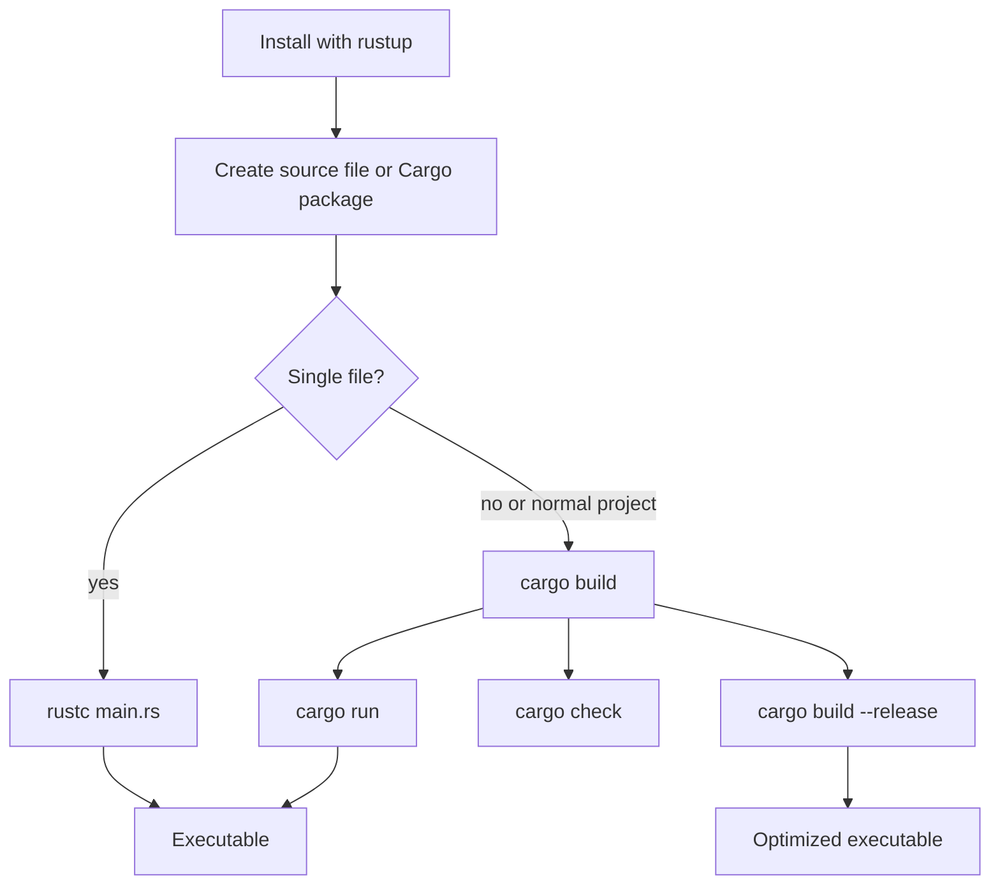

# Getting Started, Toolchain, and Cargo

Rust starts with an unusually strong toolchain story. The language is compiled, statically typed, and strict about memory safety, but the first workflow the book teaches is deliberately small: install Rust, compile `main.rs`, then let Cargo manage the project layout. That progression matters because Rust programs quickly depend on more than a single source file. The compiler `rustc` is still the foundation, but day-to-day Rust work usually happens through `cargo`.

This page sits before the language chapters. Its purpose is to connect the tools with the mental model: source code becomes a crate, Cargo builds the crate, and the compiler checks the program before any executable is produced. Later pages on [modules and crates](/cs/programming/rust/packages-crates-modules), [Cargo workflows](/cs/programming/rust/cargo-crates-io-workflow), and [testing](/cs/programming/rust/automated-tests) build on this same structure.

## Definitions

`rustup` is the recommended installer and version manager for Rust. It installs the compiler, standard library, Cargo, and local documentation. The book emphasizes the stable toolchain: examples are written so that newer stable Rust releases should continue to compile, even when warning text or diagnostics improve.

`rustc` is the Rust compiler. It can compile a single source file directly:

```powershell
rustc main.rs
.\main.exe
```

On Unix-like shells the executable is usually run as `./main`. Direct `rustc` compilation is useful for seeing the raw compile-and-run loop, but it does not manage dependencies, build profiles, package metadata, or multi-file projects.

Cargo is Rust's package manager and build system. It creates the standard project layout:

```text
hello_cargo/
  Cargo.toml
  src/
    main.rs
```

`Cargo.toml` is the manifest. It records the package name, version, Rust edition, and dependency list. `src/main.rs` is the default root for a binary crate. If the project is a library, `src/lib.rs` is the default library root.

A crate is the smallest compilation unit in Rust. A binary crate builds an executable. A library crate exposes code intended for other crates to use. A package is a Cargo-managed bundle that contains one or more crates and a manifest.

The development build profile is used by commands such as `cargo build` and `cargo run`. It prioritizes fast compilation and includes debug information. The release profile, selected with `cargo build --release`, enables optimizations and writes output under `target/release` instead of `target/debug`.

## Key results

The first key result is that every Rust executable begins at `fn main()`. The compiler looks for that function as the entry point in a binary crate. Inside `main`, calls such as `println!` expand from macros. The exclamation mark is part of the call syntax for macros, not ordinary functions.

The second key result is that Cargo gives reproducibility and convention. When dependencies are added, Cargo resolves versions, downloads crates from the registry, and records exact versions in `Cargo.lock` for executable projects. A clean checkout can then rebuild with the same dependency versions unless the lock file is intentionally updated.

The third key result is that the compiler is part of the teaching loop. Rust diagnostics identify type mismatches, unused results, missing imports, invalid borrows, and many other problems before runtime. This can make the first compile feel slower than scripting languages, but the payoff is that many classes of bugs become compiler feedback.

Proof sketch for the Cargo workflow:

1. `cargo new hello_cargo` creates a manifest and source root.
2. `cargo build` reads `Cargo.toml`, chooses the target, invokes `rustc`, and places the binary under `target/debug`.
3. `cargo run` performs the same build step if needed, then executes the binary.
4. `cargo check` performs analysis without producing a final executable, so it is usually faster during editing.
5. `cargo build --release` uses the release profile and emits optimized artifacts.

This chain explains why Rust projects normally do not scatter compiled files beside source files. Cargo owns the `target` directory, while source, tests, examples, and manifests stay readable.

## Visual



| Command | Main purpose | Output or effect | Typical moment |
|---|---|---|---|
| `rustc main.rs` | Compile one file directly | `main` or `main.exe` | Tiny experiments |
| `cargo new app` | Create a package | Manifest plus `src/main.rs` | Starting a project |
| `cargo build` | Compile debug binary | `target/debug/...` | Normal local build |
| `cargo run` | Build then execute | Program output | Quick iteration |
| `cargo check` | Type-check without final binary | Diagnostics only | Frequent edit loop |
| `cargo build --release` | Optimized build | `target/release/...` | Benchmarking or shipping |

## Worked example 1: compiling a single Rust file

Problem: create a Rust program without Cargo and verify the role of `main`, `println!`, and `rustc`.

1. Write `main.rs`:

```rust
fn main() {
    println!("Hello, world!");
}
```

2. Read the structure. `fn` introduces a function. `main` is the fixed entry-point name. The empty parentheses mean no parameters. The body is enclosed in braces.

3. Notice the macro call. `println!` is a macro that formats text and writes it to standard output. The string literal is compiled into the program.

4. Compile:

```powershell
rustc main.rs
```

5. Run:

```powershell
.\main.exe
```

6. Check the answer. The expected output is:

```text
Hello, world!
```

The program is correct if the compiler produces an executable and the executable prints exactly that line. If `rustc` is not recognized, the installation or `PATH` configuration is not complete. If `main` is misspelled, the compiler reports that no main function was found for a binary crate.

## Worked example 2: moving the same program into Cargo

Problem: convert the one-file habit into the standard Rust project workflow.

1. Create the package:

```powershell
cargo new hello_cargo
cd hello_cargo
```

2. Inspect the important files. `Cargo.toml` contains package metadata. `src/main.rs` contains a generated `fn main()` that prints a greeting.

3. Build the project:

```powershell
cargo build
```

Cargo reads the manifest, compiles the crate, and writes the debug executable under `target/debug`. On Windows the executable name ends with `.exe`; on Unix-like systems it does not.

4. Run in one step:

```powershell
cargo run
```

This checks whether any source or dependency changed. If nothing changed, Cargo can reuse the previous build and run immediately.

5. Check without producing a final binary:

```powershell
cargo check
```

This is the command to prefer while editing because it validates types, names, borrows, and many other compile-time rules without doing the final code generation work.

6. Build for release:

```powershell
cargo build --release
```

The checked answer is the project now has two different build intentions: `target/debug` for fast iteration and `target/release` for optimized execution. If you benchmark the debug executable, the result does not represent normal optimized Rust performance.

## Code

```rust
use std::env;

fn greeting(name: &str) -> String {
    format!("Hello, {name}!")
}

fn main() {
    let name = env::args()
        .nth(1)
        .unwrap_or_else(|| String::from("world"));

    println!("{}", greeting(&name));
}
```

This is a meaningful first Cargo program because it uses the standard library, command-line arguments, a helper function, a string-producing macro, and a borrowed `&str`. Run it with `cargo run -- Ada` to pass `Ada` as the first program argument. The `--` separates Cargo's arguments from the program's arguments.

## Common pitfalls

- Treating `rustc` and Cargo as competing workflows. `rustc` is the compiler; Cargo calls it and adds project management.
- Benchmarking with `cargo run` or `cargo build` instead of `cargo build --release`.
- Editing files under `target`. They are build artifacts and can be deleted or regenerated.
- Forgetting that `println!` is a macro. The `!` is required.
- Expecting Cargo to run a program after `cargo build`. Use `cargo run` for build plus execute.
- Passing program arguments before `--`, which makes Cargo interpret them as Cargo arguments.
- Assuming `Cargo.lock` is noise. For binary applications it is normally committed so builds are reproducible.

## Connections

- [Guessing game first project](/cs/programming/rust/guessing-game-first-project)
- [Common programming concepts](/cs/programming/rust/common-programming-concepts)
- [Packages, crates, and modules](/cs/programming/rust/packages-crates-modules)
- [Cargo and crates.io workflow](/cs/programming/rust/cargo-crates-io-workflow)
- [Automated tests](/cs/programming/rust/automated-tests)
