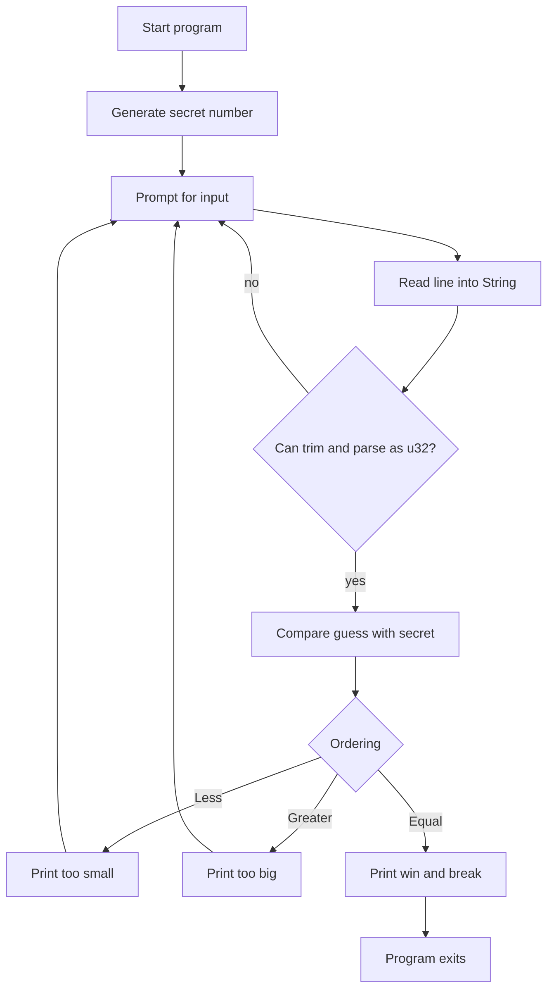

# Guessing Game First Project

The guessing game is the book's first project chapter. Its value is not the game itself; it is the way one small program introduces many Rust habits before the formal chapters explain them. The project uses input, mutable variables, references, external crates, `Result`, `match`, loops, shadowing, and numeric parsing. It also shows a realistic pattern: write a simple version, compile it, read the compiler's feedback, then refine behavior.


*Figure: Rust connects systems control with compile-time memory-safety guarantees. Image: [Wikimedia Commons](https://commons.wikimedia.org/wiki/File:Rust_programming_language_black_logo.svg), Rust Foundation, CC BY 4.0.*

This page is a bridge between [getting started](/cs/programming/rust/getting-started-toolchain-cargo) and [common programming concepts](/cs/programming/rust/common-programming-concepts). Do not worry if some terms feel early. The point is to see them in motion, then return to them with more precision in the later pages on [ownership](/cs/programming/rust/ownership-references-slices), [pattern matching](/cs/programming/rust/pattern-matching), and [error handling](/cs/programming/rust/error-handling).

## Definitions

The game chooses a secret integer in a fixed range, repeatedly reads a guess from standard input, compares the guess with the secret, and stops when the guess is correct.

`std::io` is the standard input/output module. Bringing it into scope with `use std::io;` lets the program call `io::stdin()`.

`String::new()` creates an empty growable UTF-8 string. It is used for input because the program does not know the user's text at compile time.

`read_line(&mut guess)` appends input into a mutable string. The argument is a mutable reference because the input function must modify the string owned by the caller.

`Result` is an enum used for operations that can fail. `read_line` returns a `Result`, and `parse` returns a `Result`. Ignoring these values is a warning because Rust wants failure to be handled deliberately.

`rand` is an external crate used by the book to generate the secret number. Adding `rand = "0.8.5"` under `[dependencies]` in `Cargo.toml` lets Cargo download and compile it.

`match` compares a value against patterns. In the guessing game it handles both `Ordering` values (`Less`, `Greater`, `Equal`) and parse results (`Ok(num)`, `Err(_)`).

Shadowing means declaring a new variable with the same name as an earlier variable. The project uses `let guess: u32 = ...` to replace the input string binding with a parsed number binding.

## Key results

The first result is that Rust distinguishes text input from numeric values. A user's line arrives as a `String`, not as a number. Numeric comparison requires explicit conversion.

The second result is that input is fallible. Reading from the terminal can fail. Parsing text as a number can fail. The program can either crash intentionally with `expect`, or recover by matching on `Result`.

The third result is that `match` is both a control-flow construct and an expression. In the final game, this expression converts a parse result into either a number or a loop action:

```rust
let guess: u32 = match guess.trim().parse() {
    Ok(num) => num,
    Err(_) => continue,
};
```

The proof idea is simple. If `parse` returns `Ok(num)`, the `match` expression evaluates to `num`, so the assignment succeeds. If it returns `Err(_)`, the `continue` statement immediately begins the next loop iteration. No invalid numeric value is invented.

The fourth result is that Cargo's dependency resolution is visible. Adding `rand` may compile several transitive crates because `rand` depends on other crates. Cargo records the exact resolved versions in `Cargo.lock`, which gives repeatable builds.

A fifth result is that the compiler's type errors are part of the project, not interruptions from outside it. The first comparison attempt fails because `guess` is a `String` and `secret_number` is inferred as a number. That error teaches three things at once: Rust will not guess a conversion, `cmp` compares values of compatible types, and annotations can guide inference. The fix is not to weaken the type system; the fix is to explicitly transform the user's line into a `u32`. Likewise, the unused-`Result` warning from `read_line` is not cosmetic. It tells the programmer that an operation may have failed and that the returned value carries information. Even when the early version uses `expect`, the code is acknowledging failure. The final version goes further by matching on parse errors and continuing the loop. This is the book's first demonstration of a Rust pattern that repeats everywhere: make invalid or fallible states explicit, then decide locally whether to recover, propagate, or stop.

## Visual



| Concept met early | Concrete use in the game | Later home chapter |
|---|---|---|
| Mutable binding | `let mut guess = String::new()` | Variables and mutability |
| Reference | `&mut guess` | Ownership and borrowing |
| External crate | `rand` in `Cargo.toml` | Cargo and crates.io |
| Enum | `Result`, `Ordering` | Enums and pattern matching |
| Pattern matching | `match guess.cmp(...)` | Patterns and matching |
| Loop control | `loop`, `continue`, `break` | Control flow |

## Worked example 1: from raw input to checked number

Problem: the user types `42` and presses Enter. Show how the program turns that line into a numeric `u32`.

1. Start with an empty mutable string:

```rust
let mut guess = String::new();
```

At this point, `guess` owns a heap-allocated string buffer. It is empty but can grow.

2. Read the line:

```rust
io::stdin().read_line(&mut guess).expect("Failed to read line");
```

After the user enters `42`, the string contains `"42\n"` on Unix-like systems or `"42\r\n"` on Windows. The newline is part of the input because pressing Enter completes the line.

3. Trim whitespace:

```rust
guess.trim()
```

The trimmed view is `"42"`. The original `String` is not rewritten by `trim`; the method returns a string slice that excludes leading and trailing whitespace.

4. Parse:

```rust
guess.trim().parse()
```

Because the target variable is annotated as `u32`, Rust knows the desired output type:

```rust
let guess: u32 = guess.trim().parse().expect("Please type a number!");
```

5. Check the answer. The new `guess` binding is the integer `42`, not the original string. It can now be compared with `secret_number`, which Rust infers as a compatible unsigned integer because of the comparison.

## Worked example 2: recovering from invalid input

Problem: the user enters `hello` instead of a number. Show why the final game continues instead of panicking.

1. The line is read into a string. The buffer contains `"hello\n"`.

2. `trim` removes the newline and yields the slice `"hello"`.

3. `parse::<u32>()` attempts to interpret the characters as an unsigned integer. The letter `h` is not a valid digit for base-10 integer parsing, so the result is:

```rust
Err(parse_error)
```

4. The program matches the result:

```rust
let guess: u32 = match guess.trim().parse() {
    Ok(num) => num,
    Err(_) => continue,
};
```

5. The first pattern, `Ok(num)`, does not match. The second pattern, `Err(_)`, matches any error. The underscore means the program intentionally ignores the detailed error value.

6. `continue` skips the rest of this loop iteration. Therefore no comparison happens for invalid input, and the program goes back to the prompt.

The checked answer is that `hello` does not crash the final game and does not produce a fake guess. It simply causes the next prompt.

## Code

```rust
use rand::Rng;
use std::cmp::Ordering;
use std::io;

fn main() {
    println!("Guess the number!");

    let secret_number = rand::thread_rng().gen_range(1..=100);

    loop {
        println!("Please input your guess.");

        let mut guess = String::new();

        io::stdin()
            .read_line(&mut guess)
            .expect("Failed to read line");

        let guess: u32 = match guess.trim().parse() {
            Ok(num) => num,
            Err(_) => continue,
        };

        println!("You guessed: {guess}");

        match guess.cmp(&secret_number) {
            Ordering::Less => println!("Too small!"),
            Ordering::Greater => println!("Too big!"),
            Ordering::Equal => {
                println!("You win!");
                break;
            }
        }
    }
}
```

## Common pitfalls

- Comparing the raw `String` input with the secret number. Rust rejects this because string and integer comparison is not defined.
- Forgetting `use rand::Rng;`. The random number generator's `gen_range` method comes from the `Rng` trait, so the trait must be in scope.
- Using `&guess` instead of `&mut guess` for `read_line`. The input function needs permission to modify the string.
- Leaving the debug print of `secret_number` in the final game.
- Calling `expect` on `parse` in the loop when the desired behavior is to ignore invalid guesses.
- Forgetting `break` in the winning arm, which causes the program to keep asking after the correct answer.
- Treating shadowing as mutation. `let guess: u32 = ...` creates a new binding with the same name; it does not change the old `String` in place.

## Connections

- [Getting started, toolchain, and Cargo](/cs/programming/rust/getting-started-toolchain-cargo)
- [Common programming concepts](/cs/programming/rust/common-programming-concepts)
- [Ownership, references, and slices](/cs/programming/rust/ownership-references-slices)
- [Pattern matching](/cs/programming/rust/pattern-matching)
- [Error handling](/cs/programming/rust/error-handling)
- [Cargo and crates.io workflow](/cs/programming/rust/cargo-crates-io-workflow)
