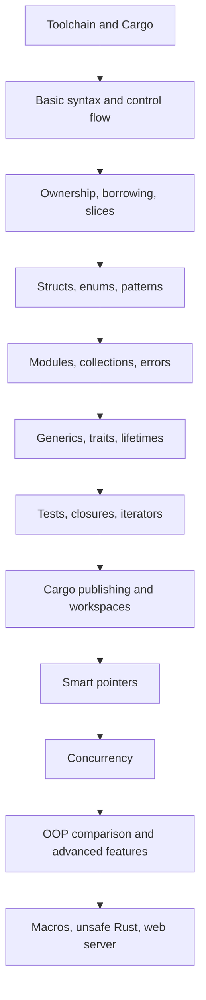

# Rust

Rust is a systems programming language focused on memory safety, predictable performance, and practical tooling. The source text for these notes is *The Rust Programming Language* by Steve Klabnik and Carol Nichols, with contributions from the Rust community. The PDF used here states that it assumes Rust 1.65 or later, so the notes follow that edition's main chapter sequence rather than adding unrelated modern ecosystem material.

These pages are organized as a guided companion to the book. They begin with the toolchain and a first project, move through ownership and the core type system, then build toward tests, iterators, Cargo publishing, smart pointers, concurrency, advanced features, unsafe Rust, macros, and the final multithreaded web server. Async/await is not treated as a detail page because this source edition does not develop it as a dedicated main chapter.

## Definitions

Rust is a compiled language. Source code is checked and translated before it runs. The compiler enforces type rules, ownership rules, borrowing rules, and lifetime relationships. These checks are the basis for Rust's safety guarantees in ordinary safe Rust.

The Rust toolchain normally includes `rustup`, `rustc`, Cargo, the standard library, local documentation, formatting and analysis tools, and access to crates.io. `rustc` is the compiler. Cargo is the package manager, build system, test runner, documentation builder, and publishing tool used by most Rust projects.

The central language concept is ownership. Every value has an owner, there is one owner at a time, and the value is dropped when its owner goes out of scope. Borrowing allows references to data without transferring ownership. Lifetimes let the compiler verify that references do not outlive the data they point to.

Rust code is organized into packages, crates, modules, and items. A package is a Cargo-managed unit with a manifest. A crate is a compilation unit. A module is a namespace and privacy boundary inside a crate.

The standard learning path in the source book has 20 main chapters: Getting Started; Programming a Guessing Game; Common Programming Concepts; Understanding Ownership; Structs; Enums and Pattern Matching; Packages, Crates, and Modules; Common Collections; Error Handling; Generics, Traits, and Lifetimes; Automated Tests; the `minigrep` I/O project; Closures and Iterators; Cargo and crates.io; Smart Pointers; Fearless Concurrency; Object-Oriented Programming Features; Patterns and Matching; Advanced Features; and the Multithreaded Web Server.

## Key results

The first key result is that Rust's safety model is mostly static. Safe Rust prevents many memory errors before the program runs: dangling references, double frees, use-after-free, and data races in safe concurrent code. This does not mean Rust proves every program correct. Logic errors still require design, tests, and review. It means the compiler removes several dangerous categories from normal safe code.

The second key result is that Rust makes cost and ownership visible. Moving a `String` transfers ownership. Cloning a `String` asks for an explicit copy. Borrowing with `&str` avoids ownership transfer. A vector owns its elements. A hash map owns inserted keys and values unless it is deliberately storing references. These rules can be strict, but they keep resource management local and inspectable.

The third key result is that Rust's abstractions are designed to compile efficiently. Generics are commonly monomorphized. Iterators are lazy and often optimize to loops. Traits support both static dispatch through bounds and dynamic dispatch through trait objects. The language gives high-level expression without assuming a garbage collector or runtime reflection system.

The fourth key result is that Rust uses explicit error channels. `panic!` is for unrecoverable bugs or broken invariants. `Result<T, E>` is for recoverable failure. The `?` operator propagates errors while preserving straight-line code. Tests use panics and results to report failures.

The fifth key result is that the book's project chapters are not side trips. The guessing game previews variables, references, `Result`, `match`, and Cargo dependencies. `minigrep` teaches separation between `main`, configuration, I/O, search logic, and tests. The web server brings together TCP, HTTP, closures, threads, channels, mutexes, and graceful shutdown.

Proof sketch for the overall learning order: the first chapters teach syntax and ownership before collections and errors because those later APIs rely on moves, borrows, and explicit failure. Traits and lifetimes arrive before iterators, smart pointers, and concurrency because those abstractions use trait bounds and reference validity. The final project works only because the earlier chapters have already explained how values move into closures, how jobs cross threads, and how cleanup happens through ownership.

## Visual



| Source chapter area | Wiki page |
|---|---|
| Chapter 1: install, hello world, Cargo | [Getting Started, Toolchain, and Cargo](/cs/programming/rust/getting-started-toolchain-cargo) |
| Chapter 2: guessing game | [Guessing Game First Project](/cs/programming/rust/guessing-game-first-project) |
| Chapter 3: variables, types, functions, control flow | [Common Programming Concepts](/cs/programming/rust/common-programming-concepts) |
| Chapter 4: ownership, references, slices | [Ownership, References, and Slices](/cs/programming/rust/ownership-references-slices) |
| Chapters 5-6 and 18: structs, enums, patterns | [Structs, Methods, and Enums](/cs/programming/rust/structs-methods-enums), [Pattern Matching](/cs/programming/rust/pattern-matching) |
| Chapters 7-9: modules, collections, errors | [Packages, Crates, and Modules](/cs/programming/rust/packages-crates-modules), [Common Collections](/cs/programming/rust/common-collections), [Error Handling](/cs/programming/rust/error-handling) |
| Chapters 10-14: abstraction, tests, projects, Cargo | [Generics, Traits, and Lifetimes](/cs/programming/rust/generics-traits-lifetimes), [Automated Tests](/cs/programming/rust/automated-tests), [I/O Project with Minigrep](/cs/programming/rust/io-project-minigrep), [Closures and Iterators](/cs/programming/rust/closures-and-iterators), [Cargo and Crates.io Workflow](/cs/programming/rust/cargo-crates-io-workflow) |
| Chapters 15-20: pointers, concurrency, advanced topics, server | [Smart Pointers](/cs/programming/rust/smart-pointers), [Concurrency and Shared State](/cs/programming/rust/concurrency-and-shared-state), [Object-Oriented and Advanced Features](/cs/programming/rust/object-oriented-and-advanced-features), [Macros and Unsafe Rust](/cs/programming/rust/macros-and-unsafe-rust), [Multithreaded Web Server](/cs/programming/rust/multithreaded-web-server) |

## Worked example 1: choosing a reading path

Problem: choose a path through the Rust notes for a programmer who already knows another language but is new to ownership.

1. Start with the toolchain page. The reader needs to know the difference between `rustc`, Cargo, debug builds, release builds, and `cargo check`.

2. Read the guessing game page next. It shows several Rust features in one working program: `let mut`, `String`, `&mut`, `Result`, `match`, `rand`, and loop control.

3. Read common programming concepts. This calibrates familiar ideas such as variables, functions, arrays, and loops to Rust's stricter type system.

4. Read ownership immediately after. This is the first concept that is not common in many mainstream languages, and it explains many compiler errors the reader will see later.

5. Continue to structs, enums, and pattern matching. These pages show how to design types that make invalid states hard to represent.

6. Check the answer. The best early path is:

```text
toolchain -> guessing game -> common concepts -> ownership -> structs/enums -> patterns
```

This order gives the learner enough syntax to read examples before asking them to reason deeply about borrowing and lifetimes.

## Worked example 2: mapping a project error to a topic page

Problem: a learner writes a CLI tool and sees this shape of error: a value was moved into a function, then used again later. Which notes should they consult?

1. Identify the symptom. "Moved value" means ownership transferred from one binding to another owner.

2. Find the primary concept page. The correct first page is [Ownership, References, and Slices](/cs/programming/rust/ownership-references-slices), because moves, clones, borrowing, and slices are defined there.

3. Check whether the moved value was part of command-line parsing. If so, read [I/O Project with Minigrep](/cs/programming/rust/io-project-minigrep), which shows how `Config` can own arguments while search functions borrow file contents.

4. Check whether the value was moved into a closure or iterator. If so, read [Closures and Iterators](/cs/programming/rust/closures-and-iterators), especially the difference between `iter`, `iter_mut`, and `into_iter`.

5. Decide on the fix. If the callee only needs to read, pass a reference. If it needs independent ownership, clone intentionally. If it should consume the value, stop using the old binding.

6. Checked answer. The error is not solved by memorizing a compiler message. It is solved by tracing ownership: who owns the value now, who needs to read it, and who needs to mutate or consume it?

## Code

```rust
#[derive(Debug, Clone, Copy)]
enum RustTopic {
    Toolchain,
    Ownership,
    Errors,
    Traits,
    Concurrency,
}

fn next_page(topic: RustTopic) -> &'static str {
    match topic {
        RustTopic::Toolchain => "/cs/programming/rust/getting-started-toolchain-cargo",
        RustTopic::Ownership => "/cs/programming/rust/ownership-references-slices",
        RustTopic::Errors => "/cs/programming/rust/error-handling",
        RustTopic::Traits => "/cs/programming/rust/generics-traits-lifetimes",
        RustTopic::Concurrency => "/cs/programming/rust/concurrency-and-shared-state",
    }
}

fn main() {
    let plan = [
        RustTopic::Toolchain,
        RustTopic::Ownership,
        RustTopic::Errors,
        RustTopic::Traits,
        RustTopic::Concurrency,
    ];

    for topic in plan {
        println!("{topic:?}: {}", next_page(topic));
    }
}
```

The snippet is intentionally simple: it uses an enum, `match`, an array, a `for` loop, and string slices to model a reading guide. Those features are introduced early and recur throughout the notes.

## Common pitfalls

- Skipping ownership and trying to learn Rust only by translating code from another language.
- Treating Cargo as optional after the first chapter. Real Rust projects normally use Cargo for builds, tests, dependencies, and documentation.
- Reading `Result` as boilerplate instead of as a recoverable-failure contract.
- Using `clone` as the default response to move errors. Borrowing is often the better expression of intent.
- Assuming Rust's object-oriented chapter means Rust has class inheritance. Rust uses traits, composition, and encapsulation instead.
- Treating unsafe Rust as a normal escape hatch. Unsafe code needs local invariants and safe wrappers.
- Adding async/await notes to this source-backed section without a source chapter from this PDF edition.

## Connections

- [Getting Started, Toolchain, and Cargo](/cs/programming/rust/getting-started-toolchain-cargo)
- [Ownership, References, and Slices](/cs/programming/rust/ownership-references-slices)
- [Generics, Traits, and Lifetimes](/cs/programming/rust/generics-traits-lifetimes)
- [Concurrency and Shared State](/cs/programming/rust/concurrency-and-shared-state)
- [Multithreaded Web Server](/cs/programming/rust/multithreaded-web-server)
