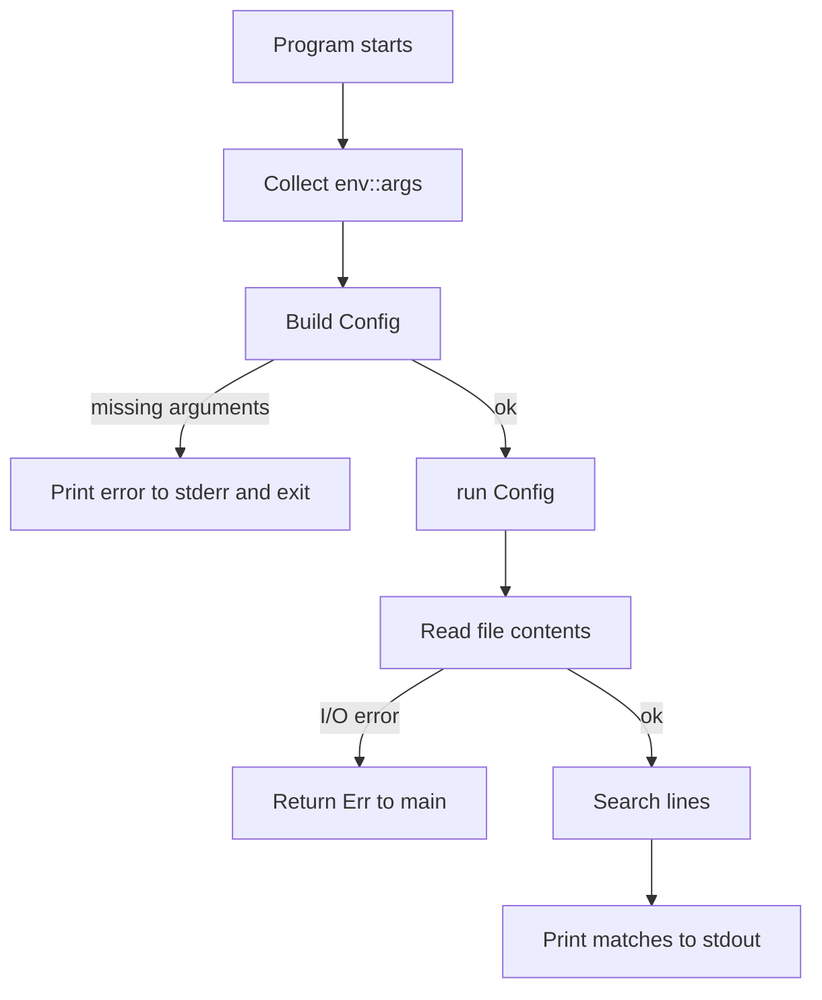

# I/O Project with Minigrep

The book's `minigrep` project turns earlier concepts into a small command-line application. It reads command-line arguments, opens a file, searches for a query, prints matching lines, and gradually improves error handling and organization. The point is not to replace `grep`; the point is to practice separating parsing, configuration, I/O, business logic, tests, and user-facing errors.

This page connects [error handling](/cs/programming/rust/error-handling), [ownership](/cs/programming/rust/ownership-references-slices), [closures and iterators](/cs/programming/rust/closures-and-iterators), and [automated tests](/cs/programming/rust/automated-tests). The project is also the first strong reason to split code between `src/main.rs` and `src/lib.rs`.

## Definitions

A command-line argument is text passed to a program when it starts. In Rust, `std::env::args()` returns an iterator over those arguments. The first argument is usually the executable path, so application-specific values begin after it.

Configuration parsing means converting raw arguments into a typed value the program can use. In the book project, a `Config` struct stores the query string and file path, and later whether search should be case-sensitive.

I/O means input/output operations such as reading a file. File I/O is fallible, so functions that read files usually return `Result`.

The binary crate is the executable entry point in `src/main.rs`. It should handle argument collection, error reporting, and process exit. The library crate in `src/lib.rs` should hold testable logic such as configuration construction and search functions.

Standard output is for normal program output. Standard error is for diagnostics. Printing errors with `eprintln!` keeps error messages separate from data output, which matters when shell pipelines redirect output.

An environment variable is process-level configuration. The book uses an environment variable to switch between case-sensitive and case-insensitive search.

## Key results

The first key result is separation of concerns. `main` should be small: collect arguments, build `Config`, call `run`, handle errors. The `run` function should return `Result<(), Box<dyn Error>>` or another error type instead of panicking.

The second key result is that parsing should validate input before the application starts doing work. Missing query or file path should become a clear error, not an indexing panic.

The third key result is that search logic is pure enough to test. A function `search(query, contents) -> Vec<&str>` can be tested without touching the filesystem or command-line environment.

The fourth key result is that iterators make search concise. Lines can be processed with `contents.lines()`, then filtered by a closure, then collected.

Proof sketch for the split design: if `search` borrows `contents` and returns matching line slices, the returned references are valid as long as `contents` is valid. Tests can pass a string literal as contents and compare the returned vector. The file-reading code stays outside the test's core logic, so failures are easier to isolate.

The project also teaches how to make `main` honest without making it large. A useful shape is: collect inputs, build configuration, call `run`, and handle the returned error. The process boundary belongs in `main` because only `main` should decide to print to standard error and exit with a nonzero status. The search library should not terminate the process; it should return information. This split becomes more important in reusable crates, where a function that calls `process::exit` would surprise any application that depends on it.

Another result is that tests can drive API shape. Once search is written as `fn search<'a>(query: &str, contents: &'a str) -> Vec<&'a str>`, test data can be a plain string literal. No temporary files, command-line arguments, or environment variables are needed for the core behavior. That simplicity is a signal that the function boundary is well chosen.

The project's incremental development style is also important. The book does not begin with the final architecture. It starts by collecting arguments, then reads a file, then extracts configuration, then improves errors, then adds tests, then adds case-insensitive search. That order keeps each compile failure small enough to understand. Rust rewards this style because the compiler can verify each refactoring step. When moving code from `main.rs` to `lib.rs`, for example, visibility, ownership, and error types all have to line up; doing that in small steps makes the diagnostics useful instead of overwhelming.

That incremental style is worth preserving outside the tutorial. A command-line tool becomes easier to maintain when each layer has a narrow job: parse, validate, execute, and report.

Once those layers are separated, later features such as recursive search, colored output, or regular expressions have a natural place to live.

## Visual



| Responsibility | Good location | Reason |
|---|---|---|
| Collect raw args | `main.rs` | Process boundary |
| Parse config | `lib.rs` or small config module | Testable validation |
| Read file | `run` or I/O layer | Fallible side effect |
| Search text | `lib.rs` pure function | Easy unit tests |
| Print matches | `run` or main path | User-facing side effect |
| Print errors | `main.rs` with `eprintln!` | Keep diagnostics on stderr |

## Worked example 1: building a `Config` without panicking

Problem: convert arguments into a query and file path while rejecting missing values.

1. Raw arguments might be:

```text
minigrep frog poem.txt
```

2. `env::args()` yields three strings: executable name, query, and file path.

3. A fragile parser might use direct indexing:

```rust
let query = args[1].clone();
let file_path = args[2].clone();
```

If either argument is missing, this panics with an index error.

4. A safer builder consumes an iterator:

```rust
let mut args = args.into_iter();
let _program = args.next();
let query = args.next().ok_or("Didn't get a query string")?;
let file_path = args.next().ok_or("Didn't get a file path")?;
```

5. Trace the missing-query case. If the user runs only `minigrep`, the first `next` gets the executable name. The second `next` returns `None`. `ok_or(...)` converts that to `Err`, and `?` returns the error from the builder.

6. Check the answer. Valid arguments produce `Ok(Config { query, file_path, ... })`; invalid arguments produce a clear recoverable error.

## Worked example 2: case-insensitive search

Problem: find lines containing `"rust"` regardless of case in the text:

```text
Rust:
safe, fast, productive.
Pick three.
Trust me.
```

1. Lowercase the query:

```rust
let query = query.to_lowercase();
```

For `"rust"`, it stays `"rust"`.

2. Visit each line:

| Line | Lowercased line | Contains `rust`? |
|---|---|---|
| `Rust:` | `rust:` | yes |
| `safe, fast, productive.` | `safe, fast, productive.` | no |
| `Pick three.` | `pick three.` | no |
| `Trust me.` | `trust me.` | yes |

3. Collect matching original lines, not lowercased lines. The result should preserve the file's text:

```text
Rust:
Trust me.
```

4. Check the answer. The algorithm compares lowercase versions but returns slices of the original lines. This keeps output faithful while making the search insensitive to ASCII case in the example.

## Code

```rust
use std::error::Error;
use std::fs;

pub struct Config {
    pub query: String,
    pub file_path: String,
    pub ignore_case: bool,
}

impl Config {
    pub fn build(args: impl IntoIterator<Item = String>) -> Result<Config, &'static str> {
        let mut args = args.into_iter();
        let _program = args.next();
        let query = args.next().ok_or("Didn't get a query string")?;
        let file_path = args.next().ok_or("Didn't get a file path")?;
        let ignore_case = std::env::var("IGNORE_CASE").is_ok();

        Ok(Config {
            query,
            file_path,
            ignore_case,
        })
    }
}

pub fn run(config: Config) -> Result<(), Box<dyn Error>> {
    let contents = fs::read_to_string(config.file_path)?;
    let results = if config.ignore_case {
        search_case_insensitive(&config.query, &contents)
    } else {
        search(&config.query, &contents)
    };

    for line in results {
        println!("{line}");
    }

    Ok(())
}

pub fn search<'a>(query: &str, contents: &'a str) -> Vec<&'a str> {
    contents.lines().filter(|line| line.contains(query)).collect()
}

pub fn search_case_insensitive<'a>(query: &str, contents: &'a str) -> Vec<&'a str> {
    let query = query.to_lowercase();
    contents
        .lines()
        .filter(|line| line.to_lowercase().contains(&query))
        .collect()
}
```

The returned line slices borrow from `contents`, so the lifetime annotation says the result cannot outlive the file contents string.

## Common pitfalls

- Indexing argument vectors directly and panicking on missing input.
- Keeping all logic in `main`, which makes tests awkward and error handling noisy.
- Printing errors with `println!`, sending diagnostics to standard output.
- Returning owned `String` lines from search when borrowed `&str` lines are enough.
- Ignoring environment-variable configuration in tests; keep pure search functions independent from environment access.
- Using `unwrap` for file reads in a command-line tool where the user needs a readable error.
- Forgetting that simple `to_lowercase` behavior is not a complete internationalized search engine. It is enough for the book project, not for every language-sensitive application.

## Connections

- [Error handling](/cs/programming/rust/error-handling)
- [Closures and iterators](/cs/programming/rust/closures-and-iterators)
- [Automated tests](/cs/programming/rust/automated-tests)
- [Cargo and crates.io workflow](/cs/programming/rust/cargo-crates-io-workflow)
- [Generics, traits, and lifetimes](/cs/programming/rust/generics-traits-lifetimes)
