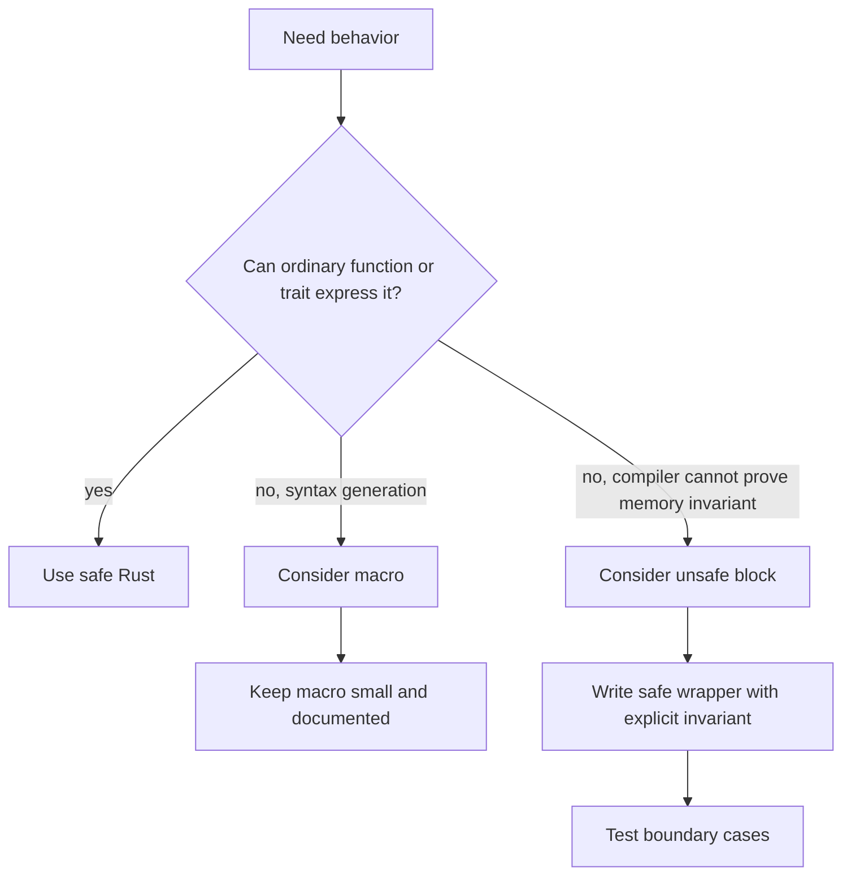

# Macros and Unsafe Rust

Macros and unsafe Rust are advanced tools for cases where ordinary functions and safe abstractions are not enough. Macros write code that writes code, reducing repetition or creating syntax-like APIs. Unsafe Rust permits a small set of operations the compiler cannot fully verify, such as dereferencing raw pointers or calling unsafe functions. The book presents both topics carefully: they are powerful, but they should be isolated behind safe, well-tested interfaces whenever possible.


*Figure: Rust connects systems control with compile-time memory-safety guarantees. Image: [Wikimedia Commons](https://commons.wikimedia.org/wiki/File:Rust_programming_language_black_logo.svg), Rust Foundation, CC BY 4.0.*

This page builds on [advanced traits and object-oriented features](/cs/programming/rust/object-oriented-and-advanced-features), [ownership](/cs/programming/rust/ownership-references-slices), and [concurrency](/cs/programming/rust/concurrency-and-shared-state). Unsafe code is not a way to turn off all Rust checks; it opens specific extra capabilities while the rest of the language remains checked.

## Definitions

Unsafe Rust is enabled inside an `unsafe` block or unsafe item. It allows five extra capabilities: dereferencing raw pointers, calling unsafe functions or methods, accessing or modifying mutable static variables, implementing unsafe traits, and accessing fields of unions.

A raw pointer has type `*const T` or `*mut T`. Raw pointers may be null, may point to invalid memory, and are not automatically checked by the borrow checker. Creating raw pointers is safe; dereferencing them is unsafe.

An unsafe function has preconditions the compiler cannot verify. Calling it requires an unsafe block because the caller must uphold those preconditions.

An unsafe trait is a trait whose implementation carries invariants the compiler cannot check. Implementing it requires `unsafe impl`.

A declarative macro is written with `macro_rules!`. It matches input token patterns and expands to Rust code. `vec!` is a familiar standard macro in this style.

Procedural macros operate on Rust token streams. The book distinguishes three kinds: custom derive macros, attribute-like macros, and function-like macros.

Macro expansion happens before much of ordinary type checking. This is why macro errors can feel different from function errors: the compiler first has to expand generated code.

## Key results

The first key result is that unsafe blocks do not disable the borrow checker globally. They only permit specific operations inside the block. Safe code around the block is still checked normally.

The second key result is that unsafe code should usually be wrapped in a safe abstraction. The standard library's `split_at_mut` is the book's key example: its implementation needs unsafe pointer work, but its public API is safe because it enforces valid behavior through arguments and checks.

The third key result is that raw pointer dereference safety depends on programmer-maintained invariants: alignment, validity, aliasing, initialization, and lifetime must all be correct.

The fourth key result is that macros differ from functions because they operate on syntax. A macro can accept a variable number of arguments or create items, but it is harder to read and debug than an ordinary function.

Proof sketch for safe wrappers: if a function checks that `mid <= len`, obtains a raw pointer to a slice's buffer, and then constructs two mutable slices covering disjoint ranges, callers cannot create overlapping mutable references through the safe API. The unsafe implementation is justified by the disjointness invariant.

Another key result is that unsafe code creates a documentation obligation. The compiler can no longer verify every condition, so the programmer must write down what must be true. Common comments identify why a pointer is non-null, why it is aligned, why two ranges do not overlap, or why a global value is accessed safely. These comments should be attached to the unsafe operation, not placed far away as general reassurance. The smaller the unsafe block, the easier it is to audit the claim.

For macros, the corresponding obligation is to explain the generated shape. Declarative macros can hide repetition, but they can also hide control flow and evaluation order. A macro that evaluates an expression more than once can surprise callers if that expression has side effects. A macro that introduces names can create confusing error messages unless it is written carefully. When an ordinary function, generic function, or trait method can express the behavior clearly, that is usually preferable.

Unsafe traits connect the unsafe and trait systems. A trait such as `Send` or `Sync` communicates a property that other unsafe code may rely on. Implementing such a trait manually is a promise that the type upholds the required invariants in every valid use. That is why unsafe trait implementations should be rare, small, and justified by a clear representation argument.

The safest mental model is to treat unsafe code as a small kernel inside a safe module. The public API should make invalid use impossible or clearly mark the remaining unsafe preconditions. Tests are necessary, but tests cannot prove the absence of undefined behavior; the invariant argument is the core evidence.

Macro-heavy code deserves the same restraint: generate the repetitive part, but keep the generated contract understandable from the call site.

Readable expansion boundaries matter.

## Visual



| Tool | What it enables | Main risk | Safer practice |
|---|---|---|---|
| `unsafe` block | Raw pointer dereference, unsafe calls | Undefined behavior if invariants are wrong | Minimize and document invariants |
| Unsafe function | Caller-checked preconditions | Easy to call incorrectly | Prefer safe wrapper |
| `macro_rules!` | Pattern-based code generation | Harder diagnostics and readability | Use when functions cannot express shape |
| Derive macro | Generate trait impls | Hidden generated code | Keep derive behavior documented |
| Attribute macro | Transform annotated item | Surprising expansion | Use clear attribute names |

## Worked example 1: why `split_at_mut` needs unsafe internally

Problem: split one mutable slice into two disjoint mutable slices.

1. Desired safe signature:

```rust
fn split_at_mut(values: &mut [i32], mid: usize) -> (&mut [i32], &mut [i32])
```

This says callers pass one mutable slice and receive two mutable slices.

2. The borrow checker cannot prove this direct version:

```rust
let len = values.len();
(&mut values[..mid], &mut values[mid..])
```

Both outputs borrow from `values` mutably. A human sees the ranges are disjoint when `mid <= len`, but the compiler does not use that reasoning here.

3. The standard pattern is to use raw parts:

```rust
let ptr = values.as_mut_ptr();
let len = values.len();
assert!(mid <= len);
```

4. Build slices from disjoint ranges inside `unsafe`:

```rust
unsafe {
    (
        std::slice::from_raw_parts_mut(ptr, mid),
        std::slice::from_raw_parts_mut(ptr.add(mid), len - mid),
    )
}
```

5. Check the invariant. The assertion prevents `mid` from exceeding length. The first slice covers indices `0..mid`. The second covers `mid..len`. They do not overlap.

The checked answer is a safe function whose internal unsafe block is justified by a precise disjointness argument.

## Worked example 2: expanding a simple declarative macro

Problem: write a macro that builds a vector from any number of expressions.

1. Macro shape:

```rust
macro_rules! my_vec {
    ( $( $x:expr ),* ) => {
        {
            let mut temp_vec = Vec::new();
            $(
                temp_vec.push($x);
            )*
            temp_vec
        }
    };
}
```

2. Interpret the pattern. `$x:expr` matches an expression. `$( ... ),*` means zero or more expressions separated by commas.

3. Call it:

```rust
let v = my_vec![1, 2, 3];
```

4. Conceptual expansion:

```rust
{
    let mut temp_vec = Vec::new();
    temp_vec.push(1);
    temp_vec.push(2);
    temp_vec.push(3);
    temp_vec
}
```

5. Check the answer. The final value is a vector containing `[1, 2, 3]`. A function could not accept an arbitrary number of arguments in this syntax; the macro can because it matches tokens before type checking.

## Code

```rust
fn split_at_mut_i32(values: &mut [i32], mid: usize) -> (&mut [i32], &mut [i32]) {
    let len = values.len();
    let ptr = values.as_mut_ptr();

    assert!(mid <= len);

    unsafe {
        (
            std::slice::from_raw_parts_mut(ptr, mid),
            std::slice::from_raw_parts_mut(ptr.add(mid), len - mid),
        )
    }
}

fn main() {
    let mut values = [1, 2, 3, 4, 5, 6];
    let (left, right) = split_at_mut_i32(&mut values, 3);

    left[0] = 10;
    right[0] = 40;

    println!("{values:?}");
}
```

The public function is safe because it checks the split point and returns non-overlapping mutable slices. The unsafe block is small and directly tied to the documented invariant.

## Common pitfalls

- Treating unsafe as permission to ignore all Rust rules. Only specific extra operations are allowed.
- Writing large unsafe blocks where the invariant is hard to audit.
- Exposing unsafe requirements through a safe API without actually enforcing them.
- Dereferencing raw pointers without proving validity, alignment, and aliasing conditions.
- Using macros where a generic function or trait would be simpler.
- Forgetting that macro input is token syntax, not already type-checked values.
- Assuming generated macro code is obvious to future readers. Keep macro APIs small and documented.

## Connections

- [Object-oriented and advanced features](/cs/programming/rust/object-oriented-and-advanced-features)
- [Ownership, references, and slices](/cs/programming/rust/ownership-references-slices)
- [Concurrency and shared state](/cs/programming/rust/concurrency-and-shared-state)
- [Cargo and crates.io workflow](/cs/programming/rust/cargo-crates-io-workflow)
- [Multithreaded web server](/cs/programming/rust/multithreaded-web-server)
