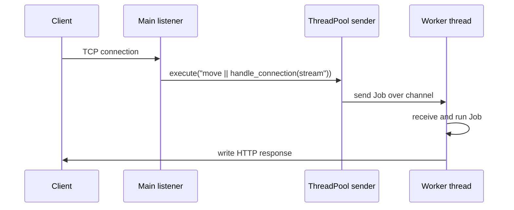

# Multithreaded Web Server

The Rust book ends with a low-level web server project. It is intentionally small: bind a TCP listener, accept incoming streams, parse enough HTTP to distinguish a few paths, write responses, then add a thread pool so slow requests do not block every other request. The project is a practical review of ownership, error handling, traits, closures, channels, mutexes, and graceful cleanup.

This source edition uses a blocking, thread-pool design rather than an async/await design. That is important: async Rust is a major ecosystem topic, but it is not developed as a dedicated chapter in this PDF's main sequence. The server here should be understood as the book's concrete final project, not as a complete production web framework.

## Definitions

`TcpListener` binds to an address and accepts incoming TCP connections. Calling `incoming` returns an iterator over connection attempts. Each successful item is a `TcpStream`.

HTTP is a text-based protocol at the request/response level. The book project reads the request line and responds with a status line, headers, a blank line, and a body.

A thread pool is a fixed set of worker threads waiting for jobs. Instead of spawning a new thread for every connection, the server sends work to the pool. This bounds thread creation overhead and limits concurrent workers.

A job is a boxed closure that a worker can execute:

```rust
type Job = Box<dyn FnOnce() + Send + 'static>;
```

`FnOnce` means the closure may consume captured values and is called once. `Send` means it can cross thread boundaries. `'static` means it does not borrow stack data that could disappear before the worker runs it.

The pool uses a channel to send jobs from the main thread to workers. Because the receiver must be shared among workers, it is wrapped in `Arc<Mutex<Receiver<Job>>>`.

Graceful shutdown means the thread pool tells workers to stop and joins their threads before the pool is dropped. This avoids abandoning work silently.

## Key results

The first key result is that a minimal HTTP response is just bytes written to a TCP stream. Frameworks are not required to understand the basic protocol shape.

The second key result is that spawning one thread per request is simple but can be wasteful. A thread pool reuses worker threads and gives the program a fixed concurrency limit.

The third key result is that jobs sent to worker threads must own their captured data. A connection stream moved into a closure can safely be processed after the main accept loop continues.

The fourth key result is that shutdown must be designed. If workers block forever waiting for jobs, dropping the pool without closing the sender and joining handles can leave threads unmanaged. The book improves the design so workers stop when the channel disconnects.

Proof sketch for the pool: main owns a sender and workers share the receiver. Calling `execute` boxes a closure and sends it through the channel. One worker locks the receiver, receives one job, drops the lock, and runs the job. Because each job is `FnOnce + Send + 'static`, it can be transferred and executed safely on that worker.

The final project also teaches the boundary between demonstration code and production code. The request parser checks byte prefixes, the response bodies are fixed strings or files, and the server handles a small number of routes. That is enough to show TCP, HTTP framing, and thread-pool mechanics. It is not enough for production HTTP, where parsing, headers, methods, errors, timeouts, TLS, and backpressure require much more care. The value of the chapter is that it removes mystery: a web server is a loop accepting streams, reading bytes, deciding on a response, and writing bytes back.

Async/await deserves a careful note because it is common in modern Rust web development. This PDF's main chapter sequence does not build an async server. The blocking thread-pool server remains source-backed here. If these notes are later extended with async Rust, that page should be sourced from Rust async documentation or a book edition that actually teaches futures, executors, tasks, pinning, and async I/O. Without that source, treating async as if it were part of this chapter would blur the boundary between summary and invention.

The graceful-shutdown portion of the project is the final ownership review. Dropping the sender closes the channel, workers observe receive errors, and the thread pool takes each worker handle so it can call `join`. Cleanup is not left to timing or background magic; it is modeled by ownership and `Drop`.

This is also why the project is a useful capstone: every line of the final design has a reason traceable to earlier chapters.

The server is small enough to inspect completely, which makes it better for learning than a framework whose abstractions hide the ownership transfers.

## Visual



| Component | Rust type | Role |
|---|---|---|
| Listener | `TcpListener` | Accept connections |
| Stream | `TcpStream` | Read request and write response |
| Job | `Box<dyn FnOnce() + Send + 'static>` | Own executable work |
| Sender | `mpsc::Sender<Job>` | Submit work to workers |
| Shared receiver | `Arc<Mutex<mpsc::Receiver<Job>>>` | Let workers receive from one queue |
| Worker handle | `JoinHandle<()>` | Join thread during shutdown |

## Worked example 1: responding to `GET /`

Problem: handle one TCP stream that requests the home page.

1. Read request bytes into a buffer:

```rust
let mut buffer = [0; 1024];
stream.read(&mut buffer)?;
```

2. Define the expected request prefix:

```rust
let get = b"GET / HTTP/1.1\r\n";
```

3. Check the prefix:

```rust
let (status_line, contents) = if buffer.starts_with(get) {
    ("HTTP/1.1 200 OK", "<h1>Hello!</h1>")
} else {
    ("HTTP/1.1 404 NOT FOUND", "<h1>Not Found</h1>")
};
```

4. Compute response length:

```rust
let length = contents.len();
```

5. Format and send:

```rust
let response = format!("{status_line}\r\nContent-Length: {length}\r\n\r\n{contents}");
stream.write_all(response.as_bytes())?;
```

6. Check the answer. A home-page request receives status `200 OK` and the hello body. Any other request receives `404 NOT FOUND`. The blank line between headers and body is required by HTTP message format.

## Worked example 2: running a job in a worker

Problem: trace how a connection-handling closure gets from the listener to a worker.

1. Main accepts a stream:

```rust
for stream in listener.incoming() {
    let stream = stream.unwrap();
    pool.execute(|| handle_connection(stream));
}
```

In the real code, the closure must be `move` so it owns `stream`.

2. `execute` boxes the closure:

```rust
let job = Box::new(f);
```

3. The sender moves the job into the channel:

```rust
self.sender.as_ref().unwrap().send(job).unwrap();
```

4. A worker waits:

```rust
let job = receiver.lock().unwrap().recv().unwrap();
job();
```

5. Check ownership. The stream moves into the closure, the closure moves into the channel, the worker receives the closure, and then the worker calls it once. No two threads own the same `TcpStream` for the same request.

6. Check scheduling. If one job sleeps for several seconds, only that worker is blocked. Other workers can receive other jobs, up to the pool size.

## Code

```rust
use std::io::{Read, Write};
use std::net::{TcpListener, TcpStream};

fn handle_connection(mut stream: TcpStream) -> std::io::Result<()> {
    let mut buffer = [0; 1024];
    stream.read(&mut buffer)?;

    let get_home = b"GET / HTTP/1.1\r\n";
    let (status_line, body) = if buffer.starts_with(get_home) {
        ("HTTP/1.1 200 OK", "<h1>Hello from Rust</h1>")
    } else {
        ("HTTP/1.1 404 NOT FOUND", "<h1>Not Found</h1>")
    };

    let response = format!(
        "{status_line}\r\nContent-Length: {}\r\n\r\n{body}",
        body.len()
    );

    stream.write_all(response.as_bytes())
}

fn main() -> std::io::Result<()> {
    let listener = TcpListener::bind("127.0.0.1:7878")?;

    for stream in listener.incoming().take(2) {
        match stream {
            Ok(stream) => handle_connection(stream)?,
            Err(error) => eprintln!("connection failed: {error}"),
        }
    }

    Ok(())
}
```

This is the single-threaded core. The book then wraps `handle_connection(stream)` in jobs submitted to a thread pool so multiple connections can be processed concurrently.

## Common pitfalls

- Treating the toy parser as a full HTTP implementation. It only recognizes simple request prefixes.
- Forgetting the blank line between HTTP headers and body.
- Spawning unbounded threads for every request in a long-running server.
- Sending closures to workers without `Send` and `'static` bounds.
- Holding the receiver mutex while running the job. The worker should receive the job, then execute it after the receive operation.
- Dropping the thread pool without closing the sender and joining workers.
- Confusing this blocking thread-pool design with async/await. Async is not the final-project model in this source edition.

## Connections

- [Concurrency and shared state](/cs/programming/rust/concurrency-and-shared-state)
- [Closures and iterators](/cs/programming/rust/closures-and-iterators)
- [Error handling](/cs/programming/rust/error-handling)
- [Smart pointers](/cs/programming/rust/smart-pointers)
- [Macros and unsafe Rust](/cs/programming/rust/macros-and-unsafe-rust)
