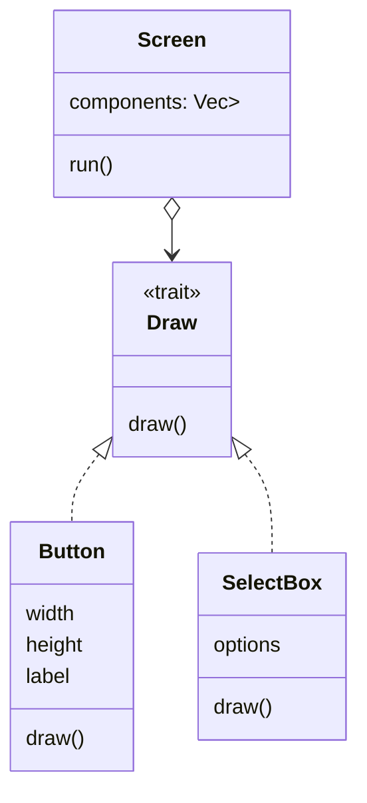

# Object-Oriented and Advanced Features

Rust does not copy class-based object-oriented programming directly, but it supports several object-oriented goals: encapsulation, polymorphism, and state-dependent behavior. The book uses this comparison to show where Rust's design differs from inheritance-heavy languages. Later, the advanced-features chapter deepens the same theme with associated types, operator overloading, fully qualified syntax, supertraits, newtype wrappers, type aliases, and function pointers.

This page combines the object-oriented chapter with the advanced trait and type material most closely related to it. It builds on [traits and lifetimes](/cs/programming/rust/generics-traits-lifetimes), [modules and privacy](/cs/programming/rust/packages-crates-modules), and [smart pointers](/cs/programming/rust/smart-pointers). It prepares for [macros and unsafe Rust](/cs/programming/rust/macros-and-unsafe-rust), where the language allows even more explicit control.

## Definitions

Encapsulation means hiding implementation details behind a public interface. Rust achieves this with module privacy, private fields, and public methods. A public struct can keep fields private so invariants are enforced by constructors and methods.

Polymorphism means code can operate on multiple concrete types through a shared interface. Rust primarily uses traits for this. With generics, the concrete type is known at compile time. With trait objects such as `Box<dyn Draw>`, the concrete type is selected at runtime through dynamic dispatch.

A trait object combines a pointer to a value with a pointer to a vtable for the implemented trait. Trait objects require object-safe traits. Methods that return `Self` or have generic parameters are common reasons a trait is not object safe.

Inheritance is not Rust's main reuse mechanism. Rust uses composition, traits, default trait methods, and generic bounds instead of subclassing.

An associated type is a placeholder type declared inside a trait. The implementor specifies the concrete type once. `Iterator::Item` is the standard example.

A default generic type parameter gives a generic parameter a default type. The `Add` trait uses this so `Rhs` defaults to `Self`.

Fully qualified syntax disambiguates methods or associated functions when multiple traits or inherent impls use the same name.

A supertrait is a trait that requires another trait. If `trait OutlinePrint: Display`, implementors of `OutlinePrint` must also implement `Display`.

The newtype pattern wraps a type in a tuple struct to create a distinct local type, often to implement an external trait or enforce domain meaning.

## Key results

The first key result is that Rust supports object-oriented design goals without classes. Private data plus public methods gives encapsulation. Traits give interface-based polymorphism. Composition replaces many inheritance use cases.

The second key result is that trait objects trade static dispatch for runtime flexibility. A `Vec<Box<dyn Draw>>` can hold buttons, text fields, and other drawable components together, but calls go through dynamic dispatch.

The third key result is that Rust's state-pattern example can be written with trait objects, but Rust's type system can often encode states more strongly. For example, a draft post type can expose `request_review`, which consumes a draft and returns a pending-review type, making invalid transitions unrepresentable.

The fourth key result is that advanced trait features resolve ambiguity and improve API expression. Associated types avoid repeating generic parameters everywhere. Fully qualified syntax says exactly which implementation is meant.

Proof sketch for trait-object screens: if a trait `Draw` has method `draw(&self)`, then any type implementing `Draw` can be placed behind `Box<dyn Draw>`. A screen can store a vector of those boxes and call `draw` on each item. The screen does not know concrete types, but the vtable for each object points to the correct method implementation.

The state-pattern discussion adds an important design comparison. A classic object-oriented version stores a `state: Option<Box<dyn State>>` inside one `Post` type and delegates behavior to state objects. That demonstrates trait objects and encapsulation, but it still allows some invalid calls to exist and do nothing. A more Rust-oriented version can use separate types such as `DraftPost`, `PendingReviewPost`, and `Post`, with transition methods that consume one state and return the next. In that design, code cannot call `content` on a draft because the method does not exist for that type. The type system carries the state machine.

Advanced traits extend this same idea: put the rule where the compiler can check it. A supertrait says one behavior depends on another. An associated type says an implementation chooses a related type once. A newtype wrapper says this value has a distinct meaning even if its runtime representation is the same as an existing type.

Function pointers and closures round out the advanced material. A function item can be passed where `fn` is expected, and closures may satisfy `Fn`, `FnMut`, or `FnOnce` bounds. In practice, generic closure bounds are more flexible than bare function pointers, but function pointers are useful when an API must accept only functions that do not capture environment. This is another example of Rust making a capability explicit in the type.

The same theme explains why Rust prefers explicit conversions over implicit subtype relationships. Interfaces are shared through traits, not hidden inheritance chains.

When an advanced feature feels necessary, ask what invariant it communicates to the compiler or to readers. If it communicates neither, it is probably ornament.

## Visual



| Feature | Static or dynamic? | Main benefit | Cost or constraint |
|---|---|---|---|
| Generic trait bound | static | Fast, monomorphized | One concrete type per instantiation |
| Trait object | dynamic | Heterogeneous collections | Object safety and vtable call |
| Associated type | static | Cleaner trait signatures | One concrete associated type per impl |
| Newtype | static | Local distinct wrapper | Must forward desired methods |
| Supertrait | static or dynamic | Express trait dependency | Implementors need all required traits |

## Worked example 1: heterogeneous UI components

Problem: store a button and a select box in one screen and call `draw` on both.

1. Define the shared behavior:

```rust
trait Draw {
    fn draw(&self);
}
```

This trait is object safe because `draw` does not use generic parameters and does not return `Self`.

2. Define the screen:

```rust
struct Screen {
    components: Vec<Box<dyn Draw>>,
}
```

The vector stores boxes because trait objects have dynamically sized concrete values. The box gives each component a known pointer size.

3. Run the screen:

```rust
impl Screen {
    fn run(&self) {
        for component in &self.components {
            component.draw();
        }
    }
}
```

4. Add types such as `Button` and `SelectBox`, each implementing `Draw`.

5. Check the answer. The screen can hold different concrete component types in one vector. At runtime, each `draw` call dispatches to the implementation for the actual component.

This is Rust polymorphism through trait objects, not inheritance. No component subclasses a base class.

## Worked example 2: disambiguating methods with fully qualified syntax

Problem: a type has an inherent method named `fly`, and two traits also define `fly`. Call each one explicitly.

1. Define two traits:

```rust
trait Pilot {
    fn fly(&self);
}

trait Wizard {
    fn fly(&self);
}
```

2. Define the type and implementations:

```rust
struct Human;

impl Pilot for Human {
    fn fly(&self) {
        println!("This is your captain speaking.");
    }
}

impl Wizard for Human {
    fn fly(&self) {
        println!("Up!");
    }
}

impl Human {
    fn fly(&self) {
        println!("waving arms");
    }
}
```

3. Call the inherent method:

```rust
let person = Human;
person.fly();
```

4. Call trait methods explicitly:

```rust
Pilot::fly(&person);
Wizard::fly(&person);
```

5. Check the answer. Rust chooses the inherent method for `person.fly()`. Fully qualified trait calls remove ambiguity and invoke the desired trait implementation.

For associated functions without `self`, the syntax may need the implementing type too, such as `<Dog as Animal>::baby_name()`.

## Code

```rust
use std::fmt::{self, Display};

trait OutlinePrint: Display {
    fn outline_print(&self) {
        let output = self.to_string();
        let len = output.len();
        println!("{}", "*".repeat(len + 4));
        println!("*{}*", " ".repeat(len + 2));
        println!("* {output} *");
        println!("*{}*", " ".repeat(len + 2));
        println!("{}", "*".repeat(len + 4));
    }
}

struct Point {
    x: i32,
    y: i32,
}

impl Display for Point {
    fn fmt(&self, f: &mut fmt::Formatter<'_>) -> fmt::Result {
        write!(f, "({}, {})", self.x, self.y)
    }
}

impl OutlinePrint for Point {}

fn main() {
    let point = Point { x: 3, y: 4 };
    point.outline_print();
}
```

`OutlinePrint` is a supertrait of `Display`, so it can rely on `to_string`. `Point` must implement `Display` before it can implement `OutlinePrint`.

## Common pitfalls

- Looking for class inheritance when a trait plus composition is the Rust design.
- Using trait objects when a generic type parameter would be simpler and faster.
- Forgetting that trait objects require object-safe traits.
- Making fields public and losing the encapsulation that methods were supposed to protect.
- Confusing associated types with generic type parameters. Associated types are chosen by the implementor.
- Forgetting fully qualified syntax when method names collide.
- Using newtype wrappers but not implementing or forwarding the traits the wrapper needs.

## Connections

- [Generics, traits, and lifetimes](/cs/programming/rust/generics-traits-lifetimes)
- [Packages, crates, and modules](/cs/programming/rust/packages-crates-modules)
- [Smart pointers](/cs/programming/rust/smart-pointers)
- [Macros and unsafe Rust](/cs/programming/rust/macros-and-unsafe-rust)
- [Multithreaded web server](/cs/programming/rust/multithreaded-web-server)
