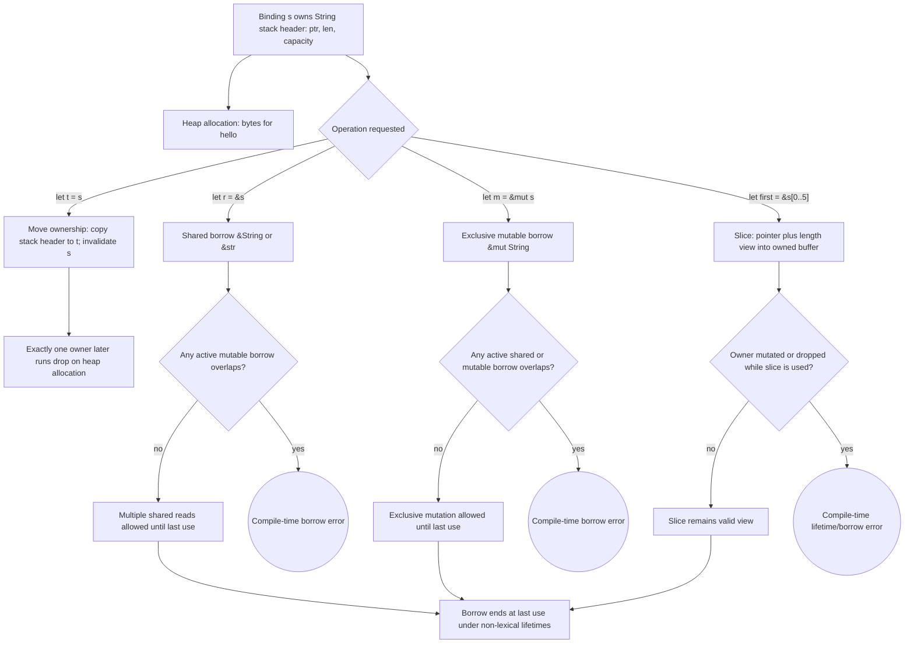

# Ownership, References, and Slices

Ownership is Rust's central idea. It is the reason Rust can give memory-safety guarantees without a garbage collector and without asking programmers to manually free ordinary values. Instead of tracking live objects at runtime, Rust checks a set of ownership, borrowing, and lifetime rules at compile time. At first this can feel stricter than other languages, but the rules are designed to prevent use-after-free, double-free, iterator invalidation, and data races.

This page sits at the center of the Rust notes. Almost every later topic uses ownership: collections own their elements, functions may take or borrow values, smart pointers extend ownership patterns, and concurrency depends on the same aliasing rules. The book introduces ownership through `String`, references, and slices because they reveal the difference between stack-only values and heap-backed data.

## Definitions

Each value in Rust has an owner. There can be only one owner at a time. When the owner goes out of scope, the value is dropped. These are the three ownership rules.

The stack stores fixed-size values in last-in, first-out order. Values such as `i32`, `bool`, and many small structs can live entirely on the stack. The heap stores data whose size may be unknown or change at runtime. A `String` stores a pointer, length, and capacity on the stack, while its text buffer lives on the heap.

A move transfers ownership from one binding to another. After `let s2 = s1;`, a heap-owning `String` is owned by `s2`; `s1` is no longer valid. Rust does not do an implicit deep copy of heap data.

`Copy` is a marker trait for types that can be duplicated by simple bitwise copy while leaving the original usable. Integers, booleans, characters, and tuples containing only `Copy` types are common examples. Types that implement `Drop`, such as `String`, cannot implement `Copy`.

Borrowing means creating a reference to a value without taking ownership. An immutable reference has type `&T`; a mutable reference has type `&mut T`. References are non-owning views and become invalid when the borrowed value is no longer valid.

The borrowing rule is: at any given time, either any number of immutable references may exist, or exactly one mutable reference may exist. These modes cannot overlap. This is the rule that prevents simultaneous reading and mutation through aliases.

A slice is a reference to a contiguous part of a collection. A string slice has type `&str`. An array or vector slice has type `&[T]`. Slices carry a pointer and a length, so they know where the view starts and how many elements are included.

## Key results

The first key result is that passing a value to a function may move it. If a function parameter type is `String`, the function receives ownership. If the caller needs to keep using the string, the function should borrow it with `&str` or `&String`; idiomatic APIs prefer `&str` when only string contents are needed.

The second key result is that returning ownership is explicit. A function can take a `String` and return it, but borrowing is usually cleaner when the function only needs to inspect the value.

The third key result is that mutable references are exclusive. This does not merely prevent obvious mistakes. It lets Rust assume that while a `&mut T` exists, no other active reference can observe stale or partially updated state.

The fourth key result is that slices tie derived views to the borrowed owner. If you compute the first word of a string as a numeric index, the index can become stale after mutation. If you compute it as a `&str`, the borrow checker prevents mutation of the original string while that slice is still used.

Proof sketch for moves: a `String` contains a pointer to heap memory. If assigning `s1` to `s2` left both bindings valid, both bindings would attempt to free the same heap allocation at scope end. Rust avoids this by invalidating `s1` after the move. Therefore exactly one owner remains responsible for `drop`.

The last-use behavior of borrows is also worth making explicit. Modern Rust does not require every borrow to last until the end of its lexical block. A borrow usually ends at its final use, which is why code can print an immutable reference and then later take a mutable reference to the same owner. This is not a loophole; it is the compiler proving that the two uses do not overlap. The rule remains the same: shared reads may coexist, but exclusive mutation may not overlap with any other active access.

## Visual



This Rust ownership diagram shows the stack header, heap allocation, move semantics, shared borrow, mutable borrow, and slice view as separate mechanisms. The borrow-checker diamonds encode the core aliasing rule: many shared references or exactly one mutable reference, with no overlap. The slice path shows why Rust ties views to the owner's lifetime and forbids mutation or drop while the view is still used.

| Form | Takes ownership? | Allows mutation? | Caller can keep using original? |
|---|---:|---:|---:|
| `String` parameter | yes | yes, if binding is `mut` | no, unless returned |
| `&String` parameter | no | no | yes |
| `&str` parameter | no | no | yes |
| `&mut String` parameter | no | yes | yes, after borrow ends |
| `String::clone()` | creates new owner | separate copy can mutate | yes |

## Worked example 1: move versus clone

Problem: understand why one `String` assignment invalidates the old binding, but `clone` does not.

1. Create a heap-backed string:

```rust
let s1 = String::from("hello");
```

The stack part of `s1` stores a pointer, length `5`, and capacity at least `5`. The heap part stores the bytes for `hello`.

2. Move it:

```rust
let s2 = s1;
```

Rust copies the stack fields into `s2`, but it does not copy the heap buffer. To avoid two owners of the same allocation, Rust treats `s1` as invalid after this line.

3. Try to use `s1`:

```rust
println!("{s1}");
```

This does not compile. The checked answer is a compile-time move error, not a runtime double-free.

4. Use `clone` when a deep copy is intended:

```rust
let a = String::from("hello");
let b = a.clone();
println!("{a} {b}");
```

5. Check the result. Both `a` and `b` are valid because `clone` allocates or otherwise creates a separate owned value. The cost is explicit in the source code.

The lesson is that assignment is cheap and moves ownership; `clone` is visible and may be expensive.

## Worked example 2: preventing a stale first-word index

Problem: find the first word in `"hello world"` and show why returning a slice is safer than returning an index.

1. A numeric-index function might return `5`, the byte position of the first space:

```rust
let mut s = String::from("hello world");
let word_end = 5;
```

2. Now mutate the string:

```rust
s.clear();
```

The string is empty, but `word_end` is still `5`. The index is disconnected from the data. Using it later would be logically wrong and could lead to panics if used for slicing.

3. Use a slice instead:

```rust
let mut s = String::from("hello world");
let word = first_word(&s);
```

Here `word` is a `&str` that borrows from `s`.

4. Try to clear while `word` is still needed:

```rust
s.clear();
println!("{word}");
```

This is rejected because `clear` requires a mutable borrow of `s`, while `word` is an immutable borrow still in use.

5. Check the answer. Returning `&str` couples the result to the original string's lifetime. The compiler prevents the stale-view bug.

## Code

```rust
fn first_word(s: &str) -> &str {
    for (index, byte) in s.bytes().enumerate() {
        if byte == b' ' {
            return &s[..index];
        }
    }

    s
}

fn describe_message(message: &str) -> String {
    let first = first_word(message);
    format!("first word: {first}, total bytes: {}", message.len())
}

fn main() {
    let message = String::from("ownership matters");
    let report = describe_message(&message);

    println!("{report}");
    println!("original still usable: {message}");
}
```

The function accepts `&str`, so callers can pass either a string literal or a borrowed `String`. The return type of `first_word` is also `&str`, meaning the result is a slice into the input rather than a newly allocated string.

## Common pitfalls

- Expecting assignment of `String`, `Vec<T>`, or `HashMap<K, V>` to behave like a deep copy.
- Adding `clone` everywhere to silence move errors. Prefer borrowing unless a real independent copy is needed.
- Taking `&String` when `&str` would make the function more flexible.
- Holding an immutable reference and then trying to mutate the owner before the reference is no longer used.
- Creating two active `&mut` references to the same value.
- Returning a reference to a local variable. The local value is dropped when the function ends.
- Treating string slice indices as character positions. String indices are byte offsets and must be on UTF-8 boundaries.

## Connections

- [Common programming concepts](/cs/programming/rust/common-programming-concepts)
- [Structs, methods, and enums](/cs/programming/rust/structs-methods-enums)
- [Common collections](/cs/programming/rust/common-collections)
- [Generics, traits, and lifetimes](/cs/programming/rust/generics-traits-lifetimes)
- [Smart pointers](/cs/programming/rust/smart-pointers)
- [Concurrency and shared state](/cs/programming/rust/concurrency-and-shared-state)
