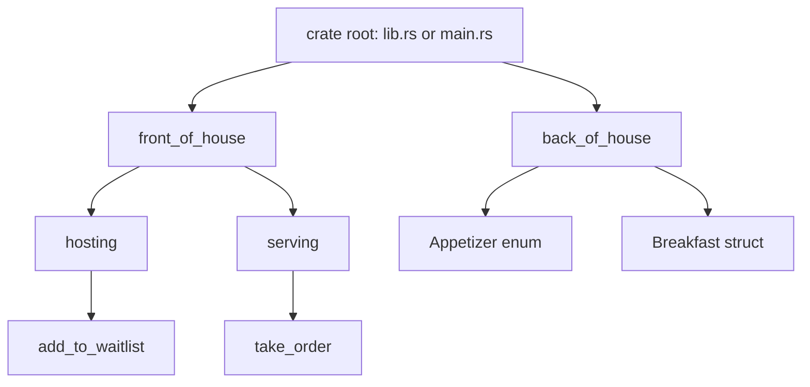

# Packages, Crates, and Modules

As Rust projects grow, the problem changes from "can this file compile?" to "where should this item live, who can use it, and how do names resolve?" The book's module-system chapter answers those questions with packages, crates, modules, paths, visibility, and `use`. These concepts are Rust's way to separate public API from private implementation while keeping compilation units explicit.

This page follows the custom-type pages because modules are often where structs, enums, functions, and traits become part of a library boundary. It also prepares for [Cargo workflows](/cs/programming/rust/cargo-crates-io-workflow), where packages are published, versioned, and consumed by other crates.

## Definitions

A package is a Cargo feature: a bundle containing a `Cargo.toml` manifest and one or more crates. A package can contain at most one library crate, but it may contain multiple binary crates.

A crate is a compilation unit. The crate root is the source file from which the compiler starts building the crate's module tree. For a binary crate, the default root is `src/main.rs`. For a library crate, the default root is `src/lib.rs`.

A module groups items inside a crate. Modules can contain functions, structs, enums, traits, constants, other modules, and implementations. A module tree starts at the crate root.

A path names an item. An absolute path starts from the crate root with `crate`. A relative path starts from the current module and can use `self` or `super`.

Visibility controls whether code outside a module can access an item. Items are private to their parent modules by default. `pub` makes an item visible to parent modules and external users according to where it appears. Public structs still have private fields unless each field is marked `pub`. Public enum variants are public when the enum is public.

`use` brings a path into scope, reducing repetition. It does not make the item public by itself. `pub use` both brings a name into scope and re-exports it as part of the module's public API.

The `as` keyword renames an imported item, which is useful when two paths contain items with the same final name.

## Key results

The first key result is that modules define privacy boundaries. A child module can use items from its ancestor modules, but parent modules cannot access private items inside child modules unless those items are made public.

The second key result is that public API design is deliberate. Marking a type `pub` does not automatically expose its internal fields. This lets a crate expose constructors and methods while preserving invariants.

The third key result is that the file layout follows the module tree but is not the module system itself. The declarations in `mod` statements tell Rust which modules exist. Files such as `src/front_of_house.rs` or `src/front_of_house/hosting.rs` are ways to store module contents.

The fourth key result is that idiomatic `use` paths often import a parent module for functions and a final type name for structs, enums, and other items. For example, `use std::collections::HashMap;` is common, while `use std::fmt;` keeps calls such as `fmt::Result` clear.

Proof sketch for privacy: if a module exposes a function that constructs a value but keeps the fields private, outside code cannot build invalid values directly. It must call the public function or methods, which can enforce checks. The compiler enforces this boundary during name resolution and field access.

## Visual



| Concept | Example | Meaning |
|---|---|---|
| Absolute path | `crate::front_of_house::hosting::add_to_waitlist` | Start at crate root |
| Relative path | `front_of_house::hosting::add_to_waitlist` | Start at current module |
| Parent path | `super::serve_order()` | Start at parent module |
| Private item | `fn cook_order()` | Visible only in current module and children |
| Public item | `pub fn eat_at_restaurant()` | Exposed through module boundary |
| Re-export | `pub use front_of_house::hosting;` | Public shortcut in API |

## Worked example 1: making a restaurant API public

Problem: expose a restaurant function that lets outside code add a customer to a waitlist while keeping internal serving functions private.

1. Start with the module tree:

```rust
mod front_of_house {
    pub mod hosting {
        pub fn add_to_waitlist() {}
    }

    mod serving {
        fn take_order() {}
    }
}
```

2. Check visibility. `front_of_house` is private to the crate root, but code in the crate root can access it because it is a child module. The `hosting` module is public, and `add_to_waitlist` is public inside it.

3. Write a public crate-level function:

```rust
pub fn eat_at_restaurant() {
    crate::front_of_house::hosting::add_to_waitlist();
}
```

4. Try to call `serving::take_order` from outside `front_of_house`. This fails because `serving` is private and `take_order` is private. The implementation detail stays hidden.

5. Check the answer. External users can call `eat_at_restaurant`, and the crate can internally route that call to the public hosting operation. They cannot call the serving internals.

This is the smallest version of an API boundary: one public function backed by private organization.

## Worked example 2: public struct with private fields

Problem: allow users to create a breakfast order but prevent them from changing a required seasonal field directly.

1. Define the struct:

```rust
mod back_of_house {
    pub struct Breakfast {
        pub toast: String,
        seasonal_fruit: String,
    }
}
```

2. Notice the mixed visibility. The type is public. The `toast` field is public. The `seasonal_fruit` field is private.

3. Add a constructor:

```rust
impl Breakfast {
    pub fn summer(toast: &str) -> Breakfast {
        Breakfast {
            toast: String::from(toast),
            seasonal_fruit: String::from("peaches"),
        }
    }
}
```

4. Use it:

```rust
let mut meal = back_of_house::Breakfast::summer("Rye");
meal.toast = String::from("Wheat");
```

5. Check what cannot be done:

```rust
meal.seasonal_fruit = String::from("blueberries");
```

That assignment is rejected outside `back_of_house`. The checked answer is that callers can customize toast but cannot break the seasonal-fruit invariant.

## Code

```rust
mod inventory {
    #[derive(Debug)]
    pub enum Category {
        Book,
        Tool,
        Food,
    }

    #[derive(Debug)]
    pub struct Item {
        pub name: String,
        category: Category,
    }

    impl Item {
        pub fn new(name: &str, category: Category) -> Item {
            Item {
                name: String::from(name),
                category,
            }
        }

        pub fn category(&self) -> &Category {
            &self.category
        }
    }
}

use inventory::{Category, Item};

fn main() {
    let item = Item::new("Rust book", Category::Book);
    println!("{} is a {:?}", item.name, item.category());
}
```

The field `name` is public and can be read directly. The field `category` is private, so outside code uses a method. This keeps the representation controlled while still exposing needed information.

## Common pitfalls

- Making a module `pub` but forgetting to make the item inside it `pub`.
- Making a struct `pub` and assuming its fields are public.
- Overusing `use crate::...` when a short relative path would be clearer inside nearby modules.
- Re-exporting implementation details with `pub use` and accidentally committing to them as public API.
- Confusing packages and crates. A package is the Cargo bundle; a crate is a compilation unit.
- Moving files around without updating `mod` declarations.
- Importing two items with the same final name without using `as` or keeping module-qualified names.

## Connections

- [Getting started, toolchain, and Cargo](/cs/programming/rust/getting-started-toolchain-cargo)
- [Structs, methods, and enums](/cs/programming/rust/structs-methods-enums)
- [Common collections](/cs/programming/rust/common-collections)
- [Cargo and crates.io workflow](/cs/programming/rust/cargo-crates-io-workflow)
- [Object-oriented and advanced features](/cs/programming/rust/object-oriented-and-advanced-features)
