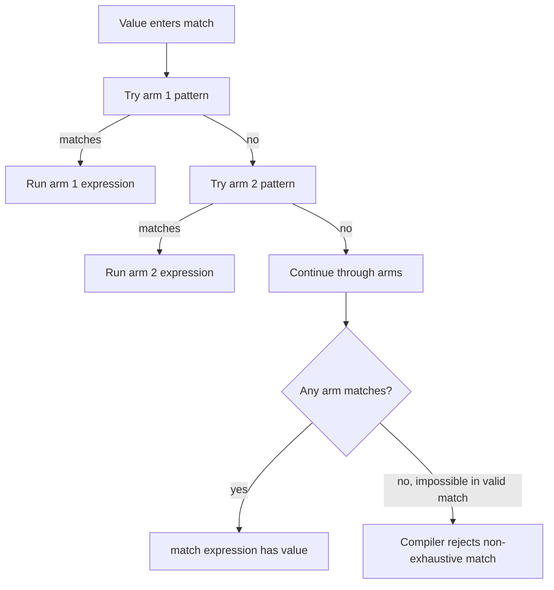

# Pattern Matching

Pattern matching is Rust's way to describe the shape of data and bind useful pieces of it. It appears in `match`, `if let`, `while let`, `let` bindings, `for` loops, function parameters, and closures. The basic idea is simple: compare a value to patterns from top to bottom, run the first matching arm, and let the compiler check whether all possible cases have been covered where exhaustive handling is required.


*Figure: Rust connects systems control with compile-time memory-safety guarantees. Image: [Wikimedia Commons](https://commons.wikimedia.org/wiki/File:Rust_programming_language_black_logo.svg), Rust Foundation, CC BY 4.0.*

This page expands the enum material from [structs, methods, and enums](/cs/programming/rust/structs-methods-enums). It also connects to [error handling](/cs/programming/rust/error-handling), because `Result` is usually handled with patterns, and to [ownership](/cs/programming/rust/ownership-references-slices), because patterns can move, copy, or borrow parts of a value.

## Definitions

A pattern is syntax that matches the structure of a value. Literal patterns match exact values. Variable patterns bind values. Wildcard patterns such as `_` match anything without binding it. Destructuring patterns break structs, tuples, arrays, references, and enums into parts.

`match` is an expression with arms. Each arm has a pattern and code to run if the pattern matches. In ordinary `match`, arms must be exhaustive: every possible input value must be covered.

`if let` is a shorter form for matching one interesting pattern and ignoring the rest. It is useful when the code only cares about one enum variant.

`while let` repeats while a pattern continues to match. It is often used to pop values from a stack-like collection.

Patterns are either refutable or irrefutable. An irrefutable pattern always matches, such as `let x = 5;`. A refutable pattern may fail, such as `Some(x)`, because the value might be `None`.

A match guard is an extra `if` condition on a `match` arm. It refines a pattern when structural matching alone is not enough.

The binding operator `@` lets a pattern test a value and bind it at the same time:

```rust
id @ 3..=7
```

This matches numbers from `3` through `7` and binds the matched number to `id`.

## Key results

The first key result is exhaustiveness. Matching an `Option<T>` must account for both `Some(value)` and `None`, unless a wildcard or catchall arm covers the rest. This is one of Rust's strongest tools for preventing forgotten cases.

The second key result is ordering. `match` arms are checked from top to bottom. A broad pattern placed before a narrow pattern can make the narrow arm unreachable. The compiler warns about unreachable patterns in many cases.

The third key result is that patterns can bind by move. If a pattern extracts a `String` from an enum by value, ownership moves into the binding. Use references or match on borrowed values when the original owner must remain usable.

The fourth key result is that `_` and names beginning with underscore are different. `_` does not bind at all. A name such as `_unused` still binds the value, which may move it, but suppresses unused-variable warnings.

Proof sketch for exhaustiveness: an enum definition lists all possible variants. A `match` over that enum can be checked against the variant set. If any variant is not represented by a pattern and no wildcard covers it, there exists an input for which the expression has no result. Rust rejects that program.

Pattern matching also clarifies ownership at the point where data is opened. Matching on an owned enum can move owned fields out of the enum. Matching on a reference, such as `match &message`, generally binds references to the fields instead. This distinction is useful when working with `String`, `Vec<T>`, or other non-`Copy` data. If a later line still needs the original value, match by reference or use patterns such as `ref` where appropriate. The book's later pattern chapter emphasizes that patterns are not only for `match`: they appear in `let`, `for`, function parameters, and closures. That means the same move-versus-borrow awareness applies in many places, not only in large enum matches.

A final practical rule is to prefer the pattern form that matches the data's real shape. If the logic cares about only one variant, `if let` may communicate that better than a full `match`. If every variant has meaning, a full `match` is better because exhaustiveness protects future changes.

When an enum grows, exhaustive matches become a useful to-do list because the compiler points at every site that needs a decision.

## Visual



| Pattern form | Example | Meaning |
|---|---|---|
| Literal | `0` | Match exactly zero |
| Range | `1..=5` | Match inclusive range |
| Variable | `x` | Match anything and bind it |
| Wildcard | `_` | Match anything and bind nothing |
| Tuple | `(x, y)` | Destructure two elements |
| Struct | `Point { x, y: 0 }` | Destructure named fields |
| Enum | `Some(value)` | Match a specific variant |
| Guard | `Some(x) if x > 0` | Match plus condition |
| Binding | `id @ 3..=7` | Test and bind |

## Worked example 1: matching nested optional data

Problem: given `Option<Result<u32, String>>`, report whether there is a successful number, an error message, or no value.

1. Define a sample value:

```rust
let value = Some(Ok(12));
```

The outer enum says the value may be present. The inner enum says the present value may be success or error.

2. Write the full match:

```rust
let message = match value {
    Some(Ok(n)) => format!("number: {n}"),
    Some(Err(e)) => format!("error: {e}"),
    None => String::from("missing"),
};
```

3. Trace the first arm. `Some(Ok(n))` matches because the outer value is `Some` and the inner value is `Ok(12)`. The variable `n` binds to `12`.

4. The result expression is:

```rust
format!("number: {n}")
```

5. Check the answer. `message` is `"number: 12"`. The second and third arms are not evaluated.

6. Test another input. If `value` were `Some(Err(String::from("bad input")))`, the first arm would fail, the second would match, and `message` would be `"error: bad input"`.

The important point is that nested patterns avoid manual unwrapping. The shape of the data is handled directly.

## Worked example 2: destructuring a struct with a guard

Problem: classify a point as the origin, a horizontal-axis point, a vertical-axis point, a diagonal point, or a general point.

1. Define the type and value:

```rust
struct Point {
    x: i32,
    y: i32,
}

let p = Point { x: -3, y: 3 };
```

2. Match by named fields:

```rust
let label = match p {
    Point { x: 0, y: 0 } => "origin",
    Point { x, y: 0 } => "x axis",
    Point { x: 0, y } => "y axis",
    Point { x, y } if x.abs() == y.abs() => "diagonal",
    Point { .. } => "general",
};
```

3. Check arm by arm. The point is not `(0, 0)`, so the first arm fails. Its `y` is not `0`, so the second arm fails. Its `x` is not `0`, so the third arm fails.

4. The fourth arm destructures both fields and applies the guard. `x.abs()` is `3`, and `y.abs()` is `3`, so the guard is true.

5. The checked answer is `"diagonal"`.

Note that the final `Point { .. }` arm is needed for exhaustiveness. Without it, points such as `(2, 5)` would have no matching arm.

## Code

```rust
#[derive(Debug)]
enum Command {
    Quit,
    Move { x: i32, y: i32 },
    Echo(String),
    ChangeColor(u8, u8, u8),
}

fn describe(command: &Command) -> String {
    match command {
        Command::Quit => String::from("stop the program"),
        Command::Move { x, y } if *x == 0 && *y == 0 => {
            String::from("move to the origin")
        }
        Command::Move { x, y } => format!("move to ({x}, {y})"),
        Command::Echo(text) => format!("echo {text:?}"),
        Command::ChangeColor(r, g, b) => {
            format!("set color to rgb({r}, {g}, {b})")
        }
    }
}

fn main() {
    let commands = [
        Command::Move { x: 0, y: 0 },
        Command::Echo(String::from("hello")),
        Command::ChangeColor(255, 128, 0),
        Command::Quit,
    ];

    for command in &commands {
        println!("{}", describe(command));
    }
}
```

The function borrows each command, so it can describe commands without consuming the array. The guard on the origin-specific move arm must appear before the general move arm.

## Common pitfalls

- Forgetting a variant in a `match` over an enum.
- Placing `_` or another catchall arm before more specific arms.
- Using `if let` when all variants should be handled explicitly.
- Accidentally moving a value out of a pattern when a borrowed match would be better.
- Assuming `_name` does not bind. It does bind; only `_` avoids binding.
- Expecting guards to count for exhaustiveness in the same way as plain patterns. A guarded arm might not match if its condition is false.
- Matching string data by byte index instead of using safe methods and slices.

## Connections

- [Structs, methods, and enums](/cs/programming/rust/structs-methods-enums)
- [Error handling](/cs/programming/rust/error-handling)
- [Common collections](/cs/programming/rust/common-collections)
- [Generics, traits, and lifetimes](/cs/programming/rust/generics-traits-lifetimes)
- [Macros and unsafe Rust](/cs/programming/rust/macros-and-unsafe-rust)
