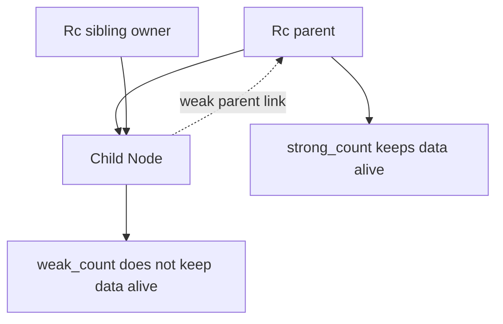

# Smart Pointers

Smart pointers are data structures that act like pointers but also carry extra behavior or metadata. The book introduces them after ownership, traits, and collections because they combine all three. `Box<T>` puts data on the heap. `Rc<T>` enables multiple ownership in single-threaded code. `RefCell<T>` moves borrow-rule checking from compile time to runtime for specific interior-mutability patterns. `Weak<T>` breaks reference cycles.

This page builds on [ownership](/cs/programming/rust/ownership-references-slices) and [generics, traits, and lifetimes](/cs/programming/rust/generics-traits-lifetimes). It also prepares for [concurrency](/cs/programming/rust/concurrency-and-shared-state), where `Arc<T>` and `Mutex<T>` play related roles in multi-threaded programs.

## Definitions

`Box<T>` is an owning pointer to heap-allocated data. It is useful when a type's size is not known at compile time, when transferring ownership of large data without copying it, or when using trait objects.

`Deref` is a trait that lets smart pointers behave like references. Implementing `Deref` allows dereference syntax and deref coercions, such as passing `&String` where `&str` is expected.

`Drop` is a trait for cleanup code that runs when a value goes out of scope. Rust calls `drop` automatically. You cannot call the `Drop::drop` method directly; use `std::mem::drop` to drop a value early.

`Rc<T>` is a reference-counted pointer for single-threaded multiple ownership. Cloning an `Rc<T>` increments the strong count; dropping one decrements it. The data is freed when the strong count reaches zero.

`RefCell<T>` provides interior mutability. It enforces the borrowing rules at runtime rather than compile time. `borrow` returns an immutable smart reference; `borrow_mut` returns a mutable smart reference. Violating the rules causes a panic.

`Weak<T>` is a non-owning reference-counted pointer associated with `Rc<T>`. It does not keep the value alive. Calling `upgrade` returns `Option<Rc<T>>` because the value may have been dropped.

## Key results

The first key result is that `Box<T>` gives recursive types a known size. An enum variant containing itself directly would be infinitely sized. A variant containing `Box<List>` has a fixed pointer size.

The second key result is that `Deref` and `Drop` are core smart-pointer traits. `Deref` controls reference-like access; `Drop` controls cleanup.

The third key result is that `Rc<T>` allows shared ownership but only immutable access by default. It is for single-threaded graphs or shared data where no mutation is needed through the shared pointer.

The fourth key result is that `RefCell<T>` should be used when the programmer can prove borrow rules are obeyed but the compiler cannot. It trades compile-time rejection for runtime checks.

The fifth key result is that `Rc<RefCell<T>>` combines multiple ownership with interior mutability, but it must be used carefully. It is powerful in tree and graph structures, but cycles can leak memory unless back-references use `Weak<T>`.

Proof sketch for recursive list sizing: `enum List { Cons(i32, List), Nil }` asks the compiler to store a `List` inside a `List` with no end, so the size is infinite. `enum List { Cons(i32, Box<List>), Nil }` stores an integer plus a pointer-sized box, so the enum has a finite known size.

The smart-pointer chapter also introduces a design smell: if every ownership problem is solved by `Rc<RefCell<T>>`, the program may be hiding unclear ownership. That combination is valid when the domain really has shared mutable nodes in one thread, such as some graph or tree structures. It is not a replacement for thinking about who owns data and who merely observes it. A simpler `Box<T>`, borrowed reference, or returned value is often easier to reason about.

`Weak<T>` is the main tool for parent links because it expresses observation without ownership. A child node may need to know its parent, but if parent and child both hold strong `Rc` pointers to each other, neither strong count reaches zero. Rust's memory safety does not guarantee the absence of leaks. A reference cycle is memory safe but still undesirable. Using `Weak<T>` for back-pointers makes the ownership graph acyclic while still allowing a temporary upgrade when the parent is alive.

`Deref` coercion is another reason smart pointers can feel natural. If a type implements `Deref<Target = str>`, a reference to that type can often be used where `&str` is expected. This is convenient, but it should not hide expensive behavior. `Deref` should feel like access to the same value, not an arbitrary computation. Similarly, `Drop` should release resources and maintain invariants, not perform surprising program logic that readers would not expect at scope exit.

The guiding question is whether the pointer type communicates something ordinary references cannot. `Box<T>` communicates heap ownership, `Rc<T>` communicates shared ownership, `RefCell<T>` communicates runtime borrow checks, and `Weak<T>` communicates non-owning reachability. If none of those meanings is needed, a plain reference or owned value is usually clearer.

That question also helps during review. A smart pointer in a field should explain the data structure's ownership graph, not merely silence a compiler error.

If the graph cannot be explained, the type is probably carrying design uncertainty.

Clarify ownership before adding another wrapper.

The simplest owner graph usually wins.

## Visual



| Type | Ownership model | Borrow checks | Thread-safe? | Common use |
|---|---|---|---:|---|
| `Box<T>` | single owner | compile time | depends on `T` | heap allocation, recursive types |
| `Rc<T>` | multiple owners | compile time | no | shared read-only data |
| `RefCell<T>` | single owner | runtime | no | interior mutability |
| `Rc<RefCell<T>>` | multiple owners | runtime for inner borrows | no | mutable shared graph in one thread |
| `Weak<T>` | non-owning observer | via upgraded `Rc` | no | parent links, cycle prevention |

## Worked example 1: recursive list with `Box`

Problem: define a cons list that can contain any finite number of integers.

1. A direct recursive enum is invalid:

```rust
enum List {
    Cons(i32, List),
    Nil,
}
```

The compiler cannot compute a finite size for `List`.

2. Insert indirection:

```rust
enum List {
    Cons(i32, Box<List>),
    Nil,
}
```

3. Construct a list:

```rust
let list = List::Cons(
    1,
    Box::new(List::Cons(
        2,
        Box::new(List::Cons(3, Box::new(List::Nil))),
    )),
);
```

4. Check sizes conceptually. Each `Cons` stores an `i32` and a `Box<List>`. The box is a pointer with known size, so the enum is sized.

5. Check ownership. Each node owns the next node through its box. When the head is dropped, the boxes drop recursively and free the heap nodes.

The answer is a recursive data structure made possible by heap indirection.

## Worked example 2: shared mutable state with `Rc<RefCell<T>>`

Problem: let two owners share a number and update it in single-threaded code.

1. Create the shared value:

```rust
let value = Rc::new(RefCell::new(5));
```

`Rc` provides multiple ownership. `RefCell` provides runtime-checked mutation.

2. Clone owners:

```rust
let a = Rc::clone(&value);
let b = Rc::clone(&value);
```

The strong count is now `3`: `value`, `a`, and `b`.

3. Mutate through one owner:

```rust
*a.borrow_mut() += 10;
```

`borrow_mut` checks that no other active borrow exists, then returns a mutable smart reference.

4. Read through another owner:

```rust
let seen = *b.borrow();
```

The value is `15`.

5. Check the answer. All owners point to the same `RefCell<i32>`. The final inner value is `15`. If code tried to call `borrow_mut` twice at the same time, it would panic at runtime.

## Code

```rust
use std::cell::RefCell;
use std::rc::Rc;

#[derive(Debug)]
struct Counter {
    value: RefCell<i32>,
}

impl Counter {
    fn new(value: i32) -> Counter {
        Counter {
            value: RefCell::new(value),
        }
    }

    fn increment(&self) {
        *self.value.borrow_mut() += 1;
    }
}

fn main() {
    let counter = Rc::new(Counter::new(0));
    let left = Rc::clone(&counter);
    let right = Rc::clone(&counter);

    left.increment();
    right.increment();

    println!("count = {}", counter.value.borrow());
}
```

The method takes `&self`, yet it mutates the inner value through `RefCell`. This is interior mutability and should be used when it models a real ownership need.

## Common pitfalls

- Reaching for smart pointers before ordinary ownership and borrowing have been tried.
- Using `Rc<T>` in multi-threaded code. Use `Arc<T>` for atomic reference counting across threads.
- Assuming `RefCell<T>` makes borrow errors impossible. It moves errors to runtime panics.
- Creating `Rc` cycles with parent and child pointers that both own each other.
- Calling `clone` on `Rc<T>` without recognizing it increments a reference count rather than deep-copying `T`.
- Trying to call `Drop::drop` directly.
- Hiding design problems behind `Rc<RefCell<T>>` when clearer ownership would be possible.

## Connections

- [Ownership, references, and slices](/cs/programming/rust/ownership-references-slices)
- [Generics, traits, and lifetimes](/cs/programming/rust/generics-traits-lifetimes)
- [Common collections](/cs/programming/rust/common-collections)
- [Concurrency and shared state](/cs/programming/rust/concurrency-and-shared-state)
- [Object-oriented and advanced features](/cs/programming/rust/object-oriented-and-advanced-features)
