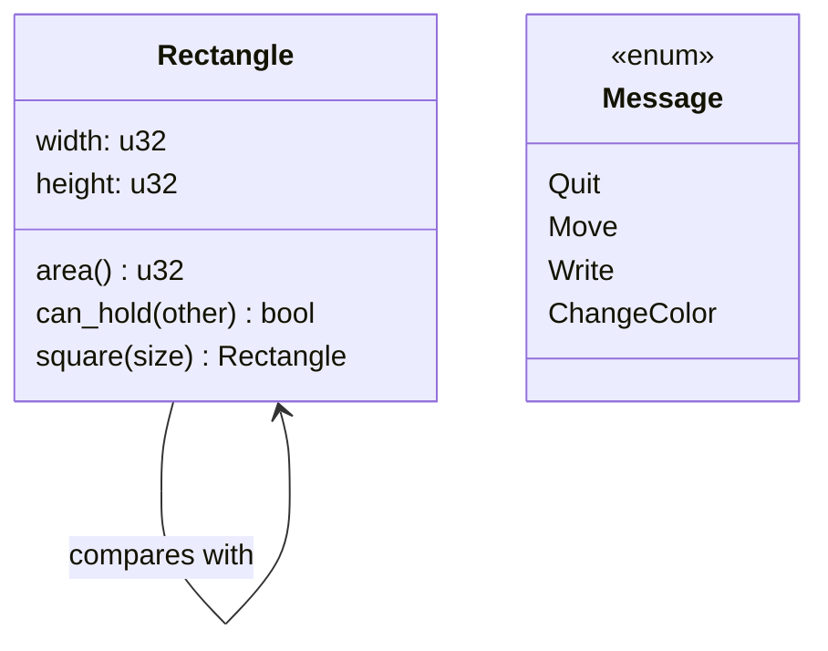

# Structs, Methods, and Enums

Structs and enums are Rust's main tools for making domain-specific types. A struct names a group of related fields. An enum defines a value that can be one of several variants. Together they let a program model data more honestly than loose tuples or strings. Rust then combines these types with methods, associated functions, traits, and pattern matching.


*Figure: Rust connects systems control with compile-time memory-safety guarantees. Image: [Wikimedia Commons](https://commons.wikimedia.org/wiki/File:Rust_programming_language_black_logo.svg), Rust Foundation, CC BY 4.0.*

This page covers the book's material on structs and the beginning of enum-based design. It prepares for the separate page on [pattern matching](/cs/programming/rust/pattern-matching), where enums become especially powerful. It also connects to [ownership](/cs/programming/rust/ownership-references-slices), because choosing owned fields such as `String` versus borrowed fields such as `&str` affects lifetimes.

## Definitions

A struct is a custom type made of named fields:

```rust
struct User {
    active: bool,
    username: String,
    email: String,
    sign_in_count: u64,
}
```

Struct update syntax creates a new value by taking some fields from another value:

```rust
let user2 = User {
    email: String::from("new@example.com"),
    ..user1
};
```

If moved fields are reused from `user1`, the old value may become partially or fully unusable depending on which fields implement `Copy`.

A tuple struct gives a name to a tuple-shaped type:

```rust
struct Color(i32, i32, i32);
struct Point(i32, i32, i32);
```

A unit-like struct has no fields and can be useful for marker types or trait implementations:

```rust
struct AlwaysEqual;
```

An `impl` block defines methods and associated functions for a type. A method takes `self`, `&self`, or `&mut self` as its first parameter. An associated function does not take `self` and is called with `Type::function()`.

An enum defines variants:

```rust
enum IpAddr {
    V4(u8, u8, u8, u8),
    V6(String),
}
```

Variants can carry no data, tuple-like data, or struct-like named fields. `Option<T>` is the standard enum for a value that may be present or absent. Its variants are `Some(T)` and `None`.

## Key results

The first key result is that structs make field meaning explicit. A tuple `(u32, u32)` might represent width and height, coordinates, or a range. A struct with fields `width` and `height` documents intent and allows direct field access by name.

The second key result is that methods organize behavior around data without hiding ownership rules. A method taking `&self` borrows the receiver immutably, a method taking `&mut self` mutably borrows it, and a method taking `self` consumes it.

The third key result is that enums encode alternatives in the type system. Instead of storing a string tag and optional fields, an enum says exactly which variants exist and what data each variant carries. The compiler can later check whether a `match` handles every variant.

The fourth key result is that `Option<T>` removes null from ordinary Rust APIs. A missing value is represented explicitly as `None`, so callers must handle absence before using the inner value.

Proof sketch for `Option<T>`: if a function returns `Option<u32>`, the caller cannot accidentally add the result to another number. The result is not a `u32`; it is either `Some(number)` or `None`. To get the number, code must use `match`, `if let`, combinator methods, or another explicit handling strategy. The type forces the absence case into the program logic.

Another result is that method receivers communicate ownership policy. A builder-like method that takes `self` can consume an old value and return a transformed one. A measurement method such as `area` should take `&self` because it only observes. A method such as `rename` should take `&mut self` if it changes fields in place. This receiver choice is part of the API. Callers can see whether a method will leave the original value usable, require exclusive access, or move the value entirely.

Struct and enum definitions also influence debugging. The book introduces derived `Debug` output because custom types cannot be printed automatically with the normal display formatter. Deriving `Debug` is not just a convenience for examples; it is a common early step when designing a type because it lets tests, logs, and failing assertions show the actual field values. The `dbg!` macro is another development tool: it takes ownership of an expression unless the expression is borrowed, prints file and line information, and returns the value. That behavior follows the same ownership rules as any other function or macro call, so even debugging tools teach the core model.

Enums are especially valuable when a program would otherwise maintain parallel fields. A message type with a `kind` string, optional coordinates, optional text, and optional color values allows combinations that do not make sense. An enum variant carries only the data for that case. This makes invalid states harder to construct and makes later `match` expressions a complete checklist of possibilities. In Rust, good type design often means moving rules from comments into the shape of the data.

The same principle applies to structs: if two values must change together, putting them in one struct with methods can protect the relationship better than passing them around separately.

This is why Rust examples often become clearer after naming a type. A name gives the compiler, tests, and readers one place to attach behavior.

Unnamed groups rarely scale as requirements grow.

Names carry invariants.

## Visual



| Modeling need | Prefer | Why |
|---|---|---|
| Related fields with stable names | Struct | Clear field access and method receiver |
| Same shape but different meaning | Tuple struct | New type prevents accidental mixing |
| No data, only a marker | Unit-like struct | Can implement traits without storage |
| One of several alternatives | Enum | Variants are checked by the compiler |
| Maybe a value, maybe not | `Option<T>` | Absence is explicit, no null reference |

## Worked example 1: rectangle methods and associated functions

Problem: model a rectangle, compute its area, and decide whether it can contain another rectangle.

1. Define the struct:

```rust
struct Rectangle {
    width: u32,
    height: u32,
}
```

2. Add an `impl` block:

```rust
impl Rectangle {
    fn area(&self) -> u32 {
        self.width * self.height
    }
}
```

The receiver is `&self` because computing area only reads fields.

3. Add comparison behavior:

```rust
fn can_hold(&self, other: &Rectangle) -> bool {
    self.width > other.width && self.height > other.height
}
```

Both rectangles are borrowed. Neither is consumed.

4. Add an associated constructor:

```rust
fn square(size: u32) -> Rectangle {
    Rectangle {
        width: size,
        height: size,
    }
}
```

This function is called as `Rectangle::square(3)`, not on an existing rectangle.

5. Check with concrete values. A `Rectangle { width: 8, height: 5 }` has area `40`. It can hold `Rectangle { width: 7, height: 4 }` because both dimensions are strictly larger. It cannot hold `Rectangle { width: 8, height: 4 }` under this definition because the width is equal, not larger.

## Worked example 2: choosing an enum over several structs

Problem: represent messages sent to an application: quit, move to coordinates, write text, and change color.

1. A weak design might use separate structs plus a string tag:

```rust
struct RawMessage {
    kind: String,
    payload: String,
}
```

This allows invalid combinations such as `kind = "move"` with payload `"red"`.

2. Define an enum instead:

```rust
enum Message {
    Quit,
    Move { x: i32, y: i32 },
    Write(String),
    ChangeColor(i32, i32, i32),
}
```

3. Construct values:

```rust
let a = Message::Quit;
let b = Message::Move { x: 10, y: -3 };
let c = Message::Write(String::from("hello"));
```

4. Add a method:

```rust
impl Message {
    fn is_terminal(&self) -> bool {
        matches!(self, Message::Quit)
    }
}
```

5. Check the answer. The enum prevents impossible payload shapes. `Move` always has `x` and `y`; `Write` always owns a string; `Quit` carries no irrelevant data.

## Code

```rust
#[derive(Debug)]
struct Rectangle {
    width: u32,
    height: u32,
}

impl Rectangle {
    fn area(&self) -> u32 {
        self.width * self.height
    }

    fn can_hold(&self, other: &Rectangle) -> bool {
        self.width > other.width && self.height > other.height
    }

    fn square(size: u32) -> Rectangle {
        Rectangle {
            width: size,
            height: size,
        }
    }
}

fn main() {
    let outer = Rectangle {
        width: 10,
        height: 8,
    };
    let inner = Rectangle::square(5);

    println!("{outer:?} has area {}", outer.area());
    println!("Can hold inner? {}", outer.can_hold(&inner));
}
```

The `Debug` derive lets the struct be printed with `{:?}`. Derivable traits are covered again when discussing traits and appendices.

## Common pitfalls

- Using tuples for data whose fields have important names.
- Taking `self` by value in a method that only needs to read fields, causing the receiver to be moved unnecessarily.
- Forgetting that struct update syntax may move non-`Copy` fields from the original value.
- Trying to print a custom struct with `{:?}` before deriving or implementing `Debug`.
- Replacing `Option<T>` with sentinel values such as `0`, empty strings, or invalid IDs.
- Modeling alternatives with loosely related fields instead of an enum.
- Assuming enum variants all need the same payload shape. Each variant can carry different data.

## Connections

- [Ownership, references, and slices](/cs/programming/rust/ownership-references-slices)
- [Pattern matching](/cs/programming/rust/pattern-matching)
- [Generics, traits, and lifetimes](/cs/programming/rust/generics-traits-lifetimes)
- [Object-oriented and advanced features](/cs/programming/rust/object-oriented-and-advanced-features)
- [Common collections](/cs/programming/rust/common-collections)
