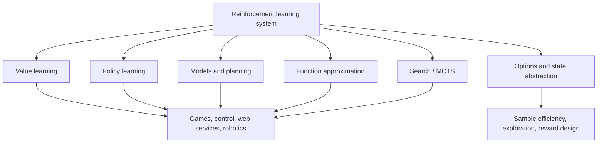

# Applications and Frontiers

Sutton and Barto close the book by showing how reinforcement learning ideas appear in substantial systems and open research directions. The case studies include TD-Gammon, Samuel's checkers player, Watson's Daily Double wagering, memory control, Atari game playing, AlphaGo and AlphaGo Zero, personalized web services, and thermal soaring. The frontier topics include general value functions, options, state representation, reward design, and unresolved issues in sample efficiency and abstraction.

The practical lesson is that successful RL systems rarely use one idea in isolation. They combine value learning, function approximation, planning, search, simulation, domain structure, and carefully chosen reward signals. The frontier lesson is similar: many hard problems in RL are not solved merely by scaling an algorithm. The agent still needs useful state, exploration, temporal abstraction, and objectives that match the intended task.

## Definitions

TD-Gammon is a backgammon program that used temporal-difference learning with self-play and function approximation. It is a landmark because it showed that TD learning could produce strong play in a complex game without relying only on handcrafted expert rules.

Samuel's checkers player predates much modern RL terminology but contains recognizable ingredients: value evaluation, self-play, and improvement from experience.

Atari game playing in the book refers to deep RL systems that learn action values from high-dimensional observations. The important concept is combining reinforcement learning with deep neural network function approximation.

AlphaGo combined supervised learning from expert games, reinforcement learning from self-play, value and policy networks, and Monte Carlo tree search. AlphaGo Zero removed the supervised expert-data stage and learned from self-play using search and neural networks.

A general value function predicts a cumulant under a policy, not necessarily ordinary reward. GVFs broaden value learning into a general predictive knowledge framework.

An option is a temporally extended course of action. It has an initiation set, an internal policy, and a termination condition. Options support temporal abstraction because a high-level policy can choose actions that last multiple time steps.

Reward design is the process of specifying the scalar signal the agent optimizes. In the RL framework, reward defines the goal; it is not merely a training hint.

Sample efficiency measures how much useful learning occurs per unit of real experience. It is a recurring challenge, especially when environment interaction is expensive.

## Key results

Self-play can generate a curriculum in competitive games. TD-Gammon and AlphaGo-style systems improve by playing against versions of themselves or search-improved policies. This reduces dependence on a fixed dataset, but it introduces stability and evaluation questions because the data distribution changes as the agent improves.

Search and learning are complementary. AlphaGo-style systems do not choose between neural networks and planning. Policy and value networks guide search; search produces stronger action choices and training targets. This is a modern expression of the planning-learning integration introduced earlier by Dyna and MCTS.

Deep RL extends function approximation, not the basic objective. A deep network can approximate $Q$, $V$, a policy, or a model, but the agent still faces delayed reward, exploration, distribution shift, bootstrapping, and off-policy instability.

Options address temporal abstraction. Instead of choosing only primitive actions at every step, an agent can learn or use extended behaviors. This can improve exploration, planning depth, and transfer, but it raises the problem of discovering useful options.

State representation is a frontier because the Markov property is not automatic. The agent's observations may omit hidden variables, history, goals, or context. Sutton and Barto emphasize that RL methods often assume a state signal; building or learning that signal remains a deep problem.

Reward design is hard because agents optimize what is specified. A reward that is only correlated with the real goal can produce undesirable behavior. The book frames reward as defining the task, so reward design is part of problem formulation, not an afterthought.

Sample efficiency remains a central limitation. Planning, models, replay, abstraction, demonstrations, and better exploration can help, but each introduces tradeoffs such as model bias, computational cost, or dependence on prior structure.

Exploration remains difficult because the useful information is often delayed and state-dependent. In a simple bandit, uncertainty belongs to actions. In a large MDP, uncertainty belongs to trajectories, representations, models, and long-horizon consequences. Optimism, intrinsic rewards, count-based bonuses, options, and model-based lookahead are all attempts to make exploration less random and more directed.

The applications chapter also shows that evaluation must match deployment. A game-playing system can be judged by win rate against strong opponents, but a web-service agent must consider user experience, delayed effects, and changing populations. A robotics controller must consider physical safety and data cost. These concerns do not replace the RL objective; they shape the MDP formulation, reward signal, constraints, and acceptable exploration strategy.

## Visual



| Case study or frontier | Core RL ideas | Why it matters |
|---|---|---|
| TD-Gammon | TD learning, self-play, function approximation | Early evidence that value learning can reach expert-level play |
| Samuel checkers | Evaluation functions, self-improvement | Historical precursor to RL game learning |
| Watson wagering | Decision making under uncertainty | RL-style value of actions in a strategic setting |
| Memory control | Control of computational resources | Shows RL outside games and robotics |
| Atari | Deep action-value learning | High-dimensional observations with delayed rewards |
| AlphaGo / AlphaGo Zero | Policy/value networks, self-play, MCTS | Integration of learning and planning |
| Personalized web services | Contextual decisions and long-run feedback | Bandits and RL in user-facing systems |
| Thermal soaring | Control under uncertainty | RL for physical sequential decision making |
| Options | Temporally extended actions | Abstraction over time |
| General value functions | Predictive knowledge | Values beyond ordinary reward |

## Worked example 1: Option value over multiple primitive steps

Problem: An option runs for three primitive steps. It receives rewards $1$, $0$, and $4$, then terminates in state $s'$. The high-level value estimate after termination is $V(s')=10$. Let $\gamma=0.9$. Compute the option's backed-up return for the state where it was initiated.

Step 1: Write the semi-Markov-style return:

$$
G = R_1+\gamma R_2+\gamma^2R_3+\gamma^3V(s').
$$

Step 2: Substitute:

$$
G=1+0.9(0)+0.9^2(4)+0.9^3(10).
$$

Step 3: Compute powers:

$$
0.9^2=0.81,\qquad 0.9^3=0.729.
$$

Step 4: Compute weighted terms:

$$
0.9(0)=0,\quad 0.81(4)=3.24,\quad 0.729(10)=7.29.
$$

Step 5: Add:

$$
G=1+0+3.24+7.29=11.53.
$$

Check: The option return discounts both internal rewards and the value after option termination. The checked answer is $11.53$.

## Worked example 2: Reward design exposes the real objective

Problem: A robot can choose action safe or shortcut. Safe reaches the goal in 5 steps with no collisions. Shortcut reaches the goal in 2 steps but causes one collision. Suppose reward is $+10$ for reaching the goal, $-1$ per step, and collision penalty is either $0$ or $-20$. With $\gamma=1$, compare returns.

Step 1: Return for safe:

The robot pays five step costs and gets the goal reward:

$$
G_{\text{safe}}=10-5=5.
$$

Step 2: Shortcut return with no collision penalty:

$$
G_{\text{shortcut},0}=10-2+0=8.
$$

The shortcut is preferred because $8\gt 5$.

Step 3: Shortcut return with collision penalty $-20$:

$$
G_{\text{shortcut},-20}=10-2-20=-12.
$$

Step 4: Compare:

$$
5>-12.
$$

Now safe is preferred.

Check: The policy changes because the reward defines the task. If collisions matter to the designer but are absent from reward, the agent has no reason to avoid them.

## Code

```python
import torch

torch.manual_seed(0)

# Tiny DQN-style update for a batch of transitions.
n_states, n_actions = 5, 2
q_net = torch.nn.Sequential(
    torch.nn.Linear(n_states, 16),
    torch.nn.ReLU(),
    torch.nn.Linear(16, n_actions),
)
target_net = torch.nn.Sequential(
    torch.nn.Linear(n_states, 16),
    torch.nn.ReLU(),
    torch.nn.Linear(16, n_actions),
)
target_net.load_state_dict(q_net.state_dict())
optimizer = torch.optim.Adam(q_net.parameters(), lr=1e-2)
gamma = 0.99

states = torch.eye(n_states)[:4]
actions = torch.tensor([1, 1, 0, 1])
rewards = torch.tensor([0.0, 0.0, -0.1, 1.0])
next_states = torch.eye(n_states)[1:5]
dones = torch.tensor([False, False, False, True])

q_sa = q_net(states).gather(1, actions.view(-1, 1)).squeeze(1)
with torch.no_grad():
    next_q = target_net(next_states).max(dim=1).values
    targets = rewards + gamma * next_q * (~dones)

loss = torch.nn.functional.mse_loss(q_sa, targets)
optimizer.zero_grad()
loss.backward()
optimizer.step()

print("DQN-style loss:", float(loss))
```

## Common pitfalls

- Treating impressive applications as evidence that a single algorithm is universally sufficient. The case studies combine representation, search, data generation, and domain structure.
- Forgetting that deep RL still has the deadly-triad issues in new forms: approximation, bootstrapping, and off-policy data remain delicate.
- Designing reward after implementation. Reward defines the task and should be examined before training.
- Equating state with raw observation. Many applications require memory, preprocessing, learned representation, or belief state.
- Assuming options are given for free. Discovering useful temporal abstractions is itself a hard learning problem.
- Measuring success only by final score while ignoring sample efficiency, compute cost, robustness, and safety constraints.

## Connections

- [Planning and learning with tabular methods](/cs/reinforcement-learning/planning-and-learning)
- [Policy gradient methods](/cs/reinforcement-learning/policy-gradient-methods)
- [Off-policy methods with approximation](/cs/reinforcement-learning/off-policy-approximation)
- [Deep learning](/cs/deep-learning/)
- [Machine learning](/cs/machine-learning/)
