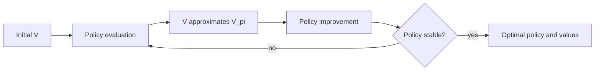

# Dynamic Programming

Dynamic programming solves finite MDPs when a complete model is available. In Sutton and Barto's structure, DP is less a practical universal method than a conceptual reference point. It shows what exact Bellman backups look like, why policy evaluation and policy improvement fit together, and how generalized policy iteration underlies many later model-free algorithms.

The main assumption is strong: the agent knows $p(s',r \mid s,a)$ for every relevant state and action. With that model, the agent can update value estimates by sweeping over states instead of waiting for sampled experience. Monte Carlo and temporal-difference methods later replace these full expected backups with sample backups.

## Definitions

Policy evaluation, also called prediction, computes $V_\pi$ for a fixed policy $\pi$. Iterative policy evaluation starts from arbitrary $V_0$ and applies

$$
V_{k+1}(s) =
\sum_a \pi(a \mid s)
\sum_{s',r} p(s',r \mid s,a)
\left[r+\gamma V_k(s')\right].
$$

Policy improvement constructs a better or equal policy by acting greedily with respect to the current value function:

$$
\pi'(s) \in \arg\max_a
\sum_{s',r} p(s',r \mid s,a)\left[r+\gamma V_\pi(s')\right].
$$

Policy iteration alternates complete or approximate policy evaluation with policy improvement until the policy is stable. Value iteration combines the two ideas by repeatedly applying the Bellman optimality backup:

$$
V_{k+1}(s) =
\max_a \sum_{s',r} p(s',r \mid s,a)
\left[r+\gamma V_k(s')\right].
$$

Asynchronous DP updates states in any order, sometimes one state at a time, as long as all states continue to receive attention. Generalized policy iteration is the broader idea that evaluation and improvement processes interact, each pushing the other: value estimates move toward the value of the current policy, and the policy moves toward greediness with respect to the current values.

## Key results

The policy improvement theorem is the hinge. If for every state

$$
Q_\pi(s,\pi'(s)) \ge V_\pi(s),
$$

then $\pi'$ is at least as good as $\pi$: $V_{\pi'}(s)\ge V_\pi(s)$ for all $s$. The greedy policy satisfies this condition because it chooses an action maximizing one-step lookahead from $V_\pi$.

Policy iteration is guaranteed to find an optimal policy in a finite discounted MDP. The reasoning is finite: each improvement step either leaves the policy unchanged, in which case it is optimal, or produces a strictly better policy for at least one state. There are finitely many deterministic policies.

Value iteration converges to $V_*$ for discounted finite MDPs because the Bellman optimality operator is a contraction in the max norm. Intuitively, applying the operator reduces the effect of value errors by at least a factor of $\gamma$. The formal statement is that if $T_*$ is the optimality backup, then

$$
\|T_*u - T_*v\|_\infty \le \gamma \|u-v\|_\infty.
$$

The contraction view clarifies why discounting matters and why repeated backups can converge from arbitrary initial values.

DP backups can be expected backups or sample backups. DP uses expected backups because it sums over all possible next states and rewards. Later methods such as TD(0) use sample backups from observed transitions. The tradeoff is computational: expected backups use more model information per update, while sample backups can operate without enumerating all next outcomes.

The sweep structure of DP also exposes the cost of exactness. A single full backup of one state may require looking at every action and every possible next state. A full sweep multiplies that cost by the number of states. This is acceptable for small gridworlds and useful for theory, but it becomes impossible in large or continuous domains. Approximate dynamic programming, simulation-based planning, and reinforcement learning can all be read as attempts to keep the Bellman idea while reducing the cost or weakening the need for a complete model.

Policy iteration and value iteration are not competitors in a narrow sense; they are endpoints on a spectrum. Policy iteration performs strong evaluation steps followed by explicit improvement. Value iteration performs very shallow evaluation because each optimality backup immediately includes maximization. Modified policy iteration lies between them, doing only a few evaluation sweeps before improving. This spectrum is the clearest early example of generalized policy iteration: values and policies can chase each other toward consistency and greediness without either process finishing completely at every round.

In implementation, the Bellman residual is often more informative than the number of sweeps. A small residual means the current values nearly satisfy the relevant Bellman equation. However, a small value residual and a stable greedy policy are not identical checks. In control, small value changes usually imply the greedy policy is close to stable, but ties, approximation, or loose thresholds can still produce policy changes.

## Visual



| Algorithm | Backup | Model required | Policy changes | Typical stopping rule |
|---|---|---|---|---|
| Iterative policy evaluation | Bellman expectation | Yes | No | Value change below threshold |
| Policy iteration | Expectation plus greedy improvement | Yes | After evaluation sweeps | Policy stable |
| Value iteration | Bellman optimality | Yes | Extracted from final values | Value change below threshold |
| Asynchronous DP | Any selected Bellman backup | Yes | Depends on variant | Coverage plus small residual |
| Generalized policy iteration | Evaluation and improvement together | Model optional in later chapters | Continual | Convergence or performance target |

## Worked example 1: One sweep of policy evaluation

Problem: There are two states, $A$ and $B$, and one action in each. From $A$ the agent receives $0$ and moves to $B$. From $B$ it receives $1$ and terminates. Let $\gamma=0.9$ and initial values $V_0(A)=0$, $V_0(B)=0$. Perform two synchronous policy-evaluation sweeps.

Step 1: First sweep for $A$:

$$
V_1(A)=0+0.9V_0(B)=0.
$$

Step 2: First sweep for $B$:

$$
V_1(B)=1+0.9(0)=1.
$$

The zero after termination is used because no future reward remains.

Step 3: Second sweep for $A$ uses $V_1(B)$:

$$
V_2(A)=0+0.9V_1(B)=0.9.
$$

Step 4: Second sweep for $B$ remains

$$
V_2(B)=1.
$$

Check: The exact values are $V_\pi(B)=1$ and $V_\pi(A)=0+0.9(1)=0.9$. After two synchronous sweeps, the checked values have reached the exact solution for this short chain.

## Worked example 2: Policy improvement by one-step lookahead

Problem: In state $s$, two actions are available. Action left gives reward $1$ and transitions to $s_1$. Action right gives reward $0$ and transitions to $s_2$. Suppose a policy evaluation step has produced $V(s_1)=3$ and $V(s_2)=6$, with $\gamma=0.5$. Which action is greedy?

Step 1: Compute the one-step lookahead value for left:

$$
\begin{aligned}
q(s,\text{left}) &= 1 + 0.5V(s_1) \\
&= 1 + 0.5(3) \\
&= 2.5.
\end{aligned}
$$

Step 2: Compute the one-step lookahead value for right:

$$
\begin{aligned}
q(s,\text{right}) &= 0 + 0.5V(s_2) \\
&= 0 + 0.5(6) \\
&= 3.
\end{aligned}
$$

Step 3: Compare:

$$
3 > 2.5.
$$

The greedy improved policy chooses right. Check the interpretation: right has lower immediate reward, but it leads to a state with sufficiently larger estimated future value. This is the reason value functions matter for sequential decision making.

## Code

```python
import numpy as np

# Small deterministic MDP:
# states 0,1 are nonterminal; state 2 is terminal.
# actions 0,1. P[s, a] = (next_state, reward)
P = {
    (0, 0): (1, 0.0),
    (0, 1): (2, 1.0),
    (1, 0): (0, 0.0),
    (1, 1): (2, 2.0),
}
gamma = 0.9
V = np.zeros(3)

for sweep in range(50):
    delta = 0.0
    for s in [0, 1]:
        old = V[s]
        V[s] = max(r + gamma * V[sp] for (sp, r) in [P[(s, a)] for a in [0, 1]])
        delta = max(delta, abs(old - V[s]))
    if delta < 1e-10:
        break

policy = {}
for s in [0, 1]:
    scores = [P[(s, a)][1] + gamma * V[P[(s, a)][0]] for a in [0, 1]]
    policy[s] = int(np.argmax(scores))

print("Optimal values:", V[:2])
print("Greedy policy:", policy)
```

## Common pitfalls

- Applying DP when the model is not actually known. If transition probabilities are estimated from data, the result is planning with an approximate model, not exact DP.
- Confusing policy evaluation with control. Evaluation predicts returns for a fixed policy; it does not by itself choose better actions.
- Updating values in place without realizing it changes the algorithm from synchronous to asynchronous-style updates. This is often fine, but it affects intermediate values.
- Stopping policy evaluation too early in a way that breaks policy improvement. Approximate policy iteration is useful, but evaluation error should be understood.
- Assuming value iteration needs full policy evaluation between improvements. It intentionally uses a truncated evaluation idea with maximization inside each backup.
- Ignoring terminal states. Their continuation value is normally zero in episodic return calculations.

## Connections

- [Reinforcement learning problem and finite MDPs](/cs/reinforcement-learning/rl-problem-and-mdps)
- [Monte Carlo methods](/cs/reinforcement-learning/monte-carlo-methods)
- [Temporal-difference learning](/cs/reinforcement-learning/temporal-difference-learning)
- [Planning and learning with tabular methods](/cs/reinforcement-learning/planning-and-learning)
- [Linear algebra](/math/linear-algebra/)
