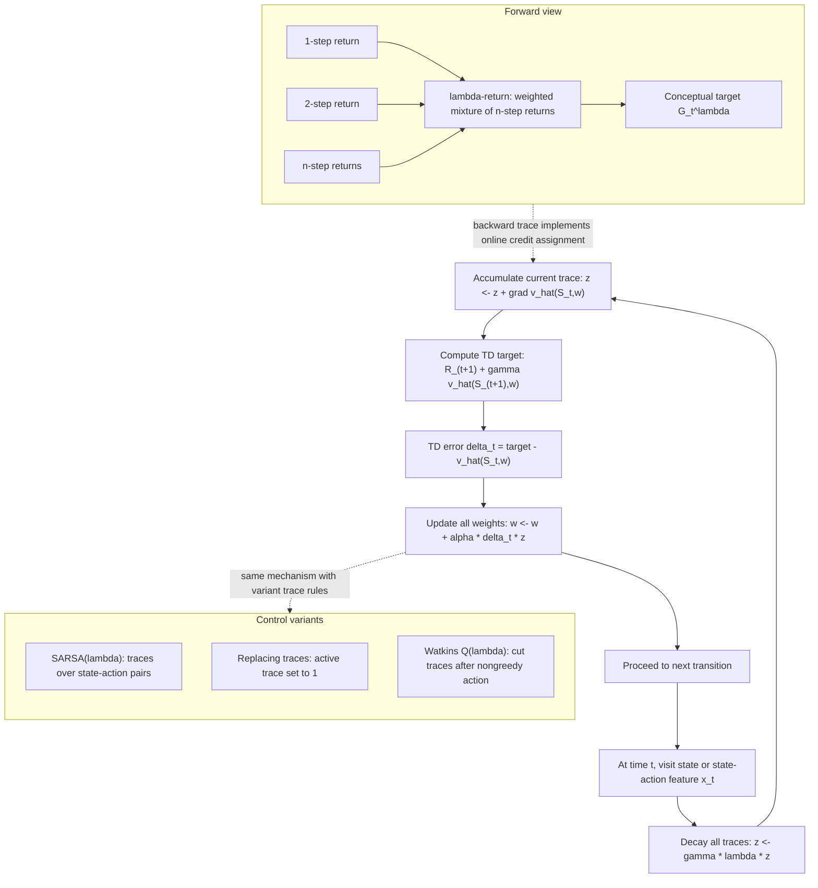

# Eligibility Traces

Eligibility traces provide a bridge between one-step TD methods and Monte Carlo methods. They let recent states or state-action pairs remain eligible for credit when later TD errors arrive. The forward view describes the target as a weighted mixture of n-step returns. The backward view gives an online mechanism: maintain a trace vector, update it each step, and use the current TD error to adjust all recently eligible predictions.


*Figure: Cart-pole is a standard control and reinforcement-learning benchmark. Image: [Wikimedia Commons](https://commons.wikimedia.org/wiki/File:Cartpole.gif), Condordellanebbia, CC BY-SA 4.0.*

Sutton and Barto use eligibility traces to unify many earlier ideas. TD($\lambda$), SARSA($\lambda$), true online TD($\lambda$), Watkins's Q($\lambda$), and tree-backup traces differ in how traces are accumulated, cleared, or weighted, but they share the idea that credit assignment should extend over time without waiting for a full episode.

## Definitions

The $\lambda$-return is a geometrically weighted average of n-step returns:

$$
G_t^\lambda =
(1-\lambda)\sum_{n=1}^{\infty}\lambda^{n-1}G_{t:t+n}
$$

in the continuing case, with appropriate truncation in episodic tasks. The parameter $0\le\lambda\le1$ controls how much weight goes to longer returns. $\lambda=0$ gives the one-step TD target. $\lambda=1$ approaches the Monte Carlo return in episodic tasks.

For linear value prediction, the accumulating eligibility trace is

$$
\mathbf{z}_t = \gamma\lambda \mathbf{z}_{t-1}+\nabla \hat v(S_t,\mathbf{w}_t).
$$

The TD($\lambda$) update is

$$
\mathbf{w}_{t+1} =
\mathbf{w}_t + \alpha\delta_t\mathbf{z}_t,
$$

where

$$
\delta_t=R_{t+1}+\gamma\hat v(S_{t+1},\mathbf{w}_t)-\hat v(S_t,\mathbf{w}_t).
$$

For tabular state values, $\nabla \hat v(S_t,\mathbf{w}_t)$ is a one-hot vector, so the trace for the current state increases while previous traces decay by $\gamma\lambda$.

SARSA($\lambda$) uses traces over state-action pairs:

$$
z_t(s,a)=\gamma\lambda z_{t-1}(s,a)+\mathbb{1}_{s=S_t,a=A_t}.
$$

Watkins's Q($\lambda$) is an off-policy control method that cuts traces when a nongreedy action is selected, preserving a connection to Q-learning's greedy target.

True online TD($\lambda$) modifies the backward view so that it more exactly matches the online forward view at every time step, not only approximately or at episode end.

## Key results

Eligibility traces solve a practical credit-assignment problem. One-step TD propagates information one step per update. Monte Carlo propagates complete returns but waits until episode end and can have high variance. TD($\lambda$) can propagate a TD error backward through many recent states immediately, with influence decaying according to $\gamma\lambda$.

The forward view is conceptually clean: update toward $G_t^\lambda$. The backward view is computationally useful: update with $\delta_t\mathbf{z}_t$. Under appropriate conditions, these views are equivalent for offline updates, and true online TD($\lambda$) sharpens the equivalence for online learning with changing weights.

The trace parameter $\lambda$ is not just "memory length." The effective decay is $\gamma\lambda$, so discounting also shortens credit assignment. With $\gamma=0.9$ and $\lambda=0.8$, a trace decays by $0.72$ each step before any new activation.

Accumulating traces can exceed $1$ for repeatedly visited states or features. Replacing traces set the active trace to $1$ instead of adding $1$, which can improve behavior in some tabular tasks by preventing repeated visits from producing very large traces. With function approximation, trace variants require more care.

Control with traces must respect the policy relationship. On-policy SARSA($\lambda$) can keep traces through exploratory actions because it evaluates the exploratory policy. Watkins's Q($\lambda$) cuts traces after nongreedy actions because Q-learning's target is greedy, not the exploratory behavior.

Eligibility traces can be understood as a memory of responsibility. A state visited several steps ago may still deserve part of the current TD error if its trace has not decayed away. This does not mean the old state caused the new reward in a philosophical sense; it means the update rule assigns credit according to recency, discounting, and the chosen trace parameter. The trace is therefore an algorithmic credit-assignment device, not an additional environment model.

In function approximation, the trace vector lives in parameter space rather than as a table over states. If $\hat v(s,\mathbf{w})$ is linear, the trace accumulates feature vectors. If the approximator is nonlinear, the trace accumulates gradients. This makes traces compatible with approximation in principle, but it also means that feature scaling and changing gradients affect how credit is distributed.

True online TD($\lambda$) is important because ordinary accumulating-trace TD can diverge from the intended online forward view as weights change during an episode. The true-online correction keeps the computational advantages of the backward view while matching the forward-view target more faithfully at each step.

## Visual



This eligibility-trace diagram shows the online backward view in parameter order: decay traces, accumulate the current state's feature gradient, compute the TD error, and update every eligible weight. The forward-view subgraph names the lambda-return as a weighted mixture of n-step returns, while the control-variant subgraph distinguishes SARSA(lambda), replacing traces, and Watkins's trace cutting. The key shape transition is from one visited state-action to a trace vector `z` that distributes the current TD error over recent history.

| $\lambda$ value | Target behavior | Credit assignment | Typical effect |
|---:|---|---|---|
| $0$ | One-step TD | Only current state strongly updated | Low variance, more bootstrap bias |
| Between $0$ and $1$ | Mixture of n-step returns | Recent states get decayed credit | Balanced learning speed and variance |
| $1$ episodic | Monte Carlo-like | Long credit assignment to episode start | Less bootstrap bias, higher variance |
| With trace cutting | Greedy off-policy consistency | Stops credit after nongreedy actions | Useful for Watkins's Q($\lambda$) |

## Worked example 1: Tabular TD(lambda) trace and update

Problem: Three states $A,B,C$ have current values $V(A)=0$, $V(B)=1$, $V(C)=2$. The agent is in $B$, the previous traces are $z(A)=0.5$, $z(B)=0$, $z(C)=0$, and it receives reward $R_{t+1}=3$ before moving to $C$. Let $\gamma=0.9$, $\lambda=0.8$, and $\alpha=0.1$. Use accumulating traces and compute the updates.

Step 1: Decay old traces:

$$
\gamma\lambda=0.9(0.8)=0.72.
$$

$$
z(A)\leftarrow0.72(0.5)=0.36,\quad z(B)\leftarrow0,\quad z(C)\leftarrow0.
$$

Step 2: Increment the trace for the current state $B$:

$$
z(B)\leftarrow z(B)+1=1.
$$

Now $z(A)=0.36$, $z(B)=1$, and $z(C)=0$.

Step 3: Compute TD error:

$$
\begin{aligned}
\delta &= R_{t+1}+\gamma V(C)-V(B)\\
&=3+0.9(2)-1\\
&=3+1.8-1\\
&=3.8.
\end{aligned}
$$

Step 4: Update each value:

$$
V(A)\leftarrow0+0.1(3.8)(0.36)=0.1368.
$$

$$
V(B)\leftarrow1+0.1(3.8)(1)=1.38.
$$

$$
V(C)\leftarrow2+0.1(3.8)(0)=2.
$$

Check: The current state receives the largest update, but the previously eligible state $A$ also receives credit.

## Worked example 2: Lambda-return as a weighted mixture

Problem: Suppose the one-step, two-step, and three-step returns from a time $t$ are $G_{t:t+1}=2$, $G_{t:t+2}=5$, and $G_{t:t+3}=9$, and the episode ends at $t+3$. Let $\lambda=0.5$. Compute the truncated episodic $\lambda$-return:

$$
G_t^\lambda=(1-\lambda)G_{t:t+1}+(1-\lambda)\lambda G_{t:t+2}+\lambda^2G_{t:t+3}.
$$

Step 1: Compute weights:

$$
1-\lambda=0.5,\quad (1-\lambda)\lambda=0.25,\quad \lambda^2=0.25.
$$

The final term gets the remaining probability mass because the episode ends.

Step 2: Multiply each return:

$$
0.5(2)=1,\quad 0.25(5)=1.25,\quad 0.25(9)=2.25.
$$

Step 3: Add:

$$
G_t^\lambda = 1 + 1.25 + 2.25 = 4.5.
$$

Check: The weights sum to $1$, and the result lies between the smallest and largest component return. The checked answer is $4.5$.

## Code

```python
import numpy as np

rng = np.random.default_rng(9)
n_states = 7
V = np.zeros(n_states)
alpha, gamma, lam = 0.1, 1.0, 0.8

def episode():
    s = 3
    states = [s]
    rewards = []
    while 0 < s < 6:
        s += rng.choice([-1, 1])
        rewards.append(1.0 if s == 6 else 0.0)
        states.append(s)
    return states, rewards

for _ in range(1000):
    z = np.zeros(n_states)
    states, rewards = episode()
    for t, r in enumerate(rewards):
        s = states[t]
        sp = states[t + 1]
        z *= gamma * lam
        z[s] += 1.0
        target_next = 0.0 if sp in (0, 6) else V[sp]
        delta = r + gamma * target_next - V[s]
        V += alpha * delta * z
        V[0] = V[6] = 0.0

print(np.round(V[1:6], 3))
```

## Common pitfalls

- Treating $\lambda$ as the only decay factor. Traces decay by $\gamma\lambda$, not just $\lambda$.
- Forgetting to reset traces at episode boundaries.
- Mixing forward-view and backward-view formulas without checking whether the algorithm is offline, online, accumulating, replacing, or true online.
- Letting traces grow unintentionally in loops with accumulating traces. Replacing traces may be more appropriate in some tabular control tasks.
- Failing to cut traces in Watkins's Q($\lambda$) after nongreedy actions.
- Assuming traces remove the need for exploration. They improve credit assignment after experience occurs; they do not guarantee useful experience.

## Connections

- [n-step bootstrapping](/cs/reinforcement-learning/n-step-bootstrapping)
- [Temporal-difference learning](/cs/reinforcement-learning/temporal-difference-learning)
- [On-policy control with approximation](/cs/reinforcement-learning/on-policy-control-approximation)
- [Off-policy methods with approximation](/cs/reinforcement-learning/off-policy-approximation)
- [Linear algebra](/math/linear-algebra/)
