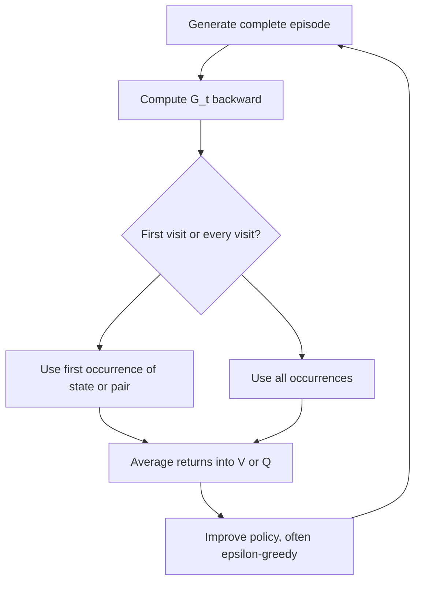

# Monte Carlo Methods

Monte Carlo methods learn value functions and policies from complete sampled episodes. They do not require a model of the environment, and they do not bootstrap from current value estimates. Instead, they wait until an episode has ended, compute actual returns, and average those returns for states or state-action pairs. This makes Monte Carlo learning conceptually simple and statistically direct.


*Figure: Cart-pole is a standard control and reinforcement-learning benchmark. Image: [Wikimedia Commons](https://commons.wikimedia.org/wiki/File:Cartpole.gif), Condordellanebbia, CC BY-SA 4.0.*

The price is that Monte Carlo methods apply most naturally to episodic tasks. They can have high variance because a return contains all later random rewards in an episode. Sutton and Barto use Monte Carlo methods as the first major model-free solution method, then contrast them with temporal-difference learning, which learns online from incomplete experience by bootstrapping.

## Definitions

First-visit Monte Carlo prediction estimates $V_\pi(s)$ by averaging returns following the first visit to $s$ in each episode. Every-visit Monte Carlo prediction averages returns following every visit to $s$. Both converge to $V_\pi(s)$ under standard sampling assumptions in episodic tasks.

For action values, Monte Carlo estimates

$$
Q_\pi(s,a) = \mathbb{E}_\pi[G_t \mid S_t=s,A_t=a]
$$

by averaging returns after visits to state-action pair $(s,a)$. Action values are especially important when no model is available, because policy improvement can be performed by greedifying with respect to $Q$ without one-step model lookahead.

Monte Carlo control alternates policy evaluation and policy improvement using sampled episodes. Exploring starts guarantee that every state-action pair has a nonzero chance of being the starting pair. More practical on-policy methods instead use soft policies, such as $\epsilon$-greedy policies, so that all actions continue to be sampled.

Off-policy Monte Carlo learning evaluates or improves a target policy $\pi$ using data generated by a behavior policy $b$. Importance sampling corrects for the mismatch:

$$
\rho_{t:T-1} =
\prod_{k=t}^{T-1}
\frac{\pi(A_k \mid S_k)}{b(A_k \mid S_k)}.
$$

Ordinary importance sampling averages $\rho G$ values. Weighted importance sampling normalizes by the sum of weights and often has lower variance, though it can be biased initially.

## Key results

Monte Carlo prediction is unbiased for the value being estimated when episodes are sampled under the policy of interest. The target for a visit is the actual return $G_t$, not an estimate. This is why MC methods do not need the Markov property in the same strong bootstrapping sense for prediction from complete returns, though the MDP framework remains the control setting.

Incremental Monte Carlo updates use the same error-correction form as bandits:

$$
V(S_t) \leftarrow V(S_t) + \alpha\left(G_t - V(S_t)\right).
$$

With $\alpha=1/N(S_t)$, this is an incremental sample average. With constant $\alpha$, it tracks nonstationary returns or emphasizes recent episodes.

On-policy Monte Carlo control commonly maintains an $\epsilon$-soft policy. After estimating $Q$, the greedy action gets most probability, but all actions keep at least $\epsilon/\vert \mathcal{A}(s)\vert $ probability:

$$
\pi(a \mid s)=
\begin{cases}
1-\epsilon+\epsilon/|\mathcal{A}(s)|, & a \in \arg\max_{a'} Q(s,a'),\\
\epsilon/|\mathcal{A}(s)|, & \text{otherwise}.
\end{cases}
$$

Off-policy methods require coverage: if $\pi(a \mid s)\gt 0$, then $b(a \mid s)\gt 0$. Otherwise the behavior policy never generates some target-policy behavior, making evaluation impossible from that data.

Importance sampling is correct in expectation but can be unstable. A long product of probability ratios can become zero when the target would not have selected an observed action, or enormous when the behavior policy selected a target-likely trajectory with small probability. This variance problem motivates later off-policy TD methods, tree-backup methods, and gradient TD methods.

Monte Carlo learning is also the first place where the difference between episode generation and update logic becomes prominent. The same episode can be processed backward to compute all returns efficiently, then filtered according to first-visit or every-visit rules. This separation matters in code because it prevents accidental leakage: the return following a visit should include rewards after that visit, not rewards that occurred before it. Backward accumulation is usually the simplest way to avoid indexing mistakes.

Exploring starts are mathematically convenient but operationally artificial. They assume the learner can begin episodes from any state-action pair, which is rarely true in physical or user-facing systems. Sutton and Barto therefore move quickly toward soft on-policy methods. The cost is that the optimal policy within the restricted class of $\epsilon$-soft policies is not exactly the deterministic optimal policy. As $\epsilon$ decreases, behavior can approach greediness, but learning still needs enough exploration to keep estimates meaningful.

Monte Carlo control also highlights why action values are often preferred in model-free control. If a model is absent, knowing $V(s)$ alone does not tell the agent which action leads to better next states. Estimating $Q(s,a)$ makes policy improvement local: choose the action with the largest estimated return from the current state.

## Visual



| Monte Carlo variant | Data source | Target | Main advantage | Main risk |
|---|---|---|---|---|
| First-visit prediction | Episodes from $\pi$ | First return after state | Simple independent episode accounting | Wastes repeated visits |
| Every-visit prediction | Episodes from $\pi$ | Every return after state | Uses more data | Correlated returns within an episode |
| On-policy control | Episodes from current soft policy | $Q_\pi$ then improve | No model required | Must keep exploring |
| Off-policy ordinary IS | Behavior policy $b$ | $\rho G$ | Unbiased in many settings | Very high variance |
| Off-policy weighted IS | Behavior policy $b$ | Normalized weighted returns | Lower variance | Initial bias and denominator issues |

## Worked example 1: First-visit Monte Carlo value update

Problem: An episode visits states and receives rewards:

$$
S_0=A,\ R_1=0,\ S_1=B,\ R_2=2,\ S_2=A,\ R_3=4,\ \text{terminal}.
$$

Let $\gamma=1$. Compute first-visit returns for $A$ and $B$, then update sample-average estimates from no prior data.

Step 1: Compute returns backward:

$$
G_2 = R_3 = 4.
$$

$$
G_1 = R_2 + G_2 = 2 + 4 = 6.
$$

$$
G_0 = R_1 + G_1 = 0 + 6 = 6.
$$

Step 2: Identify first visits. State $A$ appears at $t=0$ and $t=2$, so the first visit is $t=0$. State $B$ first appears at $t=1$.

Step 3: Assign first-visit returns:

$$
\text{return for } A = G_0 = 6,\qquad \text{return for } B = G_1 = 6.
$$

Step 4: Since there is no prior data, sample averages equal these returns:

$$
V(A)=6,\qquad V(B)=6.
$$

Check: Every-visit MC would also record $G_2=4$ for the second visit to $A$, producing a different estimate for $A$ after this one episode. First-visit MC intentionally ignores that second visit.

## Worked example 2: Off-policy importance sampling ratio

Problem: A target policy $\pi$ chooses left with probability $1$ in both visited states. A behavior policy $b$ chooses left with probability $0.5$ in the first state and $0.25$ in the second. An episode takes left both times and has return $G_0=8$. Compute the ordinary importance-sampling target for time $0$.

Step 1: Write the trajectory probability ratio:

$$
\rho_{0:1} =
\frac{\pi(A_0 \mid S_0)}{b(A_0 \mid S_0)}
\frac{\pi(A_1 \mid S_1)}{b(A_1 \mid S_1)}.
$$

Step 2: Substitute probabilities:

$$
\rho_{0:1} =
\frac{1}{0.5}\frac{1}{0.25}.
$$

Step 3: Multiply:

$$
\rho_{0:1} = 2 \times 4 = 8.
$$

Step 4: Multiply by the return:

$$
\rho_{0:1}G_0 = 8 \times 8 = 64.
$$

The checked ordinary importance-sampling target is $64$. The large target is not a mistake; it reflects that the behavior policy generated a trajectory that the deterministic target policy always takes but the behavior policy samples with probability $0.125$.

## Code

```python
import numpy as np

def episode(rng):
    # Random walk: states 1..5, terminal at 0 and 6.
    # Reward is 1 only when exiting right.
    s = 3
    states, rewards = [s], []
    while 0 < s < 6:
        s += rng.choice([-1, 1])
        rewards.append(1.0 if s == 6 else 0.0)
        if 0 < s < 6:
            states.append(s)
    return states, rewards

rng = np.random.default_rng(0)
V = np.zeros(7)
returns = {s: [] for s in range(1, 6)}
gamma = 1.0

for _ in range(5000):
    states, rewards = episode(rng)
    G = 0.0
    returns_from_t = []
    for r in reversed(rewards):
        G = r + gamma * G
        returns_from_t.append(G)
    returns_from_t.reverse()

    seen = set()
    for s, Gt in zip(states, returns_from_t):
        if s not in seen:
            returns[s].append(Gt)
            V[s] = np.mean(returns[s])
            seen.add(s)

print(np.round(V[1:6], 3))
```

## Common pitfalls

- Trying to update Monte Carlo values before knowing the return. Basic MC prediction waits until the episode ends.
- Using state values for model-free control without a model. Without transition probabilities, greedy one-step improvement requires action values.
- Forgetting exploring starts or soft policies. If some actions are never tried, their action values cannot be learned.
- Mixing up ordinary and weighted importance sampling. Ordinary averages weighted returns; weighted normalizes by total weights.
- Ignoring coverage. Off-policy evaluation fails if the behavior policy cannot generate target-policy actions.
- Underestimating variance. Importance sampling ratios multiply across time, so long episodes can be numerically and statistically difficult.

## Connections

- [Dynamic programming](/cs/reinforcement-learning/dynamic-programming)
- [Temporal-difference learning](/cs/reinforcement-learning/temporal-difference-learning)
- [n-step bootstrapping](/cs/reinforcement-learning/n-step-bootstrapping)
- [Probability and random variables](/math/probability-and-random-variables/)
- [Machine learning](/cs/machine-learning/)
