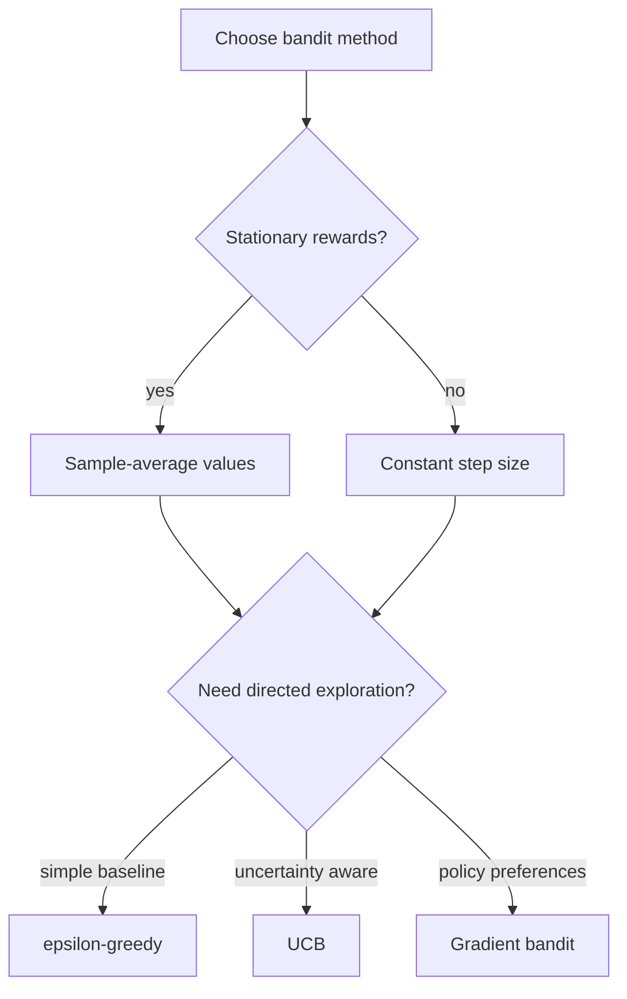

# Multi-armed Bandits

The multi-armed bandit problem is the simplest reinforcement learning setting in Sutton and Barto's development. There is no state transition structure and no delayed reward. On each step the agent chooses one of $k$ actions and receives a reward drawn from that action's distribution. The difficulty is not planning through time, but balancing exploitation of the action that currently looks best against exploration of actions that might be better.


*Figure: Cart-pole is a standard control and reinforcement-learning benchmark. Image: [Wikimedia Commons](https://commons.wikimedia.org/wiki/File:Cartpole.gif), Condordellanebbia, CC BY-SA 4.0.*

Bandits are important because they isolate a core statistical tension that appears everywhere else in reinforcement learning. A value estimate can only improve for actions tried often enough, but choosing apparently suboptimal actions has an opportunity cost. Action-value methods, $\epsilon$-greedy exploration, optimistic initial values, upper-confidence bounds, and gradient bandits are all different answers to that tension.

## Definitions

In a $k$-armed bandit, the action set is $\mathcal{A}=\{1,\dots,k\}$. Each action $a$ has an unknown true action value

$$
q_*(a) = \mathbb{E}[R_t \mid A_t=a].
$$

The learner keeps an estimate $Q_t(a)$ of $q_*(a)$. The sample-average estimate after $N_t(a)$ selections is

$$
Q_t(a) = \frac{\text{sum of rewards received after action } a}{N_t(a)}.
$$

The incremental form is

$$
Q_{n+1} = Q_n + \frac{1}{n}\left(R_n - Q_n\right),
$$

where $n$ counts selections of that action. More generally, constant step size $\alpha$ gives

$$
Q_{n+1} = Q_n + \alpha(R_n - Q_n),
$$

which is useful when rewards are nonstationary.

The $\epsilon$-greedy action rule chooses a greedy action with probability $1-\epsilon$ and a random action with probability $\epsilon$. Upper-confidence-bound action selection chooses

$$
A_t = \arg\max_a \left[
Q_t(a) + c\sqrt{\frac{\ln t}{N_t(a)}}
\right],
$$

where $c\gt 0$ controls exploration. Gradient bandits do not estimate reward means directly as the action selection rule. They learn preferences $H_t(a)$ and use a softmax policy:

$$
\Pr(A_t=a) = \frac{\exp(H_t(a))}{\sum_b \exp(H_t(b))}.
$$

## Key results

The incremental update

$$
\text{new estimate} \leftarrow \text{old estimate} + \text{step size} \times \text{error}
$$

is a pattern that recurs through the book. In bandits the error is $R_n-Q_n$. In temporal-difference learning it becomes a reward plus a bootstrapped next value minus the current value.

Sample averages converge to true means in stationary problems under repeated sampling. Their weakness is inertia: after many observations, the effective step size $1/n$ becomes tiny. If the reward distribution changes, old data dominate the estimate. Constant step size methods weight recent observations more heavily. Expanding the recursion shows that

$$
Q_{n+1} = (1-\alpha)^n Q_1 + \sum_{i=1}^{n} \alpha(1-\alpha)^{n-i}R_i,
$$

so rewards receive exponentially decaying weights.

Optimistic initial values encourage early exploration by making untried actions look attractive. This works naturally with greedy selection in stationary tasks, but it is a temporary exploration device. Once all actions have been tried and estimates settle, optimism fades.

UCB exploration explicitly adds uncertainty bonuses. Actions selected rarely have larger bonuses because $N_t(a)$ is small. As an action is sampled more often, the uncertainty term shrinks. This implements a more targeted form of exploration than $\epsilon$-greedy, which continues to select random actions even when some are clearly poor.

Gradient bandits are useful when the goal is to learn a stochastic policy directly. With average reward baseline $\bar R_t$, the preference update is

$$
H_{t+1}(a) =
H_t(a) + \alpha(R_t-\bar R_t)(\mathbb{1}_{a=A_t}-\pi_t(a)).
$$

The baseline reduces variance without changing the expected direction of improvement. This idea foreshadows policy gradient methods.

Regret is another useful way to interpret bandit behavior, even when the chapter's main experiments report average reward and percentage of optimal action selections. If the optimal action has value $q_*(a_*)$, then choosing action $A_t$ incurs expected opportunity cost $q_*(a_*)-q_*(A_t)$. Exploration is worthwhile only if the information gained can reduce later opportunity cost. This framing explains why purely random exploration is easy to implement but statistically crude: it does not ask which uncertainty is most valuable to resolve.

Bandits also clarify the difference between evaluation and selection. An action-value estimate is a statistical summary of past rewards, while an action-selection rule is a decision procedure using those summaries. The same estimates can be paired with greedy selection, $\epsilon$-greedy selection, UCB bonuses, or softmax probabilities. Later RL algorithms preserve this separation: one part estimates values or preferences, and another part converts them into behavior with some amount of exploration.

Contextual bandits add state-like information without adding delayed consequences. The agent observes a situation, chooses an action, and receives an immediate reward, but the action does not change a future state in the MDP sense. This makes contextual bandits a useful halfway point between supervised prediction and full reinforcement learning.

## Visual

| Method | Main state kept | Exploration mechanism | Strength | Limitation |
|---|---|---|---|---|
| Greedy sample average | $Q(a)$, $N(a)$ | None after initialization | Simple and exploits fast | Can lock onto a noisy early winner |
| $\epsilon$-greedy | $Q(a)$, $N(a)$ | Random action with probability $\epsilon$ | Robust baseline | Wastes trials on clearly bad actions |
| Constant-step $\epsilon$-greedy | $Q(a)$ | Same as $\epsilon$-greedy | Tracks nonstationarity | Estimates do not converge exactly in stationary cases |
| Optimistic initial values | $Q(a)$ | High initial estimates | Simple directed early exploration | Weak for long nonstationary tasks |
| UCB | $Q(a)$, $N(a)$ | Uncertainty bonus | Targets under-sampled actions | Needs time count and tuning constant |
| Gradient bandit | Preferences $H(a)$ | Softmax probabilities | Learns stochastic preferences | Sensitive to step size and reward scale |



## Worked example 1: Incremental sample-average update

Problem: Action $a$ is selected four times and gives rewards $1$, $3$, $2$, and $6$. Start with $Q_1(a)=0$ only as a placeholder before the first observed reward. Compute the sample-average estimate after each reward using the incremental rule.

Step 1: After the first reward, $n=1$:

$$
\begin{aligned}
Q_2 &= Q_1 + \frac{1}{1}(R_1-Q_1) \\
&= 0 + 1(1-0) \\
&= 1.
\end{aligned}
$$

Step 2: After the second reward, $n=2$:

$$
\begin{aligned}
Q_3 &= 1 + \frac{1}{2}(3-1) \\
&= 1 + 1 \\
&= 2.
\end{aligned}
$$

Step 3: After the third reward, $n=3$:

$$
\begin{aligned}
Q_4 &= 2 + \frac{1}{3}(2-2) \\
&= 2.
\end{aligned}
$$

Step 4: After the fourth reward, $n=4$:

$$
\begin{aligned}
Q_5 &= 2 + \frac{1}{4}(6-2) \\
&= 2 + 1 \\
&= 3.
\end{aligned}
$$

Check: The direct average is $(1+3+2+6)/4=12/4=3$. The checked final estimate is $Q_5(a)=3$.

## Worked example 2: UCB action choice

Problem: At time $t=100$, three actions have estimates and counts:

$$
Q(a_1)=1.0,\quad Q(a_2)=1.3,\quad Q(a_3)=0.8,
$$

$$
N(a_1)=50,\quad N(a_2)=5,\quad N(a_3)=45.
$$

Use UCB with $c=2$. Which action is selected?

Step 1: Compute $\ln(100)\approx 4.6052$.

Step 2: Compute each exploration bonus:

$$
\begin{aligned}
b_1 &= 2\sqrt{4.6052/50} = 2\sqrt{0.0921} \approx 0.6070, \\
b_2 &= 2\sqrt{4.6052/5} = 2\sqrt{0.9210} \approx 1.9194, \\
b_3 &= 2\sqrt{4.6052/45} = 2\sqrt{0.1023} \approx 0.6396.
\end{aligned}
$$

Step 3: Add bonuses to estimates:

$$
\begin{aligned}
u_1 &= 1.0 + 0.6070 = 1.6070, \\
u_2 &= 1.3 + 1.9194 = 3.2194, \\
u_3 &= 0.8 + 0.6396 = 1.4396.
\end{aligned}
$$

Step 4: Select the largest UCB score. The checked answer is $a_2$, even though it has only a moderately higher estimate, because it has been sampled much less often.

## Code

```python
import numpy as np

rng = np.random.default_rng(7)
k = 10
steps = 1000
epsilon = 0.1

true_q = rng.normal(loc=0.0, scale=1.0, size=k)
Q = np.zeros(k)
N = np.zeros(k, dtype=int)
rewards = []

for t in range(steps):
    if rng.random() < epsilon:
        action = rng.integers(k)
    else:
        action = rng.choice(np.flatnonzero(Q == Q.max()))

    reward = rng.normal(true_q[action], 1.0)
    N[action] += 1
    Q[action] += (reward - Q[action]) / N[action]
    rewards.append(reward)

print("True best action:", int(np.argmax(true_q)))
print("Estimated best action:", int(np.argmax(Q)))
print("Average reward:", float(np.mean(rewards)))
print("Counts:", N.tolist())
```

## Common pitfalls

- Evaluating exploration only by the immediate reward of exploratory actions. Exploration is useful because it improves future action selection.
- Forgetting that sample averages assume stationarity. In nonstationary bandits, constant step sizes are usually a better fit.
- Setting $\epsilon=0$ too early. Greedy methods can permanently favor an action that was lucky in early samples.
- Treating optimistic initial values as a complete exploration strategy. They mainly help at the beginning of learning.
- Applying UCB without handling actions with $N_t(a)=0$. In practice, select each action once or define untried actions as maximally urgent.
- Comparing gradient bandit preferences $H(a)$ as if they were value estimates. Preferences determine probabilities but are not expected rewards.

## Connections

- [Reinforcement learning problem and finite MDPs](/cs/reinforcement-learning/rl-problem-and-mdps)
- [Policy gradient methods](/cs/reinforcement-learning/policy-gradient-methods)
- [Monte Carlo methods](/cs/reinforcement-learning/monte-carlo-methods)
- [Probability and random variables](/math/probability-and-random-variables/)
- [Machine learning](/cs/machine-learning/)
