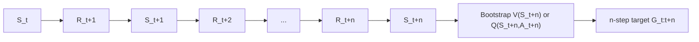

# n-step Bootstrapping

n-step methods sit between one-step temporal-difference learning and full Monte Carlo learning. Instead of updating from one reward plus one bootstrapped estimate, or waiting for a complete episode return, an n-step method looks ahead for $n$ rewards and then bootstraps. This gives a continuum of targets: $n=1$ is ordinary TD, while $n$ reaching the episode end gives a Monte Carlo target.


*Figure: Cart-pole is a standard control and reinforcement-learning benchmark. Image: [Wikimedia Commons](https://commons.wikimedia.org/wiki/File:Cartpole.gif), Condordellanebbia, CC BY-SA 4.0.*

Sutton and Barto use n-step bootstrapping to show that algorithms are not isolated tricks. Prediction, SARSA, off-policy learning, tree-backup methods, and later eligibility traces can all be understood as different ways to combine sampled rewards, bootstrapped estimates, and policy probabilities across multiple time steps.

## Definitions

The n-step return for state-value prediction is

$$
G_{t:t+n} =
R_{t+1} + \gamma R_{t+2} + \cdots + \gamma^{n-1}R_{t+n}
+ \gamma^n V(S_{t+n}),
$$

when $t+n$ occurs before episode termination. If the episode ends at time $T\lt t+n$, the return truncates at the terminal reward and has no bootstrap term:

$$
G_{t:T} =
R_{t+1} + \gamma R_{t+2} + \cdots + \gamma^{T-t-1}R_T.
$$

The n-step TD update is

$$
V(S_t) \leftarrow V(S_t) + \alpha\left(G_{t:t+n}-V(S_t)\right).
$$

For control, n-step SARSA uses action values:

$$
G_{t:t+n} =
R_{t+1} + \cdots + \gamma^{n-1}R_{t+n}
+ \gamma^n Q(S_{t+n},A_{t+n}).
$$

Off-policy n-step learning introduces importance-sampling ratios over the part of the trajectory whose action probabilities differ between target policy $\pi$ and behavior policy $b$:

$$
\rho_{t:h} = \prod_{k=t}^{h}\frac{\pi(A_k \mid S_k)}{b(A_k \mid S_k)}.
$$

Tree-backup methods avoid ordinary importance sampling by backing up expectations over actions not selected, combining sampled state transitions with expected action branches under the target policy.

## Key results

The n-step return creates an explicit bias-variance knob. Small $n$ uses more bootstrapping, so it can have lower variance but more bias from inaccurate value estimates. Large $n$ uses more sampled reward information, so it can reduce bootstrap bias but increase variance and delay updates.

The update timing matters. At time $t+n$, the algorithm can update the value for $S_t$ because the required rewards through $R_{t+n}$ and state $S_{t+n}$ are known. In episodic tasks, a common implementation keeps arrays of recent states, actions, and rewards, then updates the state whose n-step target has just become available.

n-step SARSA extends one-step SARSA directly. It remains on-policy when the sampled actions come from the same policy being improved. If the policy is $\epsilon$-greedy with respect to $Q$, then the n-step return includes the consequences of that exploratory policy.

Off-policy n-step learning is more delicate than one-step off-policy TD because probability ratios multiply across several actions. Long ratios can have high variance. This is one reason Sutton and Barto introduce per-decision importance sampling, control variates, and tree-backup algorithms.

The tree-backup idea replaces a sampled next action with an expected backup over all possible actions under the target policy, recursively. It is especially important because it points toward algorithms that are off-policy without relying on large ordinary importance-sampling products.

n-step methods also prepare the ground for eligibility traces. A forward-view $\lambda$-return can be seen as a geometrically weighted average of n-step returns. Eligibility traces then provide a backward-view mechanism for implementing a similar credit assignment online.

The backup diagram for n-step methods is best understood as a sliding window over experience. At each new time step, one more reward becomes available, and the oldest state in the window can be updated. Near the end of an episode, the window naturally shrinks because termination cuts off the bootstrap. Correctly handling these boundary cases is one of the main implementation challenges, and many errors in n-step code are off-by-one mistakes rather than conceptual misunderstandings.

The choice of $n$ is environment-dependent. In a task with dense, low-noise rewards, one-step TD may already propagate enough information. In sparse-reward tasks, longer returns can carry the rare reward back faster. In highly stochastic tasks, however, long returns may add so much variance that learning slows. This is why Sutton and Barto present n-step methods as a family rather than as a search for one universally best horizon.

For control, n-step targets also interact with policy improvement. If the policy changes rapidly, the later actions inside a stored n-step return may have been generated by an older policy. On-policy algorithms usually tolerate this as part of continual learning, but it explains why step sizes and policy improvement rates matter.

The chapter's unifying message is that backup length is a design dimension. Once that is visible, one-step TD, Monte Carlo, tree backup, and later trace methods become related points in a larger space of algorithms.

## Visual



| Target | Formula shape | Update delay | Variance | Bootstrap bias |
|---|---|---:|---:|---:|
| One-step TD | $R_{t+1}+\gamma V(S_{t+1})$ | 1 step | Low | Higher |
| n-step TD | $n$ rewards plus $\gamma^n V(S_{t+n})$ | $n$ steps | Medium | Medium |
| Monte Carlo | Rewards to episode end | To termination | Higher | None from bootstrapping |
| Tree backup | Sampled states, expected actions | $n$ steps | Often lower than IS | Depends on estimates |

## Worked example 1: Three-step return for prediction

Problem: Starting at time $t$, the next rewards are $R_{t+1}=1$, $R_{t+2}=2$, and $R_{t+3}=3$. The state at $t+3$ has current estimate $V(S_{t+3})=10$. Let $\gamma=0.5$. Compute the three-step return.

Step 1: Write the formula:

$$
G_{t:t+3} = R_{t+1} + \gamma R_{t+2} + \gamma^2 R_{t+3} + \gamma^3 V(S_{t+3}).
$$

Step 2: Substitute numbers:

$$
G_{t:t+3} = 1 + 0.5(2) + 0.5^2(3) + 0.5^3(10).
$$

Step 3: Compute each term:

$$
0.5(2)=1,\qquad 0.5^2(3)=0.25(3)=0.75,\qquad 0.5^3(10)=0.125(10)=1.25.
$$

Step 4: Add:

$$
G_{t:t+3}=1+1+0.75+1.25=4.
$$

Check: The target includes exactly three sampled rewards and then one bootstrap estimate. The checked answer is $4$.

## Worked example 2: n-step SARSA update

Problem: A two-step SARSA target has rewards $R_{t+1}=-1$, $R_{t+2}=4$, $\gamma=0.9$, and $Q(S_{t+2},A_{t+2})=5$. The old value is $Q(S_t,A_t)=2$ and $\alpha=0.2$. Compute the update.

Step 1: Write the two-step action-value return:

$$
G_{t:t+2}=R_{t+1}+\gamma R_{t+2}+\gamma^2Q(S_{t+2},A_{t+2}).
$$

Step 2: Substitute:

$$
G_{t:t+2}=-1+0.9(4)+0.9^2(5).
$$

Step 3: Compute terms:

$$
0.9(4)=3.6,\qquad 0.9^2(5)=0.81(5)=4.05.
$$

Step 4: Add:

$$
G_{t:t+2}=-1+3.6+4.05=6.65.
$$

Step 5: Update:

$$
\begin{aligned}
Q_{\text{new}}(S_t,A_t)
&= 2 + 0.2(6.65-2) \\
&= 2 + 0.2(4.65) \\
&= 2.93.
\end{aligned}
$$

Check: The target is larger than the old value, so the estimate increases. The checked answer is $2.93$.

## Code

```python
import numpy as np

rng = np.random.default_rng(2)
n_states = 7  # terminal states 0 and 6; nonterminal 1..5
V = np.zeros(n_states)
alpha, gamma, n = 0.1, 1.0, 3

def generate_episode():
    s = 3
    states = [s]
    rewards = [0.0]  # rewards indexed so rewards[t+1] is valid
    while 0 < s < 6:
        s += rng.choice([-1, 1])
        rewards.append(1.0 if s == 6 else 0.0)
        states.append(s)
    return states, rewards

for _ in range(1000):
    states, rewards = generate_episode()
    T = len(states) - 1
    for tau in range(T):
        horizon = min(tau + n, T)
        G = 0.0
        for i in range(tau + 1, horizon + 1):
            G += (gamma ** (i - tau - 1)) * rewards[i]
        if tau + n < T:
            G += (gamma ** n) * V[states[tau + n]]
        s_tau = states[tau]
        V[s_tau] += alpha * (G - V[s_tau])

print(np.round(V[1:6], 3))
```

## Common pitfalls

- Including the wrong number of rewards. An n-step return uses rewards $R_{t+1}$ through $R_{t+n}$, then bootstraps from time $t+n$.
- Bootstrapping after termination. If the episode ends before $t+n$, the terminal continuation value is zero.
- Forgetting update delay. The value at time $t$ cannot be updated with an n-step target until the needed future rewards have been observed.
- Multiplying importance-sampling ratios over the wrong range. The range depends on whether the update is for state values or action values.
- Assuming larger $n$ is always better. Larger $n$ can reduce bootstrap bias but may greatly increase variance.
- Treating tree-backup as just another sampled SARSA return. It uses expectations over target-policy actions for branches not sampled.

## Connections

- [Temporal-difference learning](/cs/reinforcement-learning/temporal-difference-learning)
- [Monte Carlo methods](/cs/reinforcement-learning/monte-carlo-methods)
- [Eligibility traces](/cs/reinforcement-learning/eligibility-traces)
- [Planning and learning with tabular methods](/cs/reinforcement-learning/planning-and-learning)
- [Probability and random variables](/math/probability-and-random-variables/)
