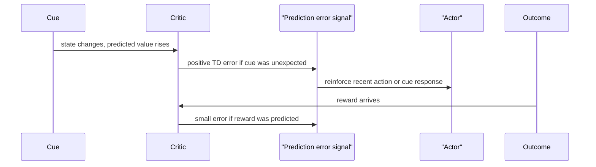

# Neuroscience Connections

The neuroscience connection in Sutton and Barto centers on reward prediction error, dopamine, and actor-critic organization in the brain. The point is not that the brain literally runs a textbook algorithm line by line. Rather, temporal-difference learning provides a compact computational hypothesis: certain neural signals resemble the error between received reward plus predicted future reward and previous prediction.


*Figure: Cart-pole is a standard control and reinforcement-learning benchmark. Image: [Wikimedia Commons](https://commons.wikimedia.org/wiki/File:Cartpole.gif), Condordellanebbia, CC BY-SA 4.0.*

The chapter discusses dopamine neurons, basal ganglia circuits, neural actor-critic ideas, and broader questions such as model-based methods, addiction, and collective reinforcement learning. For a wiki treatment, the most important lesson is how an RL equation can organize evidence about learning signals and action selection.

## Definitions

The TD error is

$$
\delta_t=R_{t+1}+\gamma V(S_{t+1})-V(S_t).
$$

The reward prediction error hypothesis relates phasic dopamine activity to a signal like $\delta_t$. When an unexpected reward occurs, the error is positive. After learning, the predictive cue produces the positive response and the reward itself produces little error. If an expected reward is omitted, the error at the expected reward time is negative.

The basal ganglia are a collection of brain structures involved in action selection, reinforcement, and motor control. Actor-critic interpretations often associate critic-like prediction error computation with dopaminergic signals and actor-like policy learning with action-selection circuits, although the biological mapping is simplified.

A neural actor-critic model separates:

- critic: learns predictions of future reward;
- actor: adjusts action tendencies using a reinforcement signal;
- dopamine-like error: broadcasts whether outcomes were better or worse than predicted.

Addiction is discussed as a domain where reward, prediction, and control can become maladaptive. In computational terms, drug effects may distort reward or prediction-error signals, changing learning in ways that do not align with long-run well-being.

## Key results

TD learning predicts a shift in error timing. Early in learning, reward is unexpected, so positive error occurs at reward delivery. After a cue reliably predicts reward, the cue raises $V(S_t)$ relative to the previous state, producing positive error at the cue. At reward time, the reward is already predicted, so error is small. This timing shift is a major reason TD models became influential in neuroscience.

Reward omission has a characteristic signature. If a reward is predicted but does not arrive, the term $R_{t+1}$ is lower than expected and the next state's value may not compensate. The TD error becomes negative at the expected reward time.

Actor-critic models explain how a scalar error could support action learning. The critic supplies the evaluative signal; the actor changes action preferences. This resembles policy gradient actor-critic methods, where the TD error estimates whether the selected action was better or worse than expected.

The distinction between reward signals, reinforcement signals, values, and prediction errors matters. Reward is an outcome. Value is a prediction of future reward. A prediction error is a teaching signal. A reinforcement signal can modify behavior. Confusing these categories leads to vague explanations.

Model-based behavior in the brain remains a deeper question. Sutton and Barto discuss evidence and possibilities for planning-like mechanisms, cognitive maps, and replay. Computational RL separates model-free cached values from model-based use of a model, but biological systems may blend these processes.

The neuroscience chapter also insists on careful vocabulary. A reward signal says something good or bad happened according to the task. A value signal predicts future reward. A prediction-error signal says the prediction should change. A policy or actor changes the probability of actions. These signals can be correlated in experiments, but they play different computational roles. Collapsing them into one word makes it impossible to state a testable hypothesis.

Timing is the strongest reason TD learning is relevant. A static error-correction model can say that an outcome was surprising, but TD learning predicts when surprise should occur as learning progresses. The movement of positive error from reward delivery back to the earliest reliable predictor is a temporal signature, not just a magnitude signature. This is why cue-reward experiments are such a natural testing ground for TD accounts.

Actor-critic models give a way to connect prediction errors to action learning. If a recent action made the situation better than predicted, the actor can increase the tendency to choose that action in similar circumstances. If the situation became worse than predicted, it can decrease that tendency. The critic does not need to know the full motor plan; it supplies an evaluative signal that can train action-selection mechanisms.

The chapter's discussion of addiction can be read computationally as a warning about corrupted objectives and teaching signals. If a substance directly changes reward or prediction-error circuitry, learning can reinforce behavior that is harmful under broader long-term objectives. This does not reduce addiction to a single equation, but it shows how RL language can separate immediate reinforcement from long-run welfare.

Replay is another bridge between neuroscience and RL. Sequences of neural activity can resemble earlier or possible future trajectories, suggesting that experience may be reused for learning or planning. In algorithmic terms, replay can support model-free value updates, model-based planning, or both. Sutton and Barto treat this as part of the broader question of how brains may combine cached values with internal models.

The biological discussion should therefore be read as a source of computational hypotheses. A hypothesis becomes stronger when it predicts timing, sign, and behavioral consequences, not just a loose association between reward and neural activity.

This careful stance keeps the connection useful. RL offers equations precise enough to simulate, while neuroscience supplies constraints on what kinds of learning signals and architectures are plausible.

## Visual



| Event | Before learning | After learning | TD interpretation |
|---|---|---|---|
| Predictive cue appears | Little value predicted | Positive error at cue | Value has moved backward to cue |
| Reward delivered | Positive error | Small error | Reward is now predicted |
| Expected reward omitted | No strong expectation | Negative error | Prediction exceeded outcome |
| Better reward than expected | Positive error | Positive error | Outcome exceeds current value |
| Worse reward than expected | Negative error | Negative error | Outcome below current value |

## Worked example 1: Reward response before learning

Problem: A state has value $V(S_t)=0$, reward $R_{t+1}=1$ arrives, and the next terminal value is $0$. Let $\gamma=1$. Compute the TD error.

Step 1: Write the TD error:

$$
\delta_t=R_{t+1}+\gamma V(S_{t+1})-V(S_t).
$$

Step 2: Substitute:

$$
\delta_t=1+1(0)-0.
$$

Step 3: Compute:

$$
\delta_t=1.
$$

Step 4: Interpret. The reward was unexpected because the previous value was zero. The positive error is the kind of signal associated with unexpected reward in the reward prediction error hypothesis.

Check: If the value had already predicted the reward with $V(S_t)=1$, the same reward would produce $\delta_t=1-1=0$.

## Worked example 2: Omitted expected reward

Problem: A cue state has learned value $V(S_t)=1$. At the expected reward time, no reward arrives: $R_{t+1}=0$. The next terminal value is $0$ and $\gamma=1$. Compute the TD error.

Step 1: Use the same TD error formula:

$$
\delta_t=R_{t+1}+\gamma V(S_{t+1})-V(S_t).
$$

Step 2: Substitute:

$$
\delta_t=0+1(0)-1.
$$

Step 3: Compute:

$$
\delta_t=-1.
$$

Step 4: Interpret. The outcome was worse than predicted, so the teaching signal is negative. In the dopamine analogy, this corresponds to a dip at the time the expected reward fails to occur.

Check: The sign is negative because prediction exceeded actual reward plus future value.

## Code

```python
import numpy as np

alpha = 0.2
gamma = 1.0
T = 6
cue_time = 1
reward_time = 4
V = np.zeros(T)

def run_trial(omit_reward=False):
    deltas = []
    for t in range(T - 1):
        reward = 1.0 if (t + 1 == reward_time and not omit_reward) else 0.0
        delta = reward + gamma * V[t + 1] - V[t]
        V[t] += alpha * delta
        deltas.append(delta)
    return deltas

for _ in range(40):
    run_trial(omit_reward=False)

learned_deltas = run_trial(omit_reward=False)
omission_deltas = run_trial(omit_reward=True)

print("Values over trial times:", np.round(V, 3))
print("TD errors when reward occurs:", np.round(learned_deltas, 3))
print("TD errors when reward is omitted:", np.round(omission_deltas, 3))
```

## Common pitfalls

- Saying dopamine is reward. In this framework the relevant signal is closer to reward prediction error, not reward itself.
- Treating the actor-critic mapping to brain areas as exact. It is a useful computational abstraction, not a complete anatomical model.
- Ignoring timing. The shift of error from reward to predictive cue is central to the TD account.
- Confusing value with pleasure. Value is a prediction of cumulative future reward in the model.
- Assuming all behavior is model-free. Biological evidence suggests mixtures of cached, habitual, planned, and representational processes.
- Using RL language to overexplain addiction or motivation without acknowledging that the chapter's models are simplified.

## Connections

- [Psychology connections](/cs/reinforcement-learning/psychology-connections)
- [Temporal-difference learning](/cs/reinforcement-learning/temporal-difference-learning)
- [Policy gradient methods](/cs/reinforcement-learning/policy-gradient-methods)
- [Applications and frontiers](/cs/reinforcement-learning/applications-and-frontiers)
- [Probability and random variables](/math/probability-and-random-variables/)
