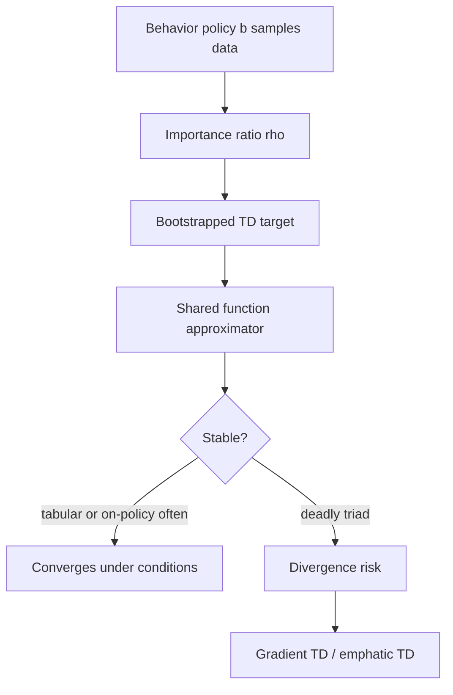

# Off-policy Methods with Approximation

Off-policy learning is attractive because an agent can learn about one policy while behaving according to another. With tabular methods this is already subtle. With function approximation and bootstrapping, it becomes one of the central stability problems in reinforcement learning. Sutton and Barto call attention to the deadly triad: function approximation, bootstrapping, and off-policy learning.

This topic explains why algorithms that look like harmless extensions of tabular TD can diverge. It also motivates gradient TD and emphatic TD methods, which are designed to produce stable learning objectives under off-policy sampling. The lesson is not that off-policy approximation is impossible, but that the update geometry matters.

## Definitions

The behavior policy $b$ generates data. The target policy $\pi$ is the policy being evaluated or improved. Off-policy prediction seeks $V_\pi$ or $Q_\pi$ from trajectories sampled under $b$.

The importance-sampling ratio for one action is

$$
\rho_t = \frac{\pi(A_t \mid S_t)}{b(A_t \mid S_t)}.
$$

A naive off-policy semi-gradient TD update for state values is

$$
\mathbf{w}_{t+1}
=
\mathbf{w}_t
+ \alpha \rho_t
\left[
R_{t+1}+\gamma\hat v(S_{t+1},\mathbf{w}_t)-\hat v(S_t,\mathbf{w}_t)
\right]
\nabla \hat v(S_t,\mathbf{w}_t).
$$

The deadly triad is the combination of:

- function approximation, where updates generalize across states;
- bootstrapping, where targets depend on current estimates;
- off-policy learning, where the update distribution differs from the target policy distribution.

Gradient TD methods introduce auxiliary weights and optimize projected Bellman-error objectives more directly. Emphatic TD methods reweight updates by follow-on traces so that states important under the target policy can receive appropriate emphasis even when sampled under a different behavior policy.

## Key results

The Bellman error for approximation is not as easy to optimize as it first appears. The mean squared Bellman error involves expectations over next states. A single sampled transition gives one next state, but an unbiased sample of a squared expectation generally requires two independent next-state samples from the same state-action pair. This is the double-sampling problem.

Projected Bellman error is more practical for linear value approximation. The Bellman target may not lie in the function class, so the best approximate value is a fixed point after projecting back into the space spanned by features. Gradient TD methods are built around objectives connected to this projected fixed point.

Off-policy TD can diverge even in small linear examples. The problem is not merely a large step size. The expected update can point away from any stable solution because the behavior distribution, bootstrapped target, and feature geometry are misaligned.

The one-step importance ratio corrects the expected update for action choices, but it does not automatically solve all stability issues under approximation. Ratios can also increase variance, especially when the target policy chooses actions that are rare under the behavior policy.

Gradient TD methods, such as GTD and related algorithms in Sutton and Barto's treatment, use an auxiliary weight vector to estimate terms needed for a true stochastic gradient direction. They are more complex than semi-gradient TD but address a real failure mode.

Emphatic TD changes which states are emphasized. The idea is that interest and follow-on traces can account for how much a state matters to future target-policy predictions, not just how often the behavior policy visits it.

The deadly triad is best read as a warning about interaction effects. Function approximation is not inherently unstable; supervised learning relies on it constantly. Bootstrapping is not inherently unstable; tabular TD is a basic convergent method under standard assumptions. Off-policy learning is not inherently unstable; tabular off-policy control can work. The danger appears when the target being bootstrapped, the parameters being shared, and the distribution of sampled updates pull against one another.

Replay buffers in deep RL create a practical version of off-policy approximation. A transition may have been generated by an older policy, but it is reused to update the current value function. Target networks, clipped updates, double estimators, and carefully controlled replay are engineering responses to the same underlying issue: without stabilizers, bootstrapped approximation can chase moving targets.

Gradient TD methods are valuable even if they are not always the default tool in applications, because they identify what a principled correction must account for. They separate the desired fixed point from the sampling distribution and introduce extra estimates to follow a real gradient objective. That conceptual clarity is the main reason the chapter spends time on value-function geometry.

The practical conclusion is conservative: when using off-policy data with approximation, verify stability empirically and prefer algorithms whose assumptions match the data source. The mismatch between behavior and target policy is not a minor bookkeeping detail.

## Visual



| Ingredient | Alone | Combined risk |
|---|---|---|
| Function approximation | Generalizes and scales | Can move many predictions in the wrong direction |
| Bootstrapping | Learns from partial returns | Targets depend on current possibly wrong estimates |
| Off-policy sampling | Reuses exploratory data | Update distribution differs from target-policy needs |
| Importance sampling | Corrects policy mismatch in expectation | Can produce high variance |
| Gradient TD | Optimizes a better-defined objective | More state and tuning complexity |
| Emphasis | Reweights important states | Requires careful trace dynamics |

## Worked example 1: Importance ratio in an approximate TD update

Problem: The target policy chooses action $a$ with probability $0.8$ in state $s$, while the behavior policy chooses it with probability $0.2$. A transition gives reward $1$, current prediction $\hat v(s)=3$, next prediction $\hat v(s')=4$, $\gamma=0.9$, step size $\alpha=0.05$, and feature vector $\mathbf{x}(s)=(2,0)$. Compute the off-policy semi-gradient TD weight increment.

Step 1: Importance ratio:

$$
\rho = 0.8/0.2=4.
$$

Step 2: TD target:

$$
1+0.9(4)=4.6.
$$

Step 3: TD error:

$$
\delta = 4.6-3=1.6.
$$

Step 4: Weight increment:

$$
\Delta\mathbf{w}=\alpha\rho\delta\mathbf{x}(s).
$$

Step 5: Substitute:

$$
\Delta\mathbf{w}=0.05(4)(1.6)(2,0).
$$

Step 6: Compute:

$$
0.05(4)(1.6)=0.32,\qquad 0.32(2,0)=(0.64,0).
$$

Check: The update is four times larger than the corresponding on-policy update because the sampled action is more likely under the target policy than under the behavior policy.

## Worked example 2: Why squared Bellman error needs care

Problem: From state $s$, action under policy leads to $s_1$ with probability $0.5$ and $s_2$ with probability $0.5$. Rewards are zero, $\gamma=1$, $\hat v(s_1)=0$, and $\hat v(s_2)=2$. Current $\hat v(s)=1$. Compare the squared error using the expected Bellman target with the average squared sampled TD error.

Step 1: Expected target:

$$
\mathbb{E}[\hat v(S')]=0.5(0)+0.5(2)=1.
$$

Step 2: Bellman error using expected target:

$$
\left(1-\hat v(s)\right)^2=(1-1)^2=0.
$$

Step 3: Sampled TD errors. If $s_1$ occurs:

$$
\delta_1=0-\hat v(s)=0-1=-1.
$$

If $s_2$ occurs:

$$
\delta_2=2-\hat v(s)=2-1=1.
$$

Step 4: Average squared sampled TD error:

$$
0.5(-1)^2+0.5(1)^2=1.
$$

Check: The squared expected error is $0$, while the expected squared sampled error is $1$. Squaring a sample target is not the same as sampling the squared Bellman error.

## Code

```python
import torch

torch.manual_seed(5)
gamma = 0.9
alpha = 0.01

# Linear value approximation with two features.
w = torch.zeros(2, requires_grad=False)

def x(state):
    table = {
        0: torch.tensor([1.0, 0.0]),
        1: torch.tensor([1.0, 1.0]),
        2: torch.tensor([0.0, 1.0]),
    }
    return table[state]

transitions = [
    # s, a_probability_under_pi, a_probability_under_b, reward, next_state
    (0, 0.8, 0.2, 1.0, 1),
    (1, 0.3, 0.6, 0.0, 2),
    (2, 1.0, 1.0, 0.0, 0),
]

for epoch in range(200):
    for s, pi_prob, b_prob, r, sp in transitions:
        rho = pi_prob / b_prob
        v = torch.dot(w, x(s))
        vp = torch.dot(w, x(sp))
        delta = r + gamma * vp - v
        w += alpha * rho * delta * x(s)

print("Off-policy semi-gradient TD weights:", torch.round(w * 1000) / 1000)
```

## Common pitfalls

- Assuming tabular Q-learning guarantees automatically transfer to function approximation. They do not.
- Treating importance sampling as a complete stability fix. It corrects action probabilities in expectation but can increase variance and does not remove all approximation issues.
- Optimizing sampled squared TD error while believing it is the mean squared Bellman error.
- Ignoring the behavior distribution. The states sampled most often may not be the states most important to the target policy's predictions.
- Using a large replay buffer off-policy with bootstrapping and a nonlinear network without stabilizing design choices.
- Forgetting coverage: if $b(a\mid s)=0$ where $\pi(a\mid s)\gt 0$, no ratio can recover the missing data.

## Connections

- [On-policy prediction with approximation](/cs/reinforcement-learning/on-policy-prediction-approximation)
- [On-policy control with approximation](/cs/reinforcement-learning/on-policy-control-approximation)
- [Eligibility traces](/cs/reinforcement-learning/eligibility-traces)
- [Deep learning](/cs/deep-learning/)
- [Linear algebra](/math/linear-algebra/)
